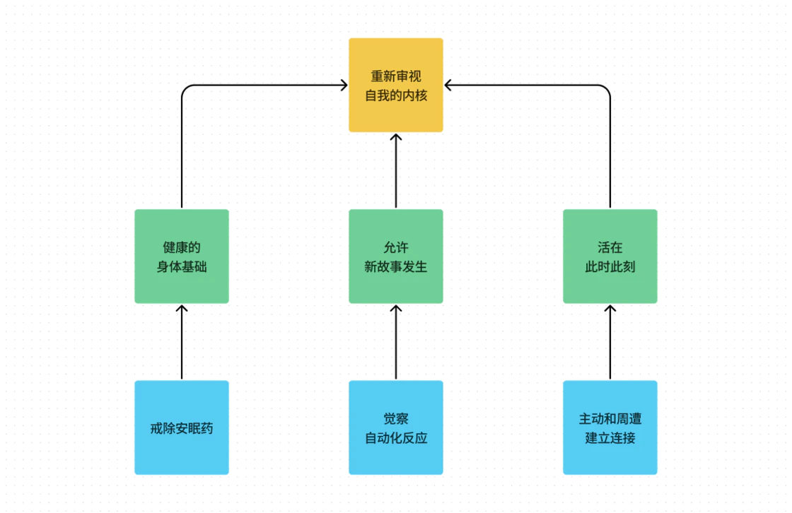
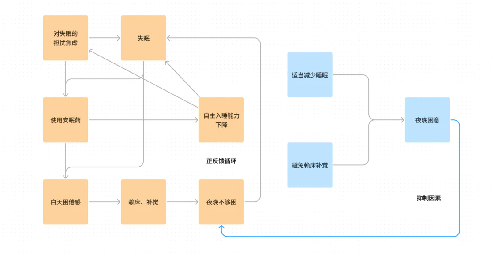
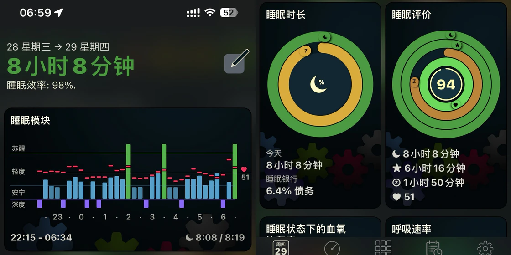
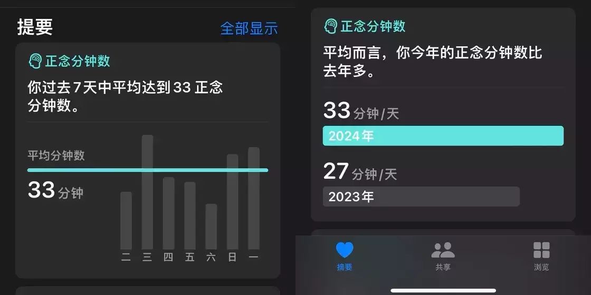
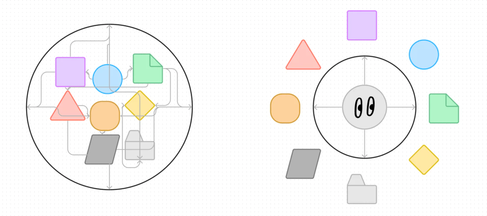
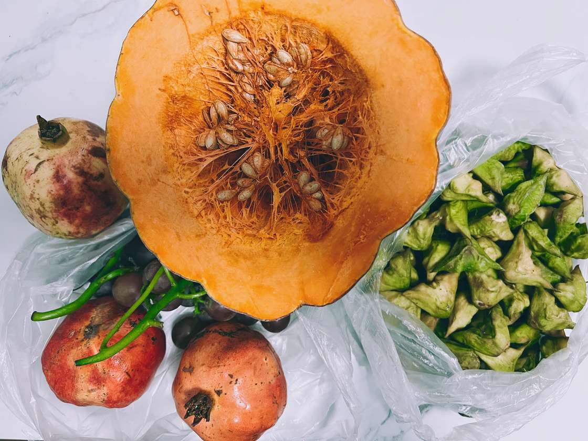
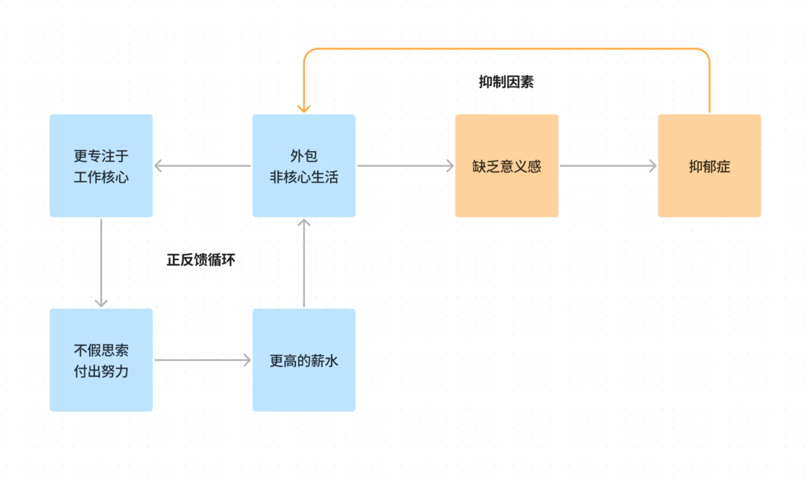
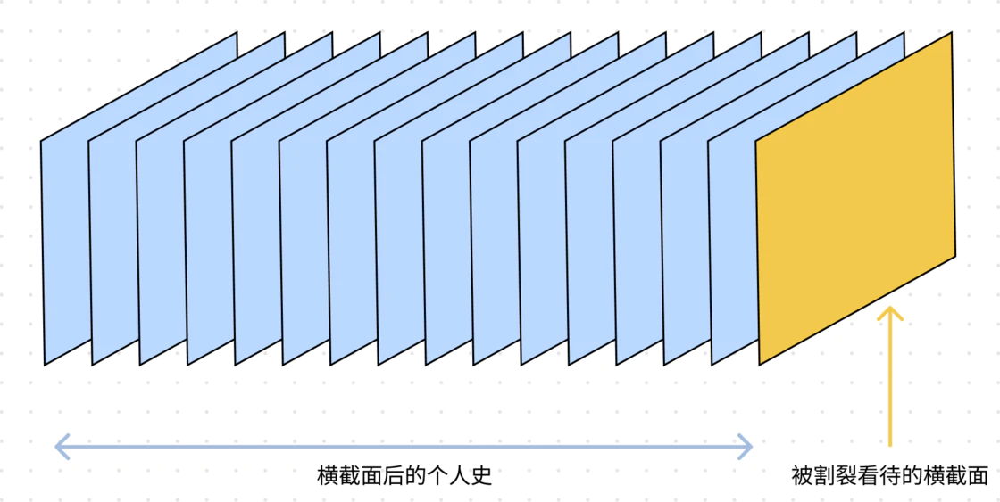

# 年度征文 | 从戒除安眠药开始，我选择不再将自己外包 - 少数派

- - -

本文参加 2023 年度征文活动。我的 2023 年度关键词是：逆外包。

从 2018 年确诊睡眠障碍并服用安眠药开始，我逐渐接受并认可「把睡眠外包给安眠药」的自创理念，并试图实践将其他做不到、不想做的事情尽可能地外包出去，直到 2022 年下半年抑郁症再度发作并裸辞至今。回头看会发现那是一段相当异化的人生，我开始反思自己的生活，并尝试做出一些改变。经过 2023 年这一整年漫长的恢复期，我终于从各类精神困扰中走出来，并尝试着手构建属于自己的新故事。我想，**这一年的努力可以被称为「逆外包」**。

如果「外包」意味着将核心之外的事情全部切割交接出去，自己只需要如同调用封装好的 API 那样不问过程只要结果，**那么「逆外包」则不仅意味着要把外包出去的生活模块回收并重新体验，更需要在这些生活的细节之中保持觉察之心，并重新审视自己的内核。**

我将从「戒除安眠药」「觉察自动化反应」「主动和周遭建立连接」这三个方面来聊聊这一年「逆外包」的具体行动，以及这些成效如何帮助我重新审视自我的内核，厘清「将人生意义外包给工作」的迷思。

## 不再将睡眠外包给安眠药

> TL;DR:
> 
> 努力为规律的发生清除障碍、创造条件，让规律接管自己不可控的部分，而非直接追求规律发生后的成果。睡眠的基本规律是「人困到极致，不用吃安眠药也能自然入睡」。相较于每天吃安眠药、忍受副作用，相对友好的方案是让自己每天都保持轻微困倦的状态。

原生家庭、校园霸凌、职场压力，总有一款经历能够引发失眠。而当这些混合到一起发挥作用，又伴随着抑郁症、焦虑症一起到来，失眠就更难以解决。

毕业后进入到一家工作强度很大的咨询公司，经常夜里十二点才下班，两三点下班也不罕见，而我那天才又不近人情的老板偶尔喜欢搞个通宵的编程马拉松和我们一起「玩」，让我本已相当脆弱的睡眠结构被彻底破坏。那时候并不知道发生了什么，只是每天夜里躺在床上睡不着，恐惧、焦虑、心脏狂跳。后来因为持续缺乏睡眠，身心双重崩溃，终于在宛平南路 600 号确诊了抑郁症、焦虑症和睡眠障碍，并开了各种药。

确诊后并不恐慌，反而觉得如释重负 —— 原来我的各种不适只是因为生病了，那只要吃药就好了吧？服用思诺思的第一晚感受很奇妙，因为连续多日都没有睡好了，吃完有点晕，再睁开眼已经是第二天早晨了，一夜无梦，神清气爽。

**当时我以为找到了救命稻草，没想到这根稻草却在后续的几年成为压垮我的会心一击** —— 我对安眠药形成了依赖，一吃就是五年，各类药物吃了 3000 多片。不仅要吃思诺思这类能缓解入睡障碍的药，还要吃艾司唑仑这类辅助肌肉松弛以延长睡眠时间的药物；而为了对抗思诺思噩梦的副作用，又吃了一段时间的盐酸曲唑酮来消除梦境。去医院开药时，偶尔能遇到七八十岁的老年人也在咨询医生用药，我不敢想，按照这样继续服药四五十年后，我的精神状态如何？

我个人的失眠循环

失眠是一种自我实现的预言，越是担心会失眠，越是会引发失眠。特别是一次次被安眠药拔电源强行关机后，就越来越难以调用身体自发的关机流程了，于是就更加依赖安眠药了。这是一个不断自我强化的循环，看起来无解。

除了安眠药之外，也不是没有尝试过其他方法，睡眠耳塞、乳胶床垫、香薰、轻音乐、重力毯、蒸汽眼罩、褪黑素、酸枣仁，但凡商品名称上有「助眠」相关字眼，我都会买来试一试，零零总总加起来差不多花了一万多元，但对自己毫无效果。回头看，我更想将它们称为**「睡眠质量的放大系数」**，它们能够让睡眠质量变得更好，但如果自身没能睡着（一个重要变量为 0），那么无论乘以多少放大系数，失眠依然不可避免。

而下定决心戒断安眠药的契机是，我频繁因思诺思的副作用而陷入噩梦，经常伴随着心悸醒来，浑身被冷汗浸透，而白天又要忍受（可能因为药物累积而产生的）剧烈的神经性偏头痛。白天痛不欲生全靠止痛药坚持工作，晚上在思诺思引发的失忆和噩梦中醉生梦死，我人生此后的每一天都要以这种方式荒谬地度过吗？不，我受够了。

开始戒断的过程很痛苦，在床上翻来覆去、辗转反侧，明明已经累到无法思考，闭上眼睛大脑却又活跃起来，熬到天亮，才昏昏沉沉睡去。而白天睡得多，到晚上又难以入睡了。但在这种痛苦中我发现了一个线索：能熬到天亮才睡着，恰恰说明了我并不是无法自主入睡，只是无法在合适的时间入睡 —— 那如果我坚持整个白天都不睡，这种困倦感能否让我在晚上顺利入睡呢？

于是白天我没有做什么需要思考的事情，也没有进行消耗体力的劳动，出门晒了晒太阳，然后回家看电视剧、玩《王国之泪》，这是我能坚持下来、打发时间的方式。到晚上的时候，浑身已经因为缺乏睡眠而冰凉、麻木了，心脏如低音鼓敲击，胃里不断涌出恶心感，我还是坚持看剧到晚上十点才闭眼。**（备注：这里请想尝试的失眠患者咨询医生后酌情参考，不要盲目效仿，毕竟对身体有伤害。）**

再醒来，就是第二天早晨了 —— 我成功了。所以我掌握了一个规律，这个规律就是「人困到极致不用吃安眠药也能自然入睡」。掌握这个基本规律之后，又通过一些睡眠训练项目实践了「失眠认知行为疗法（CBT-I）」，我学会了**刻意让自己保持轻微困倦的状态**：当我又觉得最近有点入睡困难了，我反而会选择少睡一会。比如我原先可能每天要睡 8-9 小时，那么为了让晚上感受到足够多的困意，现在我就睡 6-7 个小时。如果不幸又失眠了，只睡了一两个小时，那也坚持按时起床、不补觉，大概率晚上会觉得非常困倦而沾枕头就睡着。两害相权取其轻，轻微困倦，但不影响生产力和情绪，也没有其他身体不适，这比每天吃好几种安眠药要好得多。

戒除安眠药后的睡眠状况

如今已经大半年没再吃过安眠药了，能够再次自主入睡，这种幸福感不亚于重获新生。这也让我明白了一个道理：有些事情，不是我们努力就能得到结果，眼睛闭得再紧，都不如「困到极致就会睡着」这个不证自明的规律有用。而我们能做的，就是**给规律的发生扫清障碍、创造空间，然后平静地等待规律接管即可**。

## 不再将人生的解释权外包给自动化反应

> TL;DR:
> 
> 通过长期的正念练习觉察、反思人生中的隐藏设定，并通过切实且细微的行动逐步平衡倾斜的天平。相比较于因各种遗憾和不满而期盼着重启人生，我现在更愿意选择人生的 DLC 模式。

《武林外传》中，掌柜佟湘玉遇到了点事，就会搬出那套「我错了，我真的错了，我从一开始就不应该嫁过来，如果我不嫁过来，我的夫君也不会死。如果我的夫君不死，我也不会沦落到这么一个伤心的地方。如果我不沦落到这么一个伤心的地方，我也就不用受你们的气了……」

在观众（也就是「他者」）看来，这明显是一个带有喜剧性质的滑坡谬误。但是对当事人来说，却很难意识到这个不合理链条的存在，遑论承认其存在、分析逻辑关系并尝试做出改变了。在这里我不想详述自己的成长经历有多么不幸，一是为了达成对自己的承诺（「少去唤醒那些不幸和痛苦的回忆」），二是避免触发通过讲述苦难而进行自我怜悯的自动化反应链条，三来每个人多多少少都有一些这方面的困扰，这也是共通人性的一部分，能点到即止地帮助读者理解本章节的背景信息即可。

在很长一段时间里，我都仰赖「受害者心态」生活，以至于它成为了我的底色。当我想为了某件事而努力时，「我的人生被害成这样，我一定要搞出点名堂来」的想法会激发出一种自己看来相当悲愤的力量，也确实让我取得了一些成绩。而当我陷入自暴自弃的谷底时，它又会被搬出来证明「反正我的人生已经这么悲惨了」「我现在这样都是被那些人害的」「所以我就摆烂吧」。于是，不论我采取乐观还是悲观的生活方式，其模式要么是压榨受害者身份获得间歇性的力量，要么就是在用受害者心态自怨自艾。

去年和今年的正念练习情况

而让我意识到这个受害者心态存在的契机，是 2023 年年中开始的正念冥想练习，平均每天 20-30 分钟。大概从第三个月开始，我逐渐能够在练习的 30 分钟里觉察到纷飞的想法而不被卷入其中，以旁观者的视角观察想法、情绪的来去变化。从第五个月开始，在练习之外的日常生活中，几乎能够在想法 / 情绪出现的同时，意识到「我的大脑中产生了一个想法 / 情绪」。某天我情绪低落，这个「受害者身份」再次跳出来说一些「这就是命呀，你就是这么惨」的话时，我感受到了一种扭曲的温暖和依恋。意识到这一点后，我真实地被惊吓到了 —— 我以前就是这样生活的吗？

随着继续保持练习，我感受到抑郁症的症结在松动，也开始主动质疑大脑中的逻辑链条：

-   首先，那个盘旋在脑海中许久的「我想趁早结束」并不是我真实的想法，而真实的想法是「我想重新开始」—— 我并不是想下线，只是想重来。
-   其次，「想重来」意味着，我对自己过往的人生有诸多不满之处，我试图回到过去修正它们。这些缺憾发生在我对人生没有主导权和选择权的时候，从而一步步地构建了我的受害者心态。
-   最后，我认定这些缺憾、不满将 100% 决定我的未来同样是悲惨的，而我想重来就是不希望自己的未来是悲惨的。也就是说，我仍然希望自己未来的人生是值得憧憬的。这才是我最深层的想法。

「希望自己的未来是美好的」这样一个简单而普遍的想法，却会被掩藏在人生经历的断层之中，但如同考古一般将其挖掘出来并擦拭干净后，就会成为重新审视人生的支点。我也开始明白，只要我还在想「重启人生」这件事，那就意味着我仍然在围绕生命中那些让我遗憾、后悔、愤恨的事情生活。**我的人生可以有新的故事，但前提是我要停止复述旧故事。**

左：不断回应想法和情绪；右：保持觉察但不卷入想法和情绪，为自己留下空间

好在前文中成功戒除安眠药的努力，让我感受到了潜藏在一个人深处的力量：即便无法回到过去改变那些一步步将睡眠破坏的事实，我依然可以立足此时此地，通过科学的方法恢复身体的功能。**发生在过去的问题，可以通过向前走来解决。我不需要那个受害者身份了。**我开始尝试新的叙事，无论它们有多细微和渺小，比如：

-   接受过更多教育、读了更多心理学书籍的我更有义务和能力带妈妈走出人生泥潭，而不是反刍原生家庭对我的伤害。我为妈妈庆祝生日（我们家没有过生日的习惯）、带她出去旅行（我们也没有旅行的习惯，但我直觉上认为这能够拓展家庭经验和回忆的边界），也一遍遍地告诉妈妈，我们是为了自己好好生活，而不是为了让抛弃我们的人后悔。
-   我报了半年的绘画课程，在画室里遭遇从小学习画画的学员嘲笑我年龄大、水平低。当校园霸凌的回忆涌上心头让我感受到愤怒、焦虑和恐慌时，我告诉自己「我已经 30 岁了，不再是那个不知所措的孩子了」，于是平静地和他讲明了道理，顺便把画笔递给他，说「你觉得我画得不好，那你帮我改吧」—— 他反而能和我平和地讲话了。
-   运用「二分法」在自己能掌控的事情上倾注努力，同时接受不能掌控的部分产生的任何结果。在抢新西兰 WHV 名额前梳理清楚了流程，然后和 AI 合作写了一个全自动 Chrome 插件，虽然最终没有抢成功，但我知道我尽了自己所有的努力，所以完全没有遗憾，也体会到了「不应该为无法控制的事情责怪自己」。
-   ……

我开始用这些小小的行动，来平衡重重倾向另一侧的天平。更多时候，我不会看天平，我只会看自己积累了多少新的体验，在百分比太过弱小的情况下，我选择通过绝对值来接纳并感谢自己付出的努力。

《塞尔达传说：旷野之息》给了我许多灵感，其中之一便是 DLC。前 30 年的人生中，那些黑暗漫长、罡风吹彻的日子我不再想经历一遍，但也正是在那些不知所措的岁月里，繁荣的种子是实打实地被播种了。接下来的人生都是一个又一个的 DLC，我要做的，就是在这片我早已知悉的旷野之上，构建新的故事和新的繁荣。

## 不再将生活的连接外包给平台

> TL;DR:
> 
> 相较于高效率、模块化的生活，我现在更倾向于选择一种弥漫在「人 - 事 - 物」网络之中的生活方式。这张生活之网为我提供了现实生活中的锚点，从而逐渐从平台中将自己释放。

在上海工作时，午饭和晚饭基本都是靠点外卖来解决。当时完全不理解家人的忧心，反倒是相当认同这种「把饮食外包给外卖」的生活模式。我不需要知道这个商家在哪里，也因为默认选择「放在外卖柜」而很少见到过骑手。平台提供的标准化服务意味着人和人之间是匿名的，人们通过一个个 API 调用他者的服务，也通过这些 API 传输自己的工作成果，简洁高效，很适合我这种 I 人。

左：通过平台以匿名的方式调用他者的服务；右：在真实生活的网络中获得锚点

去年的一次午饭，和妈妈聊天才忽然饭菜颇有玄机，原来《请回答 1988》中令人向往的邻里生活就在身边：

-   主食是张姨做的红糖包子。张姨住在已经去世的姥姥姥爷家附近，和我家隔一条路，前一天提着一大袋包子送到我家里。她现在全职照顾 90 多岁的老父亲，老人精神矍铄，每天坚持看报纸。
-   南瓜焖鸡的南瓜是朱姨的女儿自己种的。她女儿很有本事，打拼出了一套别墅，现在喜欢在别墅里的小菜园自己种各种瓜果蔬菜，定期开车拉到朱姨家，朱姨再分给她的朋友们。
-   鸡腿是从隔壁的小菜市场买的。妈妈是老顾客了，本来想买四个，摊主却说「买那么多干啥，今天鸡腿大，肯定吃不完，买三个就行了，好吃再来买」。妈妈笑着说还没见过嫌买得多的人呢。
-   荀瓜和大米是从老赵那里买的。老赵是个性格可爱的老头，买菜时不能说一句他的菜贵，要不然就不卖给你了。但是如果你夸他的菜又便宜又好吃，他就恨不得把最好的菜翻出来给你。
-   而这些是作为礼尚往来的回报，因为妈妈平常会教她的朋友们如何网购、如何在各个 app 里赚钱、如何薅流量的羊毛，甚至有时候还担任人工清理大师，帮朋友们的手机提提速。

这些家常菜中包含了太多关于生活的信息，每一道菜都连接了生活在这个社区的人、妈妈和我。人和人、人和物之间，好像都有看不见的线条将彼此连接。**生活不再是一个可拆卸的模块，它弥漫在这张网络上，没有边界，却是可解释的。**渐渐地，我吃饭时也不看手机或平板了，而是细细品味经由生活网络传递而来的质朴、安稳和幸福。所以，我给自己制定的 2024 年目标中，也包含了学会做几道家常菜，希望能更加深入地体会这种连接感。

朱姨送的南瓜、石榴、葡萄、菱角

睡眠调整过来后，我开始尝试放下手机，不再通过消费社交平台上的内容来进行休息。当然，小红书上的薯条、果果这些小朋友给我带来了云养娃的快乐，猫猫狗狗的视频让人打起拎麻袋问地址的算盘（玩笑），但我觉得这些都不如走出去和真实的世界建立连接重要。

我尝试效仿老年人的生活模式，每天在小区溜达一圈，看看今天小区里在卖什么新鲜的水果蔬菜，或者去湖边散步，日复一日地途径一棵树。整个春天，我见证了它冒出花骨朵、绽放、凋萎，直至完全不见而呈现出初夏郁郁葱葱的叶子。我也观察到它隔壁枫树，叶子从初生的金黄到夏天晚风里摇荡的绿涛，再到秋日浓郁的赭红色和冬日的雪挂枝头。而更多的时候，我就在观察山，观察万里无云的山，观察烟雨蒙蒙的山，观察日落时分落霞与孤鹜齐飞的山。

某次看着天空一点点被晚霞铺满的散步

我开始觉得生活有了越来越多的锚点。随着我越来越接纳自己，这种深深根植于生活网络之中的存在感和意义感，让我自然而然地放下了那颗对信息成瘾的心。有一天，我从湖边散步回来时，听到两位老年人边快步走边说「苹果还是去老赵那里买吧，这边贵，老赵那里的便宜多了，还甜」——「老赵」又出现了，于是我知道因为这张生活网的连接，我和这两位老年人不再是彻彻底底的陌生人。

## 不再将人生意义外包给公司和工作

> TL;DR:
> 
> 抑郁症帮助我抑制了「外包非核心生活」模式的正反馈循环，对外界设定的标准和光环的祛魅让我反思职业道路的选择，并重拾那个热爱文学艺术的自己。

「戒除安眠药」让我有如大梦初醒般重新获得了清晰的思维，「觉察自动化反应」则给予了我在刺激和反应之间相当大的思考和决策空间，而「主动和周遭建立连接」让我起伏波动的心逐渐平静、澄澈。这个时候，我开始审视「职业发展」这个话题了。这一年里，我发现自己的「问题」是，我无法为别人的事业努力奋斗，给再多的钱都不行。一旦公司的事业脱离了我人生的轨道 —— 即便我知道在这些工作中我的可迁移能力会增长 —— 我就会选择让公司拥抱变化。

很多年前抑郁症第一次发作时，我学到的经验是「把人生意义交给工作」，全情投入到工作中，让自己忙起来，赚到更多钱，在职业上被更多人认可，生活变得更好，循环转起来了，就不会思考「人生的意义是什么」这种问题了。然而这一次的抑郁症发作却推翻了这个经验。回头看，我的抑郁症为那个不断增强的外包循环提供了一个潜伏在水下的抑制机制，也许这正是它存在的正面价值。

抑郁症带来了痛苦，也抑制了「外包非核心生活」模式的循环

上一家公司是电商服务商，同事们积累了领域经验，自然而然都想去电商大厂，也基本都在入职两年后成功跳槽上岸。我也曾经在 2022 年的年度目标上写着要去某大厂担任数据技术解决方案架构师，而在 2023 年整理回顾时却会心一笑 —— 我知道，自己早已不是当时的那个自己。

有一段时间我很想搞清楚为什么某些大厂的电商 app 界面做的那么复杂，试图学习他们的产品设计 —— 各种细分渠道入口，五花八门的活动页面，手指随便动一下都会有对应的交互。后来我明白了，这种复杂并不是产品优化导向的结果，而是个人的 KPI、部门的话语权、业务的试错等各方利益平衡导向后形成的人工奇观。如同现在巨型 app 那样刻意让用户迷失在一个又一个页面中来提高用户使用时长和粘性，人也会在这种不断分叉的链路中被扭曲，而我并不想把自己的力量用在这种事情上，所以我有一天突然对大厂失去了兴趣。

而我殚精竭虑主导的多个产品都没有被投入市场，用公司的话来说就是「能用来向投资人展示我们的产品能力就可以了」，并不在乎是否真的能帮助用户解决问题。这让我醒悟：自己的薪水其实只是公司的试错成本。公司可以大量、平行地试错，只要有一个方向对了，就可以收回成本。但从我个人的视角看，人生中精力最旺盛的几年确确实实地被浪费了。自然，我也对这种以吸引投资为导向的工作失去了兴趣。

曾经的我像是《哈利・波特》中的嗅嗅，追逐着那些亮晶晶的东西，希望靠这些让别人认可我。**可是，当我对令人歆羡的大厂、趋之若鹜的赛道、光鲜亮丽的 title 都不再感兴趣，当那些金光闪闪的东西都暗淡下来了，我的光源在哪里？**如果我因为离职了就瞬间对之前倾其所有投入进去的领域失去了兴趣，那我是真的喜欢这个领域吗？我一直勉励自己去习得更多可迁移的能力，但这些能力要在哪里释放呢？还是说我只是为了远方更好的 offer 在努力、面向下一份 JD 而工作呢？这个链条有尽头吗？这样的话，我又能坚持多久呢？

这是一个很艰难的过程，亲手构建的价值观和世界观崩塌了，反过来又加重了我的抑郁症。经过这一年，我开始承认，我的生命中有一个质量极大的内核，这个内核是和文学艺术创作相关的。虽然我大部分时间都不是很快乐，但是只要这个内核在发挥作用，我的人生就能运转下去。我早就知道这个内核的存在，但从十几年前读书时为了以后的「钱景」没有选择文学系而选择了数据 + 商科开始，我就在刻意回避那个内核，甚至希望它消失 —— 那时的我认为，一个感性的内核不适用于一个极度依赖理性的商业环境。

我开始重新动笔写小说，一字一句地打磨故事，好在荒废许久的天赋并没有被收走。也在尝试将一些灵感转化为叙事游戏，这让我发现自己掌握的编程、营销能力仍有不少用武之地。《存在主义心理治疗》中提及「创造性」是消解无意义感的有效因素，而创造本身还能带来自我发现。也许，我可以在这里找到人生意义。

于是，我决意选择这样平淡的生活，并非是对外界洪流的回应，而是顺应了内心深处溪流的走势。每当我意识到他者的影子地投射在我身边而让我感到羡慕、悔意和摇摆时，我都会回到那条独属于我的淙淙溪流，触摸自己的内核，回忆起自己究竟是谁，而这份来自于生命之初的回忆就会温柔地驱散他人的投影，在我面前形成一道有如极光般闪耀的守护之弧。

## 这些迷茫和痛苦的意义是什么？

最后我想聊聊，这些迷茫和痛苦的意义是什么？或者，它们发生在我的人生进程中，是想告诉我什么？

在网上分享抑郁症、焦虑症、睡眠障碍的经历，偶尔也会遇到「矫揉造作」「无病呻吟」「为赋新词强说愁」的评价。每个人的成长路径不同，这就像是一个在时间中一层层叠加的长方体，人们倾向于孤立地观察当前的横截面直接作出评判，却忽视了这个长方体是如何在几年甚至几十年的时间中演化，才展现出了此刻不那么积极向上的横截面。有的人可以不想那么多，开开心心赚钱、生活，这是一种天赋。但有的人好像就是要拧巴着活，仿佛不拧巴就没有生命的张力存在了。

看到横截面，也要看到形成横截面的个人史

人从一个胚胎开始发育的过程中，并不是直接形成了我们的手和脚，而是先形成了一个类似鸭蹼的组织，手指、脚趾之间会有薄膜连接在一起，帮助稳定手指和脚趾的结构，然后构成这部分组织的细胞再批量凋亡，最后才形成了我们相互分离的手指和脚趾结构。这个混乱的阶段是不可避免的，这是胚胎发育为完整的人必经之路。

就像是我尝试过「将非核心的生活外包出去」这种模式，本身是为了平息抑郁症，没想到却在安稳运行了三年后，于更深层次诱发了我的抑郁症，带来长达一年多的痛苦。但也正是在这种碰撞之中，才确认了自我的边界，帮助我决绝地告别了不适合自己的职业道路。如果你也正在迷茫，请珍惜现在这种感觉。**当你为此觉得焦虑的时候，你可以说自己正在长出或剥离「蹼」，所以你才会觉得痛苦 —— 而这份痛苦会过去，过去后你就是一个更加清晰、稳定的人了。**
