# 手把手教你装机 - 小白独立装机指导书 - 少数派

笔者依托以往装机经验实拍，耗时将近一年，总结出这样一份相对合理的图文版装机指导，希望能够对想要自行装机的新手 DIYer 提供参考和帮助。在正式开始前，先来说一下 DIY 的基础原则：**防呆不防傻，大力只会出问题。**

本篇文章中您将看到：

1.  DIY 相关组件的介绍
2.  装机步骤与注意事项
3.  一些进阶操作与设置

## **认识 DIY 组件（打印版需简化介绍内容，仅留图片展示与识别操作步骤）**

### **系统三大件 —— 处理器、主板、显卡**

处理器是一台电脑的绝对核心，主要功能是进行通用计算和调度其他硬件进行计算。AMD 和 Intel 两家厂商占据了现阶段消费级市场的绝对份额，其他处理器厂商主要是在服务器与商用领域发力。如果你攒机是为了打游戏的话，笔者更推荐 AMD R7-7800X3D 与的 R5-5600X3D，毕竟要同样性能表现的 Intel 处理器，配套的供电、散热的价格要高个两档不止，R7-7800X3D 就是打游戏处理器的神。

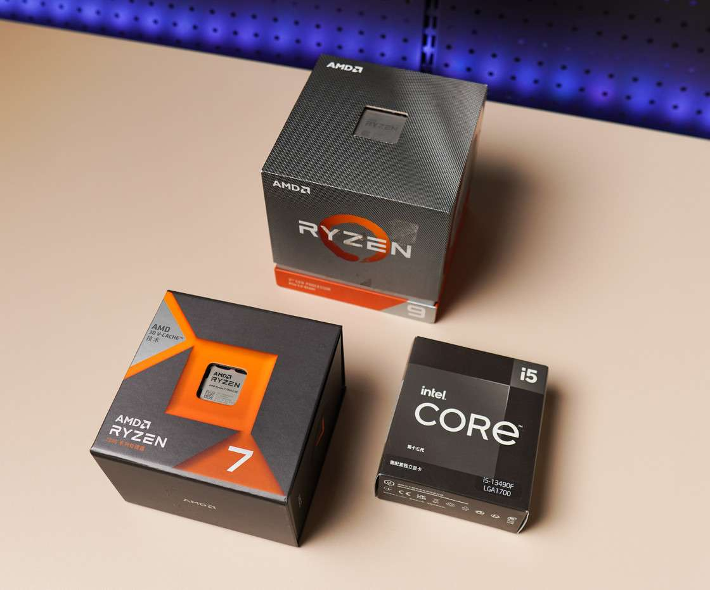

AMD 现阶段消费级在售的处理器有 AM4 与 AM5 两个规格，其中 AM4 处理器为 PGA（Pin Grid Array），针脚数量 1331 个，AM5 处理器为 LGA（Land Grid Array），触点数量 1718 个。Intel 现阶段消费级在售的处理器规格为 LGA1700，触点数量 1700 个。针脚数量的多寡可能会对处理器的物理尺寸造成影响，像 Intel 从 LGA1200 升级到 LGA1700 的尺寸变化， 就导致其需要新款扣具来安装散热器。而 AMD 这边则是 AM5 与 AM4 兼容相同扣具，旧款散热依旧能够直接使用。

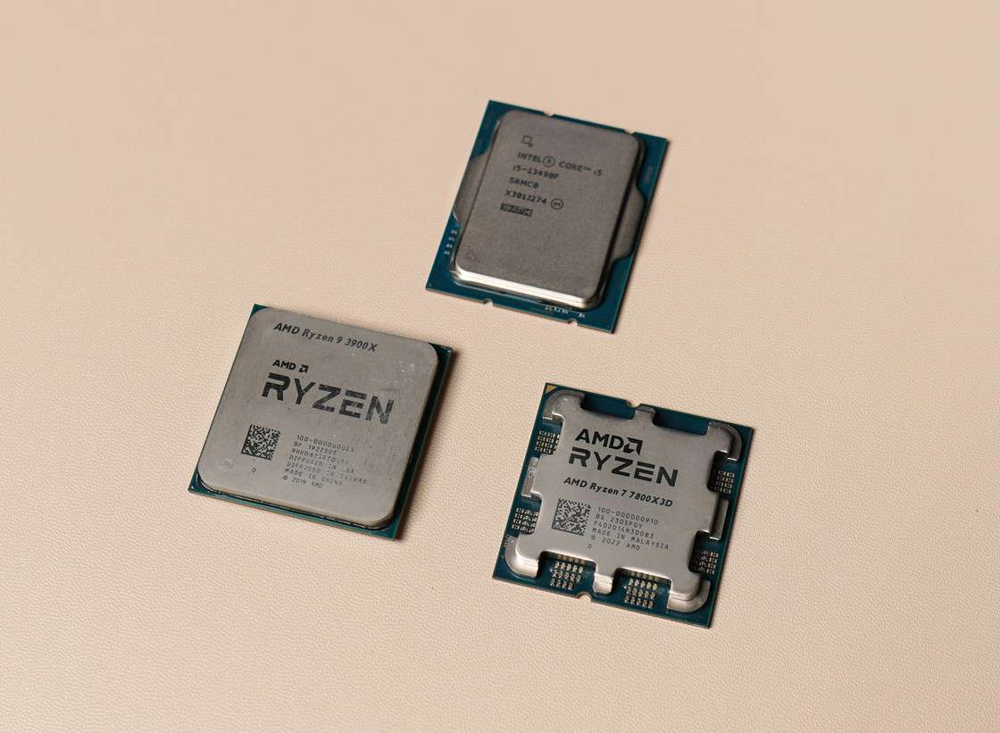

还有是否应第三方扣具这点，得看具体处理器。首先，AM4 的处理器不存在这个问题，原装扣具直接干就完了；使用原装扣具确实更容易将硅脂漏进这些凹处，是否还用第三方扣具对于散热又几乎没有影响，所以个人觉得 AM5 的处理器可以配上；Intel 12、13、14 代处理器则是建议直接替换，毕竟两向弯矩不同，时间长了真的会弯。

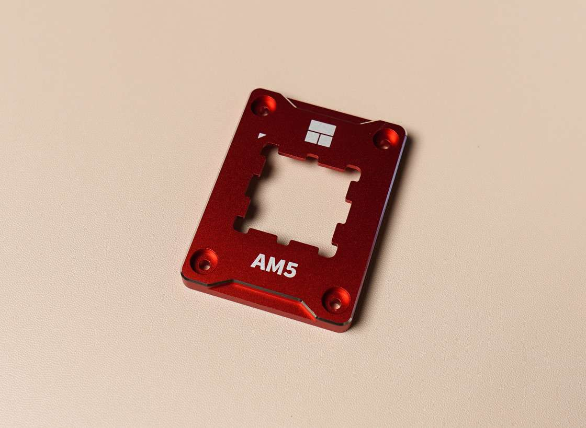

现有消费级微型计算机的外部设备，都是挂载到主板上来实现其功能的。市售的主要版型有 mini-ITX、micro-ATX、ATX 三个大类版型，各版型规格如下：

-   mini-ITX 尺寸为 170mm\*170mm，相比其他版型更贵的同时，外接扩展性是最低的，一般仅有 2 个内存插槽和 1 个 PCIe x16 插槽。
-   mATX 尺寸为 245mm\*245mm*，*245mm\*225mm，245mm\*185mm 等几个尺寸。和 ATX 版型是最主流的装机选择，一般为 4 个内存插槽，两个 PCIe x16 插槽（物理规格，按引脚实际可能为 x16+x4）和多个 M.2 硬盘位。
-   ATX 尺寸为 305mm\*244mm，和 mATX 版型是最主流的装机选择，一般为 4 个内存插槽，三个 PCIe x16 插槽（物理规格，按引脚实际可能为 x16+x8+x4）和多个 M.2 硬盘位。部分更大尺寸会被标记为 EATX，实际并不能达到 EATX 的尺寸规格（宽度，8 个内存插槽等）

各家一般都是按照**「品牌（大系列）+ 芯片组（版型）+ 品牌系列（子系列）+ 其他后缀」**这个模式进行标注，其中品牌系列可能会提到前面。Intel 从高到低排列有 X、Z、B、H 四个等级。AMD 从高到低排列有 X、B、A 三个等级。高端系列为 X399、X670、X570 等主板。更具体的命名规范在之前文章中有详细描述，请移步先前这篇。

手把手教你认识主板

网络上很少有系统讲述主板各个接口，方便大家按照本篇文章按图...

[↓↓↓](https://sspai.com/post/78672)  
  
sspai.com  
  
[↑↑↑](https://sspai.com/post/78672)

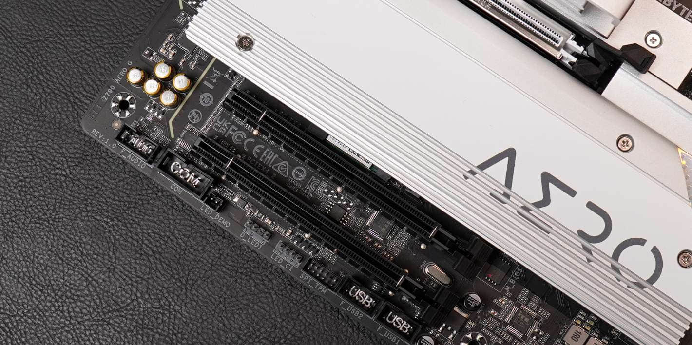

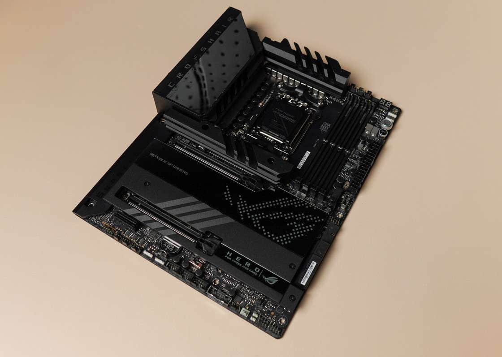

整个主板都是围绕着处理器设计的，而处理器有不同的物理形式，像 AMD 这边最新的是 AM5 底座，前几代锐龙则均为 AM4 插槽。Intel 最新的两代处理器就是 LGA1700，更早的还有 LGA1200、LGA1151 这些底座。不管是插槽还是底座，都有对应的防呆设计，但千万不要大力出奇迹，也不要使用任何除处理器外的物件触碰这些引脚。

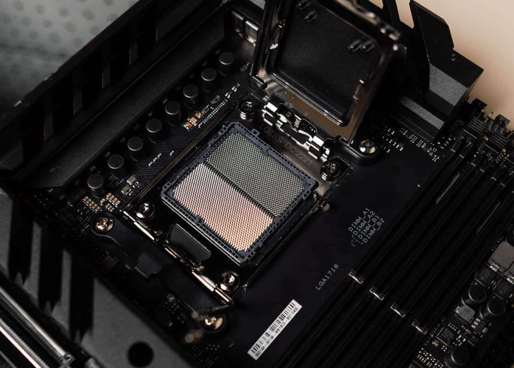

主板的供电不是数出多少电容、电感就是多少相，以型号 NCP81530R 供电 PWM 控制器为例子，查询对应的数据手册可知这是一颗 8+2 相的供电控制器。旗舰版的设计中由这颗控制器的 8 相并联出 16 相供电，并将单独的 2 相中再并联出一个 2 相，最终就是共 16+2+1 相的供电设计。其中可用于处理器部分的供电，是由原生 8 相并联出的 16 相，后面那些附加的相是给内存与核显供电的。高温下的负载能力会衰减，这也是为什么厂家更倾向于做供电并联。

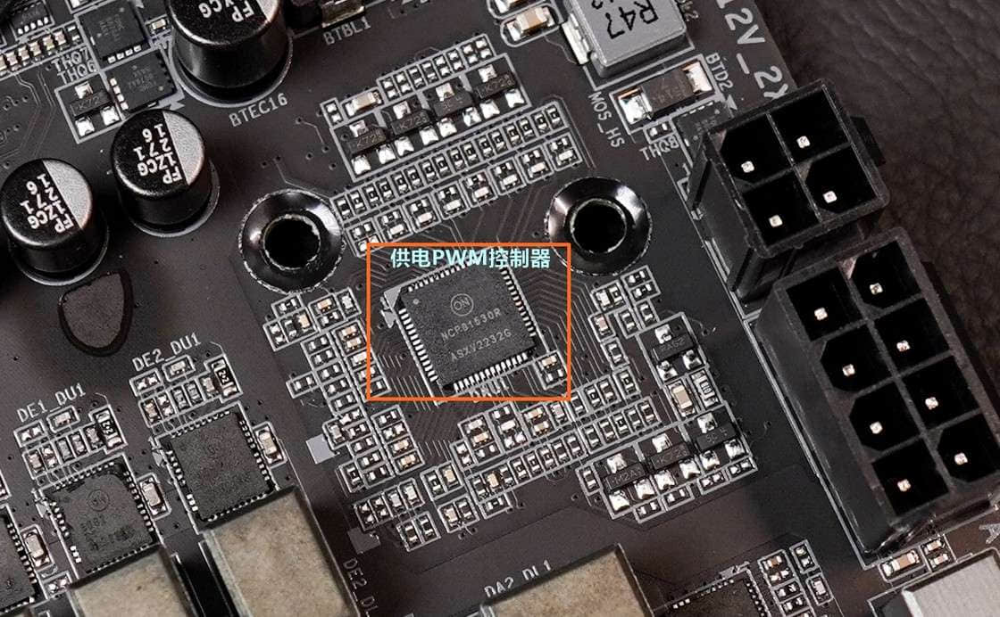

像旗舰主板动辄小 20 个的 MOS 管拉满，使用中散热自然是个大问题。所以现在的主板基本都是散热装甲拉满，供电全覆盖、芯片组全覆盖、主 M.2 硬盘位全覆盖。不过以前很多主板散热装甲就是个摆设，根本就没有散热垫，就是悬空盖在 MOS 管和芯片上，使用效果甚至不如裸奔。现在的散热装甲已经标配了散热垫，保证对应元件的热量能够快速导出。

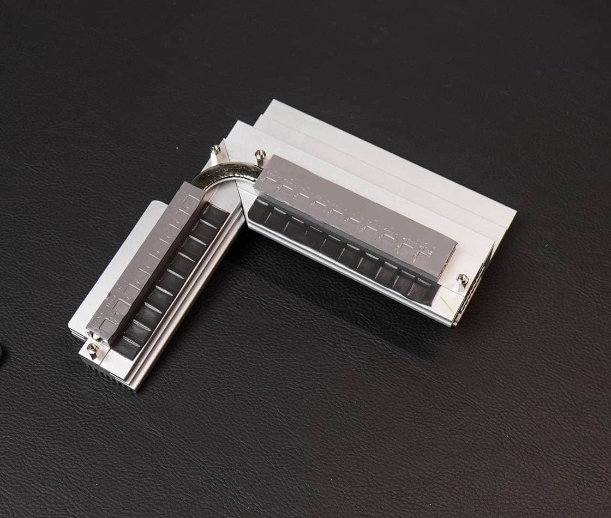

不同级别主板的背板尺寸都是一致的，当然背板的接口规格和数量是根据主板的等级和设计思路来的。以华硕 ROG CROSSHAIR X670E HERO 为例，其背板就提供了多达四个的 USB-C 接口，其中两个支持 40Gbps、1 个支持 20Gbps、一个支持 10Gbps。

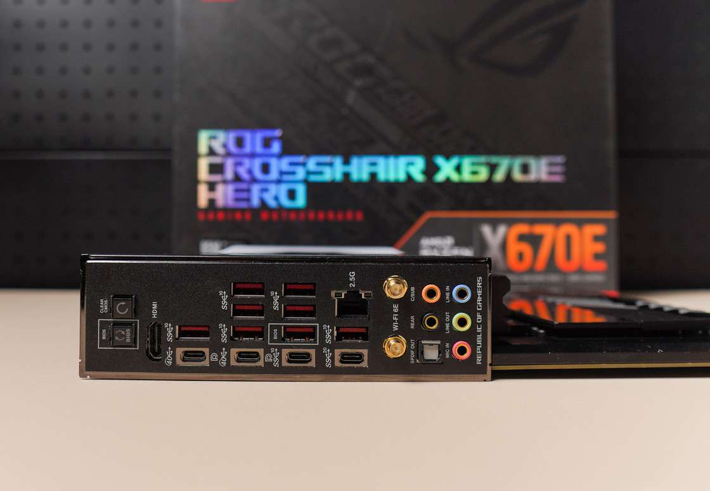

显卡就是承担输出图形显示的组件，将显示芯片、显存与周边电路做成一块独立板卡就是独立显卡，需要通过通用扩展插槽 / 接口连接到主板上；显示芯片集成在处理器内，没有单独做成独立板卡的就是核芯显卡。消费级市场的显卡市场主要由 AMD、Intel 与 Nvidia 三家瓜分，也有摩尔线程这样的新晋品牌。

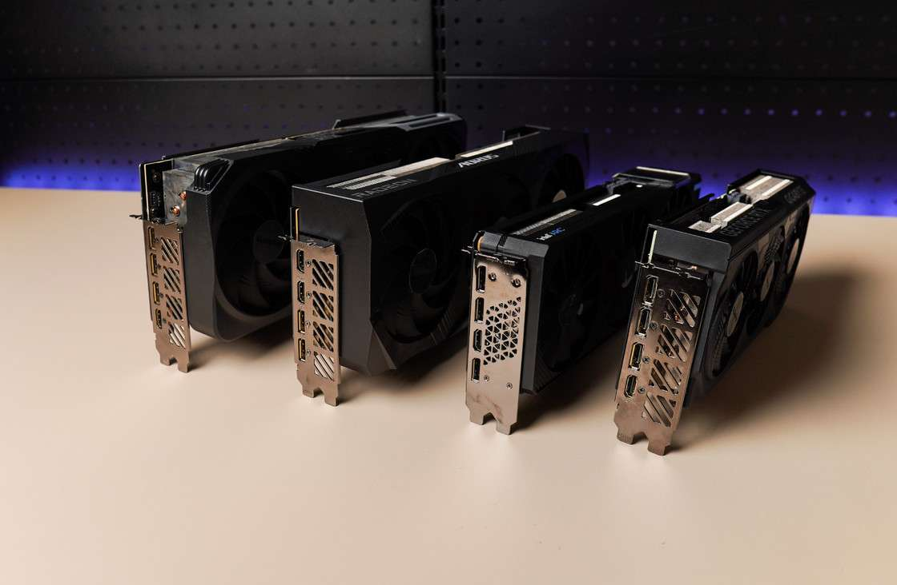

独立显卡的性能与规格基本上都远远强于同代核芯显卡，当然「拔掉独显以提升性能」的 GT1030 这类显卡除外。而随着性能的提升，功耗自然也是水涨船高，配套的散热系统自然也是更大更厚更长。新显卡基本都是两槽三风扇起步了，双风扇与单槽的卡基本绝迹。很多经典款 ITX 机箱也都做了显卡支持厚度和长度的适配，配合单风扇或双风扇卡的小机箱确实没有什么更新的必要了。

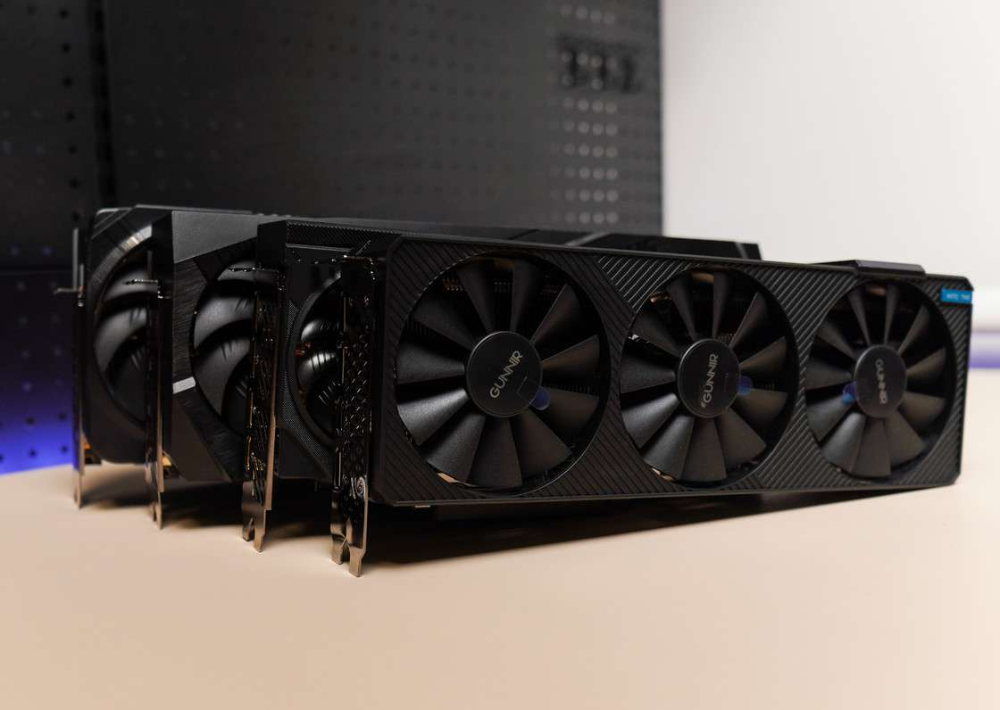

随着核显性能的提升，低端独显已经不在消费级市场铺货， 现阶段独显的规格都很高，基本都需要独立供电。以笔者手中 RX 7900XTX、RTX4090 、A770、RTX4070 四张显卡为例。RTX 4090 是 ATX3.0 供电接口，能够提供 600W 的功率；RX 7900XTX 是 3 路 PCIe 8Pin 供电，Arc A770 是 2 路 PCIe 8Pin 供电，RTX 4070 是单路 PCIe 8Pin 供电，单路 8Pin 的设计功率是 150W，也都能覆盖显卡功率。不过说实话，三路 8Pin 的原生线缆堆一块确实太挤了，有条件的话尽量还是换定制线吧。

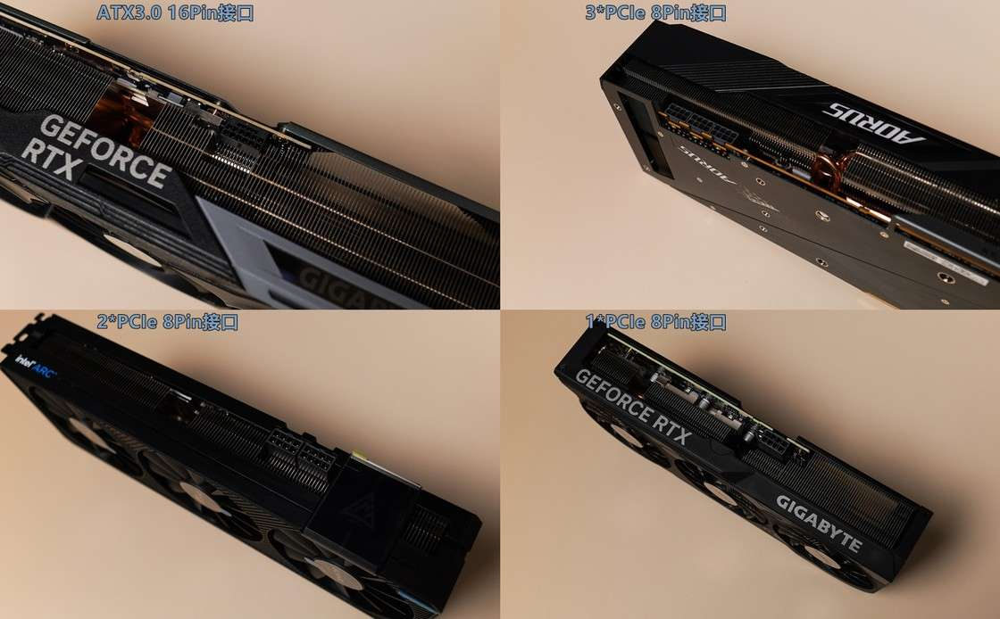

### **存储两大件 —— 内存、硬盘**

内存用于暂存处理器发出的数据和硬盘等外部存储器中调取的数据，计算机运行的绝大部分数据都要由内存负责吞吐读写，现阶段的主流选择是 DDR4 与 DDR5 内存，AMD 处理器这边，桌面级的 AM4 配套主板的内存均为 DDR4 DIMM，AM5 配套主板的内存均 DDR5 DIMM，移动端 6000 系对应可插拔内存的主板则是 DDR4/5 SO-DIMM 皆有，移动端 7000 系处理器对应的就全都是 DDR5 SO-DIMM 了；Intel 这边则是每款每代都有 DDR4 与 DDR5 版本的中低端主板，高端主板则主要以 DDR5 为主。

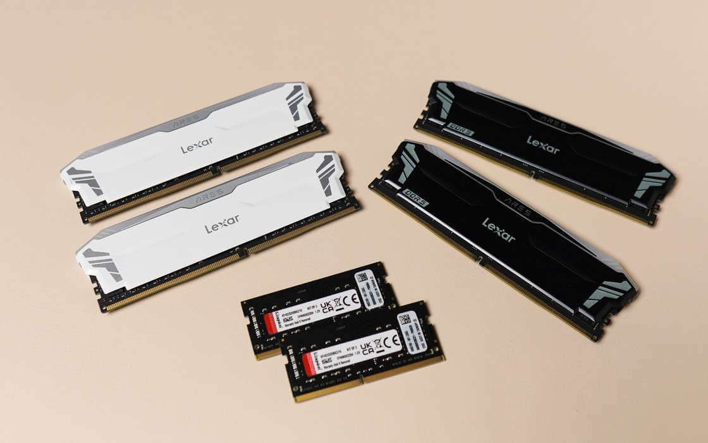

以现在的处理器表现来看，Intel 12 及 13 代处理器直接买高频条，一键开启 XMP 就完了，手动超频的话跟处理器、主板的体质关系也很大，实操还是挺麻烦的。AMD 这边就省事了，直接 6000MHz 到 6400MHz 的内存条直接用就好了。唯一需要注意的就是就是散热器会限制内存的高度，风冷可以通过更换风扇位置解决，水冷的限制一般不好解决。

硬盘是非易失性存储器，用户计算机的数据都是存储在硬盘上。DIYer 能购买到并在消费级主板上使用的硬盘只占了一部分，按照存储介质与方式能够划分为机械硬盘和固态硬盘，按照接口形式划分能够划分为 M.2 硬盘、PCIe 硬盘、SATA 硬盘、U.2 硬盘。不过由于绝大多数用户来说，后面三种硬盘已经很少出现在 DIY 装机中，所以不在此篇做展开。

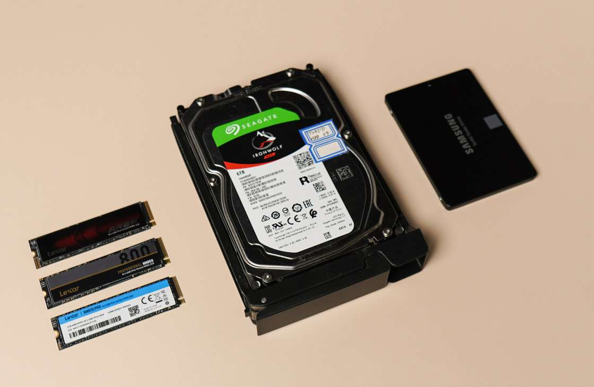

M.2 硬盘在前几年很是混乱，总线、传输协议、电气接口和物理接口各种搭配，但实际上也不是完全兼容，会有冲突。这两年已经被 M Key 接口与 PCIe x4 协议统一了，区别就只有 PCIe 协议的迭代。根据容量与价格需求出发就好，只要价格足够便宜，这个硬盘出现任何问题那都是我自己的问题。M.2 硬盘在尺寸上还有 2280、2242、2230 和 22110 这几个不同长度的规格，当然很少有装机会选择后三者就是了。

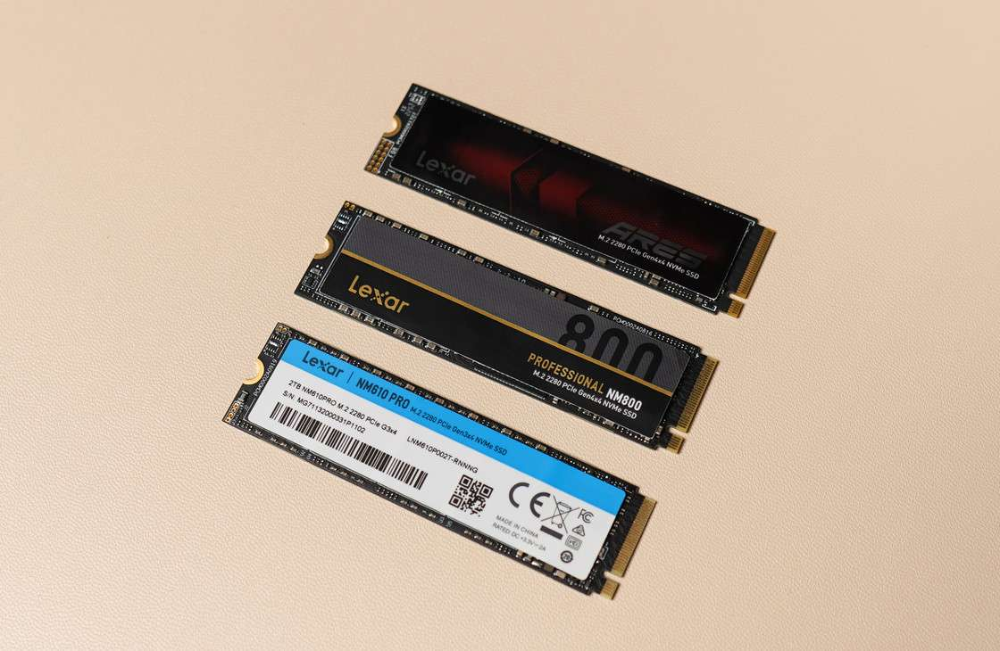

随着硬盘读写速度的攀升，PCIe 5.0 协议的固态顺序读写都能到 10G/s 以上了。发热量叫一个水涨船高，绝大部分硬盘会因为高温掉速，所以大部分主板都配了散热装甲。不过主板自带装甲的散热能力相比旗舰级固态的发热量可能还是小巫见大巫了，可能就得换个像利民 HR-09 这样的热管散热器了。当然像那些副盘位的就得换一些更薄的散热器，要是在第一条 PCIe 插槽下方的硬盘位甚至都无法使用硬盘散热器，毕竟现在显卡都是多槽占位，直接就能全挡上。

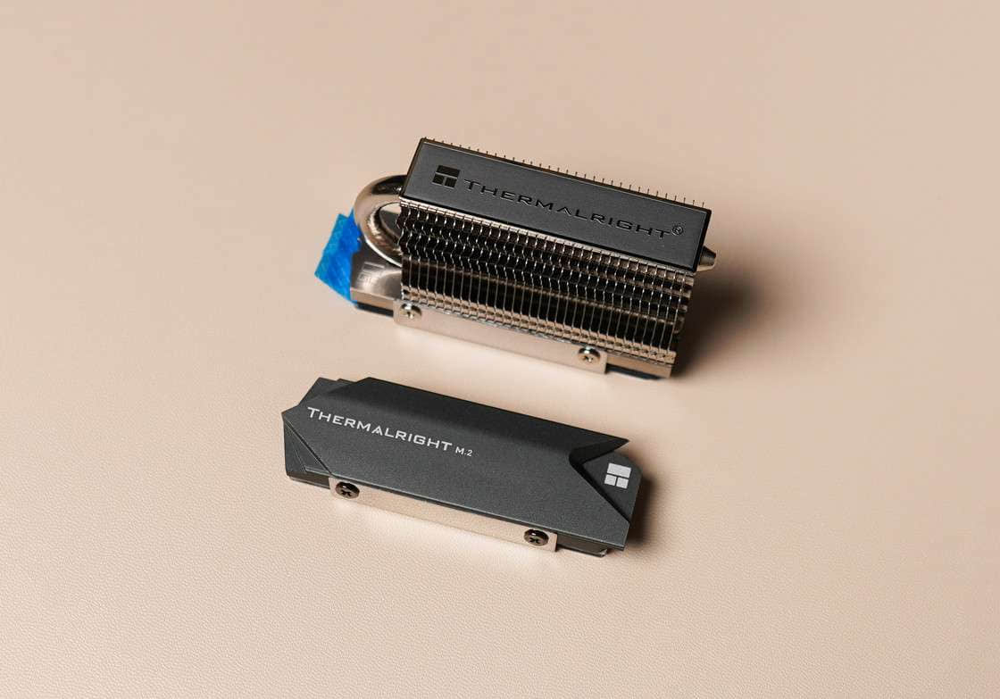

### **底层三大件 —— 机箱、电源、散热**

现在的机箱比前几年的选择多了很多：普通的侧透机箱和趋于沉寂的 ITX 机箱就不多说了，像削减无用空间的紧凑型，支持前侧全透的海景房层出不穷。而机箱基本是与主板版型，风冷散热器限高、水冷散热器冷排支持和显卡长度与槽宽几个因素互相限制，从产品选型阶段就要考试考虑，避免冲突造成无法安装的情况。

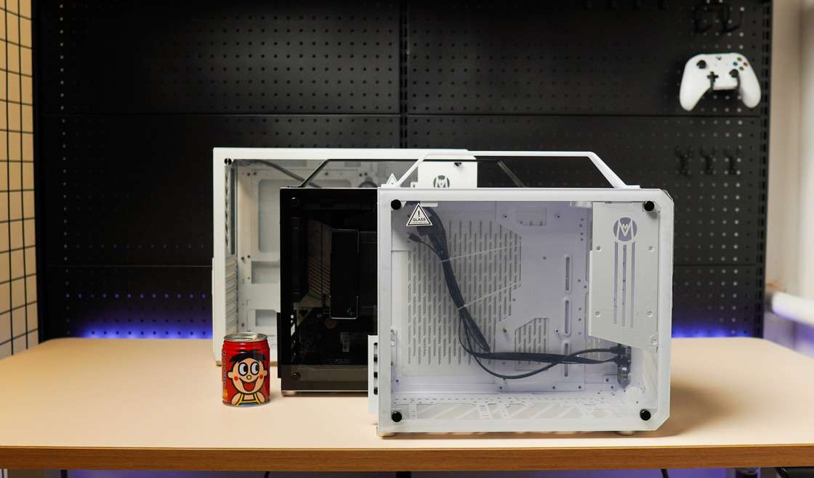

以机械大师的紧凑型机箱系列为例，小到 ITX，大到 ATX 版型都有支持的型号。以支持多版型的 C34 Pro 为例，安装 MATX 与 ATX 就需要调换机箱钢板的位置，在部分组件的支持上也会有差异。

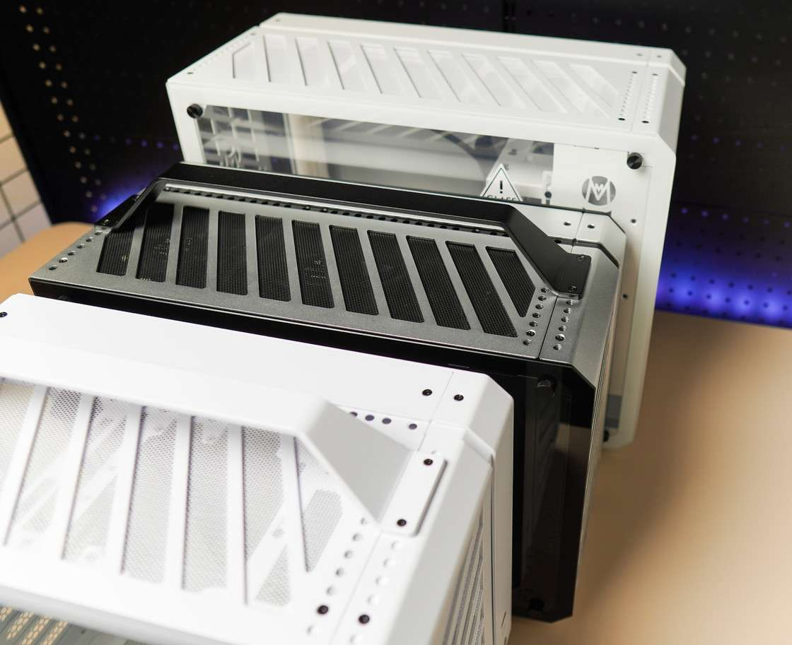

具体的支持情况请看此表，基本涵盖了机械大师现在产品线，紧凑型机箱的组件制约情况更多。因为压缩纵向高度，水冷的风扇和冷排还会对内存有限高要求。因为空间利用率更高，所以组件之间更容易产生干涉，所以机械大师 C 系列机箱都将对应的情况做了标注与说明，想尝试紧凑型装机的可以参考下表。

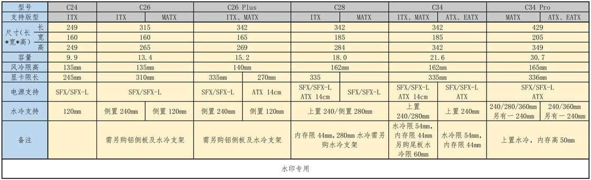

电源其实是存在大量非标设计的，不过 DIY 市场因为电源标准引入的很早，都是按照对应规范设计的。常见的有 ATX、SFX/SFX-L 和 1U Flex 这几个规格，注意 1U 电源并不一定是 1U Flex 电源，部分供服务器使用的 1U 电源长度比上面这几个都要更长。

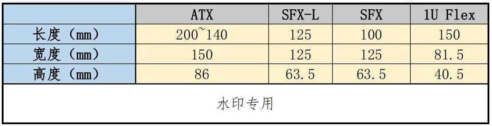

来看尺寸规格对比，以九州风神 PX850G 与银欣 SST-SX600-G 为例，能发现 ATX 电源与 SFX 电源在尺寸上相差了不少。在价格上更明显，其他规格参数相同电源来对比，SFX 的价格简直起飞。

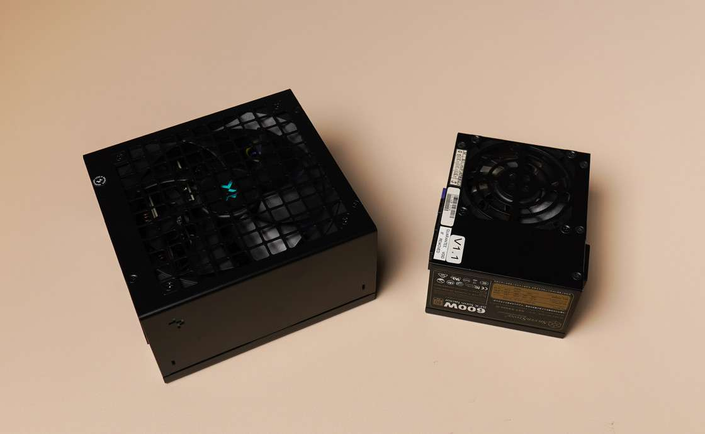

80 PLUS 认证要求主要是在电源输出 10%、20%、50% 和 100% 额定功率时对转换效率和功率因数（PF 值）有所要求。参与认证电源的转换效率和功率因数达到对应等级要求，就可以获得对应的效率等级认证。「有 80 PLUS 认证不一定是好电源，但没有 80 PLUS 认证一定不是好电源」，获得白金和钛金认证肯定都是好电源，而从金牌往下就有浑水摸鱼的产品了。

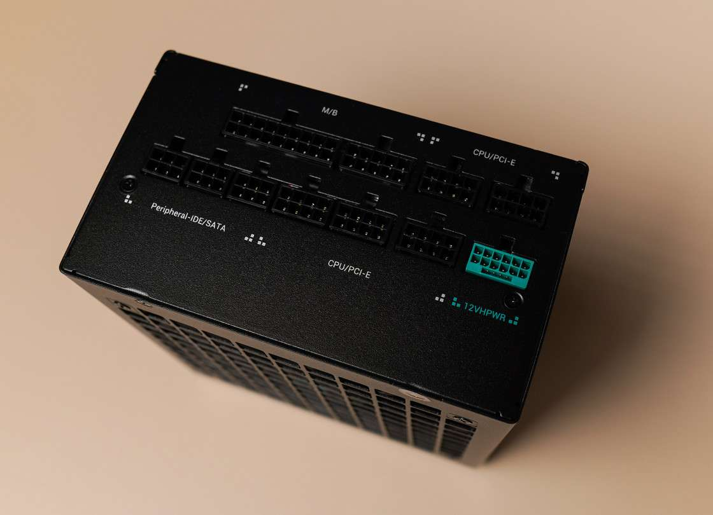

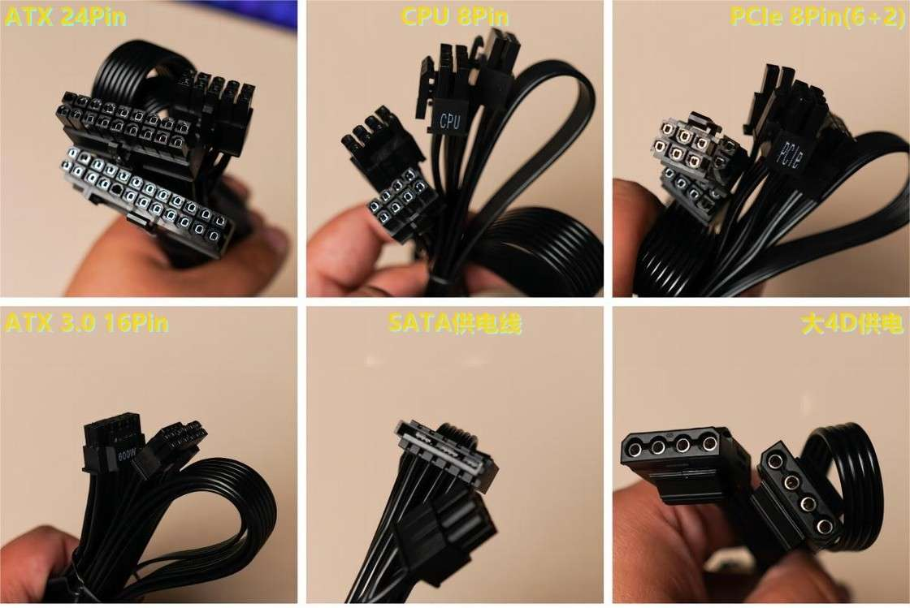

风冷受机箱侧板高度限制，水冷的冷排受机箱支持规格限制。而不同品牌不同规格的散热器的散热能力也有区别，这些导致散热基本是最受限制的组件，甚至会因为机箱的尺寸支持规格反过来限制处理器的选择。像利民双塔旗舰 FC140 风冷能是 285W 的解热能力，九州风神的冰堡垒 360 是 300W 的解热能力，一个单塔五热管也就 180W 的解热能力，再多说个硬盘散热也就是个 5W 左右的被动散热。如果处理器的满载功率，超过散热器的解热能力，就会导致热量堆积直到降频。

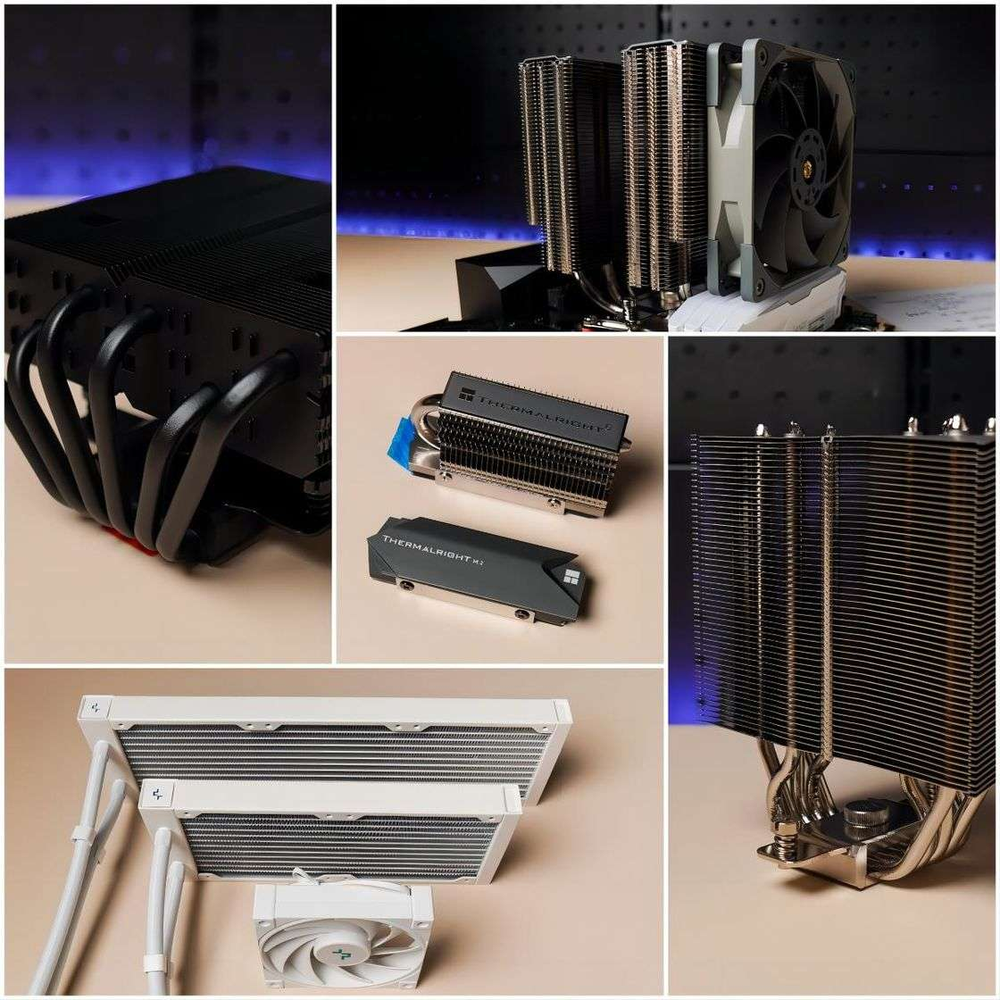

风冷散热器由底座、热管、鳍片与风扇几个部分组成，依靠热管中液体的蒸发 - 凝结搬运热量，相变介质在热管的底座端吸热蒸发，在鳍片端放热凝结。热管的导热效率是铜和铝的几百倍，理想状况下的热管数量与散热效率可以说是线性相关了，热管多就等于散热强。除开散热器自身之外，处理器的设计、硅脂的涂抹情况，机箱的风道与环境温度都会对实际的散热情况造成影响。

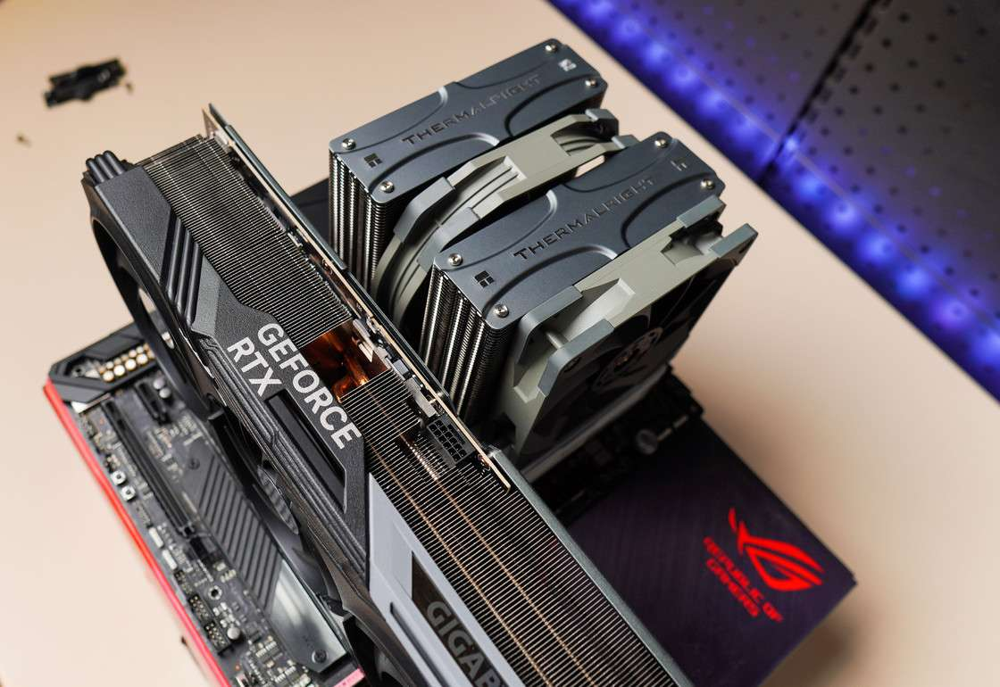

底座是与处理器表面直接接触的，自然是完全接触时的散热效果最好。常见的工艺热管直触与铜底焊接两种：热管直触相比铜底焊接，大家可能想这说直接连到热管了，没有中间材质导热效率应该更高吧。现实和理论还是有不小差距的，热管直触需要将直触这边铣磨平，再塞进走管的铝底中。热管和底座的缝隙、接触面的光滑度都没发保证。而铜底焊接只需要将铜底铣磨成光滑面就好了，底座与热管都是铜的，导热效率自然更高。

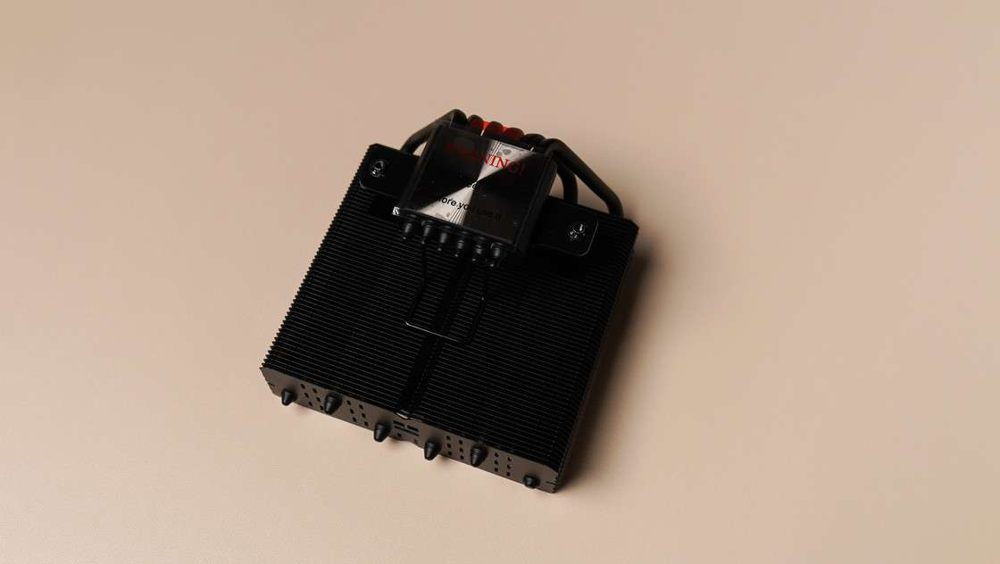

鳍片的主要功能是将热管从底座搬运过来的热量散发掉，常见的工艺分为穿 Fin 和回流焊两种：

-   穿 Fin 是指通过「管粗洞小」的设计将热管穿过鳍片，因为开孔小所以鳍片能够压紧热管。但毕竟还是有空隙存在，而且铜和铝的膨胀系数不同，受限于成本又不会提高公差要求，大部分采用穿 Fin 工艺风冷散热器的散热效果和耐用度都是差一些的。例外的就是利民老款这些穿 Fin 怪物，极其严格的公差保证了直触情况下的热导率。
-   回流焊则是将焊药刷在热管上，完成组装后放进机器加温，焊药熔化后能够将热管与鳍片间的小缝隙填满，不过还是热管与鳍片材料不同的问题，很多回流焊焊药中需要加入镍，但是镍的导热率很差，劣质的回流焊工艺产品的撒热效率就更不忍直视了。

所以在实际产品中会看到，高端旗舰散热与低端入门散热都有采用穿 Fin 与回流焊工艺的产品，但实际的散热效率和使用效果自然是天差地别了。

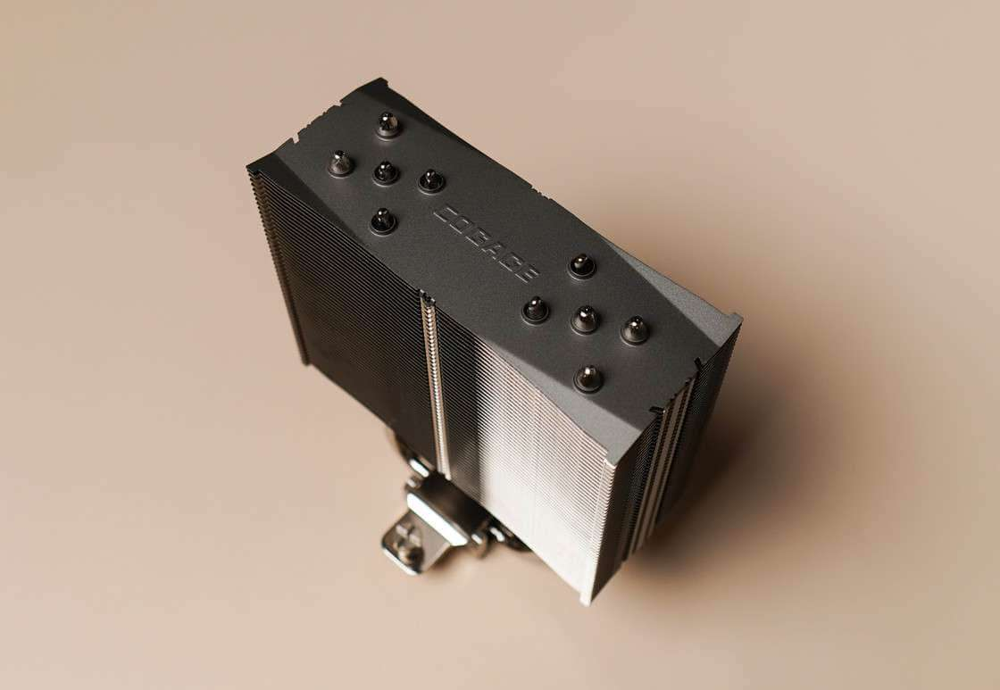

常见风冷散热器形式有下压式和塔式，一般而言塔式散热器的散热性能是强于下压式的。同样热管规格的塔式与下压式，导热效率基本不会有太大差异，但塔式鳍片面积与风扇尺寸一般都高于下压式，散热效率自然更高。

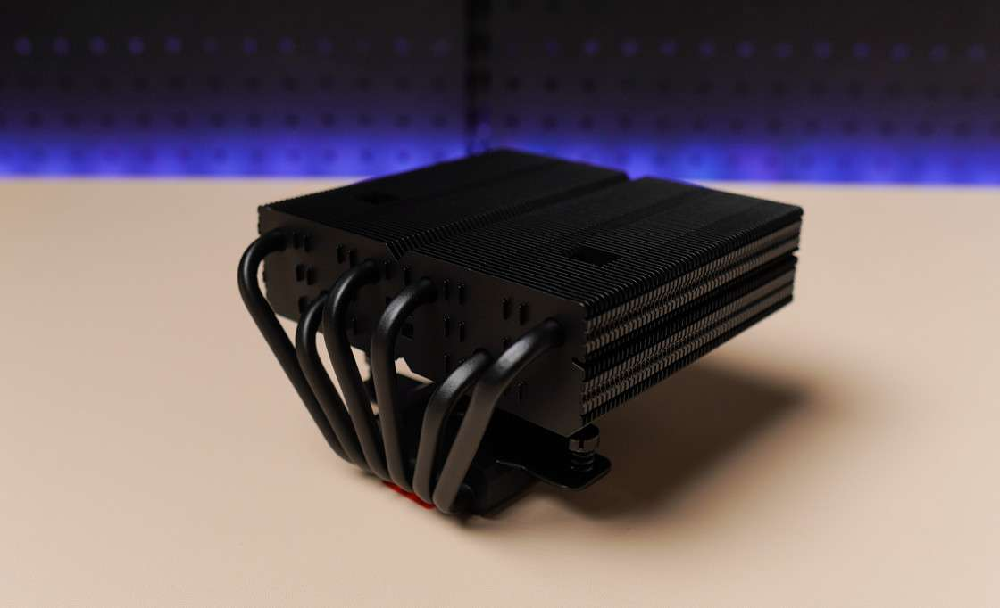

很多 ITX 或者紧凑型机箱上，限制了散热的整体高度，所以很多时候下压式散热才是更好的选择。当然很多塔式散热（包含相当一部分双塔散热器）的净高度也是 OK 的。

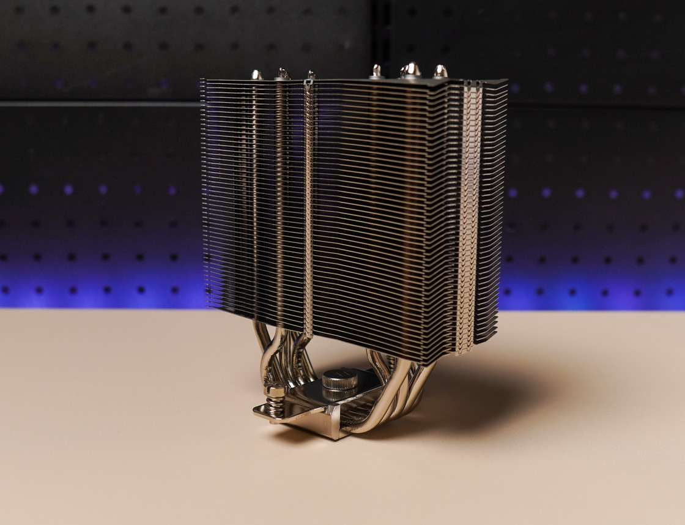

水冷散热器由带水泵的冷头、导液管、冷排与风扇几个部分组成，依靠循环系统总中液体热容搬运热量。水冷液流经冷头吸收热量，水泵加速水冷液流动从而在鳍片端释放热量。由于所用水冷液的比热容较大，所以处理器温度不会有太明显的温度突变。除开散热器自身设计外，与风冷散热器一样受处理器的设计、硅脂的涂抹情况，机箱的风道与环境温度等因素影响散热表现。

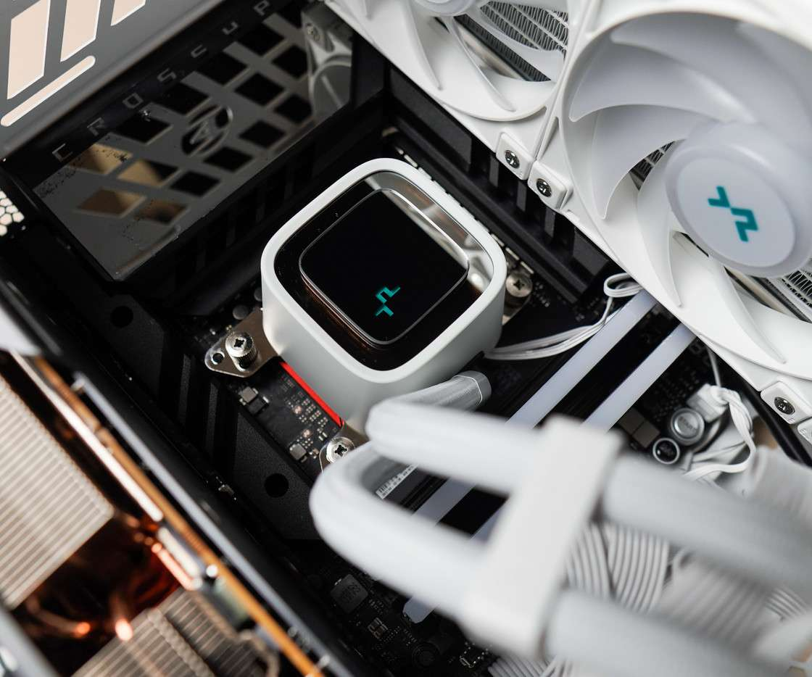

水冷散热器通过冷排尺寸区别，常见的有 120mm、140mm、240mm、280mm 和 360mm 几个尺寸，都是对应着指定规格风扇的。不过要注意的是，这里的尺寸其实对应的是冷排散热鳍片的长度，而不是冷排的实际长度。冷排的进出水口与框架普遍还要占了 20⁠–50mm 的长度，不同尺寸的冷排散热能力都是有上限的，处理器发热越高，就也需要大尺寸的冷排来散热。

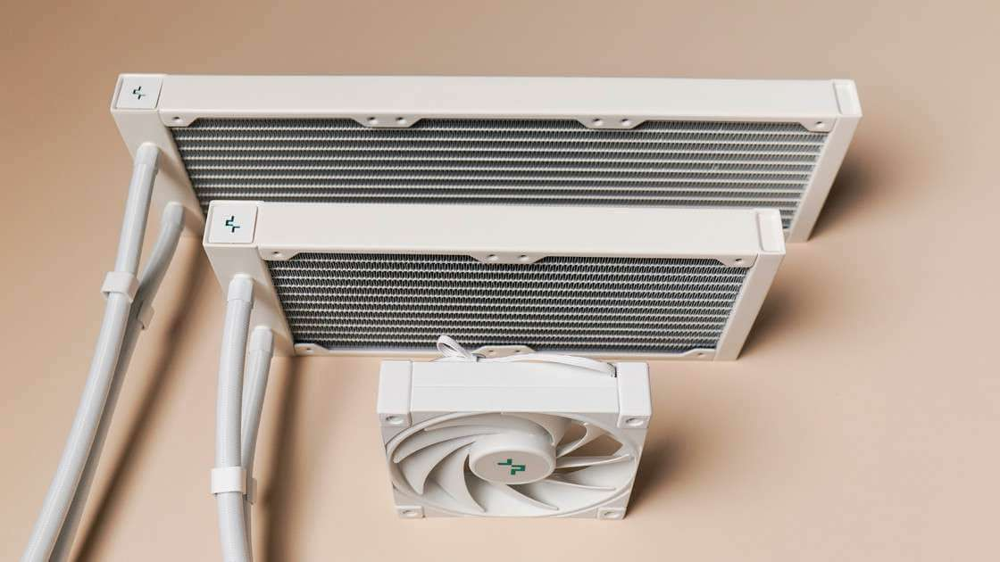

一体式水冷散热器的冷头都集成了水泵，引出的供电线需要接到 CPU\_FAN 的接口，或者对应的 PUMP 接口。而一部分水冷散热的冷头还带有灯光效果或者就是个屏幕，还需要将对应的线接到 RGB 接口或 USB 内置接口。

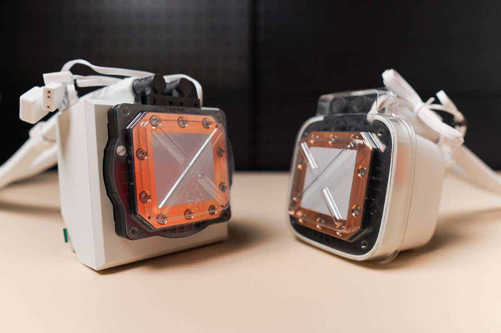

再加上风扇的线就更麻烦了，一把风扇还要一根供电及一根灯控，再算上机箱自身的风扇，可能还要再单独购入一个灯控集线器。当然设备的设计思路是一直再迭代的，九州风神水冷散热器配备的新品风扇就都支持风扇之间串接并联了。相比壳体直插风扇的价格更低，安全性与安装难度更低，毕竟机箱装风扇与水冷装风扇不是一个难度。

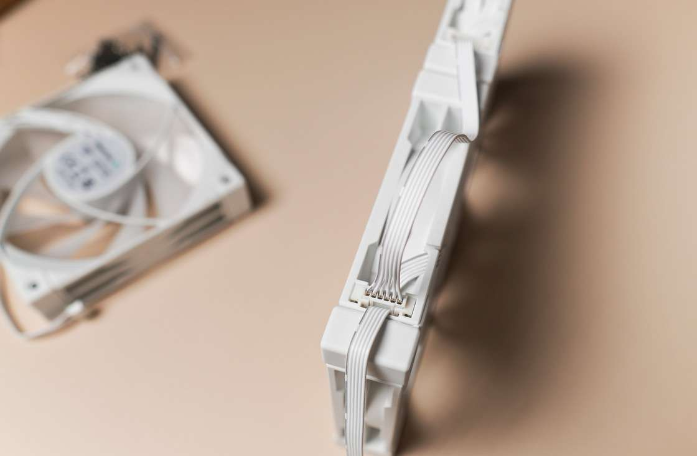

在售的成品都是这些一体式水冷，自然也就有在售的分体式水冷。很多新品主板和显卡都出了对应的水冷版，类似这样的分体式水冷，要准备水泵、水管、水箱、冷排并自行安装。这种的安装难度很大，没有装机经验的话，看看别人装的就好，千万别上来就搞这种。

## **装机准备工作**

安装各个组件时必然会大量拧螺丝，好一些的机箱基本能统一螺丝的规格，但是 M.2 硬盘螺丝的依旧是需要不同的批头。考虑到很多硬盘不会提供专门的螺丝刀，而大部分主板也没有 M.2 快速拆装，所以最好准备一个可替换批头的螺丝刀。另外有条件的话可以准备超长杆螺丝刀应对比较深处的螺丝，准备电动螺丝刀应对需要大量安装的螺丝（比如冷排）。像机械大师就自带了一支螺丝刀，兼容它家提供的全部机箱螺丝的安装，所以单独准备一个安装 M.2 硬盘的小螺丝刀就行了。

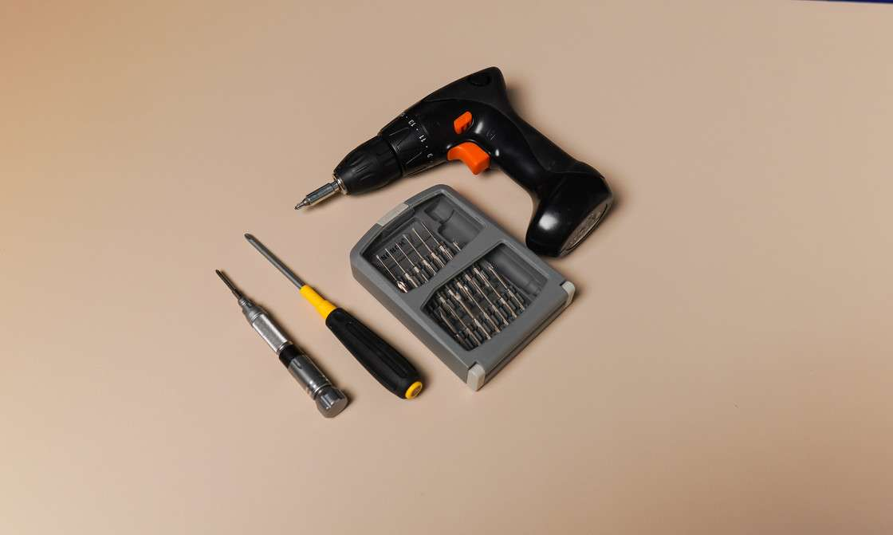

机箱一般会附带 10 条左右的最小号扎带，要是风冷 + 甜品级显卡的话勉强够用。但凡是个水冷 + 旗舰显卡就肯定得单买扎带，几个大走向都得捋着绑扎，粗略一估就得二三十条才够用。

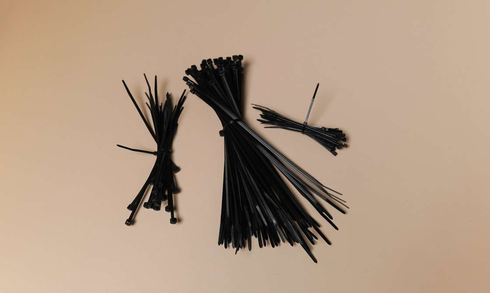

我们还需要一个 U 盘来安装系统，使用官方的 Media Creation Tool 直接安装到 U 盘中，或者使用 WePE 配合在下载的镜像进行安装。如何选择 U 盘呢？评判标准就两个，读取速度够快，主控兼容性好。使用这种 DIY 的 U 盘可以获得极快的读取速度，但有的时候兼容性确实有问题。如果有较多的零散装机需求，直接选择品牌 U 盘就行。雷克沙 V400 64G 版就卖 30 块，读速能到 100MB/s，要什么自行车。

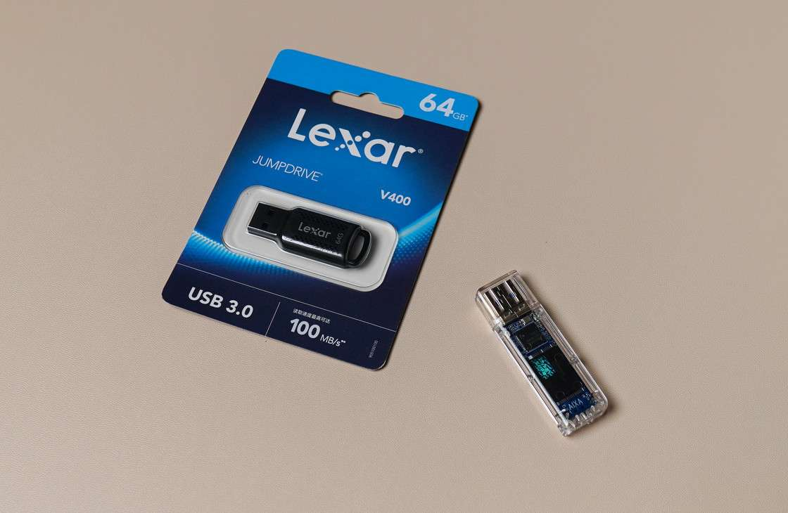

## **开始装机**

不同的机箱会有不同的装机顺序，比如像 ITX 机箱没有什么操作空间，需要把主板、组件和接线都安装好之后，再往机箱里面直接塞；紧凑型 MATX 机箱的操作空间比起 ITX 大了许多，可以把组件装配好再安到机箱上，再把供电与跳线穿插接好就可以了；像是全塔机箱又大又重，就可以先把电源和主板安装到位，再逐个安装其他的组件。

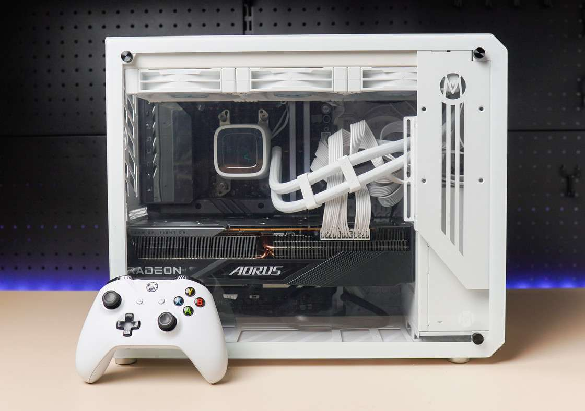

按照各种不同机箱的装机顺序，可以讲装机过程拆解为 7 个大的步骤：机箱的拆解与调整，主板及其上组件的安装，散热的安装，电源的安装，整机的接线与理线，显卡的安装和点亮与系统安装。在不同的机箱上，以上步骤的顺序可能会有所不同，而且实际操作有所重叠。装机这事就是熟练工种，装了一次没有心理负担，后续不管什么机箱配置也就都能搞定了。只需要确认好各个组件间的干涉关系，保证各组件不会相互影响安装就好。

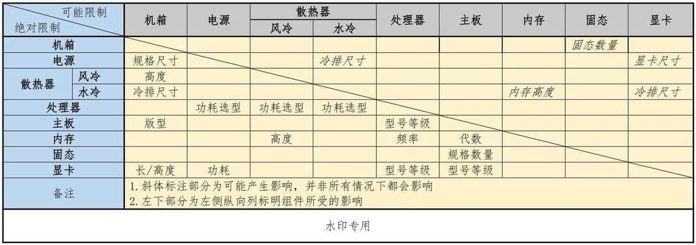

相对大一些的机箱还好，极其充分的空间最大可能地降低了，但是紧凑型的小机箱就要注意组件干涉了。以机械大师 C26 小方糖为例，机箱最终影响了处理器选型：风冷散热高度受限，从而有散热能力受限，最终影响处理器的选择；水冷散热的冷排尺寸受限，从而散热能力受限，最终影响散热器的选择。散热型号影响电源长度，电源长度不同影响显卡长度，进而影响显卡选型。

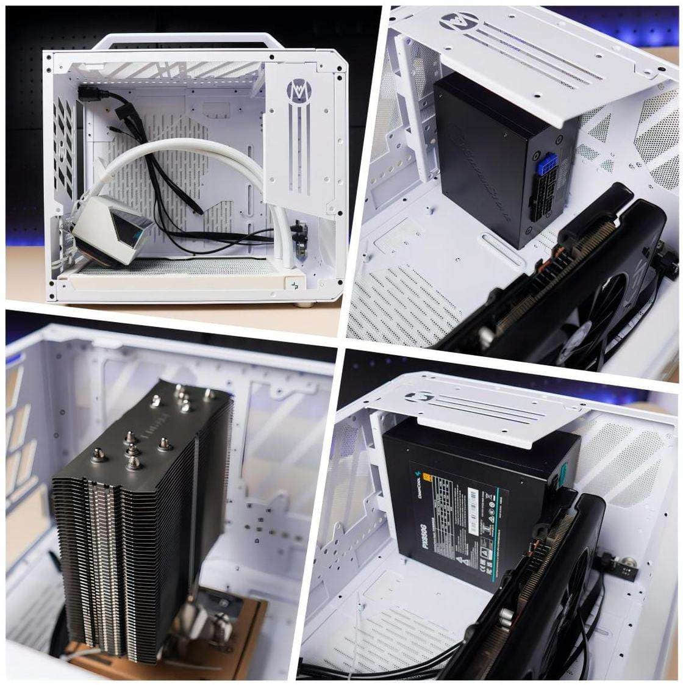

### a. 主板部分的初步安装工作：

安装 CPU 只需要注意处理器的引脚与方向，以 ROG X670E 这块 AM5 的主板为例，打开扣具后观察可以发现，以图示方向为例，底座的左上角是直切的，另外三个角都是做成了圆角。

AMD Ryzen 7800X3D 这颗 BGA 的处理器，则是在左上角标注了箭头。通过这两点我们就能处理器和底座的方向匹配了，匹配之后再按下原装扣具就能将处理器安装到位了。安装 Intel 的处理器也是类似的操作，不过 I 系主板多在塑料底座上「挖坑」标明方向，有所区别。

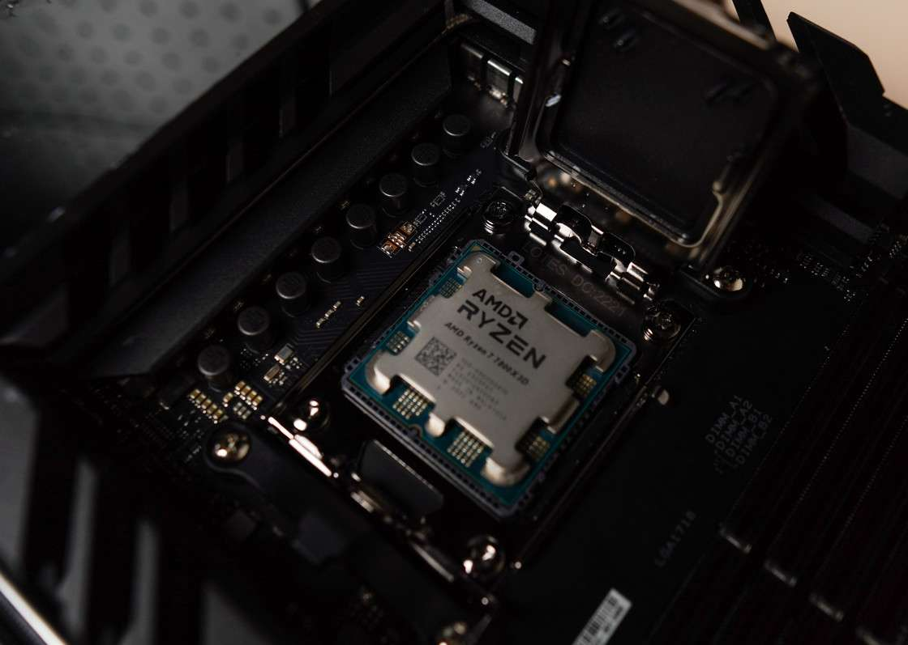

而利民的第三方扣件也标明了指向位置，保证用户能够确认好方向正确安装。AMD 的消费级处理器还都保持了基本正方形的尺寸，两向力矩基本一致，没有处理器变形的隐患。但 Intel 处理器从 LGA1700 开始就变成了长方形，也确实有处理器变形的案例，为了安全和心安还是使用第三方扣具吧。

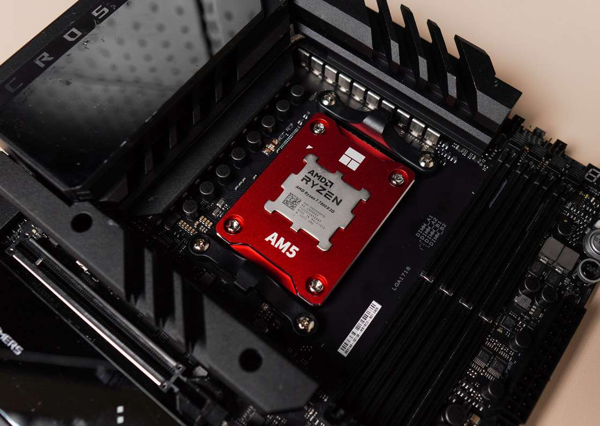

再以 ROG M12H 与 AMD3900X 为例，扣具模式不同，打开方式不同。方向上还是一样的标注和手工对齐安装，以主板方向为参考，更多的 AM4 处理器插槽为横向，而 AM4 与 LGA1700 则是多为纵向。

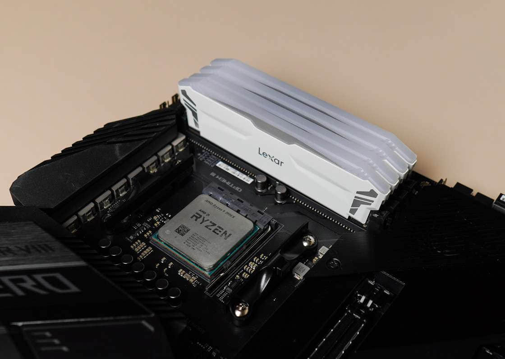

在 CPU 底座与第一条 PCIe 插槽中间，就是直通 CPU 的硬盘位了。不同主板的硬盘为朝向会有差异，但也仅此而已。硬盘的缺口和插槽的缺口是对应的，如果你的主板硬盘位固定不是快装卡扣的话，需要观察固定螺柱与插槽是否在同一平面，不在同一平面的话说明少装或者多装了螺柱，记得排查。最终选用的是雷克沙 ARES 战神 1T 版，协议是 PCIe 4.0，顺序读写能到 7.4G/s。这个规格的硬盘发热量都很大，但大部分中高端主板的主硬盘位都标配了散热装甲，扣上拧螺丝即可。雷克沙 ARES 这款固态，在顶速 PCIe4.0 硬盘算是发热量比较小的，之前 3D 打印机箱装机就没有安装散热装甲，正常使用时基本没有什么问题。但考虑到每个人机箱与使用环境不同，保险起见还得要。如果主板没有自带硬盘散热装甲，最好单独购买一个，利民连带热管和风扇的产品都有，基本是品牌硬盘散热的最优选了。

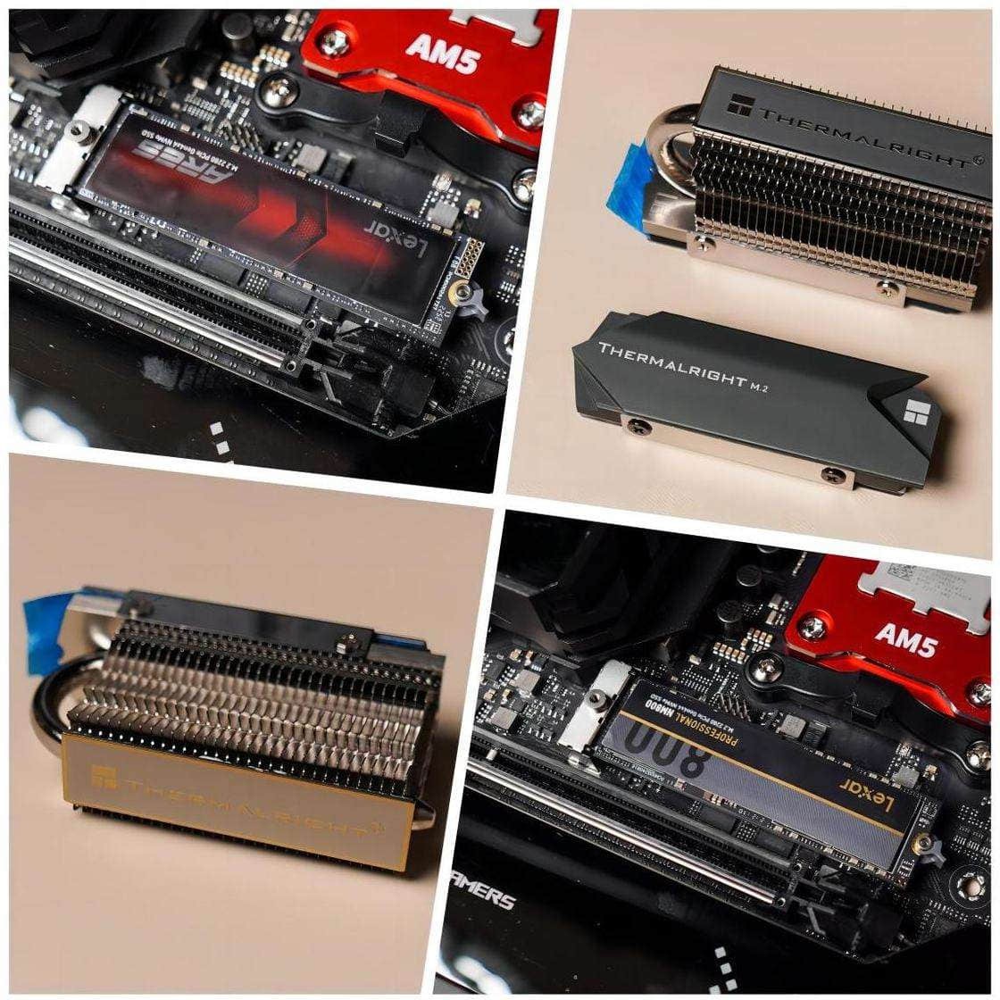

内存的安装很简单，记住不要大力出奇迹就够了。以下图为例，内存的金手指靠近中间位置是有一个缺口的，在主板的内存槽里也有对应的凸起。通常而言，内存有标签的那一面都是向着处理器的，但总归有产品例外，千万不要直愣愣地使劲按！安装的前提条件是，对准内存条的缺口和插槽上的凸起，再进行下一步！主板上的单个内存槽会有单边或双边卡扣：单边卡扣需要将内存先插入非卡扣侧，对准插槽按下内存条，听到卡扣「咔哒」一声就是到位了，可以看到卡扣已经立起并贴合到内存侧边；双边卡扣插槽需要对准后，同时按下内存两边到「咔哒」声，保证双边卡扣都到位。笔记本内存的安装是斜插变平插，操作上大同小异，只是方向有所区别。

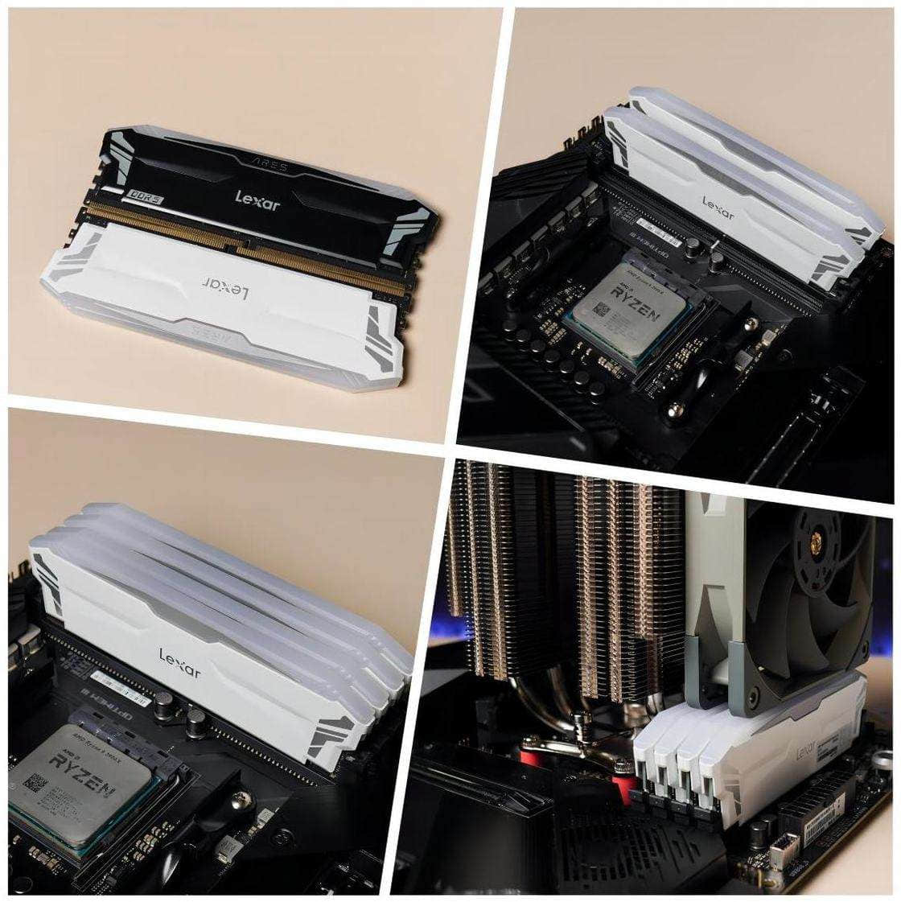

### b. 散热器的安装：

风冷散热与水冷散热的安装顺序有所区别，风冷散热器的安装顺序为：

1.  确认安装形式，拆开散热器
2.  按照说明书选择对应扣具，按照指示将其安装到主板，部分扣具上也会有对应的标记
3.  如果没有自带硅脂或者二次安装，应在处理器上涂抹硅脂
4.  将散热器安装到主板上，依据扣具不同有主板正面拧螺丝，正面搭扣和背面拧螺丝三种方式
5.  将散热器配置风扇的供电线串联后，连接到主板的 CPU\_FAN 接口，灯光控制线接到控制器或主板的灯控接口
6.  最后再将主板安装到机箱即可。

比较大的双塔散热器都是正面安装，容易阻挡主板上侧螺丝与 CPU 8Pin 供电线的安装，最后三步建议按照 ⑥主板 ⑤接线 ④散热器本体 的步骤进行安装，螺丝与 CPU 8Pin 供电在安装主板时安装。

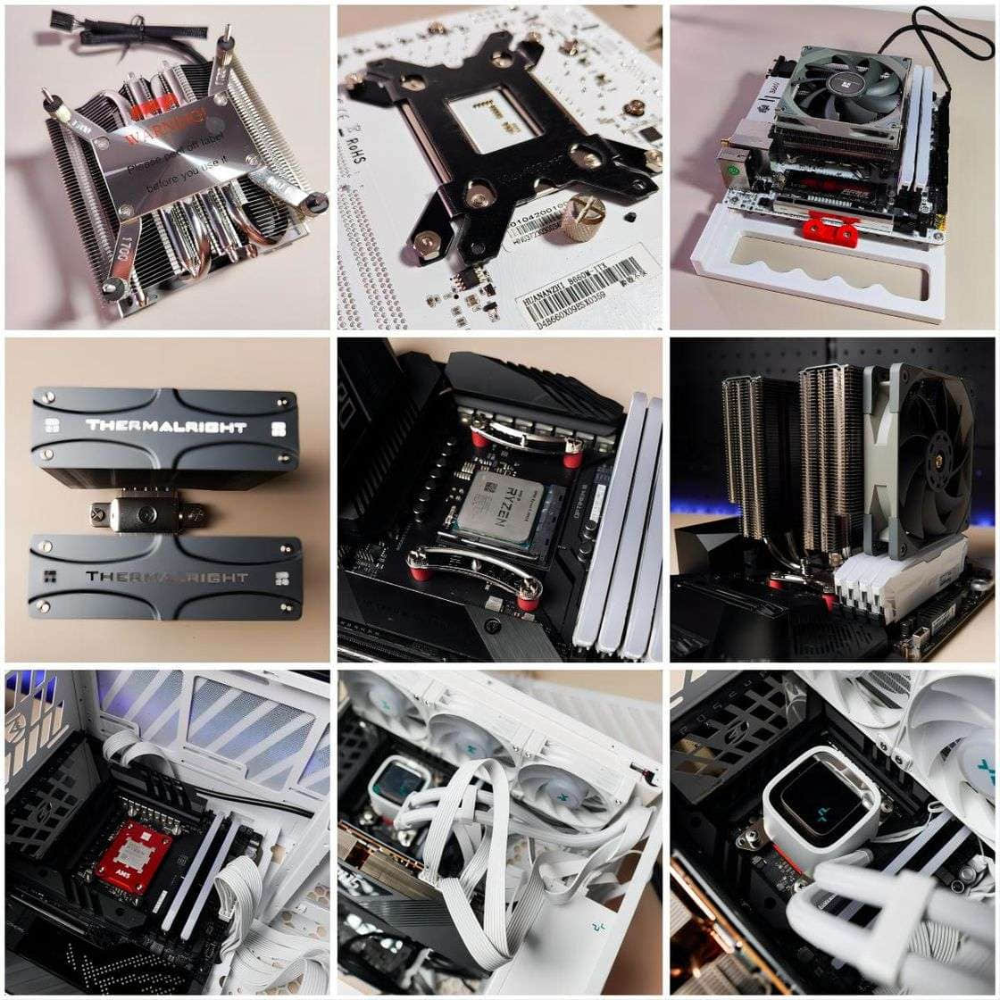

安装水冷散热器应该优先确认安装位置的选择与安装方向的确认，对于常见的机箱而言，冷排有顶置，前置与纵置三种选择。其中纵置是指冷排贴靠背板安装，非海景房机箱的背板仅用于走线，所以极少出现纵置的情况，常规情况还是顶置和前置。而机箱顶置冷排与前置冷排的支持规格不见得一致，购买时要注意阅读机箱的商详标注。

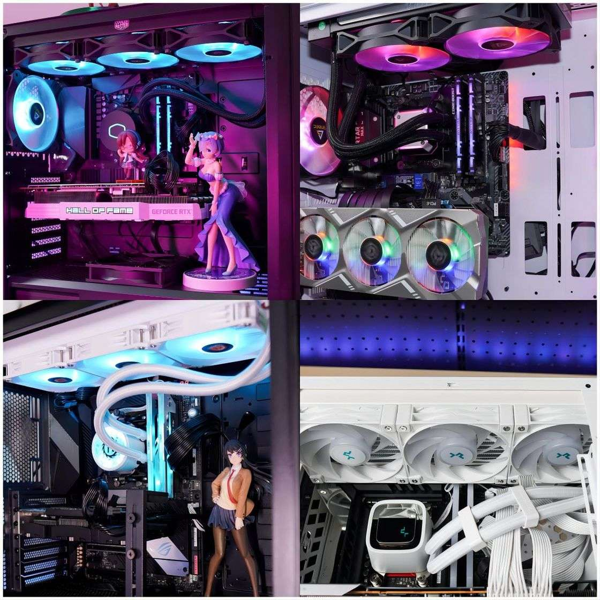

再回到水冷散热器的安装，初次装机必然是选择一体水，如果上来就敢选择分体水，只能祝愿天赋异禀了一次成功了。一体式水冷散热器的安装主要有以下几个步骤：

1.  确认好风扇方向与风扇接线方向后，将其安装到冷排上，冷排顶置对应向上吹风（即机箱外）、冷排前置对应向后吹风（即机箱内）
2.  按照说明书选择对应扣具，按照指示将其安装到主板，部分扣具上也会有对应的标记
3.  如果没有自带硅脂或者二次安装，应在处理器上涂抹硅脂
4.  安装水冷散热器冷头到主板，依照设计不同有有螺丝和搭扣两种方式，据需要在正面操作
5.  冷头水泵线连接到对应的 CPU\_PUMP 或 CPU\_FAN 接口，将风扇的供电线串联后，连接到对应的 SYS\_FAN 或 CPU\_FAN 接口，灯光控制线则是接到控制器或串接到主板的灯控接口
6.  将主板安装到机箱上，因为大部分冷排会阻挡主板上侧的螺丝安装
7.  拆下机箱顶部和前侧的盖板、防尘网等组件，再通过对应螺丝将冷排从外侧安装到机箱上。

注意如果是冷排前置并将风扇夹在机箱冷排之间，不应该单独固定风扇，而是选择超长螺丝将冷排与风扇一块固定。

### c. 主板安装到机箱

主板安装到机箱没有任何难度，只需要选好螺丝将螺丝拧到位就行。记得用长杆螺丝刀，水冷或风冷挡主板螺丝孔位的话就先装主板，散热器不遮挡主板螺丝孔位就根据重量大小自行选择先安装哪个组件。

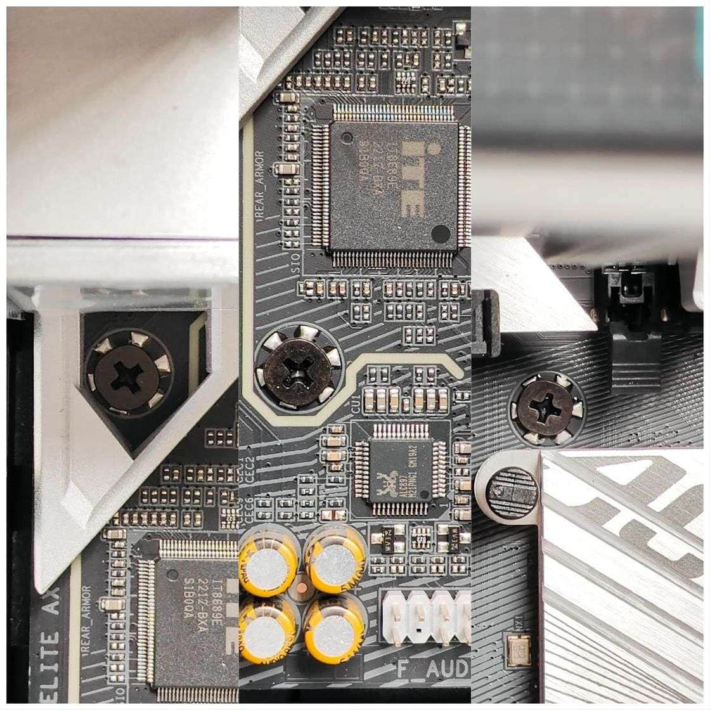

### d. 机箱与电源的安装

钢化玻璃侧板应在机箱平放时取下，如果纵向取下，极其容易磕碰到下面两个角，钢化玻璃会直接爆掉。除了部分做了侧板转轴的机箱，一定都要放平再拆卸。

安装也是一样，平放安装可以最大的降低应力，保证玻璃的寿命。

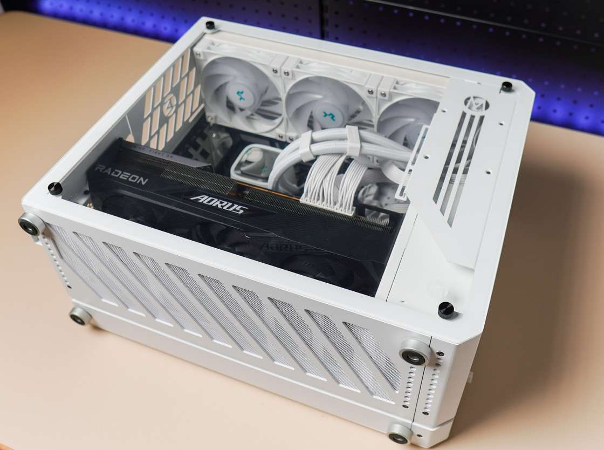

大部分机箱都是标准电源仓，使用的螺丝则是机箱随配的外六角带垫片螺丝，将电源接线的那一面对准对准机箱后部或转接卡的螺丝孔位，按交叉顺序拧紧即可。全模组或半模组电源需要注意，因为部分电源长度超标或者要给 3.5 吋机械硬盘仓位留空间，安装电源后再接线很难操作，要把对应使用的模组线提前接好。

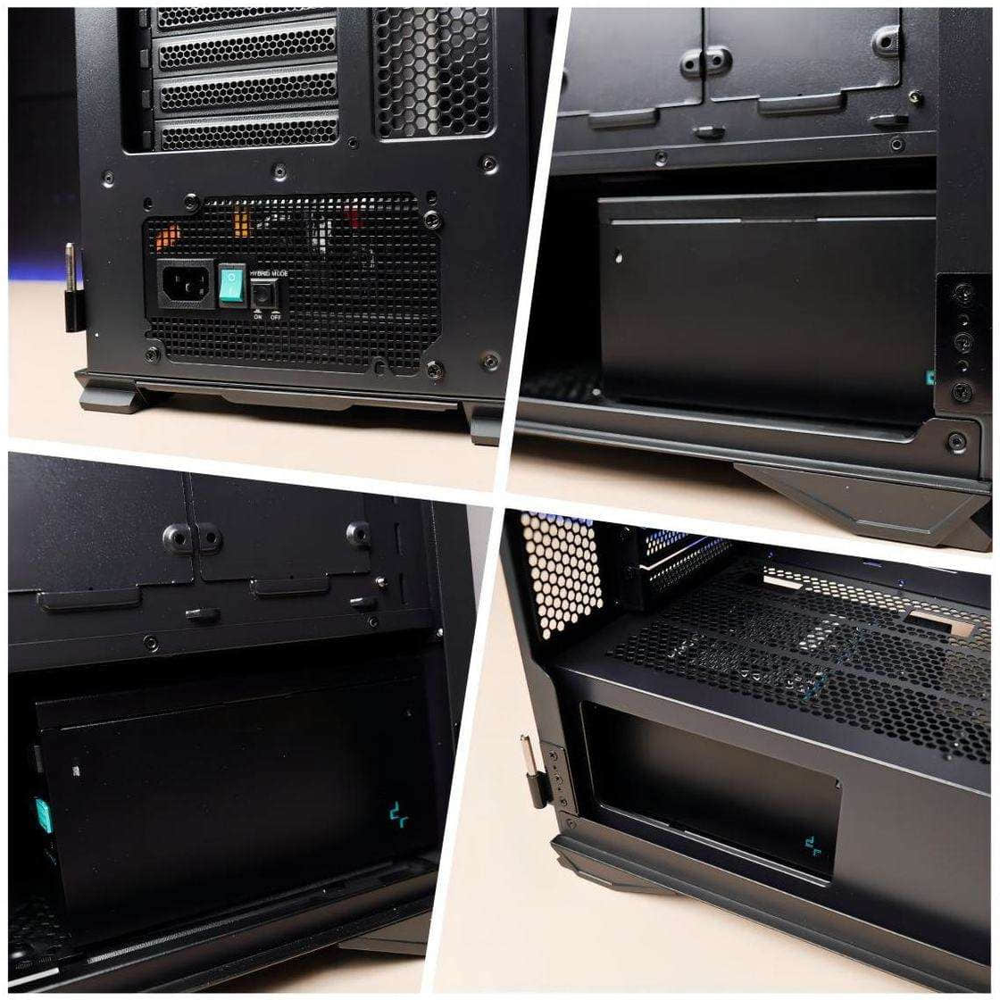

非标机箱的安装也大同小异，以电源的进风面作为正面，像九州风神就会提供一块过滤网，记得提前贴好。按照指示将转接与电源先固定好，先然后接好模组线。大部分非标机箱都是电源更加内置，所以也需要先将三孔供电线接好。全部线缆接好后将电源塞入机箱，大致排布一下走线就能安装了。电源位置周围的过孔，先将模组线穿好的话，电源安装好的大部分情况，就是模组线的接头都会受限。

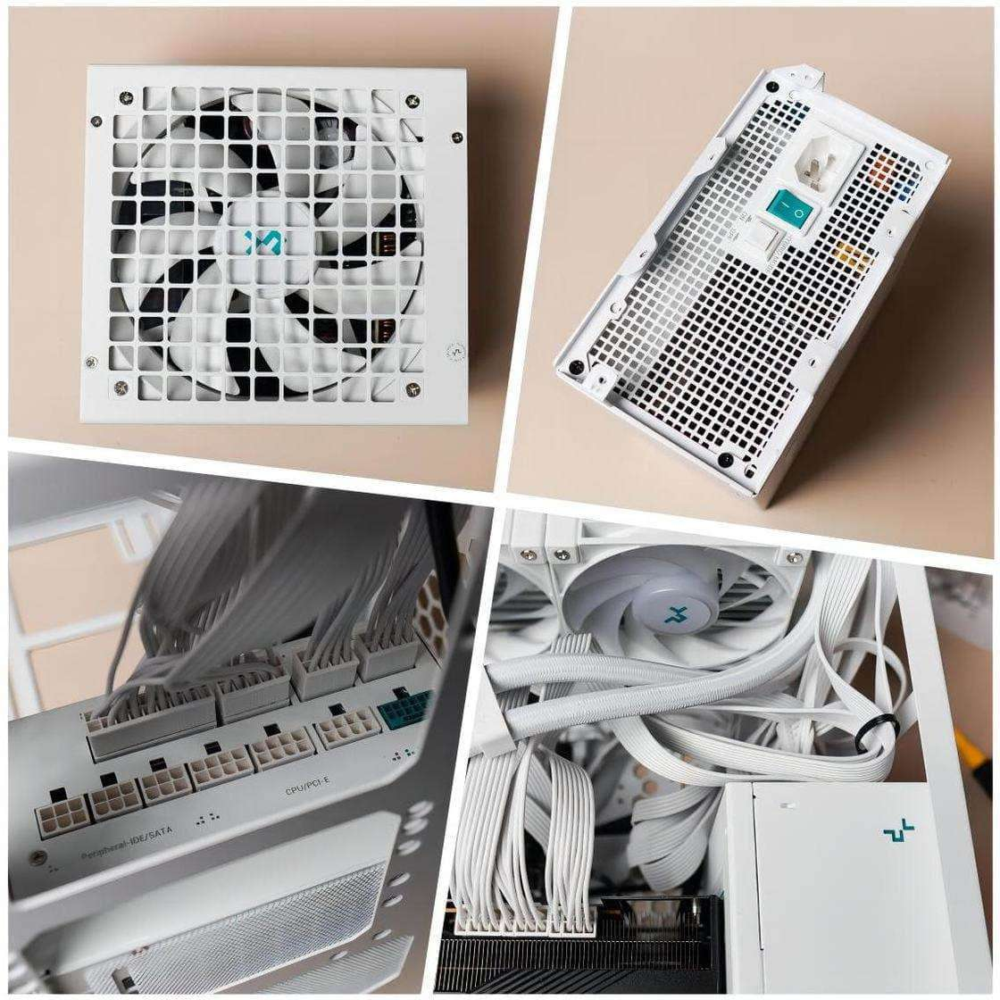

像之前那套 3D 打印机箱需要先安装主板，部分非标机箱则是需要先安装电源，标准机箱只需要考虑穿线问题一样。电源与主板的对应的一套安装流程，根据机箱的不同情况有可能相反。

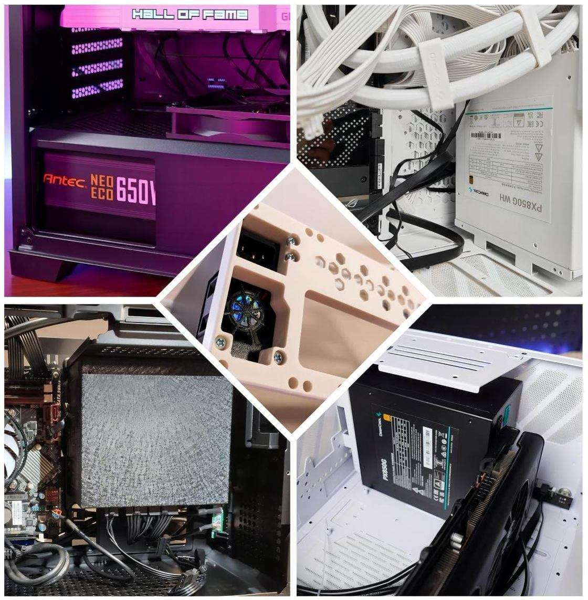

### e. 整体接线工作

先前已经把穿线工作基本完成，强电供电的线缆有：主板 24Pin 供电接头、CPU4/8Pin 供电接头、显卡 8 (6+2) Pin 接头，有需求的话也需要处理 SATA 供电和大 4Pin 供电线，另外非标机箱要注意内置供电三孔线的安装。在主板安装到机箱前，这些就要连接到连接到位，尤其是 CPU 4/8Pin 这种装好主板就完全没法捅过去的线。记住主板上对应接头的位置：CPU4/8Pin 从背板上部穿，ATX 24Pin 从背板中间穿，PCIe 8Pin 可以从背板中间或下部穿。这些预操作都是为了避免水冷冷排 / 风冷塔体和主板对接线的影响。

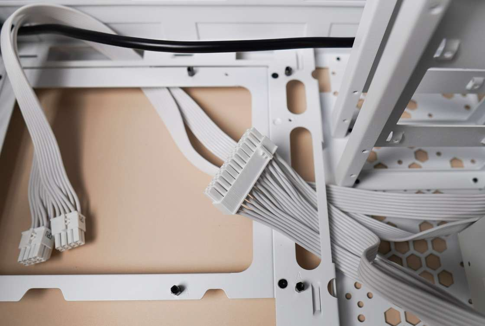

主板安装完成后的上部空隙很难 CPU4/8Pin 连接到位，不管是水冷冷排还是风冷塔体都会让手塞不进去，必须先接线再进行主板和散热器的安装。不过 ATX 24Pin 基本都不用先插，这个接口需要很大的下压力才能接好，而且不像 CPU 4/8Pin 那样容易被遮挡，所以基本是安装完主板之后再安装插紧。

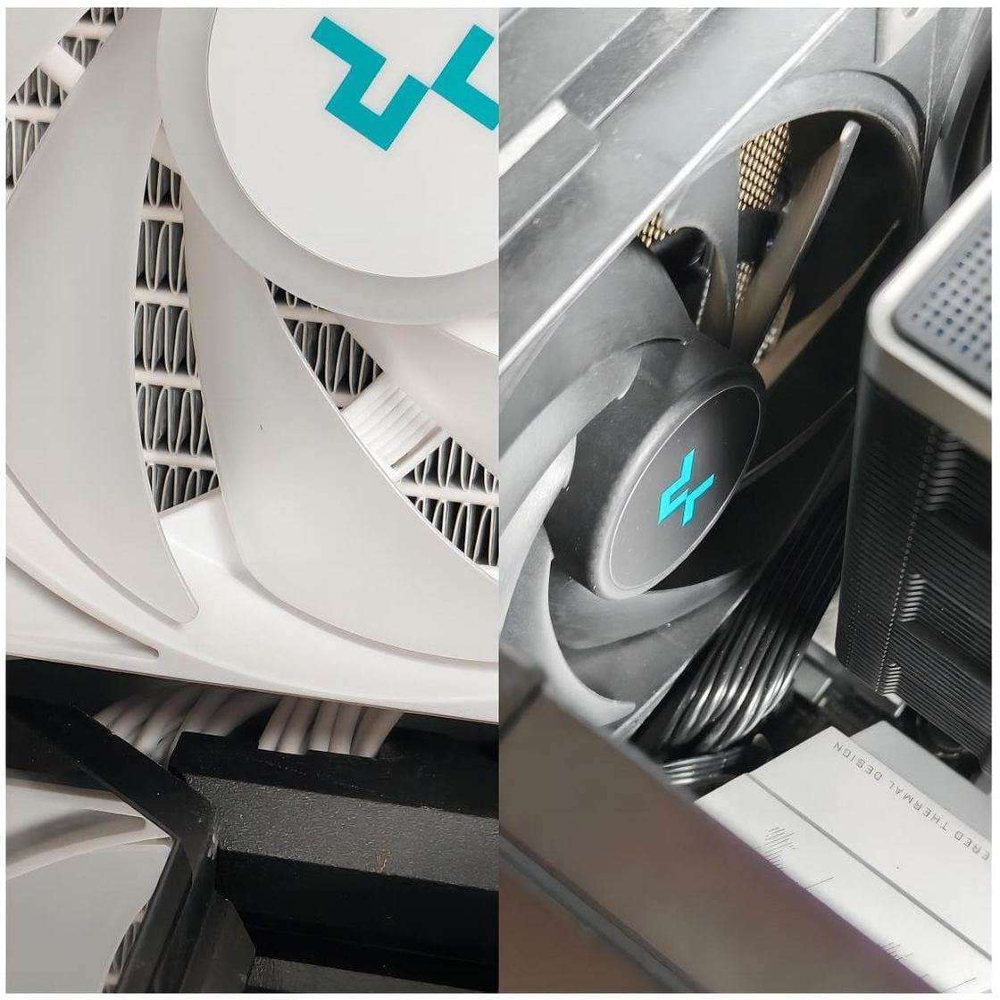

电源到主板和显卡的这些线缆基本就是这个安装顺序，下一步需要考虑的就是风扇的接线与前置面板的接线。先来说风扇接线，一般情况是一路供电线接到主板或控制盒，一路 ARGB 灯光串接并联到到主板或控制盒上；或者是积木 / 自主接口串接并联，通过非标接口来减少线缆接续工作。而水冷就是多一个水泵的接头，单个水泵的一体式水冷基本接到任一风扇接口就行，多水泵的水冷（尤其分体式水冷）要 CPU\_OPT 这种设计支持更高电流的专用接口上。

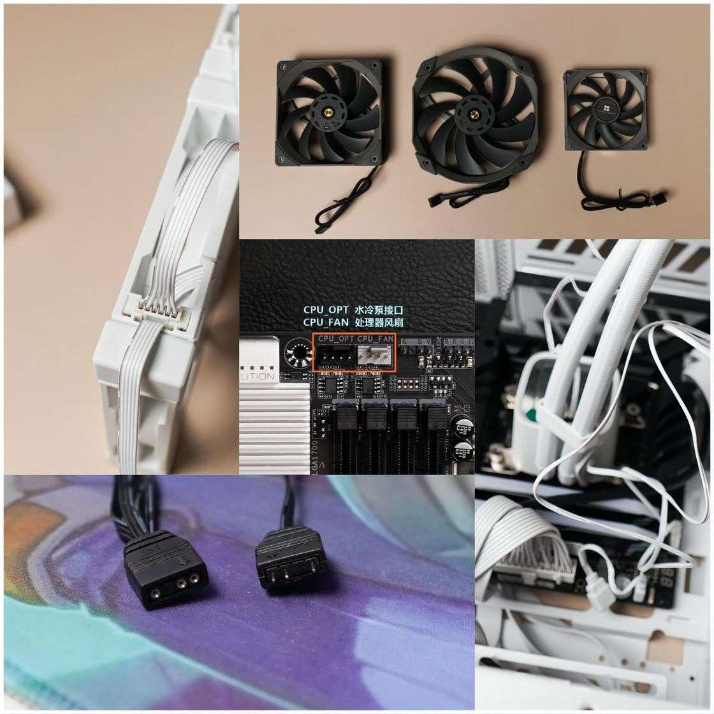

前置接口诸如音频、USB 转接都有防呆设计，翻开说明书对照或者直接看接口旁丝印就能。机箱的前置接口，就是通过对应线缆，连接到主板上 F\_Audio、F\_USB、F\_U、F\_U20G 对应的这些引出插槽。只有 USB-C 20Gbps 的不是那么防呆，得注意一下对准方向。其他接口如果想插错，除非把插针 / 插槽直接干废。需要手动排序的是 F\_Panel，这组插针提供了前面板的开机、重启、硬盘灯等工作。这组接线没有什么难度，就是对照好杜邦线的标识和主板丝印 / 说明书标记，挨个插好就行。

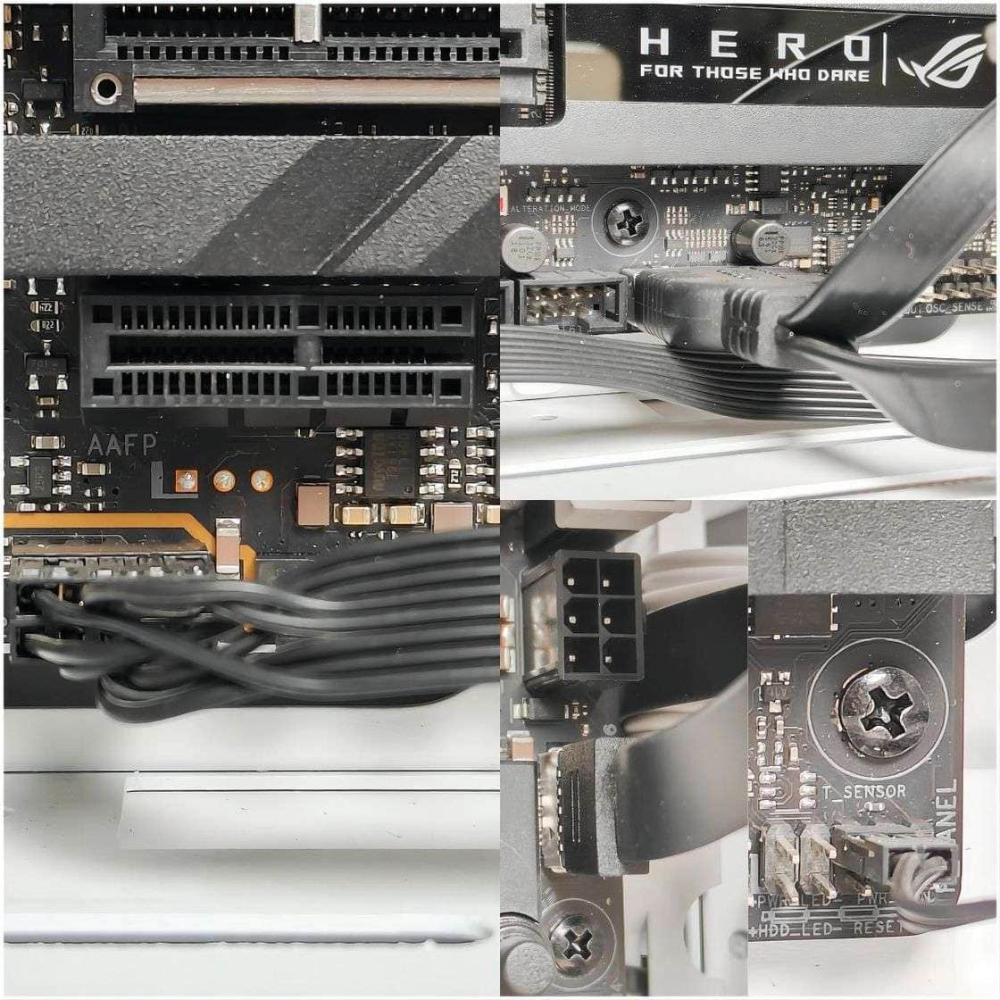

部分的高端主板有独立引出的开机按键和重启按键（华硕的 Flex Key 可自定义，默认功能为重启电脑），验证硬件情况时候可以使用这些独立按键，算是个便捷的备份选择。

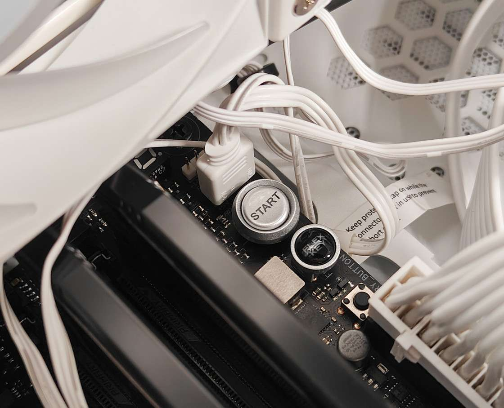

### f. 理线工作

理线的宗旨就只有一个：藏。各种线缆往盖板、背板、电源 / 硬盘仓直接塞，保证视线所及之处不乱就行了。模组和半模组电源扁平线需注意方向，前侧留下足够长度后，多余长度需在后板固定。

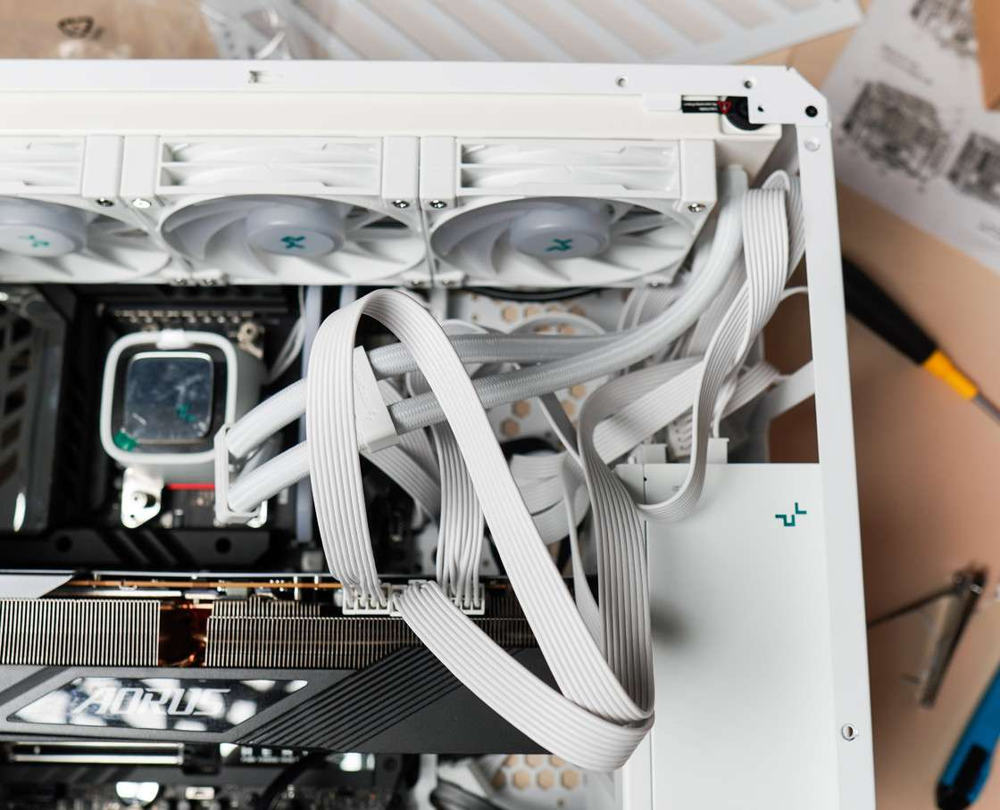

风扇灯光虽然都是 ARGB，但各家支持的协议都有所区别，而且控制盒接线模式的影响，无法详细展开。但其接线思路是和串接完全一致的，控制盒会通过风扇接口或 SATA 接口供电，记得参考对应说明完成布置。

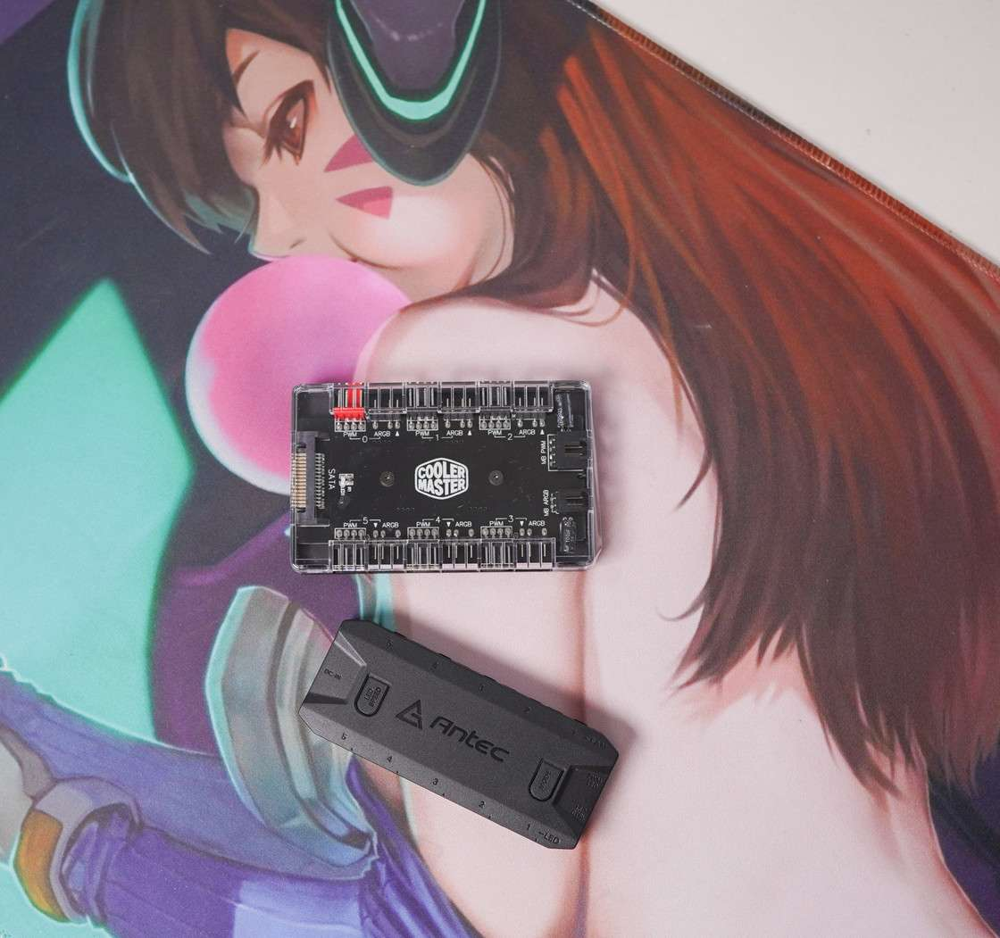

机箱自身的线可通过最小号扎带固定，藏于背板不影响其他」大线「即可，要注意机箱接线的冗余较小。主板上的接口较远时，如果 Audio 插针和 USB 插针对应的线缆的冗余较小，盘绕的话可能会导致最终长度可能会不够。电源原装线基本是按照最大尺寸的标准机箱设计的，并在这个基础上留出了相当的冗余，必须在背板走线才能保证前侧线缆不余留太多。另一个方案就是选择定制线，更整齐的线也方便整理捋清。定制线的长度可以手测也可以找根线比划，接头位置预留多少商家会提示，也可以买成品定制线。

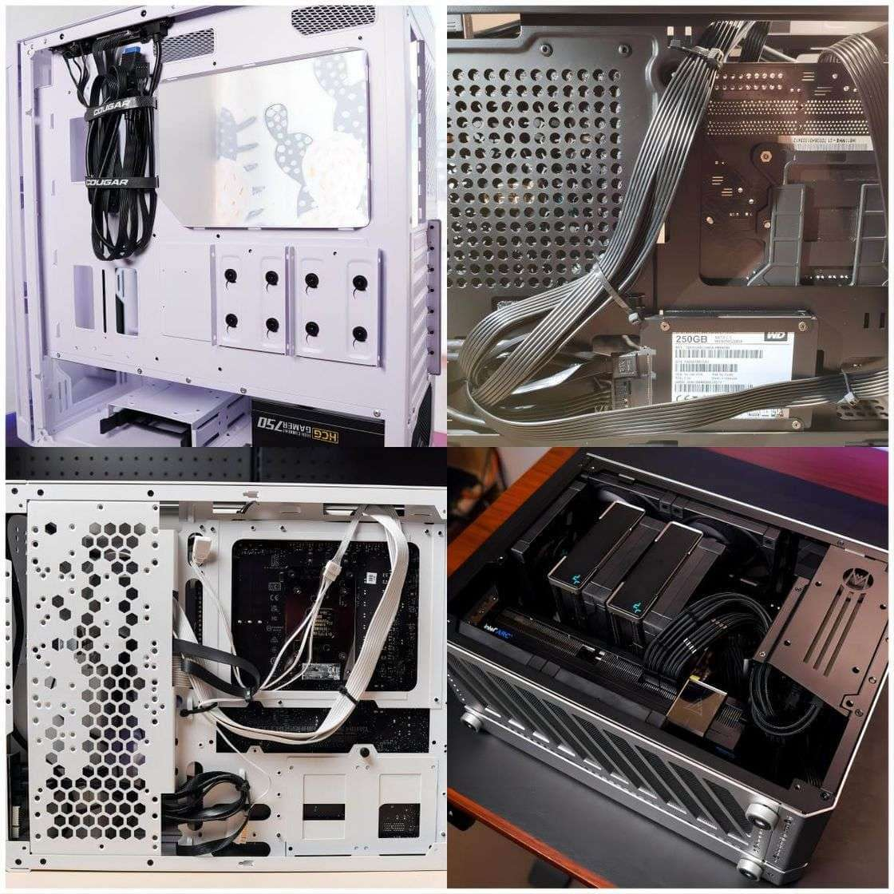

#### g. 安装显卡

安装显卡的第一步是拆下对应的挡板，具体取下哪几个挡板，要根据 PCIe x16 插槽的位置和显卡厚度确认。以普通双槽卡横置为例，ATX 主板的 PCIe x16 插槽一般偏下，就像右上这样取下第二、三个挡板；如果是 MATX 主板或 ITX 主板，PCIe x16 插槽离处理器更近，就像左下这样取下第一、二个挡板；纵置模式则是取下纵置的两个挡板。

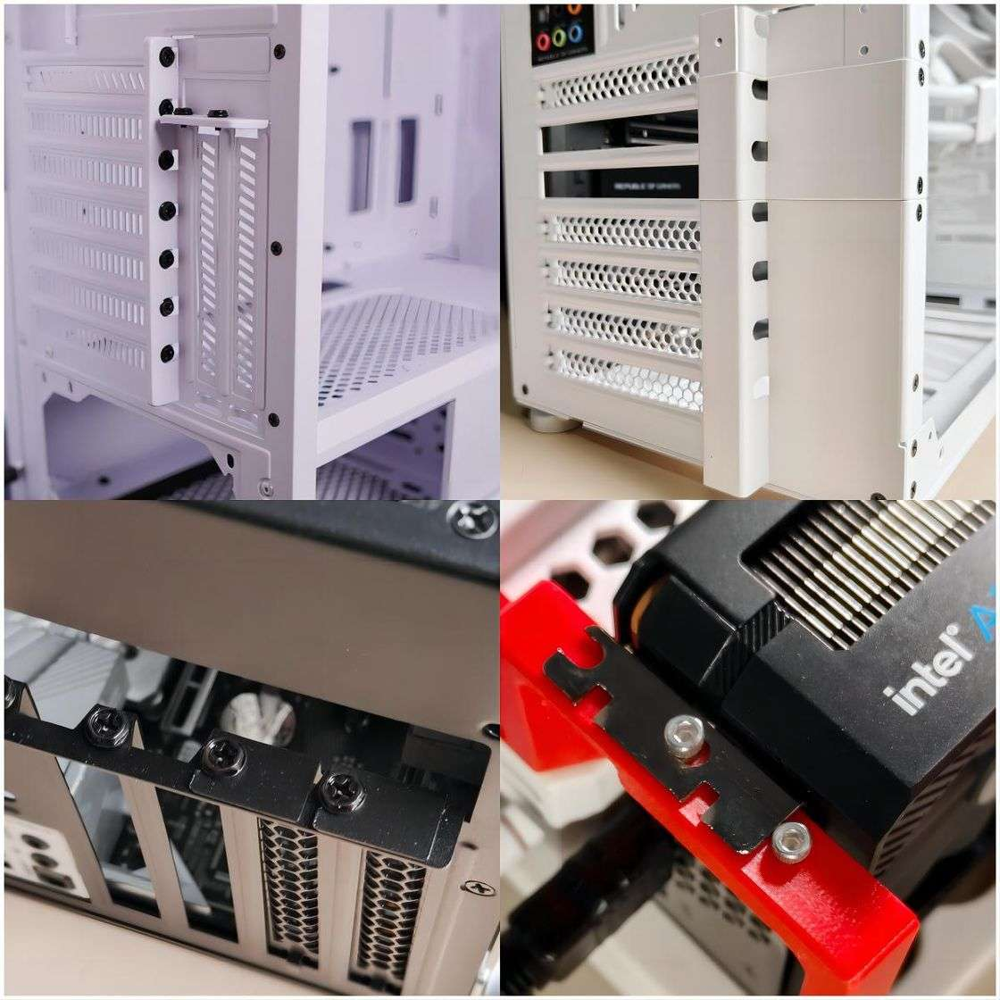

显卡横置安装时，只需要卸下对应的机箱挡板，就能够将显卡插入安装了。需要注意有部分紧凑型机箱，才用了电源前置方案，可能需要拆解机箱框架才能把显卡装上。完成上述工作后，按前面的电源接口对照，将显卡供电接线成功后，就完成了显卡的安装。机箱自带的支架，最好机箱躺倒这会调整，立起来之后就很难调整了。

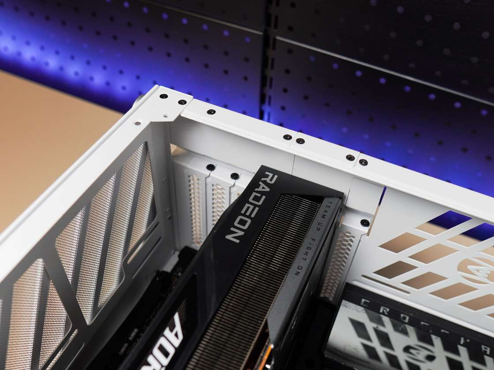

显卡纵置相比横置多了一步安装 PCIe 延长线，其余直接显卡横置的步骤就好。支持显卡纵置的机箱要不然是这种标准机箱，或者是诸如 A4 ITX 这些「薄」款机箱。使用 PCIe 4.0 延长线时，要注意调整 BIOS 中的相关设置，保证正常安装系统使用和显卡的性能释放。

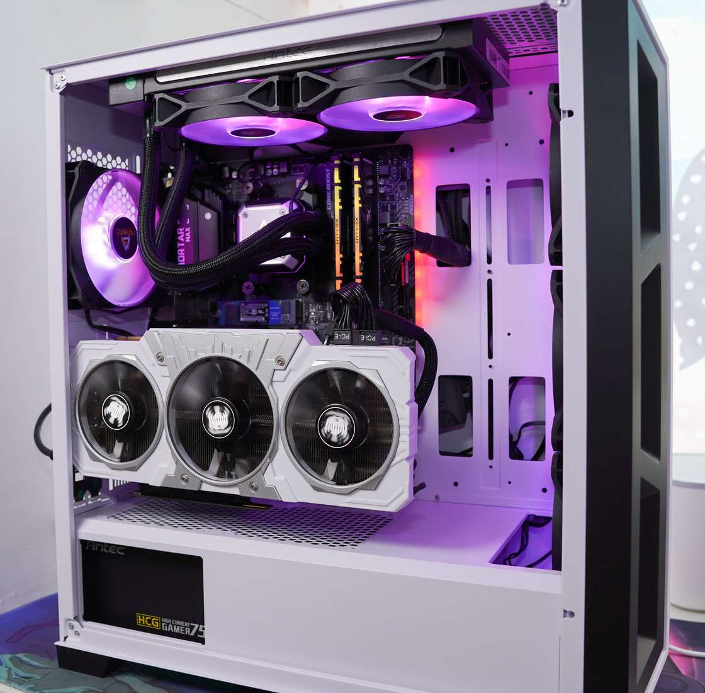

Pcie 5.0 插槽与更早先的插槽固定方式不同，更短的引脚还是更容易变形，即便有钢铁装甲对插槽进行辅助固定，随之而来又是新系列显卡的规格和重量大幅提高。所以一定要搞个显卡支架，来平衡力矩保证安全。显卡的重量都在配套的散热上，支架可以撑住散热器或外壳就足够了。例如机械大师的机箱，就都标配一个小支架，要从背板方向通过螺丝固定。有些机箱还有独立的大支架，需要自己来调节支架高度后再固定使用，但避免不了要调节很多次。部分显卡也有固定卡，可以将一端固定到机箱 PCIe 螺孔，另一端固定到显卡远端分担重量。

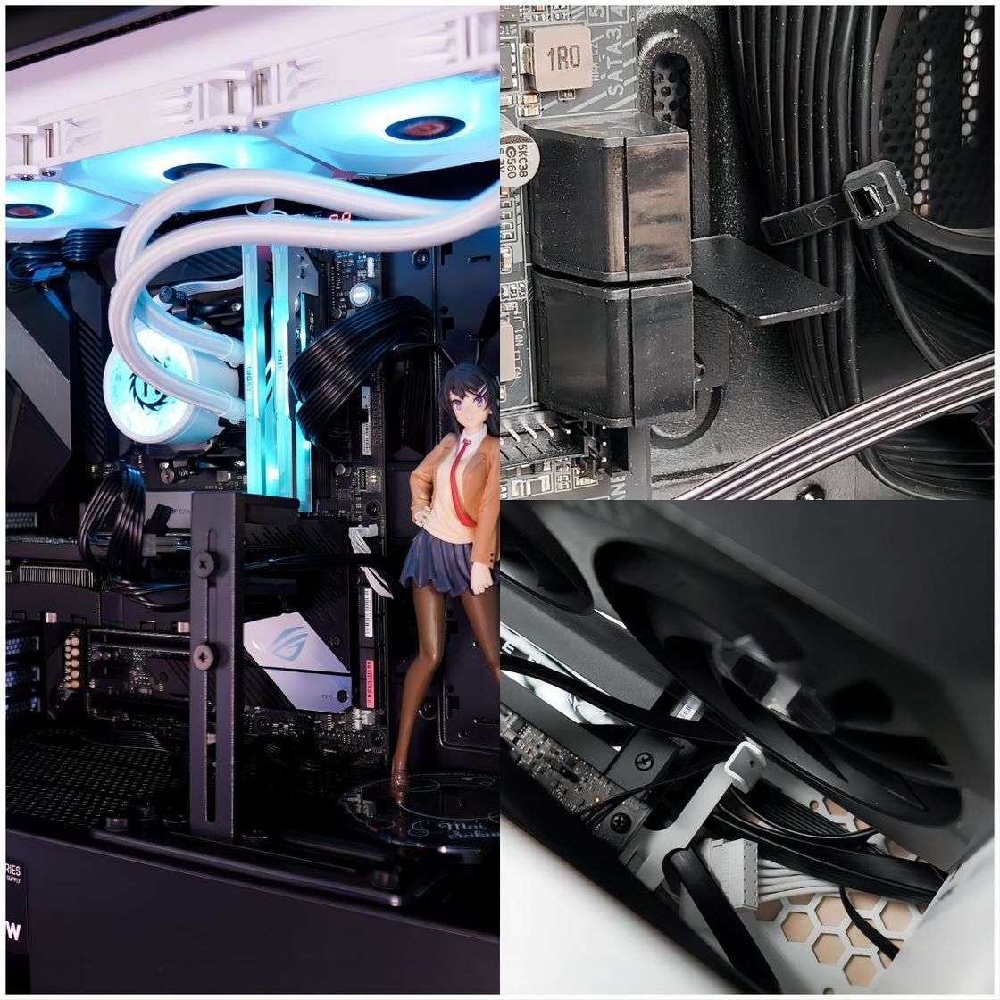

### h. 点亮与安装系统：

开机需要主板上的 F\_PANEL 的 POWER 那对引脚短接，再由主板按顺序唤醒其他挂载设备。但这过程也伴随着对应挂载设备的自检。所以即便都是新硬件，在刚装完机之后也不一定能够一次点亮，建议先根据可先行短接测试点亮情况。虽然常装机的 DIYer，绝大多数情况下都会跳过这一步。直接安装到机箱碰上点不亮的情况，就避免不了要返工了，没把握的话还是尽量不要跳过。

-   PLED/PWR\_LED 电源指示灯：连接至机箱前方面板的电源指示灯
-   PW 电源开关：连接至电脑机箱前方面板的主电源开关键
-   SPEAK 喇叭针脚：连接至电脑机箱前方面板的喇叭
-   HD 硬盘动作指示灯：连接至电脑机箱前方面板的硬盘动作指示灯
-   RES 系统重置开关：连接至电脑机箱前方面板的重置开关（Reset）键

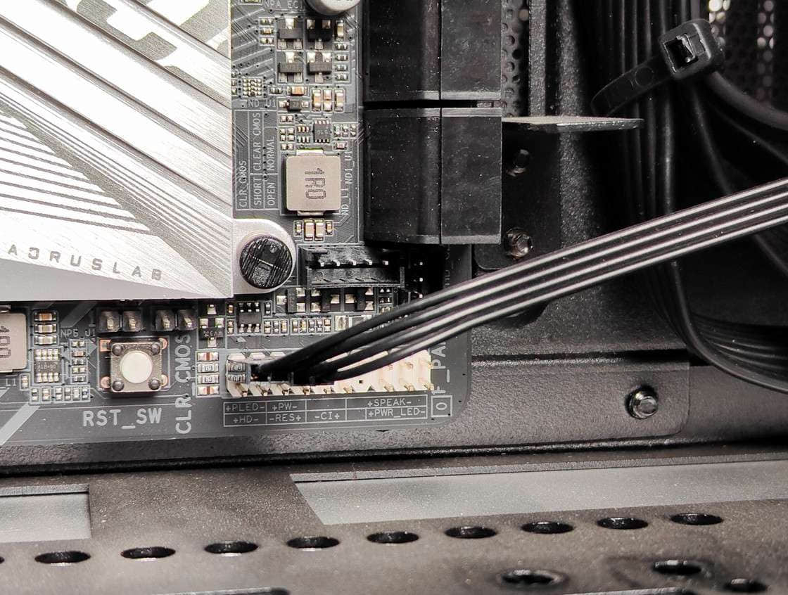

如果安装的硬盘没有预置的系统，有一半的几率是进入如图示的界面，能够看到相应的组件信息。另一半的几率是显示」no bootable device--insert boot disk and press any key「，现在就只差一步安装系统与驱动了。

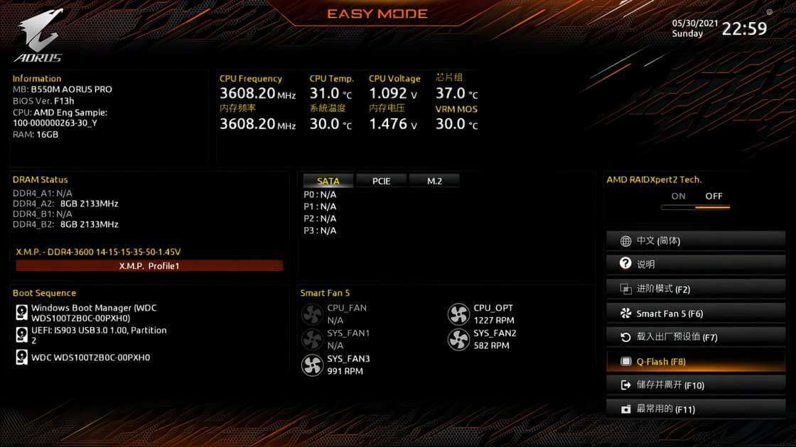

## **系统与软件配置**

Windows 10 与 Windows 11 的安装，在官网下载 MediaCreationTool 就可以制作启动 U 盘或下载对应的镜像了，Windows 10 与 Windows 11 的下载界面与工具版本不同，对特定版本有要求的话要注意。

点击可执行文件后选择好系统版本（千万不要选择家庭版），拿出之前已经准备好的 U 盘就可以安装了。如果直接通过 U 盘安装就选择 U 盘，如果通过 PE 或者拷贝到其他电脑升级就选择 ISO 镜像文件。选择完毕点击下一步，等待软件自行下载完成即可。

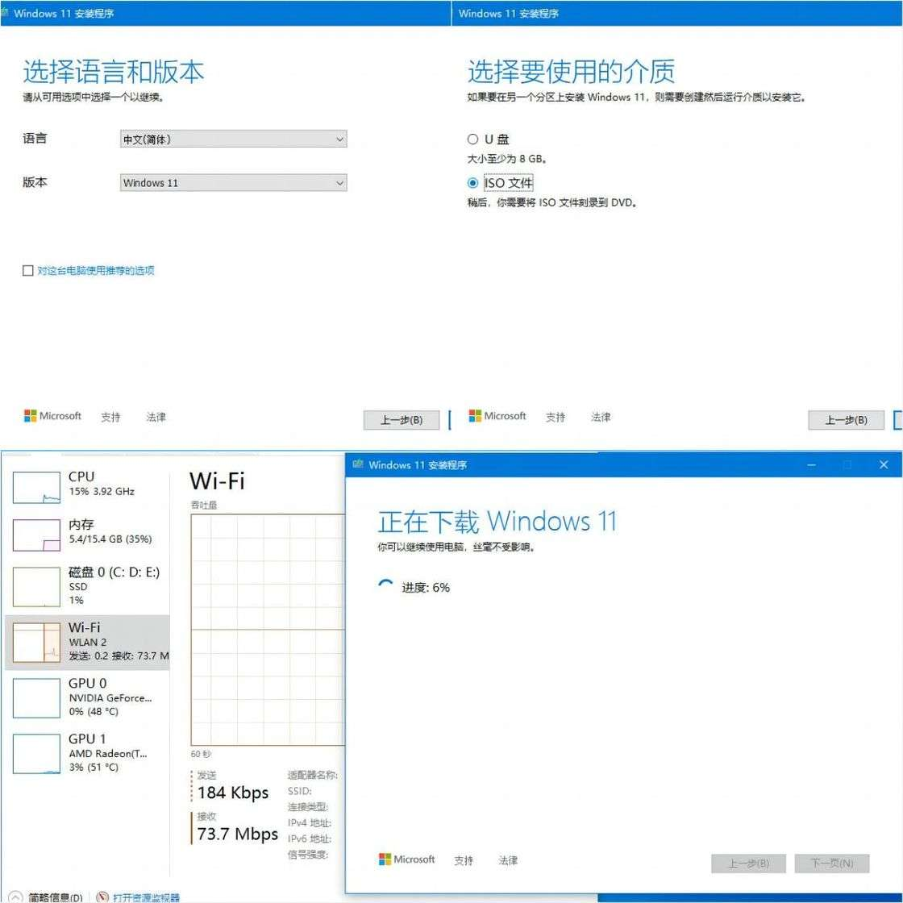

最近几年新出厂的主板已经支持自动识别安装介质，能够直接启动进入对应的 PE 系统或安装设置。但部分较早的主板还需要自行改动 BOOT 设备顺序，部分主板需要进入 BIOS 修改，而另一部分主板可以进去快捷启动项选择。U 盘在 BIOS 中的命名有多种方式：一般是由品牌的英文名打头，比如雷克沙的 U 盘就是 Lexar、金士顿的 U 盘就是 Kingston；另外就是根据主控来命名，比如银灿主控的自制 U 盘就是 IS903。

进入 BIOS 与临时启动顺序调整基本都是 F1、F2、F4、F8、F9、F10、F11、F12、Del 等按键，各家品牌的按键不同，可以多尝试或直接搜索查询。

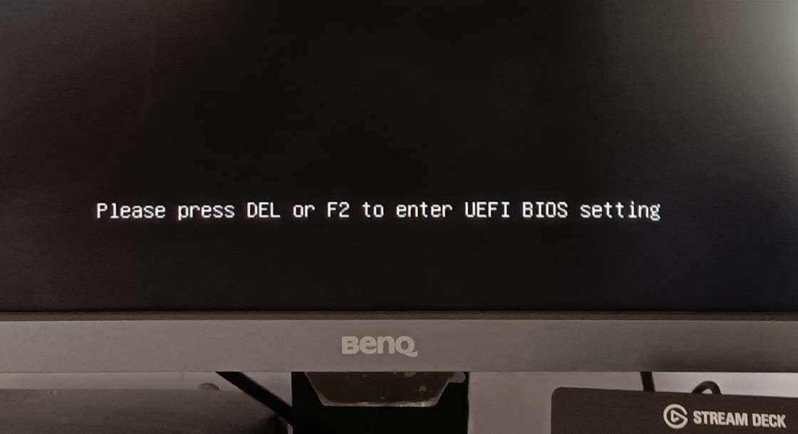

装机的步骤不做赘述，只需要一路下一步即可完成，更详细的安装步骤可以参考先前的内容。不过安装 Windows 11 时，需要先开启 TPM 认证才能安装。如果你是 AMD 平台，记得安装完系统之后再关闭此选项。不同品牌甚至不同主板的选项命名均有不同，请以说明书为准。

Windows 10 以上系统可以自动下载各项驱动，包括显卡的驱动也能自动下载。当然 Windows 的下载速度大家都知道，像显卡驱动这种比较大的就适合自己下载安装。以 AMD 驱动下载页、Intel 驱动下载页、Nvidia 驱动下载页与蓝戟驱动下载页为例，都是按照品类 —— 系列 —— 型号确认后，列出对应的下载项供自行下载安装。

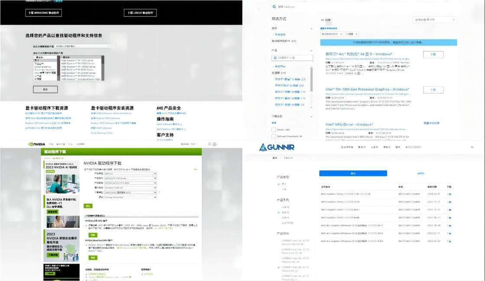

## **总结**

-   装机不要有太多的「我认为」，照猫画虎绝对能装好
-   新手装机直接连电测试硬件，不要直接装进机箱
-   不要害怕安装中的返工，不提前解决也许工作量更大

## **写在最后**

装机并不是一件很难的事，只要有耐心看教程对应着来，避免突发奇想和大力出奇迹就好。很多小细节之所以是小细节，就是因为其对于老手来说，单纯就是一个常识而已。但这些细节恰恰是新手一定会忽略或做错，而这些细节很多都会导致无法点亮甚至损毁硬件。新手自然成了两个极端：从入门到放弃和头铁大力出奇迹。正所谓一回生二回熟，难者不会，会者不难。严格按照教程走，其实并不会出什么问题，基本都能顺利装好。

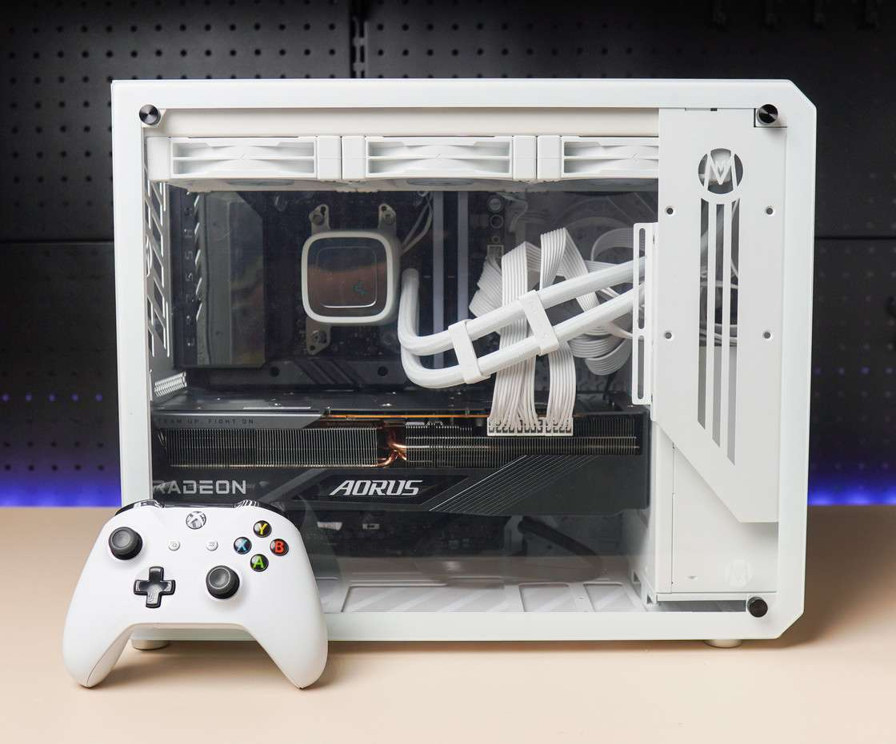
