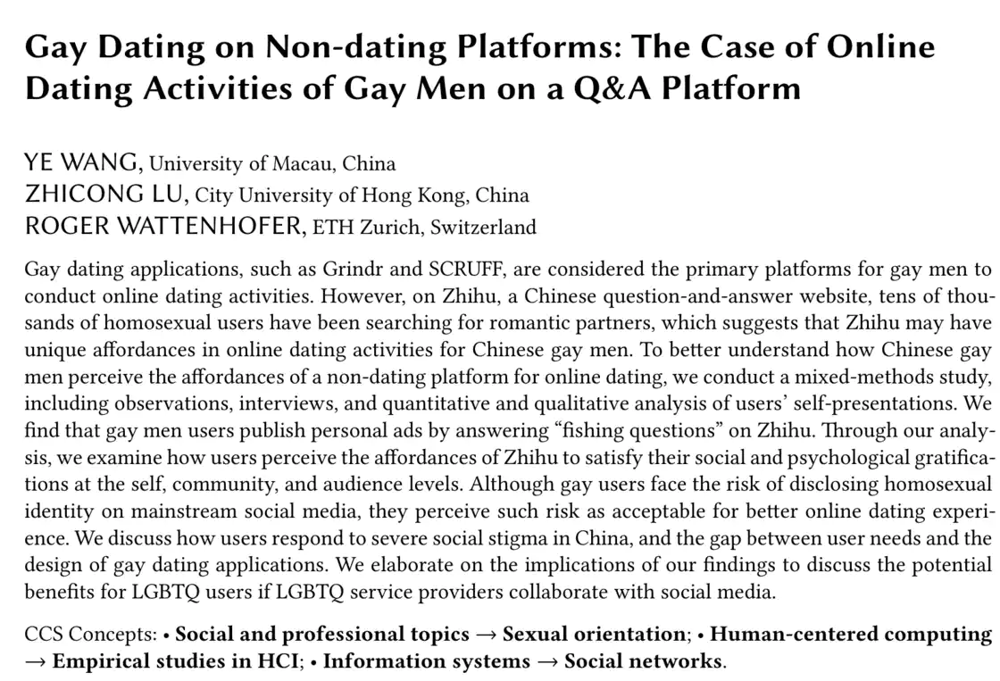
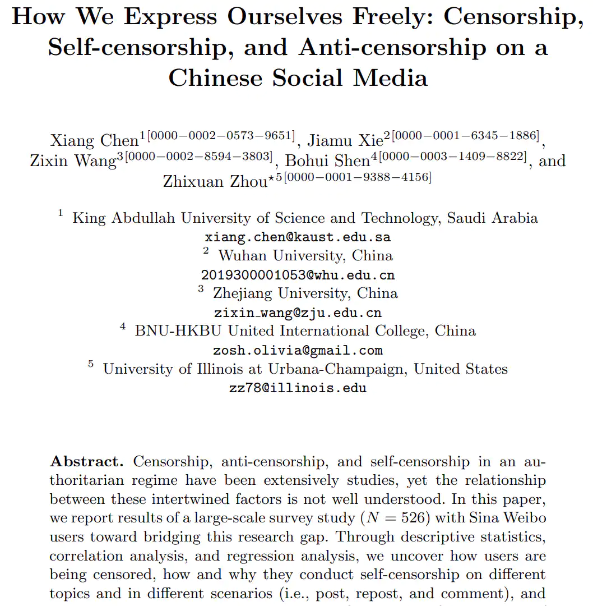
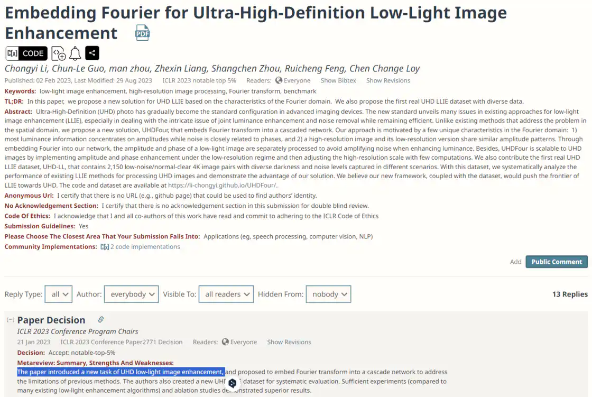
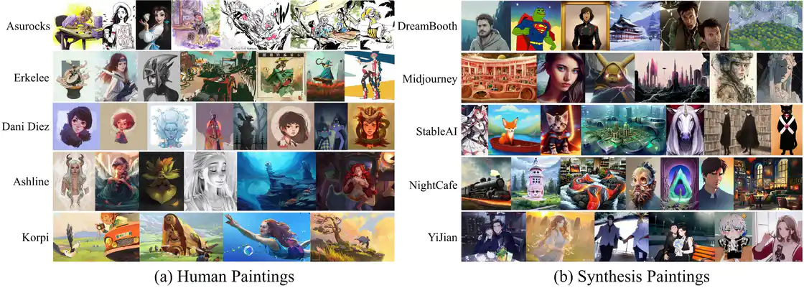
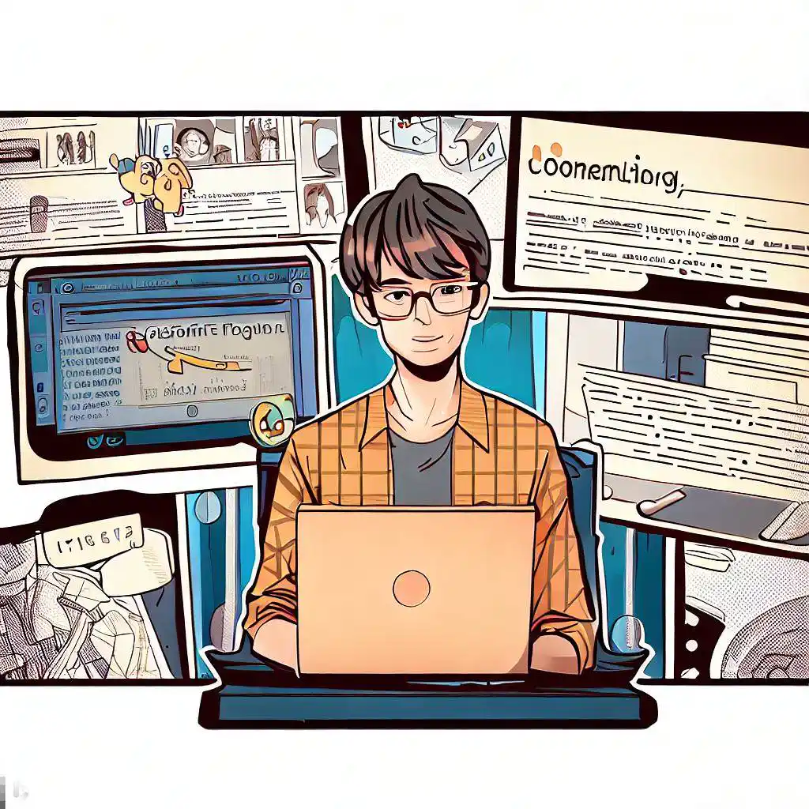

# 论文，研究，我和社会学的故事 - 少数派

在少数派上面，可以找到很多与科研相关的文章，因为科研和工作，生活一样，一样需要生产力和效率工具加持。有时候我在想，我们所说的科学研究，到底在研究什么，又或者，我们的研究除了那些成果，它可以为我们带来什么。这大概是一个比较复杂，又很空泛，需要一些经验才能得到答案，或者也没有标准答案。所以，这篇文章，我非常主观地，甚至是有一点狭隘地，简单地从我与社会学的故事开始来聊聊这些事情。

## 我与「社会学」

前段时间我和一个社会学系助理教授聊天，我当时帮助他处理了一些技术上的工作。他教授了一门课，那门课是介绍很多外国社会学家，他当时跟我说社会学很多时候就是一种意识形态传播。结束的时候，我问了老师一句，「现在的社会学是在研究什么啊，是更像一些数据分析之类的工作吗」？他说，「可以这样说，很多时候是研究一些因素和对应的社会现象之间的联系，而这些联系往往需要以数据的形式来量化、可视化」。事后我再去问了 ChatGPT，什么是社会科学，他告诉我社会科学研究的领域很广泛，分支包含众多的学科，研究的方法也是丰富多样，但最终目的都是为了提出解决社会问题的有效途径。

之后几天里，我脑子里一直盘旋着「社会学」这个概念。学院计算机系去年新来了一个老师，是从苏黎世联邦理工过来的博士，本科在北大。我点进去他个人主页看了看，有一篇文章吸引到了我的眼球，是发表在人机交互的会议上 1，研究的是同性恋在非交友平台 (知乎) 上的约会行为。我当时就在想，这不应该是属于「社会学」研究的内容吗？在计算机系也会有研究社会学的老师吗？**我之前对人机交互的概念大概也是去设计、开发和评估用户友好的界面和交互技术，可能比较熟悉的，会是一些可视化相关的工作。**我粗略地阅读了这篇论文，和我想象中对文科论文撰写很像，大概就是作者在知乎上去联系了很多在上面有交友意向的男同性恋，然后对他们进行了调查访谈，做了很多分析，然后发表了这篇文章。

发表在 Proceedings of the ACM on Human-Computer Interaction, Volume 6, Issue CSCW2 论文信息及摘要截图。

还有一次，我记不起来是怎么找到那篇论文，可能是在 GitHub 上看到了作者的主页。作者是在 KAUST 读计算机科学专业博士生，这篇论文 2 发表在 International Conference on Information (iConference) 会议上，论文研究的是我们网民在社交媒体上，主要是微博，如何合适地表达自己，我当下也觉得这是属于社会学范畴，它好像和我们社会更相关，因为无关计算机理论，也不涉及技术。

发表在 iConference 2023 论文信息及摘要截图

**人机交互是计算机的一个研究领域，像计算机视觉、自然语言处理、计算机网络、软件工程这些领域一样。**我问我在社会科学学院的同学，她的研究领域是社会学下面的犯罪学。我跟她说我们专业都有很多研究是和社会学相关，他们也会去做这些研究。她告诉我是这样，但是社会学的学生发论文，不会发到像 CHI (人机交互领域顶级会议) 这种人机交互偏计算机的会议上，他们大部分时候只会发社会学下面的期刊和会议之类。

## 我与「研究」

随着基础科学不断进步和发展，目前学科之间的联系已经变得越来越紧密。因此，尽管现在科技可以解决很多问题，但是单纯依靠科技又根本不行，它需要社会的合作，需要配套的法律，就像我关注的多媒体篡改检测工作一样，无论是单纯从计算机视觉技术的角度出发去解决这个问题，还是从线上社交网络证据链去找寻篡改足迹，都已经有计算机的研究员开展了大量工作。我便开始觉得，这些工作，光依赖科技手段是不行的，没有社会，没有法律，所谓社会学的研究，其实要解决研究一开始提出的那个问题，会很难；但不解决也有好处，意味着还可以继续研究。**例如，我以为是从社会学角度出发，是不是可以讨论一下，用户出于什么目的会在网络上分享经过篡改的图片，自媒体工作者是如何在平台上选择图片或者视频新闻进行取证然后如何决定进行传播。**

所以有时候，我就经常问作为一个研究生，做这些简单的研究是不是有意义，这是不是你想做的研究，或者研究到底是什么，入门标准是什么。前段时间我在 OpenReview 上看到这篇文章 3，是 ICLR（深度学习领域的顶级会议）Top 5%, 看 Reviewer 最后意见是，作者提出了一个新任务。我大概看了下内容，一开始我在想，图像增强已经有很多研究员做了相关工作，弱光环境下的图像增强也有很多，但这是超高清晰度的弱光图片增强，所以是一个新任务。**乍一看好像觉得这不算什么，但仔细想想，研究，就是这样，一点一滴，累积起来。**这篇论文中实验部分也做的非常充分，同时作者也针对自己设计的新任务提出了一个专门的数据集。

OpenReview 上 ICLR 2023 Conference 论文录用决定页面，最终评语写着这篇论文提出了一个新任务。

就像现在，AIGC 泛滥，我关注到一些做图像篡改检测的同学，他们又开始提出一些方法 4，用来对这些合成图片进行检测，检测是不是由 AI 生成。在我看来，现在 AI 生成图像其实更多应该叫画作，而不是图片，大部分图片也是风格化相当严重，所以问题好像来到了，检测一幅画是不是有作者，还是 AI 合成。

我了解到，现在大部分国家或地区好像都没有对这些 AI 生成内容，其所有权是谁，有法律的认定，关于这些内容在社交媒体上的传播也没有做出具体规定，所以，我大概也更觉得这是版权问题，能不能算作版权，版权又应该属于谁，它依靠社会的手段，依靠法律的监管，而科技的力量往往是一种补充。最近一段时间，国内一些针对生成式人工智能服务管理办法也慢慢在完善。

由 AI 生成的高度真实的图片和真实画作对比，[图片来源](https://sspai.com/link?target=https%3A%2F%2Fgithub.com%2FHighwayWu%2FLASTED)

正如前面提到交叉学科的现象，社会学和科技，他们其实很难是分得开，所以才能看到上文那些研究工作，在计算机专业研究员发表情况里面。所以，社会学还挺有意思的。突然想起来之前看过一个采访，里面提到**我们大学要培养什么样的人才，说就是要到社会去**。这么看起来所以是，中文系用笔来改造社会，艺术系用艺术作品，法律系用法律，计算机系用代码…

我也想到，一个议题，与社会与法律关系更大，这不能作为一个计算机系学生去规避以科学技术的手段去解决这些问题的理由，还是应该在自己能力范围之内去做一些事情。科学技术可以做的，正在做的，似乎，也是我们社会，我们法律，正在做的。所以，是不是，我们可以做的，我们正在做的，远比我们想象的，多得多。

## 我与「论文」

这样的感悟来自于论文，来自论文所研究的内容，通过阅读同一个专业不同方向，甚至是不同专业的论文，去认识当前的部分研究在做些什么。阅读论文可以帮助科研工作者发现当前领域的研究动态，以找到下一个可能是有价值的研究课题。那对于不是这个领域的学术研究员，或者我们大部分的数字网民，读其他学科，或者就是读论文，好像是一件没有什么必要的事情。所以有时候我又在想，**是出于什么原因，会让一个人去阅读一个不是他研究领域的论文，论文的作用是什么，研究者会希望自己的论文被所有人看到吗，还是只会想要在自己的研究领域圈子里流行，还是说无所谓。**

如果说是为了获取知识，随着现代科技的发展，一本书，一部电影，都可以以一段不超过 20 分钟的短视频解说完成。获取知识的途径甚至可以说，不太需要再经过书本。优秀的博客，制作精良的视频，在很大程度上，都是比书本在效率要更高的一类媒介。那论文，其实可以说是书本的前身，把一定数量的论文经过编辑出版成书。同时，**论文的获取门槛，好像就给一些人搭建了一座有形的墙，这在一定程度上是不是也说明，论文并不是适合所有人的知识传播媒体。**

就像有时候我搜索一个东西，第一反应是主流的搜索引擎，然后针对搜索的问题，可能选择不同的平台进一步搜索，是选择去 Bilibili 搜视频，还是在微信里面搜索公众号，还是来少数派搜硬核些的经验帖子，以及这两年逐渐可以替代百度搜索的小红书。

前段时间，家里老人生病了，是皮肤上的病，大家都不知道是怎么来的，只看到临床表现是很多水泡。我还是先到搜索引擎上输入，老年人，水泡，这样一些关键词，然后它告诉我可能是一种叫什么什么的疾病。但我拿着这个名字继续搜索的时候，发现网络上的信息很少，这个时候我想到了知网，我把关键词输入，结果是只要有医院报告了这样的病例，大部分都会以论文的形式发表出来，并且有些进行了详细的统计，配上了真实的图片，治疗等等信息。

我也想起来我之前一位学中药学的室友，他有一次和我提到他爷爷的病情，他告诉我他在论文里看到了某个针对他爷爷疾病的药物治疗情况，我不太记得是新批准的药物，还是组合的治疗方案。他通过和医生的沟通，找到代购，买来了那种药物，不过后面具体的治疗情况我也没有再了解了。

我开始重新思考，**论文，这个作为研究结果的呈现方法之一的媒介，是不是还有一点其他的可能，**就像这次我的经历一样，论文似乎充当了一种真实的案例来源，是在视频平台，小红书上，不需要去做太多取信工作就可以选择参考的内容平台。

## 我们与「论文」

在少数派上我也看到一些作者分享了自己如何在离开学校后找论文 5，如何阅读论文 6，甚至是如何写论文 7，等等。就我自己的这次经验，在知网上找论文，如果已经离开了学校，也没有单位订购，我要向大家推荐的是各省市图书馆，像浙江图书馆、广州图书馆、江西省图书馆等等，他们都提供了知网的在线访问服务，只需要简单的读者注册，就可以在知网数据库里搜索下载论文。**而在上海图书馆，他们还提供了 Springer Link/Springer 电子期刊数据库，以及仅限馆内使用的 IEEE Xplore 数据库，Elsevier/ScienceDirect (爱思唯尔，科学指引数据库上也提供了像** [**柳叶刀**](https://sspai.com/link?target=https%3A%2F%2Fwww.thelancet.com%2F) **等医学领域等顶刊资源)，等这些高校学生经常使用的付费数据库。**

-   [浙江图书馆](https://sspai.com/link?target=https%3A%2F%2Fwww.zjlib.cn%2F) （在支付宝上搜索「浙江图书馆」，进入生活服务号，在服务大厅中点击「新用户注册」就可以注册成为图书馆读者，浙江图书馆 [数字资源](https://sspai.com/link?target=http%3A%2F%2Fzjisa.zjlib.cn%2F) 包含了知网等付费数据库。）
-   [广州数字图书馆](https://sspai.com/link?target=https%3A%2F%2Fwww.gzlib.org.cn%2F)  （广州图书馆的读者可以在「广图 +」小程序或者网页上在线办理注册或激活，不过在线办理时须在广州或佛山地域，或者持有当地的身份证居住证等材料，广州图书馆 [数字资源](https://sspai.com/link?target=https%3A%2F%2Fwww.gzlib.org.cn%2Fdigitalresources.jhtml) 同样有知网，剑桥期刊等在线数据库。）
-   [上海图书馆](https://sspai.com/link?target=https%3A%2F%2Fwww.library.sh.cn%2F) （在线注册，注册的方式还提供了港澳通行证，护照，台胞证等）
-   [江西省图书馆](https://sspai.com/link?target=https%3A%2F%2Fwww.jxlibrary.net%2F) （江西省图书馆在网页提供了详细的 [办证方法](https://sspai.com/link?target=https%3A%2F%2Fwww.jxlibrary.net%2Fchannels%2F66.html)，其中的要求是支付宝芝麻分数大于等于 550 分。）
-   其他省市图书馆……

## 结语

文章里还存在着一些主观，认识不够清楚的地方，我通过把这段我和社会学的经历分享，肤浅地聊了聊研究，还有论文。**研究**这件事情好像是在走向一个极端，路是越走越窄，但不同学科的交叉让这条路有了更多的方向，走在这条路上的人，好像也有了更多选择。这些研究，无论轻重，无论方向，最后成果总是以**论文**的方式呈现。而从事研究工作的人通过阅读这些前沿的，不同领域的论文，继续在这条路上前进；**但论文可以做到的，为那些没有在做研究的我们，在效率之外，还提供了科学的内容平台。**

封面图片，由 Bing Image Creator 生成

-   1Wang, Ye, Zhicong Lu, and Roger Wattenhofer. "Gay Dating on Non-dating Platforms: The Case of Online Dating Activities of Gay Men on a Q&A Platform." Proceedings of the ACM on Human-Computer Interaction 6.CSCW2 (2022): 1-23.
-   2Chen, Xiang, et al. "How We Express Ourselves Freely: Censorship, Self-censorship, and Anti-censorship on a Chinese Social Media." International Conference on Information. Cham: Springer Nature Switzerland, 2023.
-   3Li, C., Guo, C.-L., zhou, man, Liang, Z., Zhou, S., Feng, R., & Loy, C. C. (2023). Embedding Fourier for Ultra-High-Definition Low-Light Image Enhancement. In ICLR 2023 notable top 5%.
-   4Wu, Haiwei, Jiantao Zhou, and Shile Zhang. "Generalizable Synthetic Image Detection via Language-guided Contrastive Learning." arXiv preprint arXiv:2305.13800 (2023).
-   5Drselfie. 免费的论文内容怎么找？. 2020-09-28. 少数派。https://sspai.com/post/62946
-   6 玉树芝兰。论文读不懂怎么办？. 2019 -11-04. 少数派。https://sspai.com/post/57303
-   7Soar\_Freely. 「论文二三事」—— 我的论文写作方法论。2023-05-23. 少数派。https://sspai.com/post/79933
