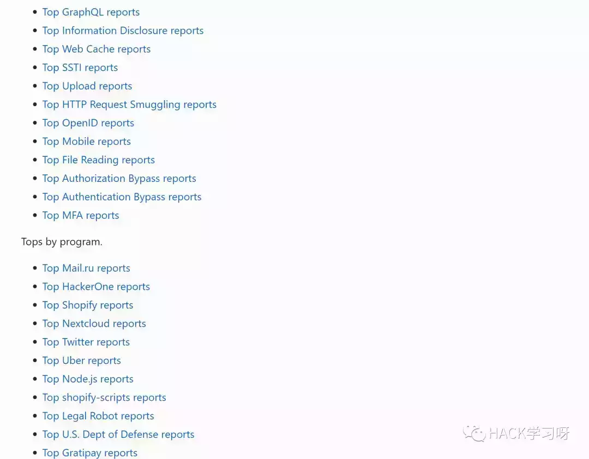
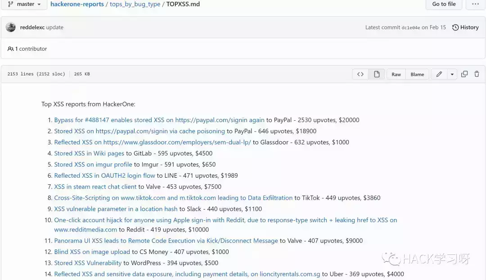
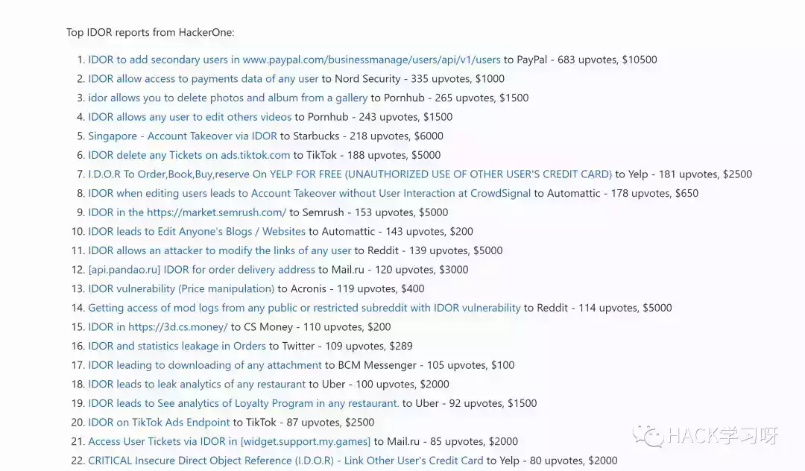

# 干货 | 如何通过HackerOne快速提升挖洞水平和经验

最近在Github上刷到了这个项目，非常不错，我觉得可以分享给大家  

```plain
https://github.com/reddelexc/hackerone-reports
```

该项目爬取了HackerOne上前100的漏洞报告，而且分门别类了，不同的漏洞类型和不同项目的漏洞TOP100




我们点开TOPXSS  



然后就可以通过链接，去阅读其他黑客是如何挖掘到这个漏洞，他们关注了哪些细节，并找到了这个漏洞，先追随大师，再成为大师

在点开IDOR漏洞报告列表  
  



其次通过乌云镜像站，去针对性的学习和补充自己的漏洞挖掘经验案例学习也是不错的选择，当然如果你想更进一步的话，建议收藏和使用该项目，去学习HackerOne上的漏洞报告也是非常好的选择

最后，在引用一下以前发过的一段话：

```plain
To follow the path:
沿着这样一条道路：
look to the master,
关注大师，
follow the master,
跟随大师，
walk with the master,
与大师同行，
see through the master,
洞察大师，
become the master.
成为大师。
```

如何成为一名黑客  

```plain
https://github.com/zer4tul/hacker-howto
```