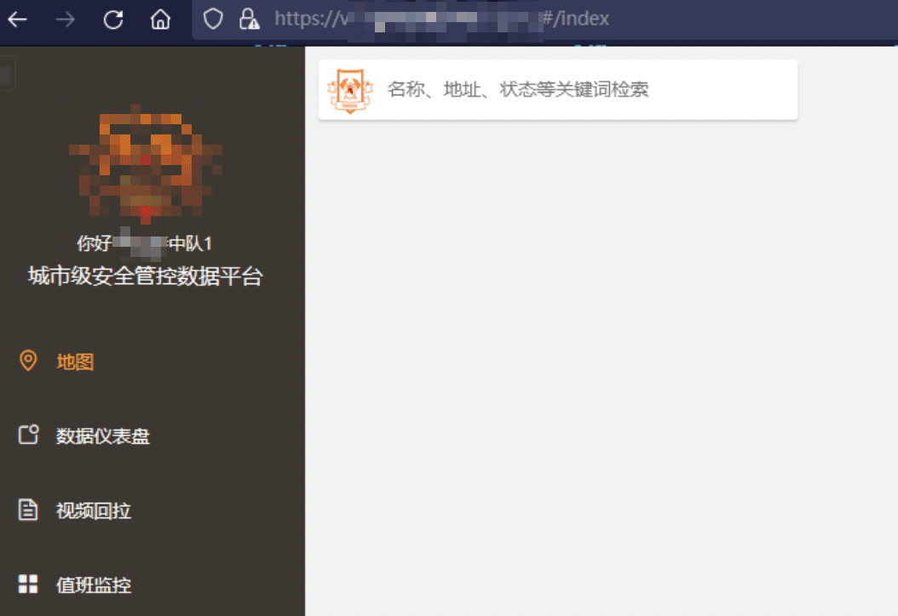

# 弱口令案例大礼包

最近翻看以前的渗透案例，发现不少有意思的入口点，基本都是弱口令 + 信息泄漏打进去，然后这里上传那里注入这样的后台打法，干脆总结个弱口令案例分享出来

info

关键信息均已打码，漏洞均已提交 edusrc 和 cnvd 并修复

- - -

# [](#%E6%9F%90%E5%AD%A6%E9%99%A2%E5%AD%A6%E5%B7%A5%E7%B3%BB%E7%BB%9F%E4%BF%A1%E6%81%AF%E6%B3%84%E6%BC%8F%E6%A1%88%E4%BE%8B)某学院学工系统信息泄漏案例

通过前期的信息收集找到目标学院的一个学工系统登录点

[](https://r0fus0d.blog.ffffffff0x.com/img/weak-password/1.png)

这一看就是 ruoyi 的站嘛。。直接用 ruoyi 默认的 admin 和 ry 账号去测试登录，提示没有该用户，那尝试其他渠道搜集下用户

右下角有个明晃晃的在线帮助文档，点进去看看

[](https://r0fus0d.blog.ffffffff0x.com/img/weak-password/2.png)

文档描述对应小程序的使用方法，不过这个不是重点，翻到最下面

[](https://r0fus0d.blog.ffffffff0x.com/img/weak-password/3.png)

默认 123456，肯定有很多学生是不改的，那这只剩下弄到用户了，这 2 张图上有登录的账号，放大看看

[](https://r0fus0d.blog.ffffffff0x.com/img/weak-password/4.png)

可以，收获一个学号，不过注意到这个帮助文档有不同用户角色的介绍，点击任务发布者的看看

> 管理员的我点进去，他全部删干净了，啥都没有

[](https://r0fus0d.blog.ffffffff0x.com/img/weak-password/5.png)

点击图片详情，上面是任务发布者权限账号

现在到后台测试登录，很幸运，任务发布者和学生的这 2 个账号都没有修改过密码

[](https://r0fus0d.blog.ffffffff0x.com/img/weak-password/6.png)

那剩下的就简单了，后台翻翻，找到了一个查询点，里面有学生的任务记录，关键是响应包里有相应的学号，直接导出 json 格式的返回包

[](https://r0fus0d.blog.ffffffff0x.com/img/weak-password/7.png)

用 jq 进行格式化处理，得到学号信息，由于有验证码无法批量爆破，手动测试了几个，基本都是 123456，这波收集到大量的学生学号，测这个学校其他分站就容易多了

[](https://r0fus0d.blog.ffffffff0x.com/img/weak-password/8.png)

- - -

# [](#%E6%A0%B9%E6%8D%AE%E5%AE%98%E7%BD%91%E4%B8%8A%E7%9A%84%E4%BA%BA%E5%91%98%E5%A7%93%E5%90%8D%E7%94%9F%E6%88%90%E5%AD%97%E5%85%B8%E7%AA%81%E7%A0%B4%E7%9A%84%E6%A1%88%E4%BE%8B)根据官网上的人员姓名生成字典突破的案例

这个站没截前台的图，只有后台的图，大致描述下，主页有个主要领导的链接，点进去是这个单位的一些领导的介绍，复制名字，根据中文用户名生产用户名字典

比如

|     |     |     |
| --- | --- | --- |
| ```bash<br>1<br>2<br>3<br>4<br>5<br>``` | ```fallback<br>张三<br>zhangsan<br>zhangs<br>san.zhang<br>zs<br>``` |

后来证明我想多了，他用户名就是中文的。。。。。

[](https://r0fus0d.blog.ffffffff0x.com/img/weak-password/9.png)

[](https://r0fus0d.blog.ffffffff0x.com/img/weak-password/10.png)

- - -

# [](#%E4%B8%89%E9%A1%BE%E8%8C%85%E5%BA%90%E7%9A%84%E6%9F%90%E7%AB%99%E7%82%B9)三顾茅庐的某站点

为啥说是三顾茅庐呢，因为这个站测了 3 次，修了 3 次

[](https://r0fus0d.blog.ffffffff0x.com/img/weak-password/11.png)

第一次，admin/123456, 没啥好说的

第二次，发现有 sourcemap，下载下来，用 shuji 进行还原

|     |     |     |
| --- | --- | --- |
| ```bash<br>1<br>2<br>3<br>``` | ```fallback<br>wget https://xx.xxxxxx.com/xxxxx/static/js/app.aa2478xxxxxxxxxe0c.js.map<br><br>shuji xxxx.map -o folder<br>``` |

[](https://r0fus0d.blog.ffffffff0x.com/img/weak-password/12.png)

在 js 中翻到有 2 个 vue 的变量 /api 和 /dev\_liufeng

猜想这个 liufeng 会不会是测试人员的姓名呢，登录试试

[](https://r0fus0d.blog.ffffffff0x.com/img/weak-password/13.png)

好吧

第三次，在历经了前 2 次的测试后，按弱口令爆破顺序，依次爆破账号

|     |     |     |
| --- | --- | --- |
| ```bash<br>1<br>2<br>3<br>4<br>5<br>``` | ```fallback<br>常见用户名<br>中文名转拼音<br>数字/工号<br>常用测试邮箱<br>常用测试手机号<br>``` |

终于，在爆破到测试手机号的时候，又爆破出来了

[](https://r0fus0d.blog.ffffffff0x.com/img/weak-password/14.png)

[](https://r0fus0d.blog.ffffffff0x.com/img/weak-password/15.png)
