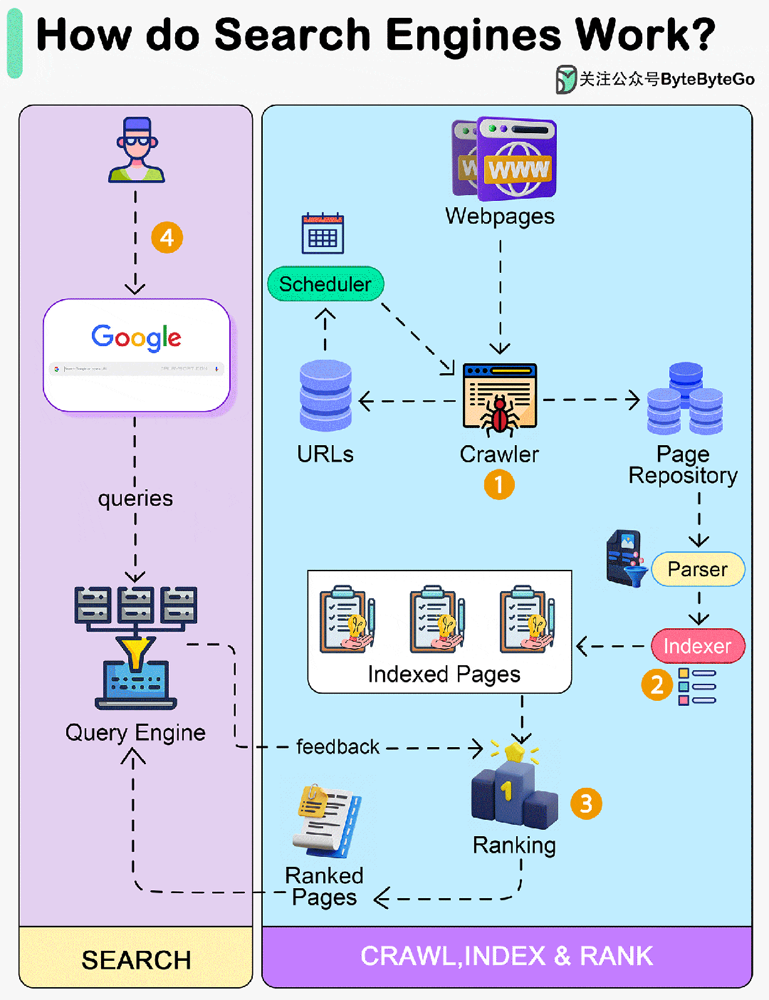

# 搜索引擎是如何工作的？

搜索引擎是如何工作的？

搜索引擎在互联网时代扮演着至关重要的角色，它们不仅极大地影响了人们获取信息的方式，还对经济、教育、科技等多个领域产生了深远的影响。

  

## 第 1 步 - 抓取

网络爬虫会在互联网上扫描网页。它们跟踪从一个页面到另一个页面的 URL 链接，并将 URL 存储在 URL 存储器中。爬虫会发现新的内容，包括网页、图片、视频和文件。

## 第 2 步 - 编制索引

网页被抓取后，搜索引擎会对网页进行解析，并将网页上的内容编入索引数据库。对内容进行分析和分类。例如，评估关键字、网站质量、内容新鲜度和许多其他因素，以了解网页的内容。

## 第 3 步 - 排名

## 第 4 步 - 查询

当用户执行搜索时，搜索引擎会筛选其索引，以提供最相关的结果。

***\------ 往期阅读 \------*** 

[提高代码质量的 10 条编码原则](http://mp.weixin.qq.com/s?__biz=MzkxMDE5NzE4Mg==&mid=2247484230&idx=1&sn=5d4b65380b07448e423397faba237676&chksm=c12e6b97f659e281f738e0fc63f62e05b7f5879fde61cdbacc658d37e1a990fd99dda1161e75&scene=21#wechat_redirect)  

[Kafka 除了用作消息队列还能干吗？](http://mp.weixin.qq.com/s?__biz=MzkxMDE5NzE4Mg==&mid=2247484143&idx=1&sn=17f8cf8c3289f784df4a9da37aa73a50&chksm=c12e6a3ef659e328922ddcc73874ca2aeca13c05e2f700284aa157d3b4a6af73881c2badbeb0&scene=21#wechat_redirect)  

[面试官：系统有万亿条消息怎么存储？](http://mp.weixin.qq.com/s?__biz=MzkxMDE5NzE4Mg==&mid=2247484082&idx=1&sn=4d851855c77b337452b68c90ae4a2fdd&chksm=c12e6a63f659e37528c9c45d38078b54d85868d8fbaed319b2265da345e0d2314a8909c12cce&scene=21#wechat_redirect)  

[万字长文详解低时延股票交易系统的设计](http://mp.weixin.qq.com/s?__biz=MzkxMDE5NzE4Mg==&mid=2247483825&idx=1&sn=fe1e33e48b6cd8ee21561580702c57fd&chksm=c12e6960f659e076efbe85fc65e4bdaa935b27cf9af10d29facf5b1bba7a6b16707c626eed69&scene=21#wechat_redirect)