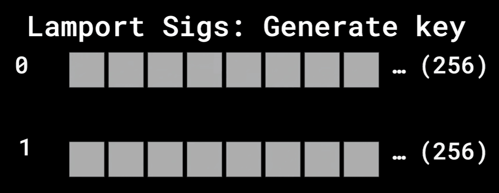
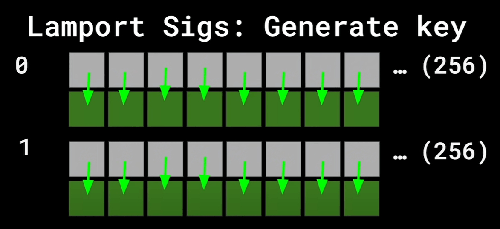
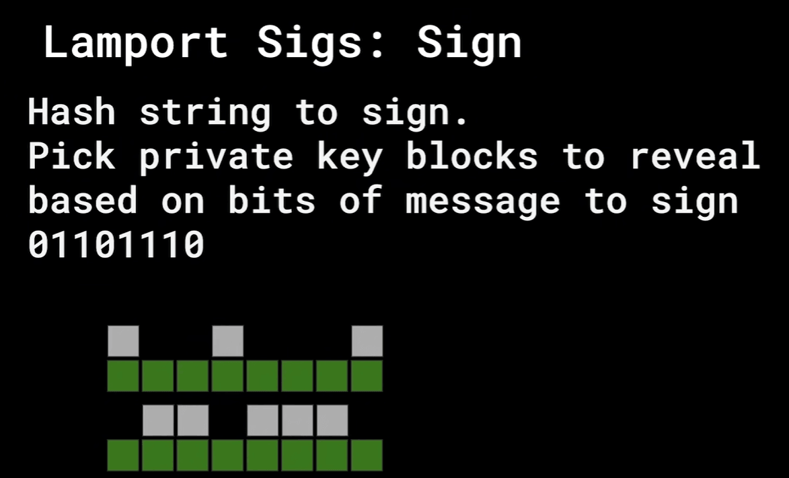
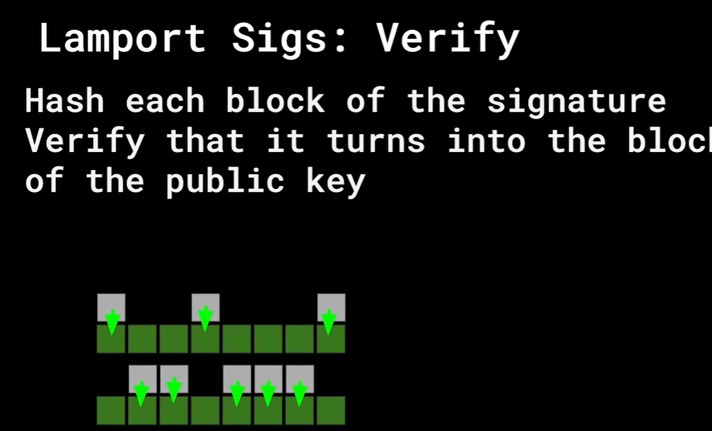
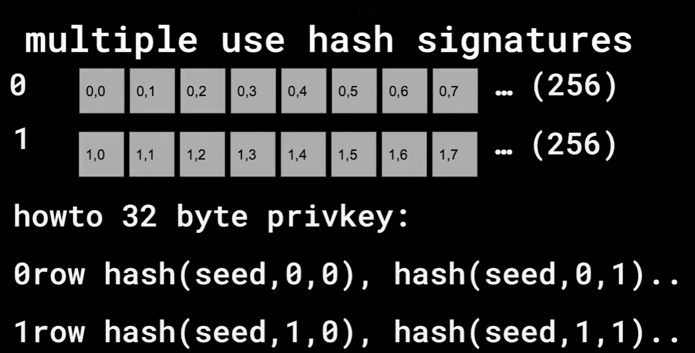
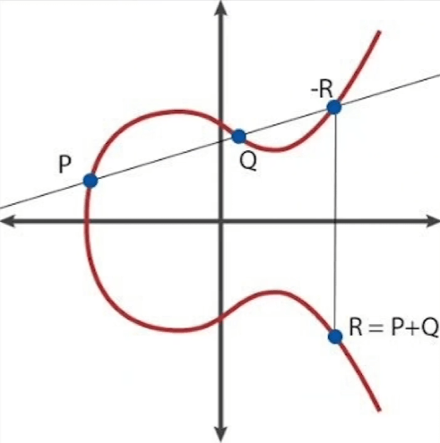
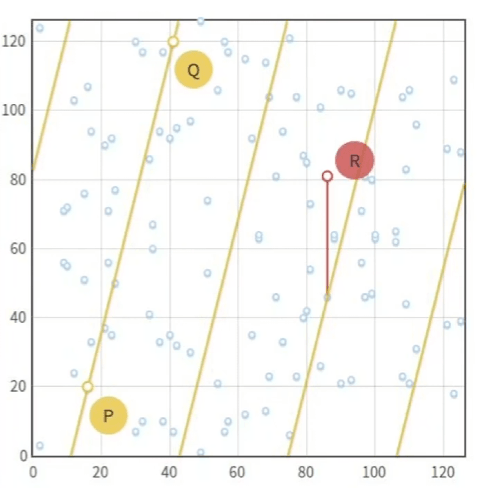

# 数字签名原理：从 Lamport 到椭圆曲线

## 签名

和现实世界的签名一样，数字签名解决的主要问题是认证和不可否认性。

-   认证：证明是你签的
    
-   不可否认：你不能抵赖说不是你签的
    

主要原语：

1.  密钥生成: `` $KeyGen(1^{k})\rightarrow (pk,sk)$ ``
    
    -   输入安全参数 `` $k$ ``,输出公钥 `` $pk$ `` 和私钥 `` $sk$ ``
2.  签名生成: `` $Sign(sk,m)\rightarrow \sigma $ ``
    
    -   输入私钥 `` $sk$ `` 和消息 `` $m$ ``,输出签名 `` $\sigma $ ``
3.  签名验证: `` $Verify(pk,m,\sigma )\rightarrow \{0,1\}$ ``
    
    -   输入公钥 `` $pk$ ``、消息 `` $m$ `` 和签名 `` $\sigma $ ``,输出 `` $1$ `` 表示验证通过,`` $0$ `` 表示验证失败

## Lamport 签名

只用哈希就能实现签名！

### 密钥生成

首先生成私钥。下面的是 `` $2 \times 256$ `` 数组，且每个元素（小方块）都是 32 Bytes。里面随即填充数据。



然后生成公钥。很简单，哈希所有元素，然后填充到新的相同形状数组。然后我们得到了公钥，也就是所有的绿色方块。



### 签名生成

假设要对 `` $m$ `` 签名，我们先 SHA256 哈希，得到 `` $h(m)$ ``，它的二进制形式可能是 `` $01101110⋯$ ``，然后根据每一位是 0 还是 1，选择第 0 或第 1 组私钥来签名（哈希）。



这些哈希构成了签名的内容。

### 签名验证

把这些对应的私钥块揭露给验证者。验证者分块分别哈希，看看是不是等于公钥。这样就完成了验证。



总结：

-   密钥生成：生成两对密钥（sk和pk各一对）：私钥sk是随机生成的，公钥pk则是私钥的哈希值。这样，每个位都有两种可能的私钥和公钥，形成一个两层的密钥结构。
    
-   签名：根据消息哈希的每一位选择相应的私钥；
    
-   验证：用公钥和哈希值确认签名的有效性。
    

### 代码实现

```python
 1
import hashlib
 2
import secrets
 3

 4
sk = [[None for _ in range(256)] for _ in range(2)]
 5
pk = [[None for _ in range(256)] for _ in range(2)]
 6
for i in range(256):
 7
    sk[0][i] = secrets.token_bytes(32)
 8
    sk[1][i] = secrets.token_bytes(32)
 9
    pk[0][i] = hashlib.sha256(sk[0][i]).digest()
10
    pk[1][i] = hashlib.sha256(sk[1][i]).digest()
11

12
raw = b'The quick brown fox jumps over the lazy dog'
13
msg = int.from_bytes(hashlib.sha256(raw).digest(), 'little')
14
sig = [None for _ in range(256)]
15
for i in range(256):
16
    b = msg >> i & 1
17
    sig[i] = sk[b][i]
18

19
for i in range(256):
20
    b = msg >> i & 1
21
    assert hashlib.sha256(sig[i]).digest() == pk[b][i]
```

### 缺点

1.  一次性。生成签名需要泄露一部分私钥。如果私钥全部泄露，攻击者就可以伪造任意消息的签名。
    
2.  有点大。8KiB sig, 16KiB pri/pub key
    

## 改进 Lamport 签名

我们有两个公钥，可以使用两次。（注意，这里使用两次只是指可以在揭露前，进行两次签名，但一旦揭露私钥之后，就不可再使用）

如何改进一次性签名方案？有一种办法，可以只使用 32 bytes 的私钥（而不是 16KB）就能产生 2x256 个公钥。原理很简单：

```plain
pub[i][j] = hash(seed, i, j)
```



这样我们减少了私钥大小（但是公钥大小翻倍），使用过程如下：

### 密钥生成

-   私钥是一个 32 字节的种子值 `seed`
    
-   公钥是使用 `seed` 和索引 `i,j` 计算出来的 256 个公钥值:
    
    ```plain
    pub[i][j] = h(seed, i, j) # i in {0,1}, j in {0, ..., 255}
    ```
    
-   总共生成 2 \* 256 = 512 个公钥值
    

### 签名生成

-   对于需要签名的 256 位消息摘要 `01101110...`, 按位检查每个比特位:
    
-   如果比特位为 0, 则使用 `pub[0][j]` 作为签名的一部分
    
-   如果比特位为 1, 则使用 `pub[1][j]` 作为签名的一部分
    
-   将所有 256 个公钥值作为签名输出
    

### 签名验证

-   接收方使用公钥种子 `seed` 重新计算出所有 512 个公钥值
    
-   对于收到的签名, 按位检查每个比特位:
    
-   如果比特位为 0, 则检查对应的 `pub[0][j]` 是否与签名中的值匹配
    
-   如果比特位为 1, 则检查对应的 `pub[1][j]` 是否与签名中的值匹配
    
-   如果所有比特位的验证都通过, 则认为签名有效
    

### 多次签名

这种方法可以扩展，只要尚未揭露私钥。我们可以生成很多组公钥用于签名。

### 问题

如果要签名四次，那么一共要生成 64 KB 的公钥。 随着签名次数的增大，需要在本地存储线性级别增长的公钥。并且对于每个验证者，都需要向他出示之前生成过的所有公钥。

解决方法是 Merkle 树。

## RSA

一种未在加密货币领域使用的对称加密算法。

### 盲签名

支持盲签名（即在内容不揭露的情况下签名），过程如下：

1.  `` $m^{′} = m + r$ `` 对原始消息 添加一个随机数得到一个新的消息 。对消息进行随机化的方法,目的是为了提高签名的安全性。
    
2.  `` $sig(m^{′}) = s^{′}$ `` 对修改后的消息进行签名,得到签名值 。签名算法可以是 RSA 签名、ECDSA 签名等。
    
3.  `` $s = s^{′}−r$ `` 通过减去之前添加的随机数 ,得到最终的签名值 。
    
    -   这样做的目的是为了保证签名值 `` $s$ `` 与原始消息 `` $m$ `` 的签名一致,即 `` $sig(m) = s$ ``。

这个过程中，签名的人不会知道它签的原始消息是什么。

### 签名生成

RSA 算法的 setup 步骤如下:

1.  选择两个大素数 `` $p$ `` 和 `` $q$ ``。
    
2.  计算 `` $n = p \times q$ ``。素数性质保证很难找到 `` $n$ `` 的 preimage。
    
3.  计算 `` $\phi (n) = (p−1)(q−1)$ ``, 其中 `` $\phi (n)$ `` 是 Euler 函数。
    
4.  选择一个整数 `` $e$ ``, 使得 `` $1 < e < \phi (n)$ `` 且 `` $\gcd (e,\phi (n)) = 1$ ``。通常选择 `` $e = 65537$ ``，或者 `` $3$ ``。这个数可以公开。
    
5.  计算 `` $d$ `` 使得 `` $d \times e \equiv 1\:(mod\:\phi (n))$ ``。这可以通过扩展欧几里得算法来实现。或者写作 `` $d = e^{−1}mod(p−1) \times (q−1)$ ``
    

此时,公钥为 `` $(e,n)$ ``,私钥为 `` $(d,n)$ ``. `` $p,q$ `` 可以丢掉。

在 RSA 算法中,签名和验证的过程如下:

### 签名

1.  使用私钥 `` $(d,n)$ `` 对消息 `` $m$ `` 进行签名:

```

LATEX_BLOCK___s = m^{d}\:mod\:\:n___LATEX_BLOCK
```

其中 `` $s$ `` 就是签名结果。

### 验证

1.  使用公钥 `` $(e,n)$ `` 对签名 `` $s$ `` 进行验证:

```

LATEX_BLOCK___m^{′} = s^{e}\:mod\:\:n___LATEX_BLOCK
```

2.  比较 `` $m^{′}$ `` 和原始消息 `` $m$ `` 是否相等。如果相等,则说明签名有效,否则签名无效。

具体步骤如下:

1.  发送者使用自己的私钥对消息 `` $m$ `` 进行签名,得到签名 `` $s$ ``。
    
2.  接收者使用发送者的公钥对签名 `` $s$ `` 进行验证,得到 `` $m^{′}$ ``。
    
3.  如果 `` $m^{′} = m$ ``,则说明签名有效,消息未被篡改。
    

这样可以确保消息的完整性和来源的真实性。

## EC

Bitcoin 使用 `` $y^{2} = x^{3} + 7$ ``，在曲线上画一条割线，交于 `` $P,Q,−R$ ``，满足 `` $P + Q−R = 0$ ``，则 `` $−R$ `` 的对称点满足 `` $R = P + Q$ ``



实际计算时，计算机处理的是模运算，保持了一些性质，但曲线不会像上面这么好看。



### 椭圆曲线上的点运算

在椭圆曲线上,有三种基本的点运算:

1.  点加法 (Point Addition):
    
    -   给定两个不同的点 `` $P(x_{1},y_{1})$ `` 和 `` $Q(x_{2},y_{2})$ ``,计算它们的和 `` $R = P + Q$ ``。
        
    -   计算方法是:
        
        -   计算斜率 `` $\lambda = (y_{2}−y_{1})/ (x_{2}−x_{1})$ ``
            
        -   计算 `` $x_{R} = \lambda ^{2}−x_{1}−x_{2}$ ``
            
        -   计算 `` $y_{R} = \lambda (x_{1}−x_{R})−y_{1}$ ``
            
    -   结果为 `` $R(x_{R},y_{R})$ ``。
        
2.  点倍乘 (Scalar Multiplication):
    
    -   给定一个点 `` $P(x,y)$ `` 和一个整数 `` $k$ ``,计算 `` $Q = k \cdot P$ ``。
        
    -   计算方法是重复进行点加法:
        
        -   `` $Q = P$ ``
            
        -   对于 `` $i = 2$ `` 到 `` $k$ ``, `` $Q = Q + P$ ``
            
    -   结果为 `` $Q(x_{Q},y_{Q})$ ``。
        
3.  点求负 (Point Negation):
    
    -   给定一个点 `` $P(x,y)$ ``,计算其负点 `` $−P(x,−y)$ ``。
        
    -   负点的 `` $y$ `` 坐标取相反数,`` $x$ `` 坐标不变。
        

几何意义：

1.  点加法 (`` $P + Q$ ``): 对于曲线上的两个点 `` $P$ `` 和 `` $Q$ ``,作过这两点的直线与曲线的第三个交点,然后以这个交点关于 `` $x$ `` 轴对称的点作为 `` $P + Q$ `` 的结果。
    
2.  点倍乘 (`` $k \cdot P$ ``): 对于曲线上的一个点 `` $P$ ``,作过 `` $P$ `` 的切线与曲线的第二个交点,然后以这个交点关于 `` $x$ `` 轴对称的点作为 `` $2 \cdot P$ `` 的结果。重复这一过程 `` $k$ `` 次,即可得到 `` $k \cdot P$ `` 的结果。
    
3.  点相反 (`` $−P$ ``): 对于曲线上的一个点 `` $P$ ``,以 `` $P$ `` 关于 `` $x$ `` 轴对称的点作为 `` $−P$ `` 的结果。
    

椭圆曲线中点的加法满足交换律，即 `` $aB = bA$ ``。

推导如下：由于加法满足交换律，所以有 `` $aB = a(bG) = (ab)G = b(aG) = bA$ ``。因此，无论先将 `` $G$ `` 点乘以 `` $a$ `` 再乘以 `` $b$ ``，还是先乘以 `` $b$ `` 再乘以 `` $a$ ``，结果都是相同的。

### 密钥生成

-   随机生成一个大整数 `` $a$ ``,作为用户的私钥。
    
    -   一般选择一个 256 位的标量。
-   计算公钥 `` $A = a \cdot G$ ``,其中 `` $G$ `` 是椭圆曲线 `` $y^{2} = x^{3} + 7$ `` 上的随机选取的基点（生成点，Generator Point）。
    
    -   `` $x_{A},y_{A}$ `` 都是 32 bytes 整数，因此一共需要 64 bytes 空间存储公钥。
        
    -   考虑到曲线是关于 `` $x$ `` 轴对称的，可以压缩到 33 bytes, 其中一个 byte 用来指示是在正半轴还是负半轴。
        

### 签名生成

-   随机生成一个整数 `` $k$ ``,作为签名的随机数。`` $k$ `` 相当于一个新的随机私钥。
    
-   计算 `` $R = k \cdot G = (x_{R},y_{R})$ ``。
    
-   计算 `` $s = k^{−1} \cdot (m + a \cdot x_{R})\:mod\:\:n$ ``,其中 `` $m$ `` 是待签名的消息哈希值,`` $n$ `` 是椭圆曲线的阶。
    
    -   这个公式是原始 DSA 形式
        
    -   `` $s = k−h(m,R)a$ `` 是 ECDSA 形式变
        
    -   签名结果为 `` $(x_{R},s)$ ``。
        

### 签名验证

验证过程如下:

1.  计算 `` $sG$ ``
    
2.  计算 `` $h(m,R)A$ ``,其中 `` $A$ `` 是签名者的公钥
    
3.  验证等式 `` $sG = R−h(m,R)A$ `` 是否成立
    

原理解释:

-   私钥 `` $a$ `` 和公钥 `` $A$ `` 满足 `` $A = aG$ ``
    
-   将签名等式两边同时乘以 `` $G$ ``,利用 `` $A = aG$ ``,可以得到验证等式
    

```

LATEX_BLOCK___\begin{matrix} sG &  = (k−h(m,R)a)G \\  &  = kG−h(m,R)aG \\  &  = R−h(m,R)A \\  \end{matrix}___LATEX_BLOCK
```

因此只需要判断 `` $R==sG + h(m,R)A$ ``

所以验证等式其实就是签名等式乘以基点 `` $G$ `` 得到的。签名过程只有持有私钥 `` $a$ `` 的签名者才能完成,而任何人都可以用公钥 `` $A$ `` 进行验证。

### 密钥交换

考虑 `` $A = aG,B = bG,aB = bA = C$ ``，`` $C$ `` 称为 Diffie Hellman 密钥交换点。我们可以用 `` $C$ `` 作为共享的公共密钥，在信道中不会传输 `` $C$ ``，而是各自通过公开信息计算出来（比如对于 A 方而言，通过 `` $bA$ `` 来计算），因此可以加密内容并安全地交换。

### 密钥组合

在 ECC 中，可以将两个密钥组合成一个新的密钥（Key Combination）。

#### 原理

设 `` $G$ `` 为椭圆曲线上的一个生成元（Generator），`` $a$ `` 和 `` $b$ `` 为两个整数。我们可以计算出两个点：

```

LATEX_BLOCK___\begin{matrix} A &  = aG \\ B &  = bG \\  \end{matrix}___LATEX_BLOCK
```

根据椭圆曲线上点的加法规则，我们可以将这两个点相加，得到一个新的点 `` $D$ ``：

```

LATEX_BLOCK___D = A + B = (a + b)G___LATEX_BLOCK
```

这里的 `` $a + b$ `` 实际上是在有限域上进行模加法运算。

#### 应用

-   多方签名：假设 Alice 和 Bob 分别持有私钥 `` $a$ `` 和 `` $b$ ``，他们可以各自计算出 `` $A = aG$ `` 和 `` $B = bG$ ``，然后将这两个公钥相加得到组合公钥 `` $D$ ``。当需要签名时，Alice 和 Bob 分别使用自己的私钥对消息进行签名，然后将两个签名相加，得到最终的组合签名。验证者可以使用组合公钥 `` $D$ `` 来验证这个签名的有效性。
    
-   密钥托管：用户可以将自己的私钥分成两部分 `` $a$ `` 和 `` $b$ ``，分别托管给两个不同的机构。当需要使用私钥时，用户可以从两个机构分别获得 `` $aG$ `` 和 `` $bG$ ``，然后自己相加得到完整的公钥 `` $D$ ``。这样可以提高私钥的安全性，防止单点失败。
    

## 课程

[1\. Signatures, Hashing, Hash Chains, e-cash, and Motivation - YouTube](https://www.youtube.com/watch?v=IJquEYhiq_U&list=PLUl4u3cNGP61KHzhg3JIJdK08JLSlcLId&index=1)