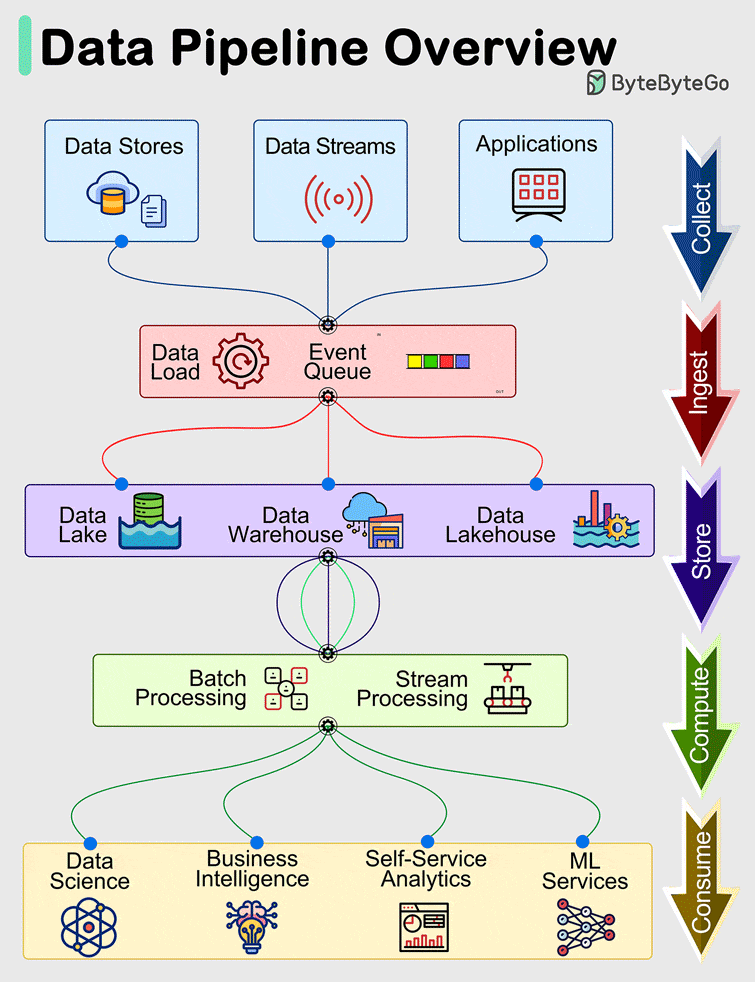

# 数据管道架构设计一览

今天来聊聊数据管道。

数据管道是现代系统中有效管理和处理数据的基本组成部分。

这些管道通常包括 **5 个主要阶段**：

-   收集（Collect）
    
-   摄取（Ingest）
    
-   存储（Store）
    
-   计算（Compute）
    
-   消费（Consume）
    

## 01 收集

从数据存储、数据流和应用程序中获取数据。数据来源于远程设备、应用程序或业务系统。

## 02 摄取

在摄取过程中，数据被加载到系统中，并在事件队列中进行组织。

## 03 存储

摄取后，整理好的数据与数据库等各种系统一起存储在数据仓库、数据湖和数据湖中，确保摄取后的存储。

## 04 计算

对数据进行聚合、清理和处理，以符合公司标准，包括格式转换、数据压缩和分区等任务。这一阶段采用批处理和流处理技术。

## 05 消费

处理后的数据可通过分析和可视化工具、运营数据存储、决策引擎、面向用户的应用程序、仪表板、数据科学、机器学习服务、商业智能和自助分析等方式提供给用户使用。

每个阶段的效率和有效性都有助于数据驱动型业务在企业内取得全面成功。
