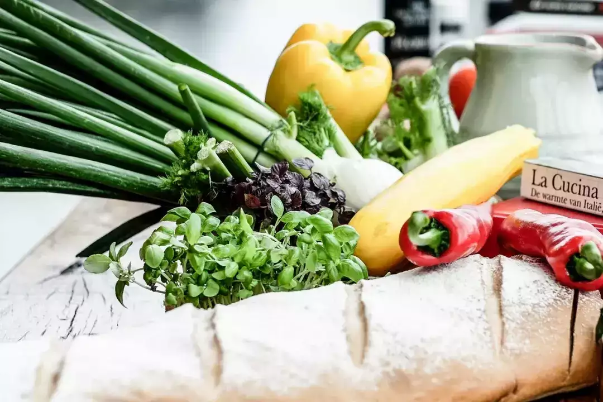

# 日常物资储备手册

  

  

根本原因在于涉及到自身生命安全的决策一定要亲自把关，而不是把希望寄托于任何组织。紧急情况下一定要先自救然后再寻求帮助。

  

列举一些适合长期储存的食品。

  

饮用水

  

人没有食物可以撑 1 个月，但是没有水，生命最多只能支撑 10 天。所以饮用水的重要性排在首位，按照每人每天 550 ml 的饮水量计算，至少储备 14 天的饮水量。

  

在超市或者京东上购买几箱农夫山泉在家放着就行，即使没有发生极端情况，水总是会喝的也不会浪费。

  

方便面

  

方便面是最为便捷的快食品，家里备个几十包，可轻松应对极端情况。

  

主食  

  

真空包装的大米、食用油、调味品：盐、味精、酱油、醋、酒，这些主食的保质期在 1 年左右，可以长期保存。

  

面食

  

冷冻面食类也非常适合长期保存，冷冻水饺、冷冻馄饨这些都是非常不错的物资。

  

维生素片

  

维生素意为维持生命之元素，可见维生素对于人体的重要性。人对维生素的诉求是非常多样性的，家里备几份维生素片，可在新鲜果蔬不足的情况下做适当补充。

  

冷冻蔬菜

  

新鲜的蔬菜无法长期保存，但是经过脱水处理的蔬菜可以长期保存，保质期可以长达 18 个月。日常的蔬菜对应的冷冻菜品都有，西兰花、油麦菜、青豆等。

  

坚果

  

坚果含有非常丰富的不饱和脂肪酸，平时也可以当零食。

  

日用品

  

餐巾纸、毛巾、牙膏、沐浴露、牙刷等。

  

基础药

  

感冒、发烧、头痛、胃痛等常见病症都需要准备一些基础药品。

  

日常生病在不发生医疗资源挤兑的情况下，小病根本不是问题，但是特殊情况下，政策容易导致层层加码，越是下层越怕担责，多一事不如少一事。

  

如果碰巧赶上一些重病后果不堪设想，所以了解一些必备的医疗基础知识也是必要的。

  

很多人可能会觉得上面这些举措是不是过于杞人忧天了？我曾经也一直认为不用这么神经质，但是从目前的情况来看，完全有必要。

  

我曾经一度从心里嘲笑那些抢物资的大爷大妈，这都 21 世纪了，居然还有人抢盐，事实证明我还是太年轻了，大爷之所以是你大爷是有原因的。

  

如果真的发生了恐慌事件，不用迟疑直接冲到楼下最近的超市储备物资。

  

作为普通人，大的决策层和趋势我们是无法决定的，能做的是更加全面的搜索和验证信息，做出对自己最有利的决策。不要每天只看一些满是正能量的信息，也不要只看都是负能量的信息。

  

做决策的第一步是信息要全面，多关注多思考。做好物资储备，了解基础医疗知识，做好现金储备这才是普通人最需要做的。