# 最强中文语音克隆 BertVits2 - 有一点点麻烦，但是效果真的无敌

曾经我写过一篇做语音克隆的 AI 音频工具：[11Labs](http://mp.weixin.qq.com/s?__biz=MzIyMzA5NjEyMA==&mid=2647660086&idx=1&sn=daffe518acad39de416638660ade8c69&chksm=f007ca61c77043772991b50aae00ea6670649809d1233f5fe84a9a2754ac1d054fe71b4ce502&scene=21#wechat_redirect)

效果好是好，也非常傻瓜简单，但是很多朋友都跟我反馈说，11Labs 中文效果不好。  

而国内的 AI 音频产品，比如出门问问的魔音工坊，效果确实很好，而且他们也有做媲美 11Labs 语音克隆的实力，但是因为国内很多很多的原因，内部做出来了，有时候也不太对外放出来...具体的原因我就不细聊了，反正，懂得都懂。  

总之，还是得靠自己，所以去年我 12 月翻了很久的 TTS 项目之后，找到了这个：

**Bert-Vits-2**


但是吧，这个效果虽好，但是没有好的特别影响代差的地步，直到上周有个大佬传了一个分支项目：  

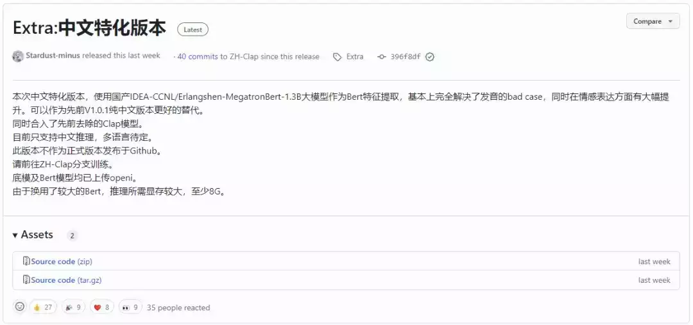

我觉得，中文语音克隆 TTS 的最强项目，到来了。

可以听听看，我去网上扒了 B 站 UP 主“峰哥亡命天涯”的音频，训练成 TTS 模型之后，说话的效果：  

**AI 峰哥说话 demo** ,数字生命卡兹克 ,22 秒

这可能是目前市面上，开源 TTS 这块，我能体验到的最好的中文音频克隆效果了。  

话不多说，开始教程，这次不是那么傻瓜，会有一点点麻烦，需要点好多下，但是毕竟各种乱七八糟的坑我都基本踩了个遍，所以我尽量写的清晰明白，让大家都能最方便快捷的训练自己的中文 TTS。  

首先，第一步，肯定是上云，云会让大家成功率最高，少踩一些坑，也花不了几块钱；  

打开我们的国际标准炼丹平台 AutoDL：https://www.autodl.com/

没注册的自己去链接注册去，我就不管了。

然后在西北 A 区租一台 4090 的机器。  


这里要注意一下，CPU 型号别选 AMD 的，右边有一列叫“最高 CUDA”，一定要大于 11.8 的，西北 A 区的一般都是 12.0 所以没啥问题，但是还是要留心一下，**CUDA 版本小于 11.8 必报错。**  

然后在下方，选择社区镜像，就是别人已经做好的系统我们直接拿来用就行了。在输入框中输入 Bert-Vits，就会自动联想出来一堆，**一定！一定！一定要选 V11.1 版本！！！要不然必报错！！！**  

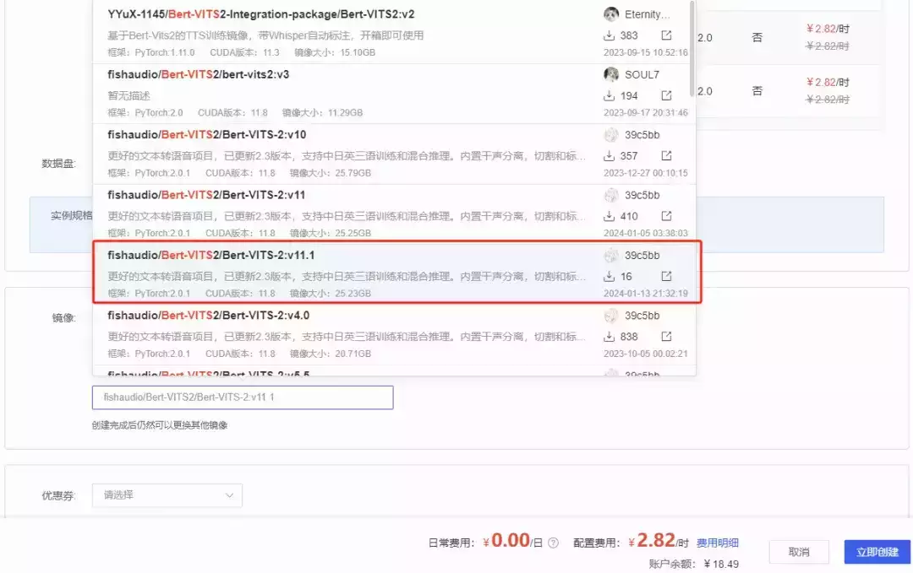

选完之后，我们就可以点击创建镜像。  

第一次创建镜像，可能会非常久，大概需要将近 10 分钟，不要急，耐心等等就好。

创建完成之后，点击 JupyterLab 进入系统。

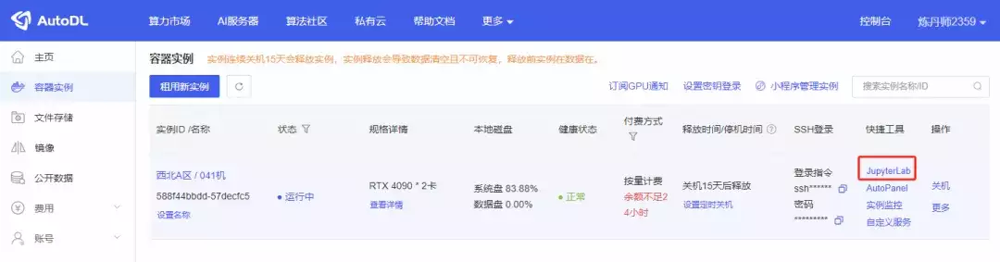

进来后就会看到一大堆文字，不用管，直接往下滑，直到看到分割线页面，点击第一个代码块，然后点上方的三角按钮运行这个代码块。  

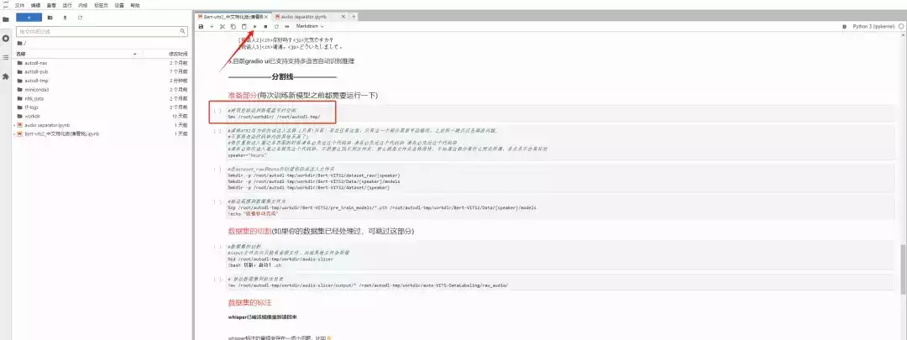

同时注意一下右上角这个圆圈的状态。  

实心圆则代表系统正在运行中，空心圆则代表上一步已经运行完成，目前系统空闲中。


所以只有当看到右上角圆圈是空心圆的时候，再去运行下面的代码块。  

第二个代码块比较重要，你可以先把这句话的 speaker="Neuro" ，后面的这个 Neuro 改成你自己的名字，比如我就改成了 speaker="Khazix"

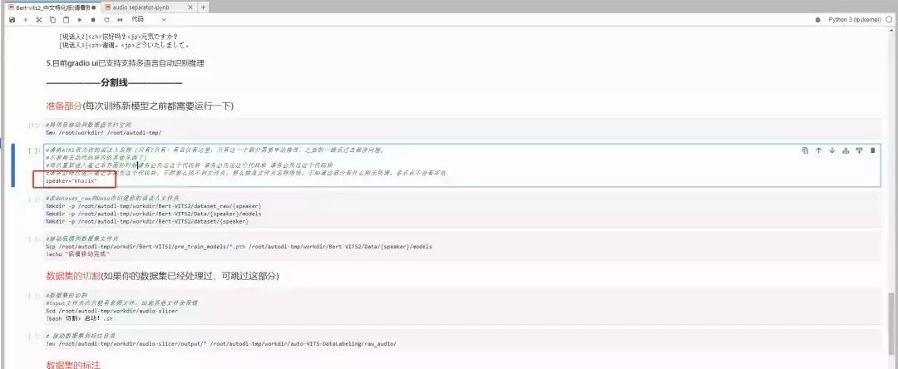

改完以后，再点顶上的三角按钮运行。

后续的两个代码块，都不需要运行任何东西，跟着运行即可。但是记得右上角的圆圈状态一定要是空心圆再运行！  

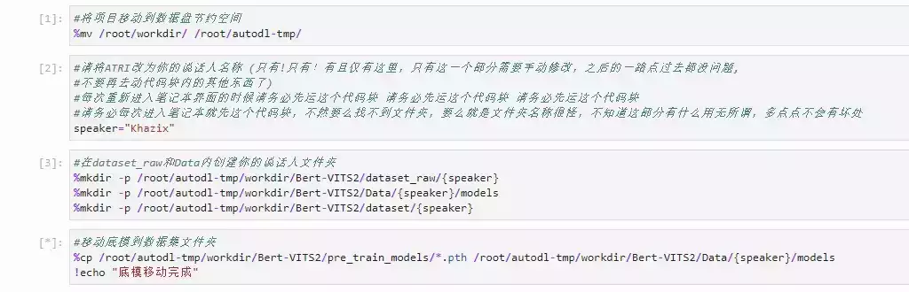

这四步都运行完了之后，接下来就是数据集的上传与切割，我们大概需要半个小时到 1 个小时的纯人声说话的干声，一定要干声！尽量不要有任何杂音，这样效果才好。

同时注意你的口吻，最好是比较日常的、说话的，不要唱歌的、不要念课文的，要不然出来的效果也是稀奇古怪的朗读腔。

TTS 大模型这种东西，90% 的效果其实都跟原始数据集有密切的关系。  

数据集这块，我们一般都是需要处理成多段 10~15 秒的音频的，如果你没有切割过的话，你可以直接把你的文件传到 autodl-tmp/workdir/audio-slicer/input 这个文件夹里，然后自己直接在代码块点击后运行即可。

如果你是已经在本地用 slicer-gui 切过的同学，你就可以直接把数据集上传到 autodl-tmp/workdir/auto-VITS-DataLabeling/raw\_audio 这个路径下，直接拖进来就行。

就像这样，注意一下下面的蓝色的进度条就行，没传完别乱点。  

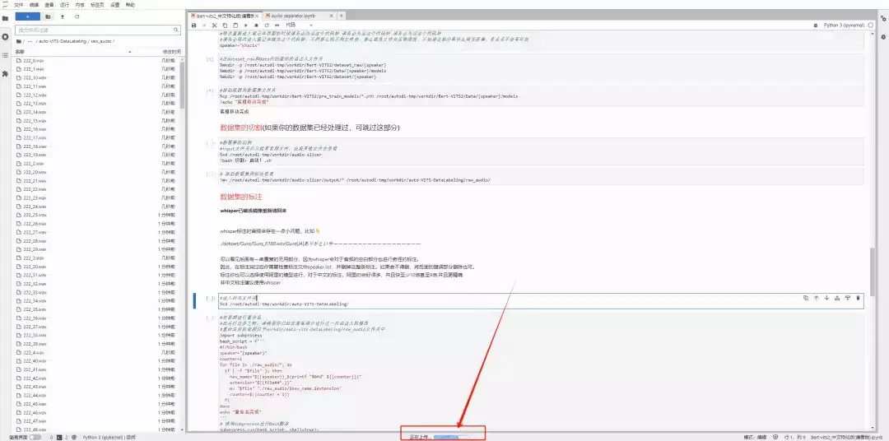

传完以后，我们就要进行数据集的标注了。这两个代码块，连这运行就行。  


然后我们开始正儿八经的标注，继续运行代码块就行。数据集嘛，标注一下效果才好，你懂的。  


这一步会有一点点久，毕竟得一条条语音识别出来。我 1093 条音频，大概花了 9 分钟，你们可以自己类推一下下~  

直到看到 Done 的提示，说明标注就完成啦。  


然后就是后面的 5 步，生成出各种东西，这 5 个代码块你也不需要改任何东西，看着右上角圆圈状态，无脑点击运行就行。

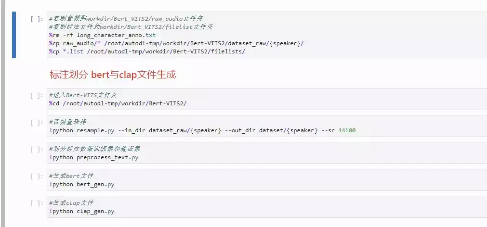

每一步都运行完的提示大概长这样，你们可以对着验证一下：  


最后，我们就要开始最后的一步！训练了！！！  

训练一共是 3 步，前两步还是跟之前一样，无脑点击就行。  

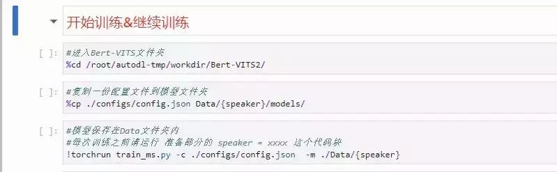

前两部运行完之后，等一等，停手！先别点第 3 步那个开始训练的代码块，而是返回顶部，找到我们最开始的 speaker="Khazix"那个代码块，运行一下后，再回来开始训练！！！就是这个：

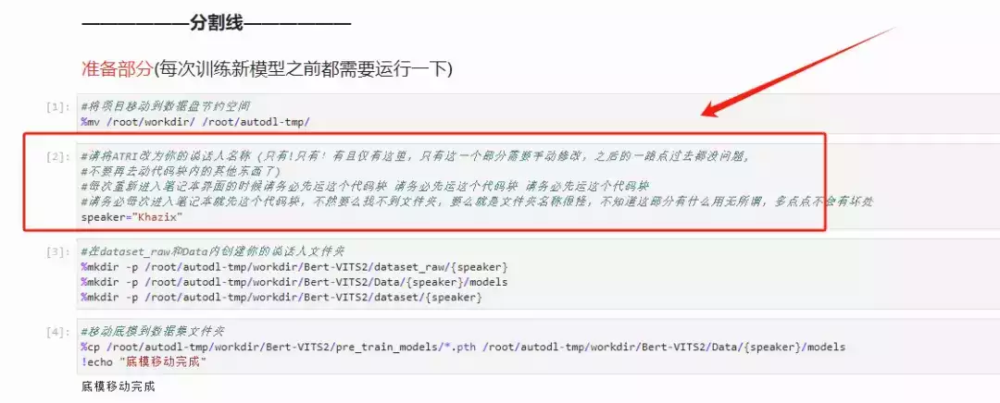

一定要，运行完以后，再回来开始训练！！要不然到时候报错了别来问我= =

OK，一切完毕，直接点击训练的那个代码块。如果你一切按我的来，从选机器开始，到最后的运行，基本是不会有 BUG 或者报错的，都能跑起来。你就能看到开始蠕动的进度条了。


等着就行，跟 SVC 类似，每 1000 步会在 autodl-tmp/workdir/Bert-VITS2/Data 这个文件夹里保存一个模型，我一般推荐 4000 步、5000 步的模型可以听听效果了，没有大问题的话，就可以继续往后炼，10000 步的模型差不多就可以用了，但是我还是推荐你 10000 步以后的每个保存下来的模型，都听一下，挑个最好的。

最后，模型差不多了，我们就要开始推理了~也就是真正的把文字转成语音了~推理我建议还是上云推理，本地推理要求最低也是 8G 显存，挺高的。。。像我这种垃圾 3060 想都不敢想。

推理第一步，先去改一下配置文件，因为这个项目比较新，所以用户体验不是特别好，大家忍耐一下，马上就完事了~  

我们在 autodl-tmp/workdir/Bert-VITS2 这个路径下，找到一个叫 config.yml 的文件。双击点开它。

找到 105 行。  


把这行的路径 model: "Data/maolei/models/G\_0.pth"，换成你自己的。

比如我的说话人最开始设的叫 Khazix，现在我想用 5000 步的模型去做推理，那我就把这行改成：

model: "Data/**Khazix**/models/**G\_5000**.pth"

标红的这块就是需要你去修改的。改完以后，记得多按几下 Ctrl+S 保存。  

然后，保持在 autodl-tmp/workdir/Bert-VITS2 目录下，再点击右上角的 + 号，再点终端，进入命令行页面。  

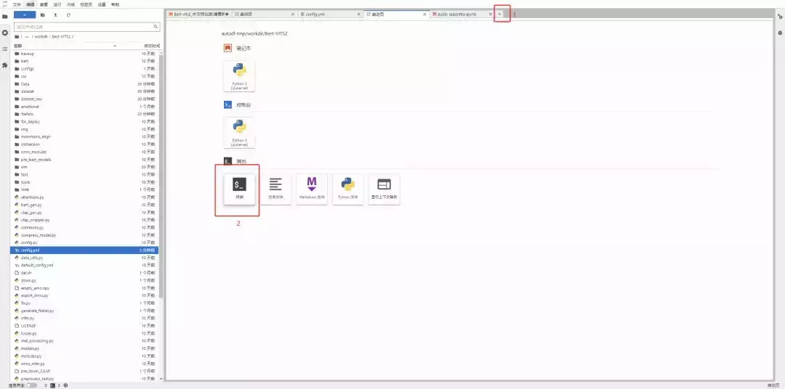

输入代码：

```plain
python webui.py
```

就会出来一串推理地址：  


如果遇到报错，可以先把那边训练给停了，按顶上的方块停止按钮就行，下次再开是接着训练的，不影响。  

看到这个地址后，别直接点进去，会啥也看不到的，因为这是云机器的本地连接，所以我们要通过一些额外手段接进去。  

回到 AutoDL 的控制台首页，点击这个自定义服务，就可以进去了。

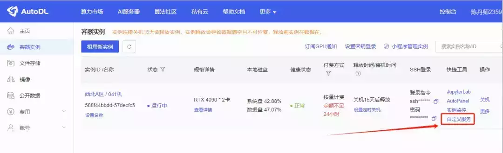

然后，你就可以看到推理的 WebUI 了。  


在左上角正常输入你的文字内容就行。

有个有趣的东西是音频 Prompt，你可以再传一段音频上去，把这段音频的风格作为 Prompt，他就可以生成差不多效果的音频。  

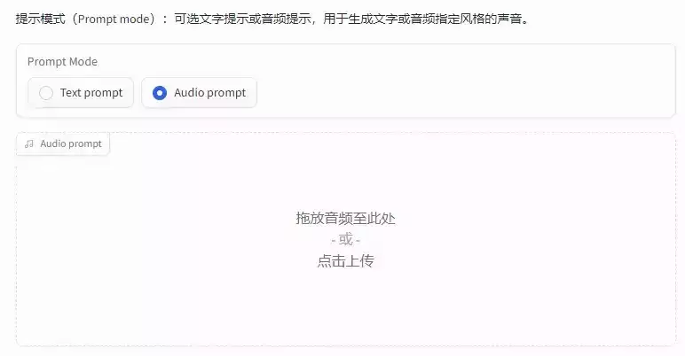

比如我传了一段峰哥 8 秒的说话切片作为参考，然后所有参数都不变，就生成了这么一段话。  

**AI 峰哥说话 demo2** ,数字生命卡兹克 ,13 秒

实在是太还原了，除了气口这个老大难问题，其他的都几乎一样，连峰哥语气词都还原出来了。  

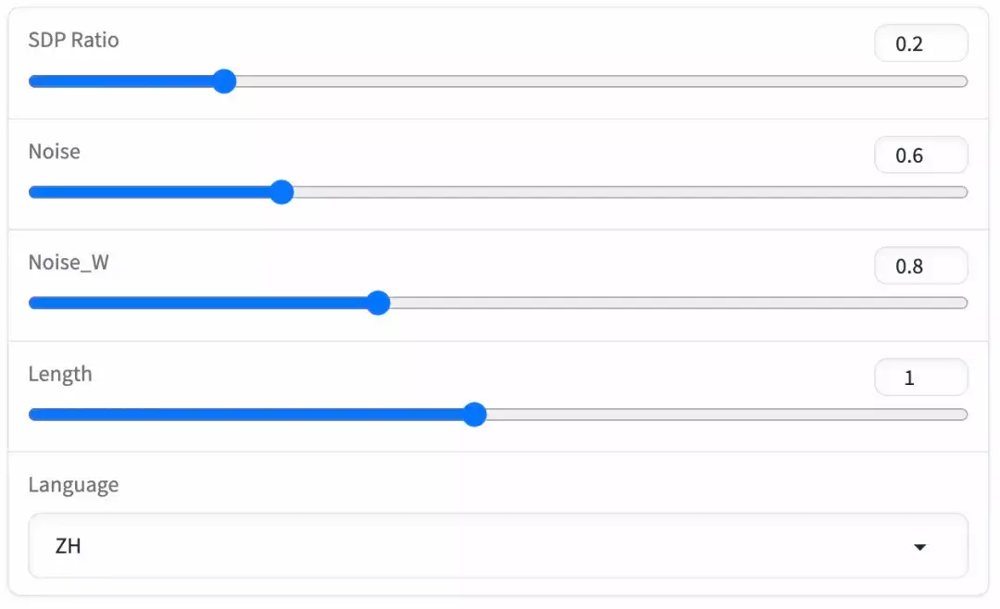

下面的这些参数，其实只用看最后一个 Length 那个就行，那个是语速，有时候 AI 会贼快，所以可以适当的加大参数，参数越大越慢，另外三个最好别动，默认就行。

最后，你训练的模型如果要保存下来，记得去 autodl-tmp/workdir/Bert-VITS2/Data/你的文件夹名字/models 里，把三个模型下载下来，一定要保证后缀是一样的，下次直接传到同一个文件夹里，就可以继续推理了。


以上，就是这一版 Bert-Vits2 中文特化版的全部用法。  

说实话，蹚坑挺累的，作为一个不懂技术的，我蹚坑真的蹚了好几个晚上，没有前路，只能自己把各种报错原因拿去跟 GPT 对话，然后研究怎么整。。。

但是好在，最后还是 OK 了。

希望，大家都能发挥出它的强大，用 AI，真的去做一些有趣的事。