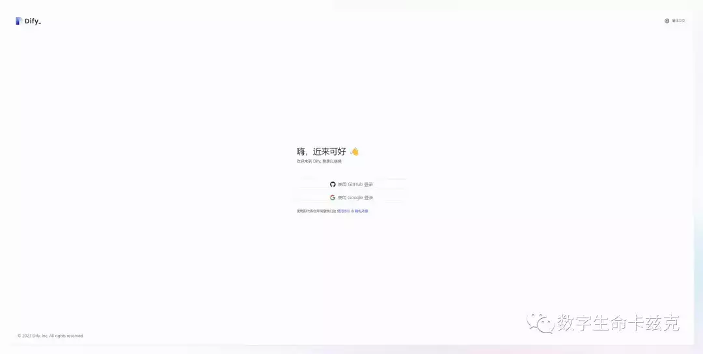
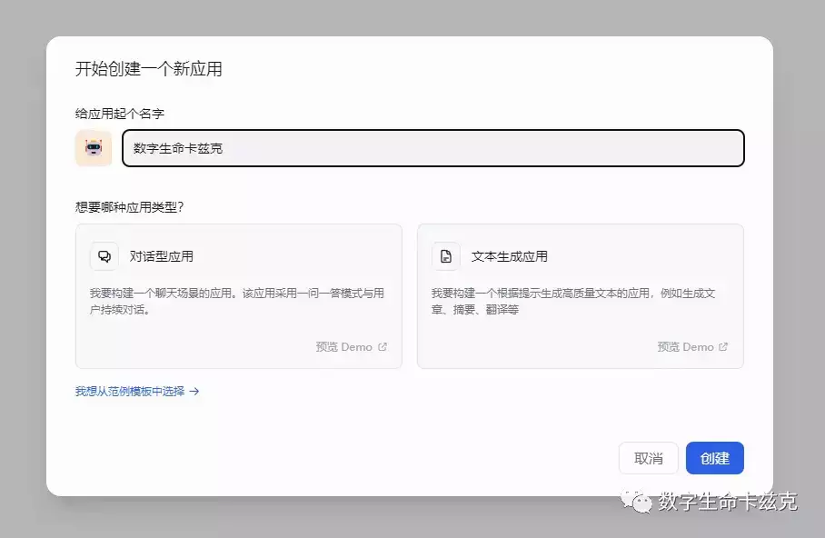
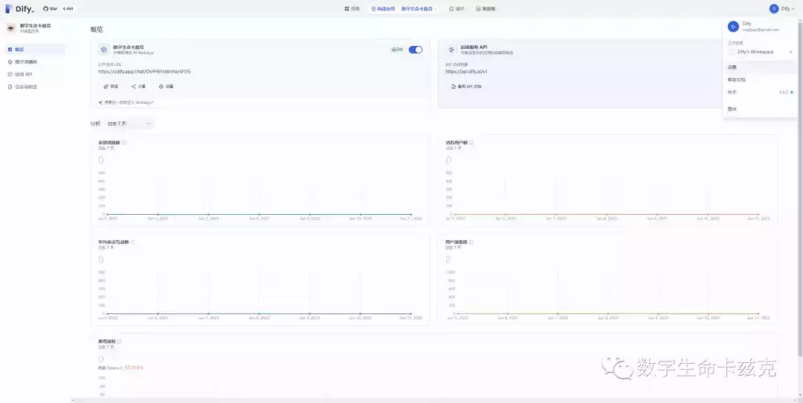
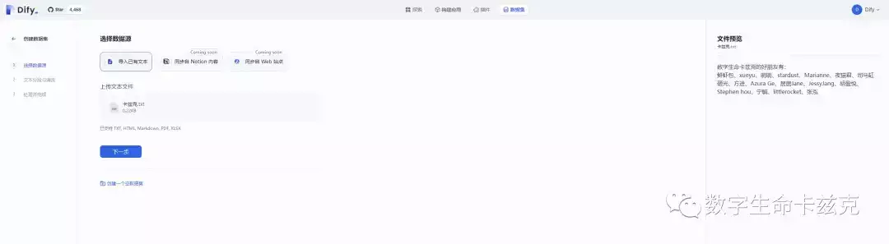
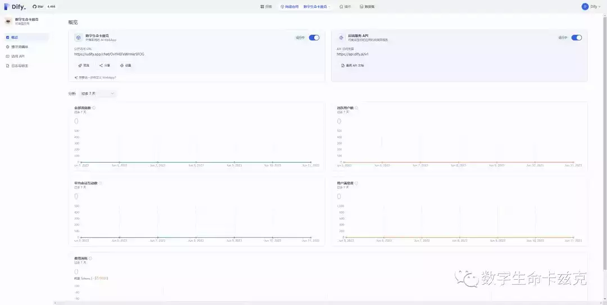
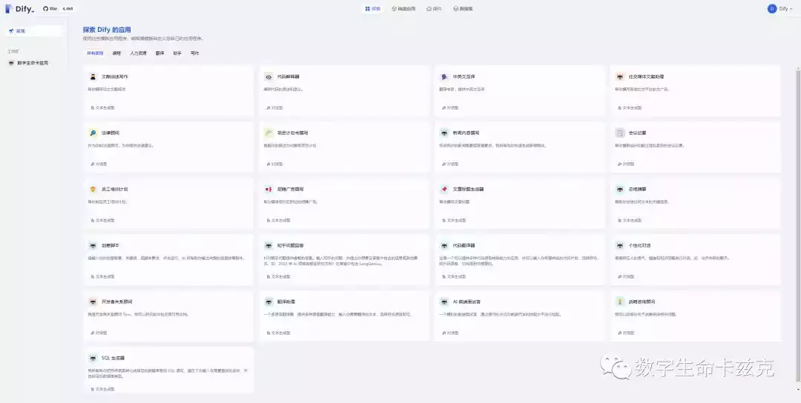

# 【有手就行】2分钟0代码，教你用Dify搭建专属AI知识库

自从ChatGPT发布以来，已经过去了8个月了。

而基于知识库的问答产品，ChatPDF的发布，也过去很多个月了。  

毕竟，这玩意，可不是玩玩而已，是真的生产力啊。  

**比如智能AI客服，7\*24小时在线沟通，百问百答，没任何脾气，可同时服务数千客户咨询；**

**比如企业内部知识库，大家都做了那么多文档那么多SOP对吧，看那么多文件，脑袋都大了，这下好了，一句话全部解决。**

**比如你的搭建你的数字分身，学习、咨询一站式服务；**

当然，还能搞垂直行业的AI咨询师，比如律师、比如金融等等。

三头六臂，直接起飞。  

话不多说，今天带大家搭自己的知识库，用的项目是Dify。

首先要理解一下搭知识库的基本原理。  

**知识库并不是将几百页的文档全灌给了GPT，而是将文档全部转成向量，存到向量数据库中，当用户发起提问时，就将这个问题的向量去向量数据库里查，找到最相近的文本，给它取出来，并嵌入给GPT，让GPT根据这段取出来的文字进行回答。**  

这涉及到了很多知识，比如你要用API接入，你要做文本分割，你要做向量库，你要做嵌入等等...  

你不会代码的话，直接就可以回家玩泥巴了。。。

而现在，Dify横空出世，无需代码，无需那些乱七八糟的知识，真正的实现，有手就行。  

> Dify 是一个易用的 LLMOps 平台，旨在让更多人可以创建可持续运营的原生 AI 应用。Dify 提供多种类型应用的可视化编排，应用可开箱即用，也能以“后端即服务”的 API 提供服务。

网址在此：https://cloud.dify.ai/

一进来是一个非常简单的登录页面，用Google登录就好。

然后你会发现，你现在没有任何应用，是空空如也的状态。我们点击左上角，创建应用。  

在弹出的框中，选择对话型应用，毕竟我们是要做一个对话知识库嘛。然后名字按照真实场景随便填。  

进入到一个数据统计页面后，说明我们的应用已经创建完成了，是不是很迅速？但是不急，我们还需要做两步操作，输入我们的OpenAI的Key，再上传我们的数据集。

我们先点头像右上角，点击设置。在弹窗里找到模型供应商，把OpenAI这块的Key，改成自己的账号的Key。

然后，我们点击数据集这个tab。再创建一个自己的数据集。

目前Dify的数据集只支持文本上传，已支持TXT，HTML，Markdown，PDF，XLSX。对本地的文档支持的很全面了。**你要是有多个文件，就一个一个传。**

我随便弄了一个文档传上去了。  

然后这个分段与清洗的设置页面，如果你不太懂文本切割，你就无脑选自动和高质量就行。

然后我们保存并处理，很快就好啦。  

处理完成之后，我们回到刚才所创建的应用页面。点击提示词编排。  

**对话前的预设Prompt我就随便写了两句，大家可以根据自己的实际情况去写，比如智能客服跟法律顾问的Prompt肯定是不一样的。**  

在上下文关联那，把自己的数据集给添加进去。

我们点击发布！大功告成！

回到概览页，我们就可以把这个链接分享给朋友，或者懂代码的话，也可以直接接这个API。

我们打开网页，来问一下我上传的文档内容来试试看。  

当然，Dify的功能还不止于此。知识库只是冰山一角。

大家对他们还感兴趣的话，以后可以慢慢写。

**以上，既然看到这里了，如果觉得不错，随手点个赞和“在看”吧，感恩。**