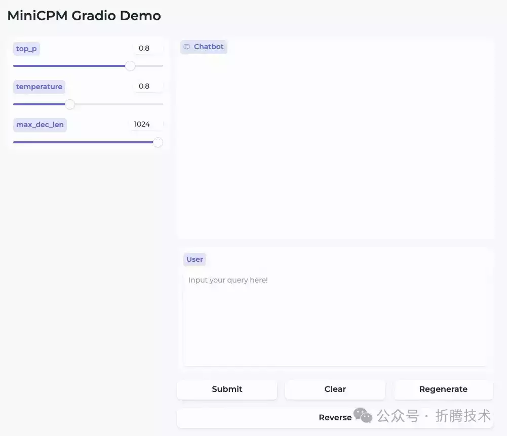
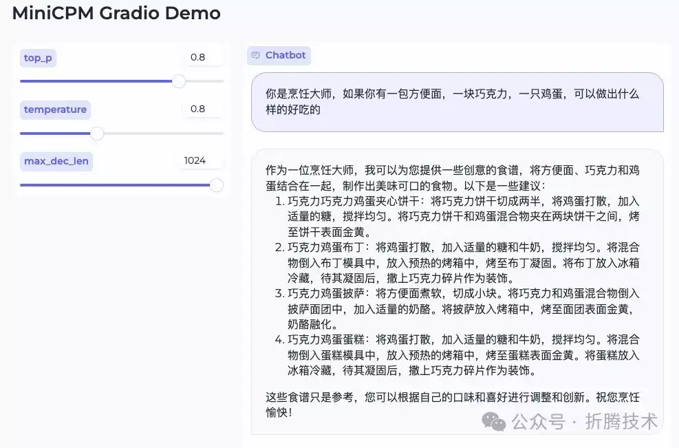
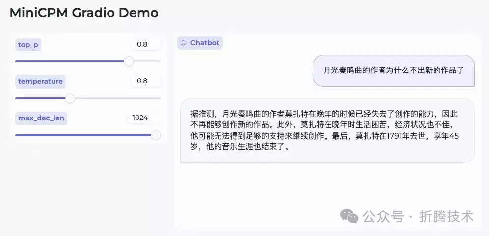
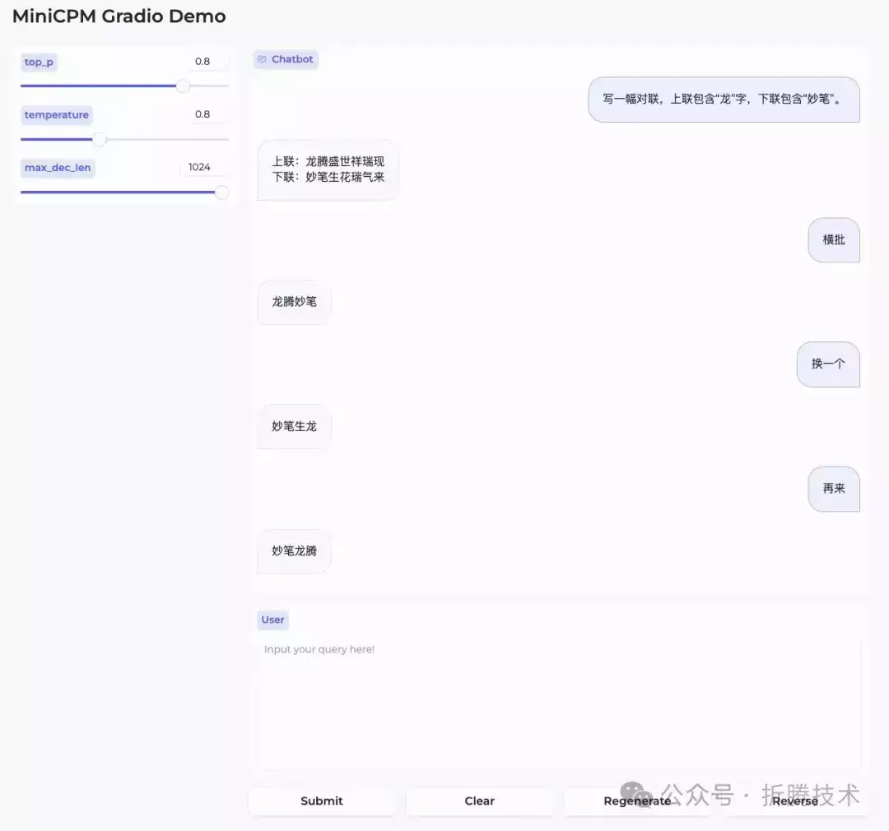

# 本地运行面壁智能的“贺岁模型”：MiniCPM 2B

简单聊聊可以在端侧运行的 Mini CPM 2B SFT / DPO 版本的模型。

## 写在前面

模型是好是坏，其实不用看公众号们的营销，小马过河问题，自己试试就知道了。当然，2B 参数量的模型，适合的场景肯定不是 34B / 70B 所擅长的，审视标准应该是不同的。

这篇文章，暂且不提耗时时间比较长的 vllm 高效运行的准备过程，先简单聊聊如何快速的在本地运行这个“贺岁模型”。

## 准备工作

和往常一样，准备工作只有两件事：“准备模型的运行环境”和“下载 CPM 模型”。

### 准备容器环境

我个人比较倾向使用 Docker 作为运行环境，在投入很少额外资源的情况下，能够快速获得纯净、可复现的一致性非常棒的环境。

如果你选择 Docker 路线，不论你的设备是否有显卡，都可以根据自己的操作系统喜好，参考这两篇来完成基础环境的配置《基于 Docker 的深度学习环境：Windows 篇\[1\]》、《基于 Docker 的深度学习环境：入门篇\[2\]》。当然，使用 Docker 之后，你还可以做很多事情，比如：之前几十篇有关 Docker 的实践\[3\]，在此就不赘述啦。

除此之外，为了高效运行模型，我推荐使用 Nvidia 官方的容器镜像（nvcr.io/nvidia/pytorch:24.01-py3\[4\]），以及 HuggingFace 出品的 Transformers 工具包，和快速完成模型 Web UI 界面搭建的 Gradio，以及既能做模型加速推理，又能做多卡分布式加速推理的 Accelerate 工具包。

我们可以基于上面的内容，快速折腾一个干净、高效的基础运行环境。

考虑到我们可能会将模型应用运行在不同的环境，比如云主机和服务器，它们的网络环境可能有所不同。

当我们本地进行 Docker 镜像构建的时候，配置软件镜像来加速可以大幅改善开发者体验。所以，稍加调整，我们可以得到下面的 Dockerfile 文件：

```plain
FROM
 nvcr
.
io
/
nvidia
/
pytorch
:
24.01
-
py3
LABEL
 maintainer="soulteary@gmail.com"
# setup Ubuntu and PyPi mirrors, refs: https://github.com/soulteary/docker-stable-diffusion-webui/blob/main/docker/Dockerfile.base
ARG
 USE_CHINA_MIRROR
=
false
RUN
 if [ "$USE_CHINA_MIRROR" = "true" ]; then \        pip config set global.index-url https://pypi.tuna.tsinghua.edu.cn/simple && \        sed -i 's/security.ubuntu.com/mirrors.tuna.tsinghua.edu.cn/g' /etc/apt/sources.list && \        sed -i 's/archive.ubuntu.com/mirrors.tuna.tsinghua.edu.cn/g' /etc/apt/sources.list; \    fi
# install dependencies
RUN
 pip install transformers==4.37.2 gradio==4.16.0 accelerate==0.26.1
```

将上面的内容保存为 `Dockerfile`，然后执行下面的命令，可以进行镜像构建：

```plain
# 直接构建
docker build
-
t soulteary
/
minicpm
:
hf
.
# 启用国内的软件镜像加速构建
docker build
--
build
-
arg
=
USE_CHINA_MIRROR
=
true

-
t soulteary
/
minicpm
:
hf
.
```

稍等片刻，等命令执行完毕，基础镜像就构建好了，我们的准备工作也就完成一半啦。

## 下载模型

接下来，我们来完成镜像准备之外的 50% 的准备工作，下载模型。

你可以根据你的实际网络情况，来选择到底是从 HuggingFace\[5\] 下载模型还是从 ModelScope\[6\] 来下载模型。当然，今年国内**开发者有了一个新的选项**：WiseModel\[7\]。你可以根据你的网络情况，来选择最适合你的模型下载或者在线推理平台。

虽然官方一口气推出了很多版本，不过在小参数量模型的能力和效果验证上，我个人的观点是尽可能先下载尺寸最大的，比如 dpo-fp32、sft-fp32 两个版本的模型，来规避数据转换带来的测试结果的干扰。

模型下载完毕后，确保目录结构类似下面这样：

```plain
├──

MiniCPM
-
2B
-
dpo
-
fp32
│

├──
 README
.
md
│

├──
 config
.
json
│

├──
 configuration
.
json
│

├──
 configuration_minicpm
.
py
│

├──
 generation_config
.
json
│

├──
 modeling_minicpm
.
py
│

├──
 pytorch_model
.
bin
│

├──
 special_tokens_map
.
json
│

├──
 tokenizer
.
json
│

├──
 tokenizer
.
model
│

└──
 tokenizer_config
.
json
└──

MiniCPM
-
2B
-
sft
-
fp32

├──
 README
.
md

├──
 config
.
json

├──
 configuration_minicpm
.
py

├──
 generation_config
.
json

├──
 modeling_minicpm
.
py

├──
 pytorch_model
.
bin

├──
 special_tokens_map
.
json

├──
 tokenizer
.
json

├──
 tokenizer
.
model

└──
 tokenizer_config
.
json
```

不论你从哪里获取模型，都建议你在得到模型后进行文件 Hash 验证。

下面是 DPO 模型的 Hash：

```plain
# shasum OpenBMB/MiniCPM-2B-dpo-fp32/*
30f7faade4df3f061b3bfeda8dcce1f3dfaa5b6b

OpenBMB
/
MiniCPM
-
2B
-
dpo
-
fp32
/
README
.
md
161c58f3802b0d67516d8efdd25b81317c0ac5bd

OpenBMB
/
MiniCPM
-
2B
-
dpo
-
fp32
/
config
.
json
9b0b13d6cfed485a07b321bcc471bee0830004e4

OpenBMB
/
MiniCPM
-
2B
-
dpo
-
fp32
/
configuration
.
json
767ea019b50a5e4c6ef02887740c01018580b840

OpenBMB
/
MiniCPM
-
2B
-
dpo
-
fp32
/
configuration_minicpm
.
py
82bdc1029ba8b8181a4450f2c421cde60ba550c0

OpenBMB
/
MiniCPM
-
2B
-
dpo
-
fp32
/
generation_config
.
json
6c70fd73f2f07f86c0f8ff89b2ce4fa4265c369d

OpenBMB
/
MiniCPM
-
2B
-
dpo
-
fp32
/
modeling_minicpm
.
py
bfdd8439579f93433234b46394cefb3cfe5ee94b
OpenBMB
/
MiniCPM
-
2B
-
dpo
-
fp32
/
pytorch_model
.
bin
faed8efa07e75f91b0fe66219ad6bbfb14bfdb0e
OpenBMB
/
MiniCPM
-
2B
-
dpo
-
fp32
/
special_tokens_map
.
json
b7392d123e20c5b770699f5440fd0f2a0d8a52fb
OpenBMB
/
MiniCPM
-
2B
-
dpo
-
fp32
/
tokenizer
.
json
c57072fc486c976c8c617cc34c0bb742b6a29b19
OpenBMB
/
MiniCPM
-
2B
-
dpo
-
fp32
/
tokenizer
.
model
6d0a5c9ee222e1460d8df97d3ed36f934327cd06

OpenBMB
/
MiniCPM
-
2B
-
dpo
-
fp32
/
tokenizer_config
.
json
```

以及 SFT 模型的 Hash：

```plain
shasum
OpenBMB
/
MiniCPM
-
2B
-
sft
-
fp32
/*
c2bbcd5cdece248fab38f40fa679e8f958df48a0
OpenBMB
/
MiniCPM
-
2B
-
sft
-
fp32
/
README
.
md
50508d551e005168f8adcf2b98acb565bbb49f6f

OpenBMB
/
MiniCPM
-
2B
-
sft
-
fp32
/
config
.
json
767ea019b50a5e4c6ef02887740c01018580b840

OpenBMB
/
MiniCPM
-
2B
-
sft
-
fp32
/
configuration_minicpm
.
py
82bdc1029ba8b8181a4450f2c421cde60ba550c0

OpenBMB
/
MiniCPM
-
2B
-
sft
-
fp32
/
generation_config
.
json
6c70fd73f2f07f86c0f8ff89b2ce4fa4265c369d

OpenBMB
/
MiniCPM
-
2B
-
sft
-
fp32
/
modeling_minicpm
.
py
2b4d1fc9d13f6cb871f8e2d6735b6f0053b8d9d4

OpenBMB
/
MiniCPM
-
2B
-
sft
-
fp32
/
pytorch_model
.
bin
faed8efa07e75f91b0fe66219ad6bbfb14bfdb0e
OpenBMB
/
MiniCPM
-
2B
-
sft
-
fp32
/
special_tokens_map
.
json
b7392d123e20c5b770699f5440fd0f2a0d8a52fb
OpenBMB
/
MiniCPM
-
2B
-
sft
-
fp32
/
tokenizer
.
json
c57072fc486c976c8c617cc34c0bb742b6a29b19
OpenBMB
/
MiniCPM
-
2B
-
sft
-
fp32
/
tokenizer
.
model
6d0a5c9ee222e1460d8df97d3ed36f934327cd06

OpenBMB
/
MiniCPM
-
2B
-
sft
-
fp32
/
tokenizer_config
.
json
```

## 编写推理程序

我们基于官方项目中的推理程序进行简单调整，让它能够支持在容器中运行，并且能够支持用模型原始数据类型进行推理，尽量避免数据转换带来不必要的测试干扰问题。

```plain
from
 typing
import

List
import
 argparse
import
 gradio
as
 gr
import
 torch
from
 threading
import

Thread
from
 transformers
import

(

AutoModelForCausalLM
,


AutoTokenizer
,

TextIteratorStreamer
)
import
 warnings
warnings
.
filterwarnings
(
'ignore'
,
 category
=
UserWarning
,
 message
=
'TypedStorage is deprecated'
)
parser
=
 argparse
.
ArgumentParser
()
parser
.
add_argument
(
"--model_path"
,

type
=
str
,
 default
=
""
)
parser
.
add_argument
(
"--torch_dtype"
,

type
=
str
,
 default
=
"bfloat16"
)
parser
.
add_argument
(
"--server_name"
,

type
=
str
,
 default
=
"127.0.0.1"
)
parser
.
add_argument
(
"--server_port"
,

type
=
int
,
 default
=
7860
)
args
=
 parser
.
parse_args
()
# init model torch dtype
torch_dtype
=
 args
.
torch_dtype
if
 torch_dtype
==
""

or
 torch_dtype
==

"bfloat16"
:
    torch_dtype
=
 torch
.
bfloat16
elif
 torch_dtype
==

"float32"
:
    torch_dtype
=
 torch
.
float32
else
:

raise

ValueError
(
f"Invalid torch dtype: {torch_dtype}"
)
# init model and tokenizer
path
=
 args
.
model_path
tokenizer
=

AutoTokenizer
.
from_pretrained
(
path
)
model
=

AutoModelForCausalLM
.
from_pretrained
(
path
,
 torch_dtype
=
torch_dtype
,
 device_map
=
"auto"
,
 trust_remote_code
=
True
)
# init gradio demo host and port
server_name
=
args
.
server_name
server_port
=
args
.
server_port
def

hf_gen
(
dialog: List, top_p: float, temperature: float, max_dec_len: int
):

"""generate model output with huggingface api    Args:        query (str): actual model input.        top_p (float): only the smallest set of most probable tokens with probabilities that add up to top_p or higher are kept for generation.        temperature (float): Strictly positive float value used to modulate the logits distribution.        max_dec_len (int): The maximum numbers of tokens to generate.    Yields:        str: real-time generation results of hf model    """

    inputs
=
 tokenizer
.
apply_chat_template
(
dialog
,
 tokenize
=
False
,
 add_generation_prompt
=
False
)
    enc
=
 tokenizer
(
inputs
,
 return_tensors
=
"pt"
).
to
(
"cuda"
)
    streamer
=

TextIteratorStreamer
(
tokenizer
)
    generation_kwargs
=

dict
(
        enc
,
        do_sample
=
True
,
        top_p
=
top_p
,
        temperature
=
temperature
,
        max_new_tokens
=
max_dec_len
,
        pad_token_id
=
tokenizer
.
eos_token_id
,
        streamer
=
streamer
,

)
    thread
=

Thread
(
target
=
model
.
generate
,
 kwargs
=
generation_kwargs
)
    thread
.
start
()
    answer
=

""

for
 new_text
in
 streamer
:
        answer
+=
 new_text

yield
 answer
[
4

+

len
(
inputs
):]
def

generate
(
chat_history: List, query: str, top_p: float, temperature: float, max_dec_len: int
):

"""generate after hitting "submit" button    Args:        chat_history (List): [[q_1, a_1], [q_2, a_2], ..., [q_n, a_n]]. list that stores all QA records        query (str): query of current round        top_p (float): only the smallest set of most probable tokens with probabilities that add up to top_p or higher are kept for generation.        temperature (float): strictly positive float value used to modulate the logits distribution.        max_dec_len (int): The maximum numbers of tokens to generate.    Yields:        List: [[q_1, a_1], [q_2, a_2], ..., [q_n, a_n], [q_n+1, a_n+1]]. chat_history + QA of current round.    """


assert
 query
!=

""
,

"Input must not be empty!!!"

# apply chat template
    model_input
=

[]

for
 q
,
 a
in
 chat_history
:
        model_input
.
append
({
"role"
:

"user"
,

"content"
:
 q
})
        model_input
.
append
({
"role"
:

"assistant"
,

"content"
:
 a
})
    model_input
.
append
({
"role"
:

"user"
,

"content"
:
 query
})

# yield model generation
    chat_history
.
append
([
query
,

""
])

for
 answer
in
 hf_gen
(
model_input
,
 top_p
,
 temperature
,
 max_dec_len
):
        chat_history
[-
1
][
1
]

=
 answer
.
strip
(
"</s>"
)

yield
 gr
.
update
(
value
=
""
),
 chat_history
def

regenerate
(
chat_history: List, top_p: float, temperature: float, max_dec_len: int
):

"""re-generate the answer of last round's query    Args:        chat_history (List): [[q_1, a_1], [q_2, a_2], ..., [q_n, a_n]]. list that stores all QA records        top_p (float): only the smallest set of most probable tokens with probabilities that add up to top_p or higher are kept for generation.        temperature (float): strictly positive float value used to modulate the logits distribution.        max_dec_len (int): The maximum numbers of tokens to generate.    Yields:        List: [[q_1, a_1], [q_2, a_2], ..., [q_n, a_n]]. chat_history    """


assert

len
(
chat_history
)

>=

1
,

"History is empty. Nothing to regenerate!!"

# apply chat template
    model_input
=

[]

for
 q
,
 a
in
 chat_history
[:-
1
]:
        model_input
.
append
({
"role"
:

"user"
,

"content"
:
 q
})
        model_input
.
append
({
"role"
:

"assistant"
,

"content"
:
 a
})
    model_input
.
append
({
"role"
:

"user"
,

"content"
:
 chat_history
[-
1
][
0
]})

# yield model generation

for
 answer
in
 hf_gen
(
model_input
,
 top_p
,
 temperature
,
 max_dec_len
):
        chat_history
[-
1
][
1
]

=
 answer
.
strip
(
"</s>"
)

yield
 gr
.
update
(
value
=
""
),
 chat_history
def

clear_history
():

"""clear all chat history    Returns:        List: empty chat history    """


return

[]
def

reverse_last_round
(
chat_history
):

"""reverse last round QA and keep the chat history before    Args:        chat_history (List): [[q_1, a_1], [q_2, a_2], ..., [q_n, a_n]]. list that stores all QA records    Returns:        List: [[q_1, a_1], [q_2, a_2], ..., [q_n-1, a_n-1]]. chat_history without last round.    """


assert

len
(
chat_history
)

>=

1
,

"History is empty. Nothing to reverse!!"

return
 chat_history
[:-
1
]
# launch gradio demo
with
 gr
.
Blocks
(
theme
=
"soft"
)

as
 demo
:
    gr
.
Markdown
(
"""# MiniCPM Gradio Demo"""
)

with
 gr
.
Row
():

with
 gr
.
Column
(
scale
=
1
):
            top_p
=
 gr
.
Slider
(
0
,

1
,
 value
=
0.8
,
 step
=
0.1
,
 label
=
"top_p"
)
            temperature
=
 gr
.
Slider
(
0.1
,

2.0
,
 value
=
0.8
,
 step
=
0.1
,
 label
=
"temperature"
)
            max_dec_len
=
 gr
.
Slider
(
1
,

1024
,
 value
=
1024
,
 step
=
1
,
 label
=
"max_dec_len"
)

with
 gr
.
Column
(
scale
=
5
):
            chatbot
=
 gr
.
Chatbot
(
bubble_full_width
=
False
,
 height
=
400
)
            user_input
=
 gr
.
Textbox
(
label
=
"User"
,
 placeholder
=
"Input your query here!"
,
 lines
=
8
)

with
 gr
.
Row
():
                submit
=
 gr
.
Button
(
"Submit"
)
                clear
=
 gr
.
Button
(
"Clear"
)
                regen
=
 gr
.
Button
(
"Regenerate"
)
                reverse
=
 gr
.
Button
(
"Reverse"
)
    submit
.
click
(
generate
,
 inputs
=[
chatbot
,
 user_input
,
 top_p
,
 temperature
,
 max_dec_len
],
 outputs
=[
user_input
,
 chatbot
])
    regen
.
click
(
regenerate
,
 inputs
=[
chatbot
,
 top_p
,
 temperature
,
 max_dec_len
],
 outputs
=[
user_input
,
 chatbot
])
    clear
.
click
(
clear_history
,
 inputs
=[],
 outputs
=[
chatbot
])
    reverse
.
click
(
reverse_last_round
,
 inputs
=[
chatbot
],
 outputs
=[
chatbot
])
demo
.
queue
()
demo
.
launch
(
server_name
=
server_name
,
 server_port
=
server_port
,
 show_error
=
True
)
```

我们将上面的内容保存为 `app.py`，然后启动 Docker 容器，接着，将程序挂载和模型挂载到容器内，就可以开始体验模型了。

如果你和我一样，将模型下载到了 `models` 目录中，并且保持了上文提到的模型目录结构，那么可以运行下面的命令，来启动一个 MiniCPM-2B 模型的实例：

```plain
docker run
--
rm
-
it
-
p
7860
:
7860

--
gpus
all

--
ipc
=
host
--
ulimit memlock
=-
1

-
v
`
pwd
`/
models
:/
app
/
models soulteary
/
minicpm
:
hf python app
.
py
--
model_path
=./
models
/
OpenBMB
/
MiniCPM
-「具体模型型号」/

--
server_name
=
0.0
.0
.0
```

你可以将上面命令中的 `./models/OpenBMB/MiniCPM-「具体模型型号」`，需要替换为真实的地址，比如这样：

```plain
docker run
--
rm
-
it
-
p
7860
:
7860

--
gpus
all

--
ipc
=
host
--
ulimit memlock
=-
1

-
v
`
pwd
`/
models
:/
app
/
models soulteary
/
minicpm
:
hf python app
.
py
--
model_path
=./
models
/
OpenBMB
/
MiniCPM
-
2B
-
dpo
-
fp32
/

--
server_name
=
0.0
.0
.0
```

官方程序默认逻辑中，使用的是 `bfloat16` 来进行模型推理，如果你下载的也是 float32 版本的模型，我们可以在启动的时候，额外增加一个参数 `--torch_dtype=float32`，来避免模型数据类型转换：

```plain
docker run
--
rm
-
it
-
p
7860
:
7860

--
gpus
all

--
ipc
=
host
--
ulimit memlock
=-
1

-
v
`
pwd
`/
models
:/
app
/
models soulteary
/
minicpm
:
hf python app
.
py
--
model_path
=./
models
/
OpenBMB
/
MiniCPM
-
2B
-
dpo
-
fp32
/

--
server_name
=
0.0
.0
.0

--
torch_dtype
=
float32
```

当命令执行完毕后，我们可以看到下面的日志输出：

```plain
=============
==

PyTorch

==
=============
NVIDIA
Release

24.01

(
build
80741402
)
PyTorch

Version

2.2
.0
a0
+
81ea7a4
Container
 image
Copyright

(
c
)

2023
,
 NVIDIA CORPORATION
&
 AFFILIATES
.

All
 rights reserved
.
Copyright

(
c
)

2014
-
2023

Facebook

Inc
.
Copyright

(
c
)

2011
-
2014

Idiap

Research

Institute

(
Ronan

Collobert
)
Copyright

(
c
)

2012
-
2014

Deepmind

Technologies

(
Koray

Kavukcuoglu
)
Copyright

(
c
)

2011
-
2012
 NEC
Laboratories

America

(
Koray

Kavukcuoglu
)
Copyright

(
c
)

2011
-
2013
 NYU
(
Clement

Farabet
)
Copyright

(
c
)

2006
-
2010
 NEC
Laboratories

America

(
Ronan

Collobert
,

Leon

Bottou
,

Iain

Melvin
,

Jason

Weston
)
Copyright

(
c
)

2006

Idiap

Research

Institute

(
Samy

Bengio
)
Copyright

(
c
)

2001
-
2004

Idiap

Research

Institute

(
Ronan

Collobert
,

Samy

Bengio
,

Johnny

Mariethoz
)
Copyright

(
c
)

2015

Google

Inc
.
Copyright

(
c
)

2015

Yangqing

Jia
Copyright

(
c
)

2013
-
2016

The

Caffe
 contributors
All
 rights reserved
.
Various
 files include modifications
(
c
)
 NVIDIA CORPORATION
&
 AFFILIATES
.

All
 rights reserved
.
This
 container image
and
 its contents are governed by the NVIDIA
Deep

Learning

Container

License
.
By
 pulling
and
 using the container
,
 you accept the terms
and
 conditions of this license
:
https
://
developer
.
nvidia
.
com
/
ngc
/
nvidia
-
deep
-
learning
-
container
-
license
WARNING
:
 CUDA
Minor

Version

Compatibility
 mode ENABLED
.

Using
 driver version
525.147
.05
 which has support
for
 CUDA
12.0
.

This
 container
  was built
with
 CUDA
12.3

and
 will be run
in

Minor

Version

Compatibility
 mode
.
  CUDA
Forward

Compatibility

is
 preferred over
Minor

Version

Compatibility

for
 use

with
 this container but was unavailable
:

[[
Forward
 compatibility was attempted on non supported HW
(
CUDA_ERROR_COMPAT_NOT_SUPPORTED_ON_DEVICE
)
 cuInit
()=
804
]]

See
 https
://
docs
.
nvidia
.
com
/
deploy
/
cuda
-
compatibility
/

for
 details
.
Running
 on local URL
:
  http
://
0.0
.0
.0
:
7860
To
 create a public link
,

set

`
share
=
True
`

in

`
launch
()`.
```

日志输出内容中出现 `Running on local URL: http://0.0.0.0:7860` 时，我们访问浏览器地址 `http://容器IP地址:7860`，就能够来体验 SFT 或者 DPO 版本的小钢炮模型啦。



默认的 WebUI 界面

接下来，就是随便的进行测试啦。

## 简单测试

关于模型的体验，我之前在这篇知乎帖子\[8\]中回答过。为了客观和真实性，我们不妨再做几次测试。

首先，测试下基础的“命题作文”的能力：


“知乎故事”小达人

接着，问问条件有限的情况下的“料理”：



做饭辅助回答

这里的回答如果能够结合“下厨房的 API”，应该会更靠谱一些，虽然乍一看是符合要求的食谱方案，但是仔细一看是没有遵循指令的，要求中的食材是没有用到的。

继续顺便问问经典的“螺丝帽料理”话题：


“做饭”小达人

不正经的做饭倒是回答的不错，先叠甲规避责任，然后放飞自我的生成内容，最后加一句“仅供娱乐，不推荐食用”。

当然，也可以问问“为什么伟大的音乐家没有再继续谱曲”：



“知识区”小达人

这里的回复准确度是有问题的，月光不是莫扎特的，得用官方推荐的 RAG 方式来做准确内容的生成。

当然，模型还有很多问题，除了想要得到答案，需要反复的 Roll 来 Roll 去外，也会出现怎么都刷不出来自己想要的答案的情况，比如这个（还是相对好的状态）：



“对联”就达人不起来了

在生成对联的过程中，最容易出现的是重复内容的生成，虽然可能和其他的模型一样，通过添加 `repetition_penalty` 重复惩罚相关的参数，并设置比较大的数值来减少一些情况的发生，但可能最好的方案还是给这个小模型附加一个“知识库”，避免完全进入知识不足的“局部最优解”的死循环中。

## 最后

这篇文章先写到这里，关于本篇文章挖的一个坑，如何在安装了最新版本 CUDA 、Torch 等软件版本的容器环境中，使用 vllm 来高效运行模型，下一篇相关的文章再聊。

\--EOF

  

引用链接

`[1]` 基于 Docker 的深度学习环境：Windows 篇: *https://soulteary.com/2023/07/29/docker-based-deep-learning-environment-under-windows.html*  
`[2]` 基于 Docker 的深度学习环境：入门篇: *https://soulteary.com/2023/03/22/docker-based-deep-learning-environment-getting-started.html*  
`[3]` 之前几十篇有关 Docker 的实践: *https://soulteary.com/tags/docker.html*  
`[4]` nvcr.io/nvidia/pytorch:24.01-py3: *https://docs.nvidia.com/deeplearning/frameworks/pytorch-release-notes/rel-24-01.html*  
`[5]` HuggingFace: *https://huggingface.co/openbmb*  
`[6]` ModelScope: *https://modelscope.cn/organization/OpenBMB*  
`[7]` WiseModel: *https://www.wisemodel.cn/organization/OpenBMB*  
`[8]` 这篇知乎帖子: *https://www.zhihu.com/question/642344955/answer/3384215477*  
  
  
  

- - -

- - -