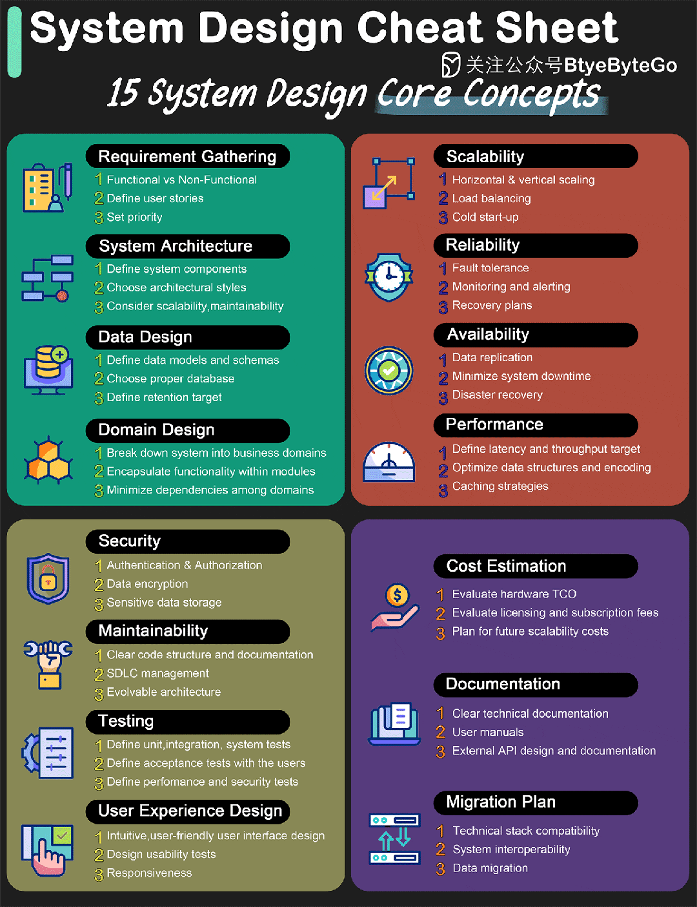

# 架构设计的 15 个关键概念

今天给大家带来一份架构设计小抄，包含了系统设计的 15 个核心概念。请保存以备将来参考！

## 01 需求收集

需求收集是从利益相关者、用户和其他相关方那里收集特定需求和期望的过程，以清晰地定义系统的目标。这一步骤对于确保最终产品满足其既定目的和用户需求至关重要。我们在搜集需求时，需要搜集功能性需求和非功能性需求（包括性能、高可用、扩展性等），并且排出优先级。有效的搜集方法包括访谈、调查、文档分析和研讨会。最终这些需求会以“用户故事”的形式记录下来，成为用户和开发团队的需求蓝图。

## 02 系统架构

系统架构是定义系统结构、行为和更多视图的概念模型。它作为系统的蓝图，概述了组件、它们之间的关系以及指导它们设计和演变的准则。良好的架构支持系统的需求，是实现可扩展性、可靠性和性能的基础。我们需要选择一个合适的架构风格，比如前后端通信使用 REST ，服务间通信使用 gRPC等。

## 03 数据设计

## 04 领域设计

领域设计，或领域驱动设计（DDD），涉及对系统的业务领域进行建模，以创建对问题空间的丰富、可理解的模型。它强调技术专家和领域专家之间的合作，确保系统准确反映并解决领域的复杂性。这一步对于降低系统整体复杂性尤为重要，好的设计使得领域之间的耦合降低，而领域内部高聚合。

## 05 可扩展性

可扩展性是系统在不影响性能的情况下处理增加负载的能力，可以通过增加单个节点的资源（Scale Up）或增加更多节点（Scale Out）来实现。设计可扩展性涉及无状态架构、分布式系统原则和数据分区策略等考虑因素。为了更好地管理增加的节点，我们通常需要使用负载均衡，并且处理好节点的冷启动。

## 06 可靠性

可靠性指的是系统正确且持续运行的能力。它包括容错、冗余和故障转移机制，以确保系统在硬件故障、软件缺陷或外部干扰的情况下仍然运行且数据完整性得到维护。

## 07 可用性

可用性衡量系统正确运行的情况。通过冗余、故障转移系统和强大的基础设施实现高可用性，这些措施最大限度地减少停机时间，并确保用户在需要时可以访问系统。它通常以正常运行时间的百分比来量化。

## 08 性能

系统设计中的性能指的是系统在给定负载下的响应性和吞吐量。它涉及优化代码、高效的数据访问模式、缓存策略以及选择合适的硬件和软件以满足速度和效率要求。

## 09 安全性

系统设计中的安全性确保数据的保密性、完整性和可用性。它包括采取措施防止未经授权的访问、数据泄露和其他网络威胁。这包括加密、认证、授权和定期的安全评估。

## 10 可维护性

可维护性是指系统易于修改以添加功能、修复缺陷或改善性能的程度。通过清晰、良好文档化的代码、遵循设计原则和模块化架构来实现高可维护性，这允许轻松进行更新和升级。

## 11 测试

测试涉及验证系统是否满足其要求并按预期工作。它包括单元测试、集成测试、系统测试、性能测试、安全测试等一系列测试，每种测试都针对系统的不同层级。有效的测试在部署前识别出错误和问题，确保质量和可靠性。

## 12 用户体验设计

用户体验设计（UX）专注于确保系统用户友好、直观并满足用户的需求和期望。它涉及用户研究、可用性测试和交互设计，以创建为用户提供无缝且满意体验的产品。

## 13 成本估算

成本估算涉及预测开发、部署和维护系统所需的财务资源。它考虑了硬件、软件、人员、培训和运营成本等因素。准确的成本估算有助于预算和资源分配。

## 14 文档

文档提供有关系统设计、功能和使用的书面详细信息和解释。它对于维护、故障排除和升级系统以及培训新用户和开发人员至关重要。文档应该清晰、全面且保持最新。

## 15 迁移计划

迁移计划概述了以最小化中断将系统从旧系统迁移到新系统的策略。它包括数据迁移、系统测试、用户培训和出现问题时的回滚程序的步骤。有效的迁移计划确保平稳过渡并减少数据丢失或停机的风险。

- - -

这些核心设计点每一个都在设计和实现健壮、高效和用户友好系统中扮演着至关重要的角色。理解和应用这些概念对于架构师在创建可扩展、可靠和可维护的系统中至关重要。

- - -