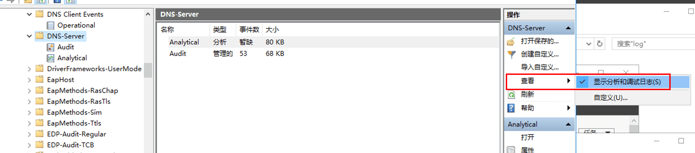
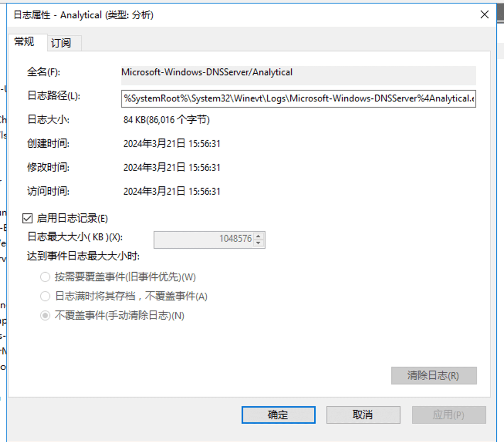
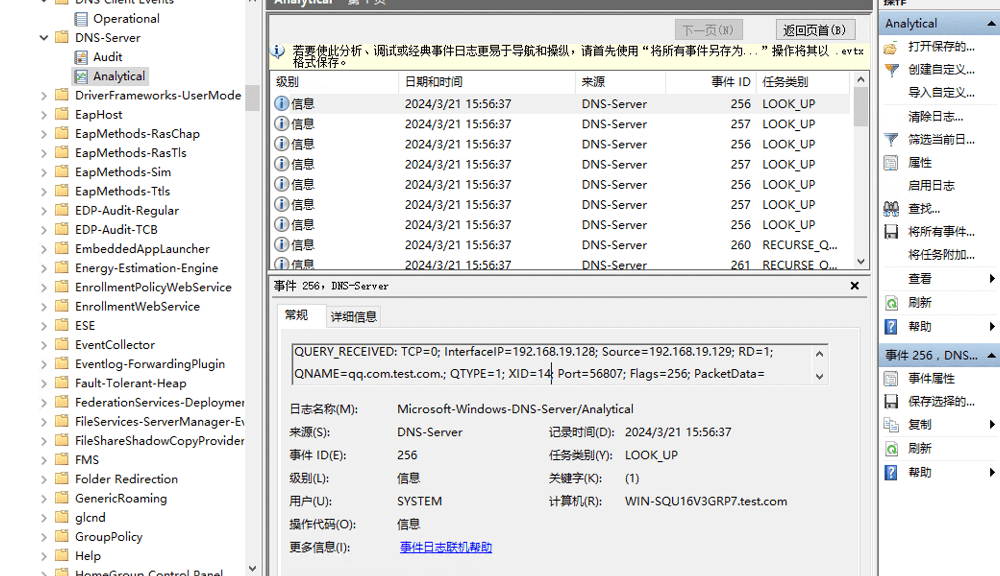

# 查看域控 DNS 服务器上面的 dns 解析日志

一个实际场景，soc 上告警有挖矿连接事件，特征是访问到了矿池 dns，但是源 ip 却是域控 dns 的 ip，那得想办法定位 pc 记录

info

gpt 给出的回答不是很靠谱，一开始按照方案做，日志文件都是空的

找了微软官方的文档里的解决方案才可以看到实际请求记录

- - -

# 正确使用

eventvwr.msc，打开事件查看器

在事件查看器中，导航到“应用程序和服务日志”\\“Microsoft”\\“Windows”\\“DNS-Server”。

右键单击“DNS-Server”，指向“视图”，然后单击“显示分析和调试日志”。

右键单击“分析”，然后单击“属性”。

在“达到最大事件日志大小时”下，选择“不覆盖事件（手动清除日志）”，选中“启用日志记录”复选框，并在系统询问是否要启用此日志时单击“确定”。

再次单击“确定”以启用 DNS 服务器分析事件日志。

这样 pc 查 dns 的记录就有了

默认情况下，分析日志将写入以下文件：% SystemRoot%\\System32\\Winevt\\Logs\\Microsoft-Windows-DNSServer%4Analytical.etl。

- - -

# Source & Reference

-   [https://learn.microsoft.com/en-us/previous-versions/windows/it-pro/windows-server-2012-r2-and-2012/dn800669(v=ws.11)](https://learn.microsoft.com/en-us/previous-versions/windows/it-pro/windows-server-2012-r2-and-2012/dn800669(v=ws.11))
