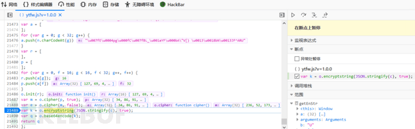
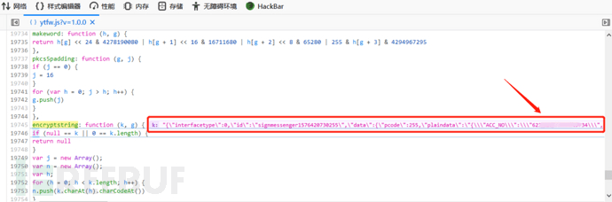

# 浅析前端加密后数据包的修改方法 - FreeBuf 网络安全行业门户

## 前言

**渗透测试过程中，使用 BurpSuite 对 Web 站点进行数据包拦截时，有时会遇到应用程序在前端对数据进行了加密后再传输，导致拦截或监听到的数据包为密文的形式。**

如下图所示。

此时，我们如何对数据包进行修改，从而进行正常的渗透测试流程呢？

要做到对前端加密数据的修改，有两种思路：

> （1）从网站的前端 JS 代码中查找加密函数，有些站点的加密方式较为简单，通过审计前端 JS 逻辑代码可以直接破解，从而对密文进行解密后做修改，最后再重新加密并发送；
> 
> （2）中断程序的执行，直接在前端 JS 代码对明文数据进行加密前，对明文数据进行更改。

显然，第二种思路更具有通用性，本文将介绍两种实现该思路的方法。

## 前端断点拦截

1、来看看本次测试的站点和功能，为某支付平台的交易记录查询功能：

2、首先，从前端 JS 代码找到该站点的加密函数所在的位置，如下图所示：

3、接着，在该语句设置断点，然后执行程序，如果加密函数寻找正确，那么程序将暂定在该行代码处：

4、程序跳转到执行下一行代码，发现查询请求包的明文数据 k，如下图所示：

5、切换到控制台，输入 k，控制台将打印 k 的值，如下图所示：

6、接着关键操作！直接在控制台输入“k=XXXXX”的命令替换掉 k 的值（此处替换掉查询的卡号，尝试进行越权查询测试），如下图所示：

7、最后，取消断点，放行程序，发现查询的卡号成功被篡改，同时越权查询失败，如下图所示：

### 小结

至此，借助 F12 开发者工具的断点调试功能，我们成功实现了对采用前端加密的站点的数据包篡改。

## JS 脚本替换

下面介绍第二种方法，借助 Fiddler 抓包工具，实现对前端加密站点的 JS 脚本替换，从而达到任意篡改数据包的目的。

1、首先，将包含加密函数的在线 JS 脚本文件通过点击鼠标右键，下载保存到本地，如下图所示：

2、在加密函数 encryptstring: function (k, g) 中添加 JS 代码，替换查询请求包中的卡号，如下图所示：

3、接下来打开 Fiddler，捕获加密函数所在的 JS 文件的请求，并将其拖入到右侧 AutoResponder 模块里，如下图所示：

4、进入 AutoResponder 模块，勾选以下选项并添加自动替换规则，将本地编辑的 JS 代码替换用于在线加密的 JS 代码，如下图所示：

5、刷新该站点，点击该功能模块，其前端 JS 代码将被我们本地编辑过的 JS 代码替换，来看下效果：

### 小结

至此，我们借助 Fiddler 的 AutoResponder 模块模块实现了对采用了前端加密的站点的请求包的篡改。

## 总结

本文讲述的两种方法，断点调试虽然比 JS 脚本代码替换简便，但是 JS 脚本代码替换的方法可以实现的功能更为强大，测试人员可根据实际的需求，选择合适的测试方法。
