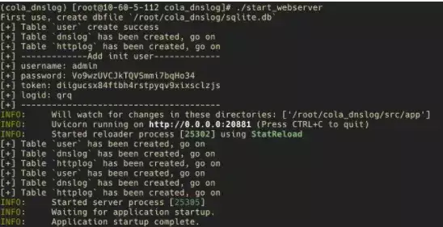

# 漏洞探测辅助平台 -- Cola_Dnslog

**0x01 工具介绍**

  

Cola Dnslog v1.3.1 更加强大的 dnslog 平台/无回显漏洞探测辅助平台，可帮助检测漏洞有：

```plain
log4j2 fastjson ruoyi Spring RCE Blind SQL Bland XXE
```


  

**0x02 安装与使用**

  

1、安装需要的库文件  

```plain
git clone https://github.com/Abelche/cola_dnslog.git
cd cola_dnslog
pip install -r requirements.txt
```

2、启动 webserver

修改根目录下的 config.yaml

主要需要修改 DNS\_DOMAIN NS1\_DOMAIN NS2\_DOMAIN SERVER\_IP

可选：修改 HTTP\_RESPONSE\_SERVER\_VERSION 伪造 http 返回中 Server 字段

```plain
global:
  DB_FILENAME: sqlite.db


logserver:
  DNS_DOMAIN: example.com
  NS1_DOMAIN: ns1.example.com
  NS2_DOMAIN: ns2.example.com
  SERVER_IP: 1.1.1.1
  DNS_PORT: 53
  HTTP_HOST: 0.0.0.0
  HTTP_PORT: 80
  HTTP_RESPONSE_SERVER_VERSION: nginx
  LDAP_HOST: 0.0.0.0
  LDAP_PORT: 1389
  RMI_HOST: 0.0.0.0
  RMI_PORT: 1099


webserver:
  HOST: 0.0.0.0
  PORT: 28001
  PASSWORD_SALT: 随便一长串字符串，如：cuau89j2iifdas8
```

  

```plain
chmod +x start_webserver
./start_webserver
```



3、启动 logserver

```plain
chmod +x start_logserver
./start_logserver
```


4、启动前端

现在来到前端（不一定要和 webserver 放在一起，你甚至可以通过 electron 打包成本地客户端），先修改配置文件.env.production

```plain
cd src/app/front
vim .env.production
```

```plain
# just a flag
ENV = 'production'
# base api
VUE_APP_BASE_API = 'http://1.1.1.1:28001'
TARGET_API = 'http://1.1.1.1:28001'
```

然后 npm 安装依赖、打包、启动 http 服务（这里可以随意选择 http 服务器，为了方便我直接用 python 启动）

```plain
cd src/front
npm install
npm run build:prod

cd dist
python3 -m http.server 18001
```

至此，三端（webserver 端、logserver 端、webui 前端）已经全部开启！

这时，访问 http://1.1.1.1:18001 应该可以看到登录页面！

  

0x03 项目链接下载

  

  

https://github.com/Abelche/cola\_dnslog