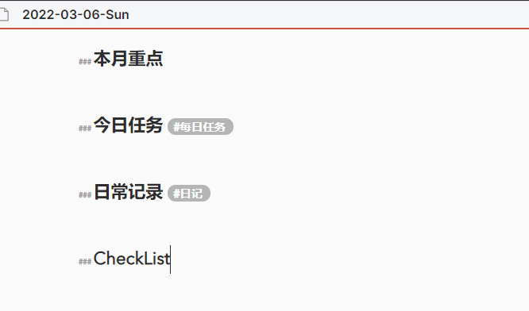
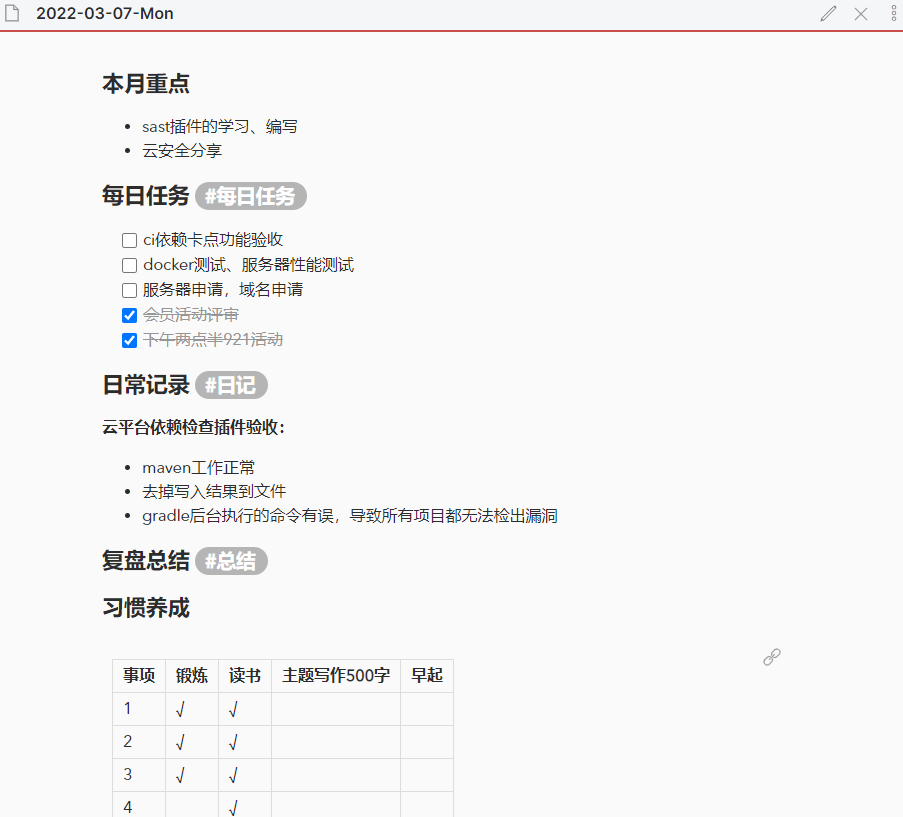
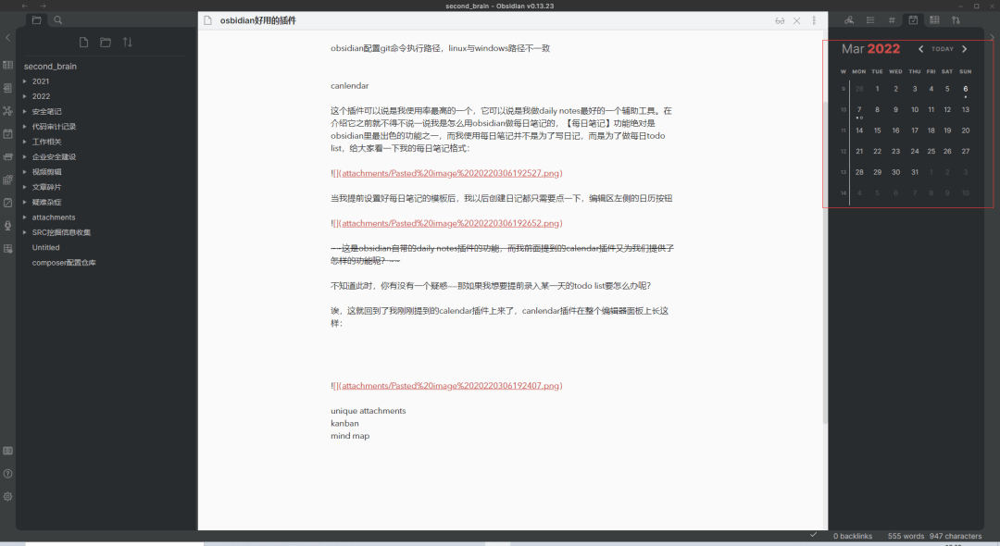
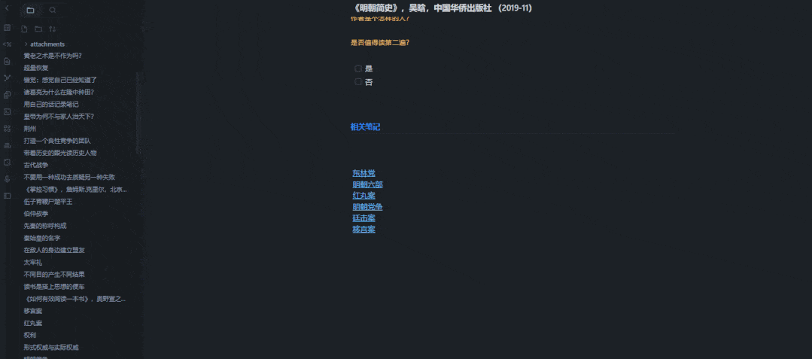

# 用 Obsidian 打造自己的 Workflow

本文继[如何把笔记变成知识？](http://mp.weixin.qq.com/s?__biz=MzU5MDI0ODI5MQ==&mid=2247486085&idx=1&sn=3e7489276e3223ae4133816db14af4b7&chksm=fdc06a89cab7e39f1f074cd6dcd8b22c8c5c162b274cd1cdb5f233b2e364eff0c6578ce02563&scene=21#wechat_redirect)之后

在开始今天的主题之前，我不得不先向大家简单地介绍一下 Obsidian。

## 为何是 Obsidian

### 本地化存储

Obsidian 是一个以**本地化存储为主要方式**的笔记软件，换句话说你的笔记全部都是本地文件，因此你不用担心自己被笔记服务提供商数据绑架（想想你传到百度网盘那些几十个 G 的学习资料吧），这也是我选择 Obsidian 而不是 Notion、印象笔记等笔记工具的原因之一

一个功能的好坏取决于它的受众以及使用场景

有人觉得数据放在云端没有安全感，就有人觉得数据存在本地很危险，不过还好，Ob 提供了数据存储服务，当然，你可能也猜到了，这是一个收费功能，而且要价不菲，一个月 10 刀，一年 96 刀，这一年 96 刀，真的是刀刀都砍在了我的要害上

但是没关系，群众中有不少和我一样的白嫖党，他们提供了各式各样的多设备数据同步方案，而我正在使用的方案则是通过 obsidian git 这个插件来实现数据同步。

想必通过这个插件名，大家也猜到了它是通过 git 来同步数据的，这个插件可以定时提交我们的笔记到 github，当我们从公司回到家中，打开家里的电脑，后台会自动去 GitHub 拉取最新的文件，这样也算是官方同步仓库的一个平替方案了。

当然，这种方案也许没有官方提供的同步服务那么丝滑，但是也可以解决问题了，还要啥自行车！

### Markdown 友好

你肯定不希望自己的笔记只能在某个特定的软件上查看，市面上有一部分笔记软件导出后的笔记格式其他软件是无法解析的，这简直就是敲诈！而 Ob 上所有的笔记都是纯 Markdown 文本的，如果有一天我不想用 Ob 了，我可以很轻松的实现数据迁移

我之前在【如何把笔记变成知识】一文里提到过，Ob 是一个出色的 Markdown 编辑器

**实时预览：**


ps: Ob 中的实时预览需要在设置里开启

**分屏展示：**


问：我上面分了几个阅读面板？

### 跨平台

Windows、Mac、Linux、Android、IOS 全平台都可以使用 Ob，但是跨平台的笔记同步如果不使用官方提供的服务，可能会麻烦一点。

我只在 Windows 和 Mac 上使用，所以直接用 git 同步就很方便了，但是如果你想要在 Android 上也同步数据，我不确定 obsidian git 是否可以帮到你，当然，Obsidian 社区里一定有免费的解决方案。

ps：如果你没有一颗折腾的心，而又想要实现多设备同步，要么购买官方服务，要么别选择 Ob

### 双向链接 + 知识图谱

最开始我了解到 Ob 是在 twitter 上，第一眼就被它那漂亮的知识图谱给吸引了，于是有了第一次尝试，也是因为 Ob 我第一次接触到了双向链接的概念，关于双向链接，我在【如何把笔记变成知识】一文中有过详细的讲解


### 美观且主题丰富，可定制化

很多 markdown 编辑器都提供大量主题供用户选择，Ob 也不例外，有花里胡哨的，也有简约小清新的，这些主题都来自 Ob 社区，你一定可以找到心仪的一款，如果找不到，你也可以自定义一款主题（需要有 css 基础）

### 插件丰富且社区活跃

Ob 社区成员除了贡献了大量好看的主题之外，还贡献了很多提高生产力的插件，后面我也会介绍一两款我自己用起来顺手的插件，当然，如果现有插件不能解决你的痛点，你也可以自己开发插件解决（大多数时候并不需要）。

下面我将结合插件来介绍我是如何使用 Ob 并提高生产力的

## 用 Ob 做任务管理

如果要问我 Ob 中哪一个插件使用的最多，那一定非 Calendar 莫属，Ob 自带了一个日历插件，然后我还下载了社区中的 Calendar 插件。

它们是我用来做 daily notes 最有力的工具，我这里所谓的【每日笔记】其实最大的作用是任务管理，那么，在 Ob 中如何做 daily notes 呢？

1.  创建日记模板，并在日历插件中配置该模板路径
    
2.  创建好模板后，以后的每一天你都只需要点击左侧工具栏中的日历图标就能够创建一份【今日笔记】，然后你就可以开始做今日的计划了并记录想法了
    

我现在每个工作日到公司的第一件事儿就是打开 Ob-> 创建每日笔记 -> 在每日任务栏记下今日 todo

下面是一份我之前的 daily notes (内容已做脱敏处理)：



**本月重点**模块下是为了指明本月学习、工作的大方向，比如希望自己攻破哪个知识点、学会哪个技能等等，之所以有这个模块是为了时刻提醒自己最重要的任务，**很多时候我们不能顺利的完成计划，不是因为自己懒惰，而仅仅是因为我们单纯的忘记了这个计划**，所以，时刻提醒自己目标是什么是很重要的

**每日任务**模块下主要就是列出今日的 todo 项，不仅仅是工作相关的

**每日记录**则比较随性，可能是具体的工作内容，也有可能是突然想到的针对某个问题的解决方案，如果你正在一个大项目中，今天你突然想起了关于某个 bug 的解决方案，你想要把这个方案统一记录到某个类似【xxxx 项目问题记录】文档中，又想把这个问题关联到今日的 daily notes 中，得益于 Ob 有着出色的双向链接功能，你只需要在项目文档中写下方案，然后在 daily notes 中进行**块引用**，是的，Ob 不仅支持单文件的引用，也支持文本块的引用。

**复盘总结**模块则是下班回家做复盘总结的内容存放区，而这个模块对于我来说其实已经名存实亡了，哈哈哈，都是我最开始建立模板的时候理想太过丰满了，后来发现，我并不会每天都总结，但是这个模块也一直没有删去，万一哪天想总结了呢？

**习惯养成**模块则外联了一张表（这张表实际上就是通过块引入嵌入到每日笔记中的），这张表是每日计划的 checklist，它主要是用来做长期习惯养成的，里面的事项都是一些需要每天或者周期性完成的事情。我每个月都会创建这么一张表，一年就是 12 张，而这 12 张表都被我统一放在一个文件里，例如 2021 年的表，我就存放在名为 2021-todo-list 文件里：


我只需要在 daily notes 的模板中引入对应月份的 checklist 就行，这样我每天新建 daily notes 时，这个 checklist 也就嵌入进来了，有一个注意点就是我需要每个月更换一个 daily notes 的模板，以确保引入了正确的 checklist。

ps: 上述表格使用 markdown 语法创建

不知道此时，你有没有一个疑惑 —— 如果我想要提前录入某一天的 todo list 要怎么办呢？

这也是一个硬需求，而支持这个需求就需要我刚刚提到的社区版的 Calendar 插件了，Calendar 插件在整个编辑器面板上长这样 (右侧红框中)：



同样的，在配置好笔记模板后，我们只需要在日历组件中点击对应的日期就可以提前创建某天的 daily notes，如下所示


Ob 的这两个插件让创建 daily notes 变得更加丝滑，一键创建降低了我做每日计划的成本，让我更喜欢做任务管理了

但是，我在使用的过程中又遇到了一个问题 —— 我特别想要让今天没有完成的 todo 自动流转到下一天，之前还想过自己写插件来实现这一功能，但是苦于自己不会 typescript 又没有精力学习，所以一直搁置

直到前不久我浏览 Ob 插件市场的时候，我发现了一个插件 ——rollover daily todos，这个插件完美的解决了上述问题，这一波啊，等等党迎来了他的胜利！

管中窥豹，大家也可以通过我的经历看出来，Ob 的社区活跃度确实不错。

## 用 Ob 做读书笔记

之前我做读书笔记都是很随性地写，笔记库里也基本都是一些自己的想法，这些想法没有上下文，下一次写文章想要引用的时候就会发现缺少素材支撑。

于是，我尝试着用 Ob 来优化自己写读书笔记的流程，目前整个流程还在优化中

在写读书笔记的过程中，用到的主要功能还是模板，不过这次我借助了一个第三方插件 templater 来强化 obsidian 的模板功能

在比较正式的阅读场景下，我会在 Ob 为将要阅读的书籍创建一个文件，该文件的命名为：

`《书名》，作者，出版社`

然后阅读会大致分为两个阶段：10-30min 的粗读、精读

对于这两个阶段的阅读，我会尝试去回答不同的问题，而这些问题是可以模板化的，所以我就为这两个阶段创建了模板：


例如我在阅读《掌控习惯》这本书，我在阅读时就会打开 Ob 并切到这本书对应文件（之前创建的），使用快捷键向该文件插入上述两个模板，粗读阶段插入粗读模板，精读时再插入精读模板：


通过回答这些问题，我就可以确保自己理解了这本书的内容，下次翻阅时，也可以知道这本书的大体情况，而模板则是将执行上述流程的复杂度大大地降低了

这两个模板里提到的问题都只是对这本书的整体评价，那么具体做笔记时我采取了怎样的流程呢？

同样的，我还是创建了一个模板，模板存放在【文献笔记】文件下，内容如下：


我简单解释下这个模板

【创建日期】和【出处】使用了 templater 插件的语法，你可以把它们理解为两个变量，它们会根据上下文自动填充上对应的值

原文模块下会记录摘抄，批注模块下则记录自己的想法

然后，我还利用 templater 插件的语法写了个小脚本，这个脚本存放在【新建读书笔记】文件下

```bash
<%*
let input = await tp.system.prompt("笔记标题：")
let templateName = tp.file.find_tfile("文献笔记")
let titleName = input 
-%>

[[<% (await tp.file.create_new(templateName, titleName , false)).basename %>]]
```

上面脚本的意思是：

-   弹出一个输入框，等待用户输入将要新建的笔记的标题
    
-   找到文件名为【文献笔记】的模板，即上述提到的模板
    
-   然后以上述模板创建一个用户指定名称的文件
    
-   并且向当前文件中插入如下内容：`[[用户输入的文件名]]`。其中 `[[文件名]]` 在 Ob 中表示链接到对应的文件
    



可以看到，执行完脚本后，它自动帮我们创建了一条笔记，并且将其关联到对应书籍，如果你观察够仔细，你还可以看到新创建的那条笔记中的【创建日期】以及【出处】都填充上了正确的内容

这样每一条读书笔记就像一个卡片一样，有着自己信息的同时也和它对应的书目关联了起来。


## 彩蛋

想要拥有一个本地的个人博客？Ob 好像也行


- - -

本文中的图片采用了不同的 Obsidian 主题
