# 用SVC做特定人物AI配音 - 你奶奶都会的AI声音教程

前几天我又做了一个《流浪地球》的二创，其中台词配音用了李雪健老师的声音，很多人来问我，这个声音是怎么实现出来的。

数字生命卡兹克

，赞 209

其实几个月之前，我写过AI声音的几篇教程，不过这眨眼间，小半年过去了，现在的AI声音质量已经有了质的飞跃，体验也已经简单很多了，也属于你奶奶都会的级别了。

先简单的说一下这个技术，SVC，你就把它简单的理解成一个特定人物声音的变成器，你自己先录一段音频，然后把这个音频扔给AI，AI就自动产出另一个人声音的音频了。  

比如我这个视频，我是自己先念了一段台词：  

**我的声音** ,数字生命卡兹克 ,1分钟

然后用AI转成了李雪健老师的声音：

**AI后的李雪健老师声音** ,数字生命卡兹克 ,1分钟

你们可以听一下，大概就是这样的效果。

训练这样的声音模型整体需要3步：

1.  准备声音数据集。
    
2.  在云上训练模型。
    
3.  在云上使用AI声音。
    
      
    

我们一步一步来，**不用发怵，我都能做出来，你也一定能**。  

  

**一. 准备数据集**

这个其实没有一个固定的方法，只要你能找到5~10分钟左右的干净的人声就行，我是直接从李雪健老师过往的影视作品中选了他的片段。  

然后扔到剪映里，把他的声音单独剪出来，最后导出的时候只导出WAV格式的音频就行。


理论上30分钟到2小时的数据集这个量肯定是最好的，但是你要是实在搞不到那么多，5分钟10分钟的迷你数据集拿去训练也不是不行，但是一定要干声，要干净，别有乱七八糟的混响声音之类的。  

这块我建议还是用神器UVR5去一下你的伴奏和混响。**要用的工具我都打好包了，对着后台私信"S"就行。**

UVR5分两步，第一步先去伴奏，把你的声音素材input进去，参数如下，直接Start，注意UVR5不要跟剪映同时开，会爆显存。


成功了以后，我们去到我们设置的输出目录下，就能看到两个文件，有一个后缀带有Vocals的，再input到UVR5中，按如下参数设置，去掉混响。

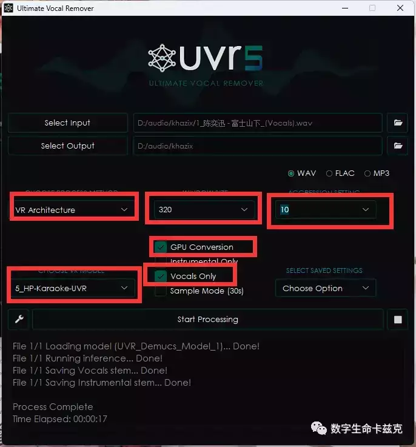

最后你还会得到一个XX\_Vocals\_Vocals的文件，就是一个非常干净的人声了。  

再使用整合包里的工具Audio Slicer（音频切分）将其剪裁成10秒左右的分段文件，因为你1个小时的文件直接拿去训练是必爆的，所以我们需要将他拆成10秒左右的1小段1小段。

打开整合包中的工具Slicer-gui。然后把Minimun Length那一项改成8000，把我们需要处理的音频直接拖到左边窗口，在右下角选择输出路径。**同时此处注意，任何路径和文件命名，都一定不要带有中文和特殊的比如空格之类的字符！！！**

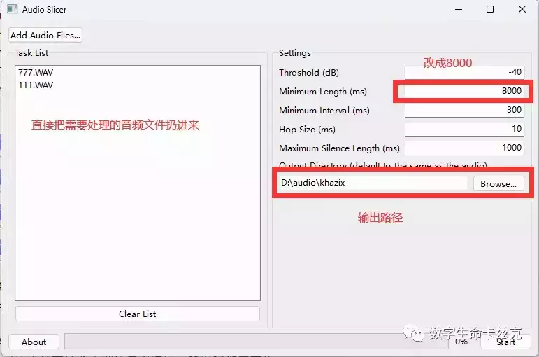

这样数据集就处理完毕了。接下来就是轻松愉快的训练。

  

**二. 在云上训练模型**

打开我们的老朋友AutoDL，https://www.autodl.com/

注册好账号以后，自己充值，10~30块就差不多了。然后我们点击控制台 - 容器实例，来到这个页面，再点击租用新实例（实例你可理解为就是一台电脑的意思）

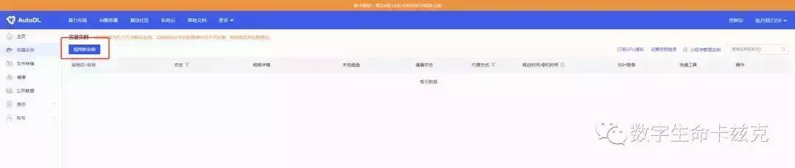

直接选北京C区，V100-32G，在下面的社区镜像中搜so-vits，选这个**svc-4.1，V10版本的。**  

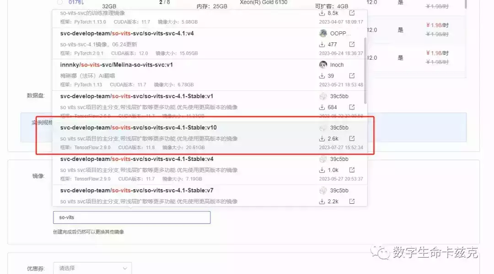

然后创建，第一次稍微等一会，毕竟这个镜像20个G，有点大，下载还是要一段时间的。  

等好了后，直接点这个JupyterLab。

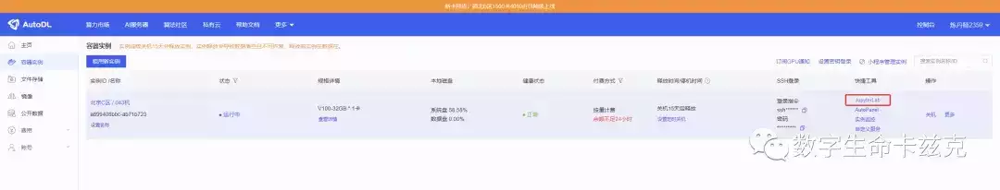

进去以后，点一下左上角这个。  

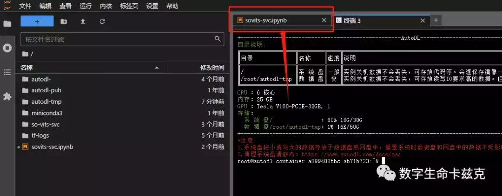

再然后里面的东西其实都很详细了，你跟着教程点点点，真的就是有手就行。前面那一大堆玩意不用看，直接往下拉。找到这个#移动项目文件夹，点顶上的三角播放。


等右上角这个实心圆变成空心圆，就说明这一步跑好了。

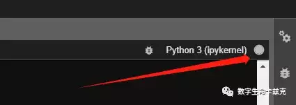

然后再运行进入项目文件夹那个代码块。  

这块点完要小停一下，我们需要把我们的数据集传上去。  

在左边的文件管理器里，进入autodl-tmp/so-vits-svc/dataset\_raw，先新建一个文件夹，比如我就新建了一个叫lixuejian的。

再把你刚才切出来的数据集文件直接全部都拖进去就行。  

这样数据集就传好了，再运行这个代码块。


1s就运行完了，运行完之后，在下面**选vec768l12编码器**，再运行代码块。下面那几个就不用管了，这个编码器是6选1。

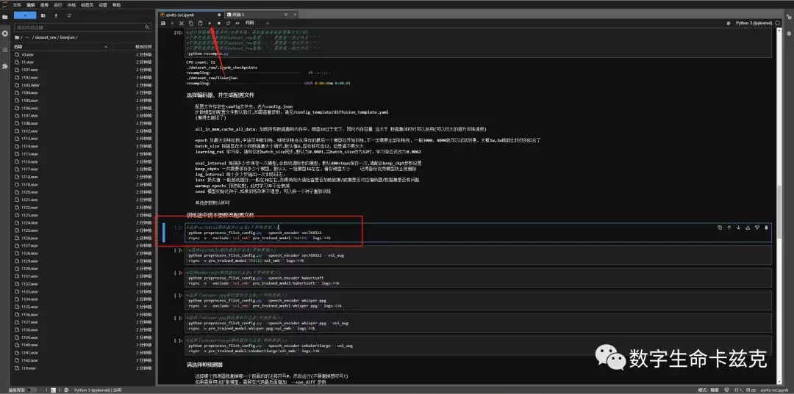

运行完后下滑，找到f0预测器。删掉第二条rmvpe预测器前面的那个#号，**！感叹号不要删，只删这一个#符号就行**，这其实也是个6选1。然后一样点左上角三角按钮运行代码块。

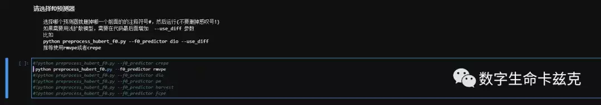

完事了以后，下面的其他的代码块先不用管，去到左边文件管理器，按这个路径autodl-tmp/so-vits-svc/configs，找到config.json文件。

右键，打开方式-Editor。  

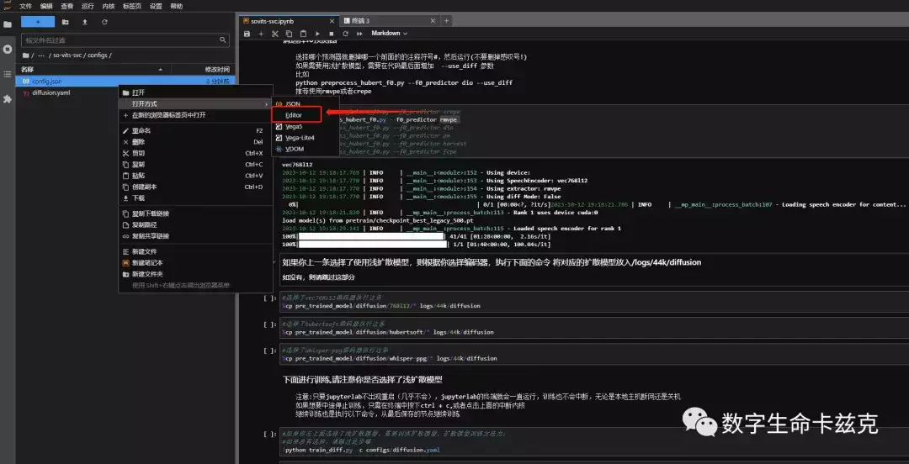

然后改几个参数。  

**"batch\_size": 6改成12；**

**"learning\_rate": 0.0001改成0.0002；**

 "keep\_ckpts": 3改成10；（从最多保存3个模型变成最多保存10个模型）

改完以后，Ctrl+S保存。关掉。

保持在当前在svc这个目录下，点右上角的加号，新建1个终端。

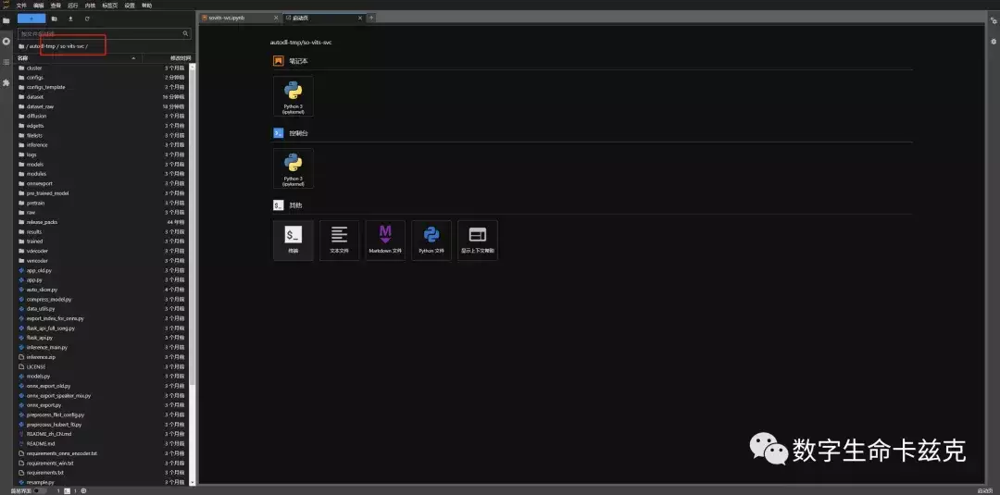

在终端里输入我这块的代码

```plain
python train.py -c configs/config.json -m 44k
```

训练就正式开始了。你一步一步按我的来，基本不会有任何报错。

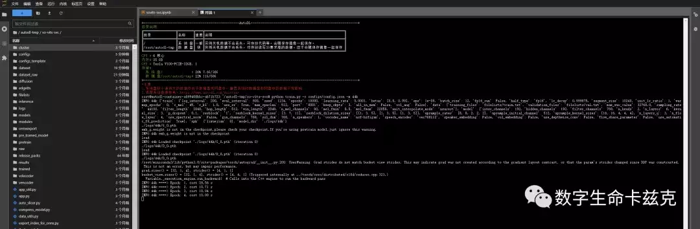

  

**三. 在云上使用AI声音。**

模型训练开始后会有步数提示，每训练800步会保存一个模型，基本3000步左右的那个模型你就可以去听听了。

可以稍微注意一下一个叫loss（损失值）的参数，越低越好，一般是在28左右，如果给你保存的那个是在22啥的，那就是还不错的模型了。

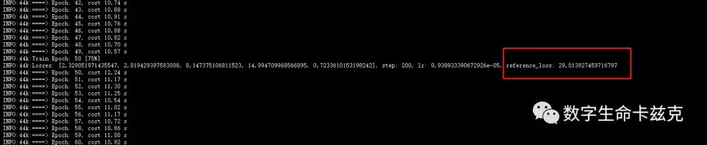

模型保存在autodl-tmp/so-vits-svc/logs/44k这个目录下，这些D和G开头的就是。后面的编号一般都是800倍数，比如800、1600、2400等等。我从别的地方直接拽了一个已经训练好的模型当示意。  

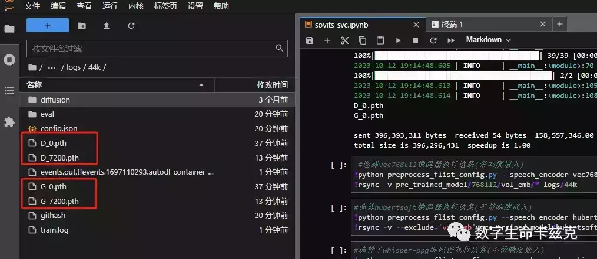

你要是觉得模型质量不错，可以下载到本地，一样，都通用。

然后就是推理了。  

还是保持在当前在svc这个目录下，再新建一个终端，输入我这个代码  

```plain
python app.py
```

 你就能看到多出来两个链接  

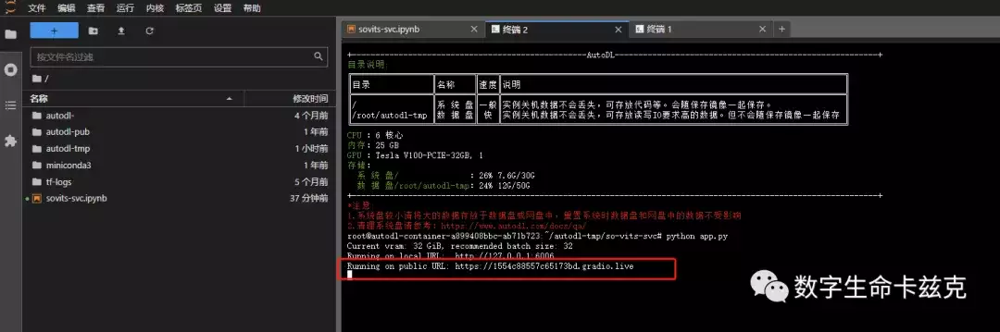

把第二个复制粘贴到你的网页。  

就能看到WebUI了。  

然后把这两个下拉选项选成你的模型就行。

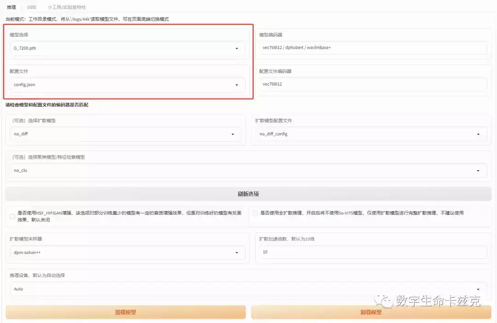

每几秒钟，你就能看到这么一条提示，你的模型被加载了。  

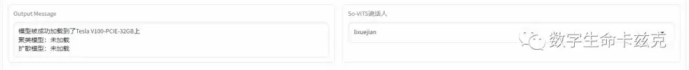

再然后，传上你自己的音频，勾选上自动F0预测，F0预测器选择之前的rmvpe，愉快的点击音频转换就可以啦~

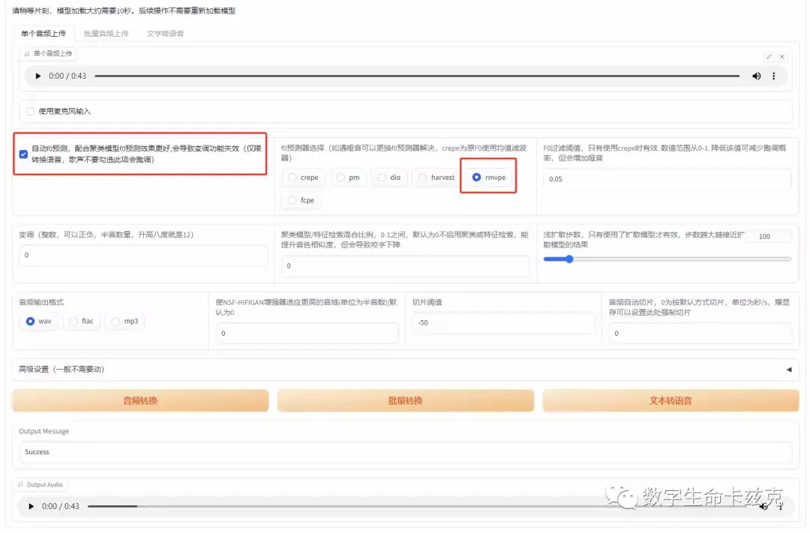

得益于V100的算力和大显存，2分钟的音频都不会爆，直接推理就行。大概十几秒后，就OK啦！  

接下来，你就自己去见证奇迹吧哈哈。  

  

**写在最后**

从2月到5月，从5月到10月，不知不觉，我已经写了8个月了。

时间真如老狗，跑的真特么让人追不上。  

AI的进化速度和新工具的出现速度，也让我这种普通人难以企及，别说学懂研究透，我耗尽了我所有的时间，能勉强跟上它的变迁，我已经是觉得非常艰辛了。

前一段时间看了稚晖君的视频，我真的挺感慨。人跟人的学习能力实在是差距太大太大了。

那种神一样的学习能力和知识海，我可能这一生都无法企及。

而在AIGC领域，我更不是什么大牛，在真正的大佬面前，我就是一个很小的小卡乐咪。  

但是看完他的视频，我也突然明白了自己的定位。

我就是AI世界的一个小小的门童，用各种稀奇古怪的作品和奶奶都会的教程，让没见过这个世界的人，看一眼这个世界的玄妙。

如果能引领他们走进AI的殿堂，那我这个门童的使命，也就真正达成了。

人嘛，总是要给自己找点价值，不是嘛。  

现在，我找到了。