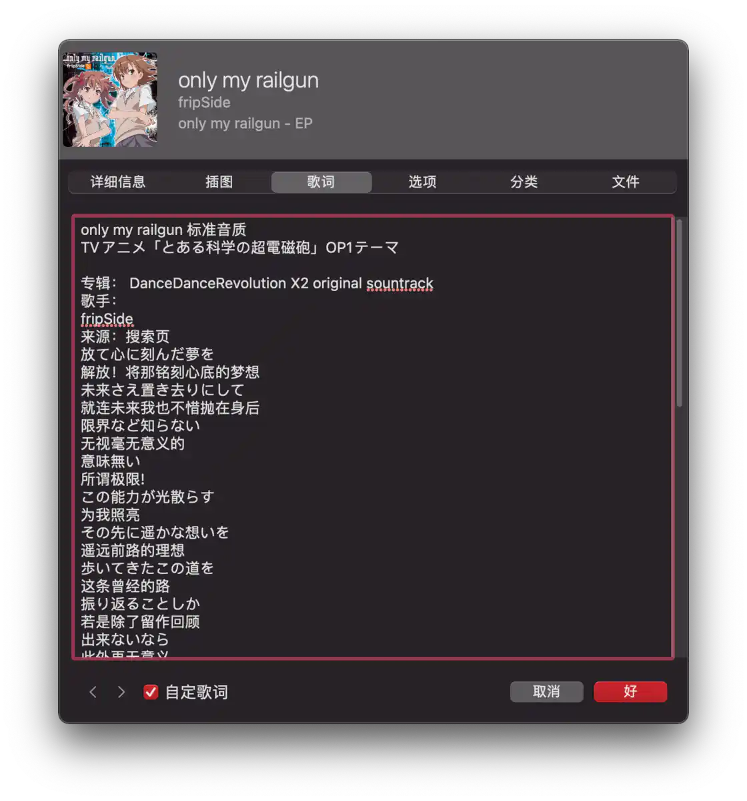

# 「用好」Apple Music，这些是你应了解的 - 少数派

## Apple Music 给我们带来了什么？

Apple Music 上线多年，其发展道路无疑是曲折前进的。它在竞争最激烈的时候入局，试图与各大流媒体巨头分羹。经过几年的沉淀，它在洪流中站稳脚跟，赢得了部分用户的青睐。

在 2018 年，我也许对 Apple Music 抱着爱恨参半的态度。参差不齐的曲库、缺失滚动歌词、「不顺滑」的 App 使用体验…… 还有很多我曾经想要吐槽的。但在 2020 年，我一定会向你推荐它。经过几年的用心打磨，它的体验无论在 Apple 设备上，或是在 Android 设备上，都达到了「优秀」的程度。逐渐丰富的曲库、定价低廉的国区、跟手的使用体验…… 这些都是我推荐它的理由。

接下来，我会按照大家对 Apple Music 功能或特性的熟悉程度，逐一为你展示如何真正「用好」Apple Music。

## 选择你的 Apple Music 地区

一款好的流媒体 App，纵使有让每一个人都满意的设计风格和使用体验，但**缺少你想听的歌曲**，你是否还想使用呢？所以，我们要**以音乐类别为导向**，选择最适合自己的 Apple Music 区域。

高兴的是，在少数派已经有作者帮忙对比好了这些区域的优劣，如果你有空，不妨阅读以下这篇文章。如果没空，不妨查看下方的表格。

**关联阅读：**

-   [订阅 Apple Music 该选哪个区？—— 中美坡港日五大地区全对比](https://sspai.com/post/59546)

|     |     |     |     |
| --- | --- | --- | --- |
| 区域  | 曲库类型 | 价格  | 界面语言 |
| 中国大陆 | 部分华语流行、欧美流行 | 低廉  | 简体中文 |
| 美国  | 欧美流行 | 较高  | 英语  |
| 日本  | J-Pop、欧美流行 | 较高  | 英语 / 日语 |
| 中国香港 | 华语流行、欧美流行 | 较高  | 繁体中文 |
| 新加坡 | 华语流行、欧美流行 | 较高  | 简体中文 |

## 和 Siri 打好交道

Siri 和 Apple Music 相结合为我们带来了极为便利的操作体验。

### 查找和播放音乐

找歌？找专辑？找歌单？甚至搜歌词？这些 Siri 都能做！

-   「播放 LiSA 的《紅蓮華》。」
-   「来点周杰伦的歌。」
-   「我要跑步了，帮我找健身音乐。」
-   「播放歌词中包含「Every Color Bleeds Into The Same」的歌曲。」

实际使用下来，搜索歌词的功能因 Siri 的识别不是特别准确而偶尔失败。

虽然识别并不准确，但 Siri 依然找到了我想要的歌曲

### 不知道听什么？

Siri 可以帮助您发现任何类型的新音乐和流行音乐。还可以播放任何年代的热门歌曲。请说「嘿 Siri」，然后可以这样说：

-   「播放今天的热门歌曲。」
-   「播放全球最受欢迎的 10 首歌曲。」
-   「播放 90 年代的一些另类音乐。」
-   「播放一些流行的嘻哈歌曲。」

### 如果你有 HomePods……

-   「在所有位置播放 Maroon 5 的音乐。」
-   「在我的房间播放当前在播放的这首歌。」
-   「换到我的房间播放。」
-   「现在客厅在放什么歌？」

## 用好 Spotlight 搜索

Spotlight 搜索是老生常谈的内容了。在这里，你可以省去打开 Apple Music 并且查找你的歌曲、歌单的操作，而是直达你所好。以下不再赘述，而是提供两个小例子。

搜索特定歌曲

搜索歌单内容

## 探索 iTunes 音乐资料库

iTunes 音乐资料库的前身是 iTunes Match，iTunes Match 是 Apple 于 2011 年推出的一项服务，类似于匹配你上传的歌曲。现在，你在 Apple Music 中依然可以上传自己的歌曲。

使用 iTunes 音乐资料库来收听自行上传的歌曲

你可以在简介中找到该文件的信息

但有一点需要注意的是， iTunes 音乐资料库与 Apple Music 使用的 CDN 服务器似乎略有区别，以至于国内的网络环境几乎无法流畅收听 iTunes 音乐资料库中的自行上传内容。所以，建议有条件的用户先在设备上下载好 iTunes 音乐资料库中的歌曲，以获得流畅的收听体验。

**关联阅读：**

-   [订阅 iTunes Match](https://support.apple.com/zh-cn/HT204146)
-   [通过订阅 Apple Music 打开「同步资料库」](https://support.apple.com/zh-cn/HT204926)

## 利用电台搜寻你所爱

Apple Music 作为流媒体 App，自然少不了音乐推荐功能。使用该功能的方式也十分简单。

#### Windows/macOS

右键 - 创建电台 macOS

Windows

#### iOS/Android

在 iOS 上创建电台

## 玩转智能播放列表

不同于国内流媒体音乐平台的传统播放列表 / 歌单小助手，Apple Music 提供了丰富的播放列表自定义选项。

网易云音乐的「歌单小助手」

## 发现官方推荐

### 推荐歌单

推荐歌单功能在各区均可使用。歌单每周更新，在这里你可以发现许多好歌。但每个歌单只有 25 首歌曲。

日区

国区

### 推荐电台

推荐电台功能近似「创建电台」功能，但你可以无止境地听下去。

日区

国区

### 艺人歌单

艺人歌单是 Apple Music 的一个独特功能。当你搜索艺人或相关内容时，艺人歌单在被选列表中供你选择。它的内容经过编辑筛选，基本可以满足你的需要。

各区通用

### 音乐回忆歌单

音乐回忆歌单是每年年底时 Apple Music 自动生成的音乐播放列表，囊括了这一年里你最爱的歌曲。

音乐回忆歌单

## 同步「自定」歌词

如果你是 Apple Music 或 iTunes Match 的订阅用户，你可以选择自己添加歌词。例如网易云的~沙雕~翻译。同样在某一首歌处点击「右键」（或按住 Control 键点按一首歌曲），然后选取「显示简介」。框选「自定歌词」，输入你的歌词，点击「好」，歌词就被你保存下来了。此时你打开其他设备的 Apple Music 客户端，也能看到你在你的 Mac 上输入的歌词。

虽然在 iOS 13 时，部分歌曲的歌词添加了时间轴，⽀持滚动，但歌词没有翻译。所以我们可以⾃定义双语歌词，但⾃定义的歌词没有时间轴，也不能⾃⼰添加时间轴，在 iPhone 上是不能滚动的。

歌词编辑页

iPhone 上即可阅读同步的歌词

## 自动播放「∞」功能、随机播放以及**妙选**

上文中提到了「创建电台」功能，那么你也许想问：创建电台、自动播放「∞」、妙选以及随机播放这四者之间与什么区别，又有什么联系呢？

|     |     |     |     |     |
| --- | --- | --- | --- | --- |
| **类别** | **自动播放** | **随机播放** | **创建电台** | **妙选** |
| **支持平台** | **移动端** | **全平台** | **全平台** | **桌面端** |
| **歌曲关联性 \*** | **有关** | **无关** | **有关** | **二者** |
| **呈现形式** | **待播清单** | **待播清单** | **待播清单** | **二者** |
| **音乐来源** | **资料库** | **资料库** | **Apple Music** | **资料库** |

### **自动播放**

> 您无需选取要插播的音乐，「自动播放」功能可为您代劳。只需播放一首歌曲，「自动播放」功能就能找到类似歌曲并随后播放。

**使用「自动播放」的待播清单**

### **随机播放**

随机播放是音乐播放软件中必不可少的功能，它的目的是把播放列表随机化，从而实现随机播放。

### **妙选**

> 可让您（在您的资料库以及 iTunes Store 中）查找与您的资料库中已存在的音乐相关的新音乐。

妙选在这几种功能中略显尴尬，因为它原有的历史使命已经基本上被自动播放与创建电台取代了。选择歌曲，然后选取「文件」>「新建」>「妙选播放列表」。即可创建一个妙选播放列表。但大概率你看到的是下图的状况：

**不可使用提示**

但别慌，还有「妙选随机播放」。

在歌曲播放时按住 Control 键，然后单击播放控制中的「妙选」按钮，即可开始播放。

**正数第二个就是「妙选」按钮**

同「创建电台」不同，妙选会在待播清单中生成一些它认为你喜欢的音乐。

**使用「妙选」功能生成的待播清单**

**关联阅读：**

-   [在 iPhone、iPad、iPod touch 或 Android 设备上将音乐添加到队列来插播](https://support.apple.com/zh-cn/HT208383)
-   [在 Mac 上的「音乐」中使用「妙选随机播放」或「妙选播放列表」](https://support.apple.com/zh-cn/guide/music/musbe3694c1b/1.1/mac/11.0)

## **别走，还有这些**

### **Mac 全屏播放**

这个功能也许你闻所未闻，但是它的确存在于 mac 版的 Apple Music 中。

**动图演示**

首先，将 Apple Music 缩小到小窗。点击播放状态栏中的专辑图标，即可进入小窗。

然后，点击小窗的「缩放」按钮，即可进入全屏播放界面。

**全屏播放界面**

第二种方式是点选菜单中的「窗口」>「全屏播放程序」即可进入。

## **结语**

Apple Music 没有一部分流媒体音乐 App 冗杂的「直播」、「商城」、「开屏广告」、「K 歌」、「视频」、「游戏中心」等功能，它所带给你的，是音乐，纯粹的音乐，适合你的音乐。该有的它一个不落，不该有的它毫无痕迹。在这个流量为王的时代，已经几乎找不到一款纯粹听歌的音乐应用了。我们高兴的看到，Apple Music 与 5 年前年轻的它相比，越来越成熟、越来越好用，但最难能可贵的是，它一直保持着「纯粹」。

