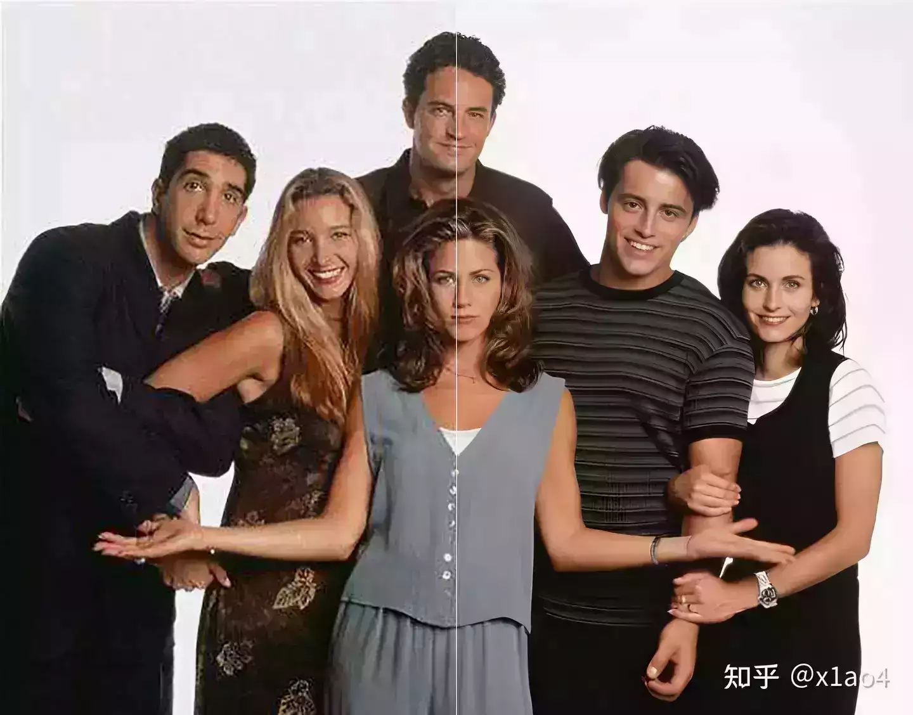
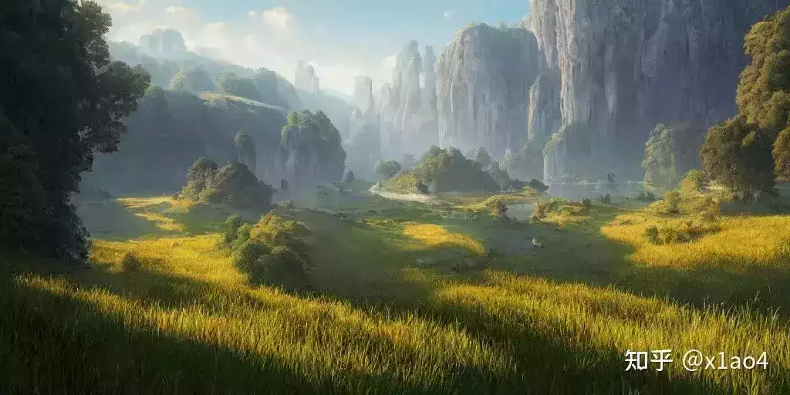
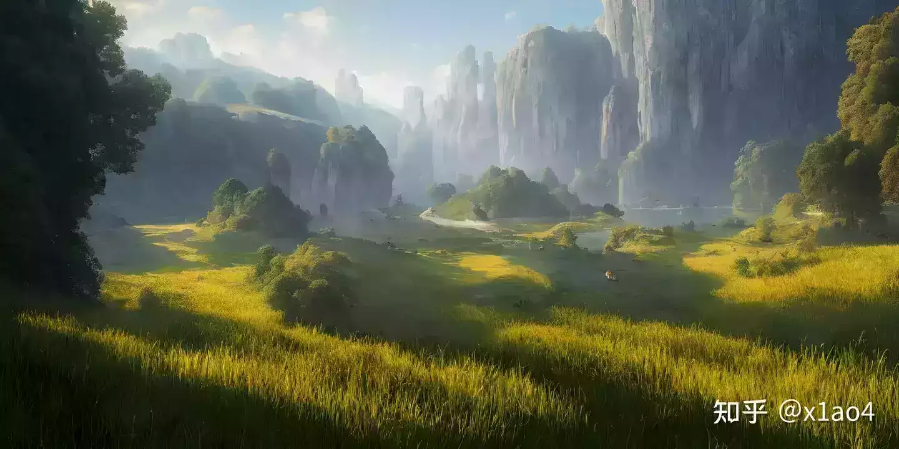
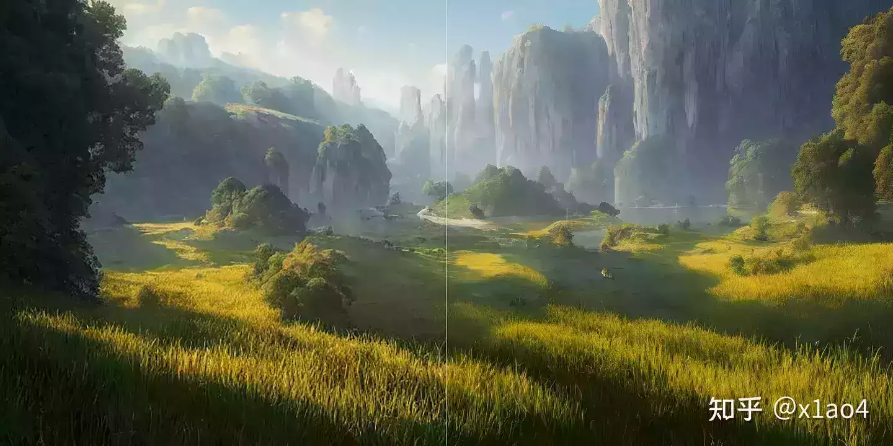
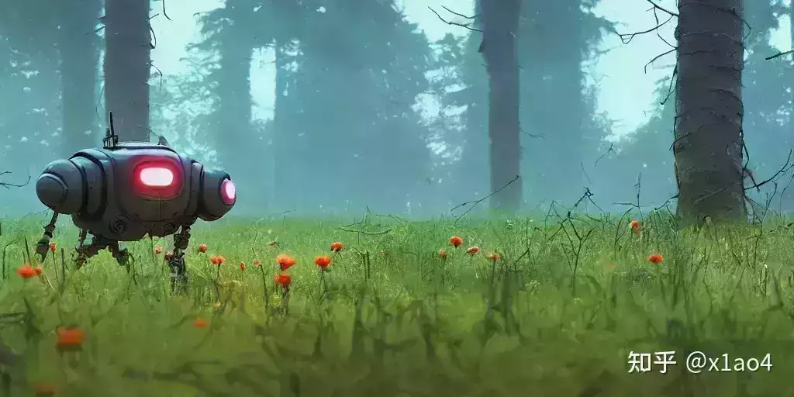
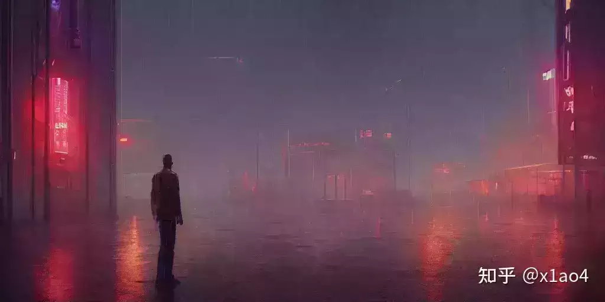
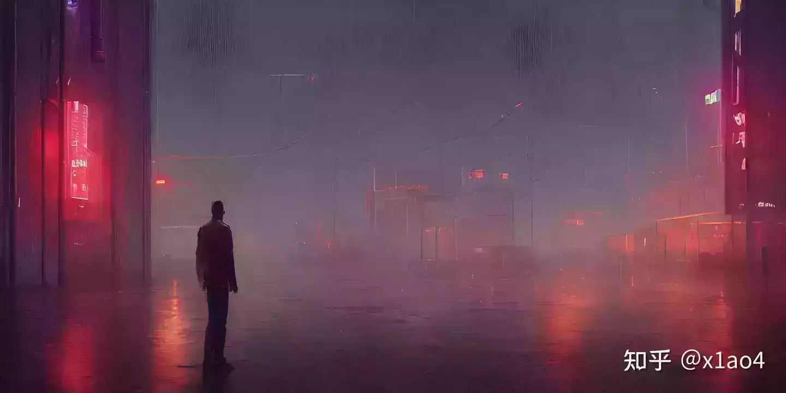
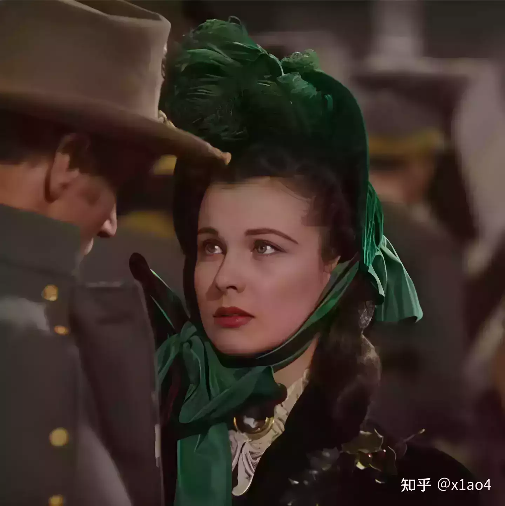
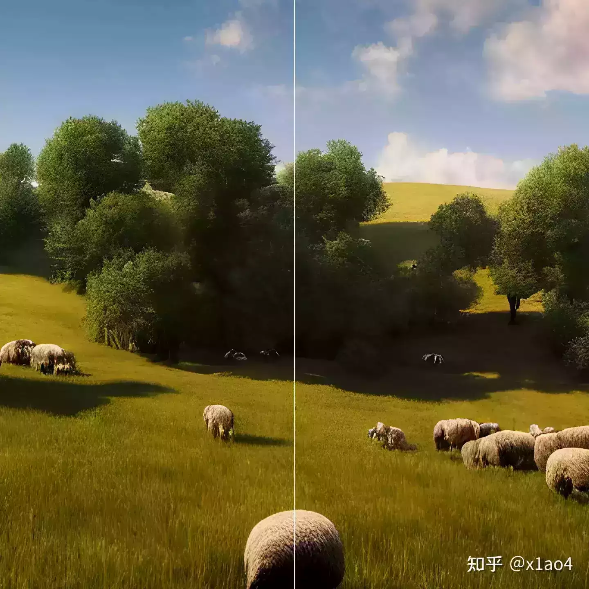
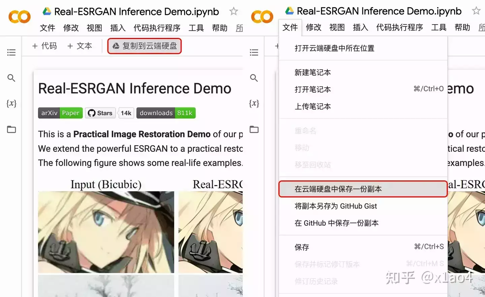

# 盲图像超分辨率模型 Real-ESRGAN 使用教程

[Real-ESRGAN](https://link.zhihu.com/?target=https%3A//github.com/xinntao/Real-ESRGAN) 是由[腾讯 ARC 实验室](https://link.zhihu.com/?target=https%3A//arc.tencent.com/zh)发布的一个盲图像超分辨率模型，它的目标是开发出实用的图像/视频修复算法，Real-ESRGAN 是在 ESRGAN 的基础上使用纯合成数据来进行训练的，基本上就是通过模拟高分辨率图像变低分辩率过程中的各种退化，然后再通过低清图倒推出它的高清图，简单说你也可以把它理解为一个图像/视频修复、放大工具。

上图来自 Real-ESRGAN 的 GitHub 页面

Real-ESRGAN 目前提供了五种模型，分别是 realesrgan-x4plus（默认）、reaesrnet-x4plus、realesrgan-x4plus-anime（针对动漫插画图像优化，有更小的体积）、realesr-animevideov3（针对动漫视频）和 realesrgan-x4plus-anime-6B，你可以根据你要处理的图片或视频选择合适的模型进行使用。

下面可以先看几个例子。

原图（图片来自网络） 456x600

使用 Real-ESRGAN realesrgan-x4plus 模型放大 4 倍 1860x2400

左侧使用 Photoshop 放大，右侧使用 Real-ESRGAN 放大

原图（图片来自网络） 604x473

使用 Real-ESRGAN realesrgan-x4plus 模型放大 4 倍 2416x1892

左侧使用 Photoshop 放大，右侧使用 Real-ESRGAN 放大

原图 1024x512

使用 Real-ESRGAN realesrgan-x4plus 模型放大 4 倍 4096x2048

左侧使用 Photoshop 放大，右侧使用 Real-ESRGAN 放大

大部分情况下放大后可以得到满意的结果，但 Real-ESRGAN 也不是完美的，还是存在一些问题，在处理某些画面时可能会产生一些异常变化。

原图 1024x512

使用 Real-ESRGAN realesrgan-x4plus 模型放大 4 倍 4096x2048

上图在放大后将原图本该模糊的部分区域处理的更清晰了（画面下侧），而且处理的并不均匀，虚实关系不正确。

原图 1024x512

使用 Real-ESRGAN realesrgan-x4plus 模型放大 4 倍 4096x2048

上图在放大后画面靠上的部分出现了深浅不一的竖纹。

原图（图片来自网络） 719x720

使用 Real-ESRGAN realesrgan-x4plus 模型放大 4 倍 2876x2880

上图在放大后某些区域出现了明显的分界，部分画面虚实关系错乱，部分画面处理后有些失真。

虽然存在一些问题，但是整体来看 Real-ESRGAN 的处理能力还是非常强大的，在大部分情况下都能有不错的效果，Real-ESRGAN 团队也在继续优化产品，相信随着版本的更新 Real-ESRGAN 也会越来越完善。

  

目前你可以通过以下三种方式运行 Real-ESRGAN。

1.  Real-ESRGAN 的 **[Colab Demo](https://link.zhihu.com/?target=https%3A//colab.research.google.com/drive/1k2Zod6kSHEvraybHl50Lys0LerhyTMCo%3Fusp%3Dsharing)**（仅支持 realesrgan-x4plus 模式），Real-ESRGAN 动漫视频的 **[Colab Demo](https://link.zhihu.com/?target=https%3A//colab.research.google.com/drive/1yNl9ORUxxlL4N0keJa2SEPB61imPQd1B%3Fusp%3Dsharing)**（仅支持 realesr-animevideov3 模式）。
2.  **支持 Intel / AMD / Nvidia 显卡**的**绿色版** **exe** **文件**： [Windows 版](https://link.zhihu.com/?target=https%3A//github.com/xinntao/Real-ESRGAN/releases/download/v0.2.5.0/realesrgan-ncnn-vulkan-20220424-windows.zip) / [Linux 版](https://link.zhihu.com/?target=https%3A//github.com/xinntao/Real-ESRGAN/releases/download/v0.2.5.0/realesrgan-ncnn-vulkan-20220424-ubuntu.zip) / [macOS 版](https://link.zhihu.com/?target=https%3A//github.com/xinntao/Real-ESRGAN/releases/download/v0.2.5.0/realesrgan-ncnn-vulkan-20220424-macos.zip)，详情请移步[这里](https://link.zhihu.com/?target=https%3A//github.com/xinntao/Real-ESRGAN/blob/master/README_CN.md%23%25E4%25BE%25BF%25E6%2590%25BA%25E7%2589%2588%25EF%25BC%2588%25E7%25BB%25BF%25E8%2589%25B2%25E7%2589%2588%25EF%25BC%2589%25E5%258F%25AF%25E6%2589%25A7%25E8%25A1%258C%25E6%2596%2587%25E4%25BB%25B6)。NCNN的实现在 [Real-ESRGAN-ncnn-vulkan](https://link.zhihu.com/?target=https%3A//github.com/xinntao/Real-ESRGAN-ncnn-vulkan)。
3.  通过**搭建** **Python** **环境运行**，详情请移步[这里](https://link.zhihu.com/?target=https%3A//github.com/xinntao/Real-ESRGAN)。

由于这些 exe 文件会把图像分成几个板块，然后分别进行处理，再合成导出，输出的图像可能会有一点割裂感（而且可能跟 PyTorch 的输出不太一样），所以本人不建议使用本地可执行文件直接运行 Real-ESRGAN。

左侧使用 Colab Demo 放大，右侧使用 macOS 绿色版放大

如上图所示（截取了部分画面），右侧使用 macOS 绿色版放大的图片上下有明显的分界线，交界处附近上面清晰下面模糊，因为是分块处理再合并，所以出现了这种问题，根据画面内容有的时候会比较明显，有的时候不这么明显，这个缺陷我是不可以接受的，所以我不推荐使用本地绿色版。如果你想尝试可以在[这里](https://link.zhihu.com/?target=https%3A//github.com/xinntao/Real-ESRGAN)查看相关信息。

因为通过搭建 Python 环境运行 Real-ESRGAN 门槛有一点高，大部分人都很难操作，所以这里也不做讲解，有需要的人可以直接在[这里](https://link.zhihu.com/?target=https%3A//github.com/xinntao/Real-ESRGAN)查看相关指导。

  

这里重点讲一下 Google Colab 版本的操作。（请先登入谷歌账号）

01\. 打开 **[Real-ESRGAN Inference Demo](https://link.zhihu.com/?target=https%3A//colab.research.google.com/drive/1k2Zod6kSHEvraybHl50Lys0LerhyTMCo%3Fusp%3Dsharing)**，**点击**「**复制到云端硬盘**」或点击「文件」选择「在云端硬盘中保存一份副本」。

02\. 副本创建完成会出现「笔记本的副本已完成」弹窗，**点击**「**在新标签页中打开**」。

03\. 点击「“Real-ESRGAN Inference Demo.ipynb”的副本」**修改笔记本名称**（不改也可以，以后就能直接从自己的云端硬盘打开这个文件运行 Real-ESRGAN 了）。

04\. 一共有五个步骤，步骤四是显示对比图，就是会把处理前后的图片放在一起展示出来，没啥用处，可以**点击**单元格「**4\. Visualization**」，**点击**单元格右上角的**垃圾桶图标**，**删除单元格**。

05\. **点击**「**1\. Preparations**」下方的**运行按钮**（在「已隐藏一个单元格」前面）运行准备程序。（点击单元格前面的小三角可以展开和收起单元格）

06.「1. Preparations」运行完成后**点击**「**2\. Upload Images**」下方的**运行按钮**，**点击**「**选择文件**」从本地选择你要放大的图片并**点击**「**打开**」（可多选），然后会开始上传图片，此单元格下方会显示上传进度。

07\. 图片上传完成后**展开**「**3\. Inference**」**单元格**，在图中位置将数字改为你要将图片放大的倍数（X3.5 是备注说明，下面那个 3.5 是命令语句，默认放大 3.5 倍），然后**点击**「**3\. Inference**」的**运行按钮**运行该单元格。（运行完成后单元格左上角会出现绿色对钩）

注意默认是开启面部修复功能的，在放大一些包含人脸的图片时有可能会造成五官的变化，在进行一些人物照片修复的时候可能会比较有用，但是对一些偏向写实类的插画就会起到反作用，会使面部画风与其他部分产生差异，并且会改变原图的五官形态，如果想关闭面部修复功能只要删除「**\--face\_enhance**」再运行即可。

08\. **点击**「**5\. Download Results**」的**运行按钮**运行该单元格，运行完成会开始自动下载处理好的图片，该单元格下方会显示下载进度，完成后图片就以压缩包的形式下载到本地了。

如果还有图片需要处理直接重复 **06.-08.** 即可，也就是单元格 「**2\. Upload Images（上传图片）**、**3\. Inference（执行命令）**、**5\. Download Results（下载文件）**」。

  

如果需要处理视频可以打开 **[Real-ESRGAN Inference Demo (anime videos)](https://link.zhihu.com/?target=https%3A//colab.research.google.com/drive/1yNl9ORUxxlL4N0keJa2SEPB61imPQd1B%3Fusp%3Dsharing)**，然后参考处理图片的步骤操作即可，注意这个模型是针对动漫视频设计的，所以处理动漫视频效果较好，处理其他视频也可以，但效果不一定理想。

首先「**2\. (Optional) Inference the Demo Video、3. (Optional) Visulize the Input Video and Enhanced Video、6. Visulize the Input Video and Enhanced Video**」这三个单元格可以直接删除。（没啥用处）

然后先**运行**「**1\. Preparations**」**准备工作**，再**运行**「**4\. Upload Anime Videos**」**上传视频**，之后在「**5\. Inference**」**修改放大倍数及文件名并执行命令**，最后**修改输出文件名称并运行**「**7\. Download Results**」**下载文件**。

如果还有其他视频要处理可以重新执行「4. Upload Anime Videos、5. Inference、7. Download Results」。

注意处理视频有几个地方需要手动修改，如下图所示，**upload/** 后方需要按你的文件名修改，**名称**和**后缀**都要保持和你上传的视频文件一致，**results/** 后方也要与你的视频文件名保持一致，如图所示，上传的视频文件为 **111.mp4**，则三处名称都为 **111**，两处有后缀的后缀保持一致，右侧的三个数字也要保持一致，第一个 **2** 表示**放大的倍数**，第二、三个 **2** 是输出文件的**文件名称后缀**，如需放大其他倍数可手动修改。

注意所有上传的文件名称可以包含中文，但最好不要包含标点符号，否则可能会引发语义错误。上传视频可能会有点慢，请耐心等待。

  

以上就是这次教程的全部内容了，Real-ESRGAN 是一个很强大的图像/视频修复、放大工具，感谢开发者们，感谢 Xintao Wang、Liangbin Xie、Chao Dong、Ying Shan。