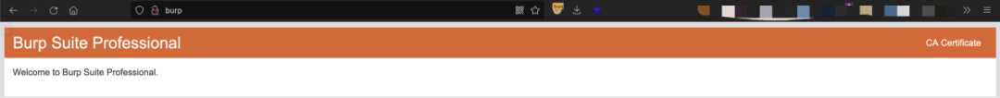
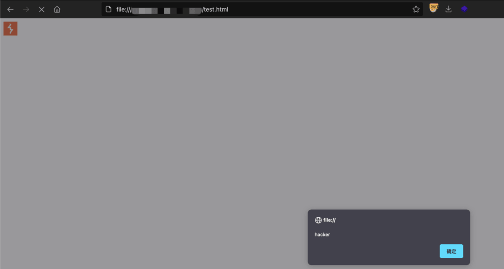
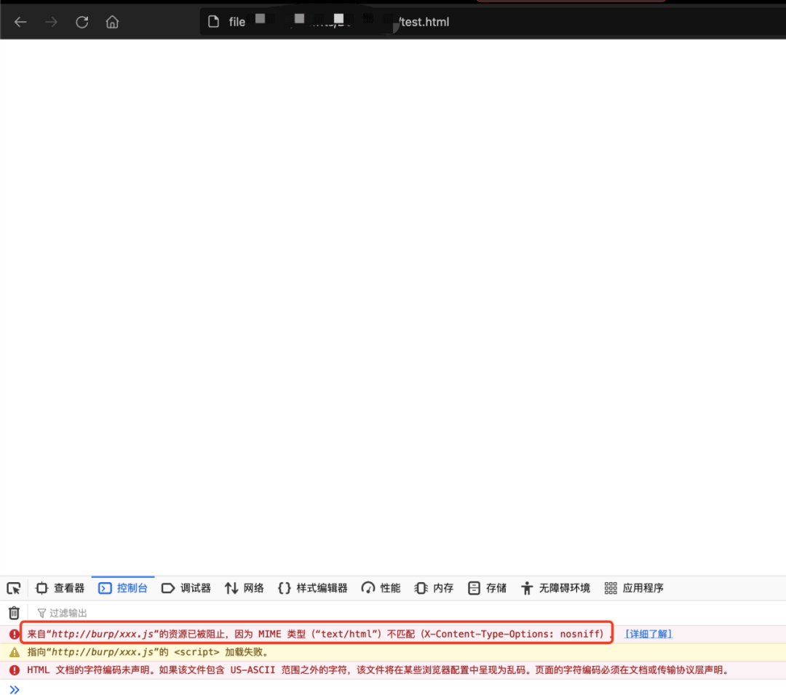
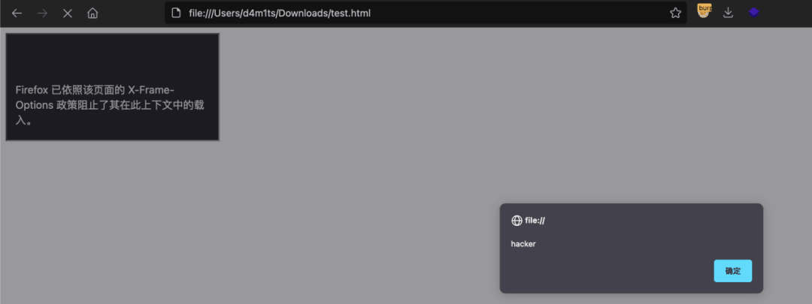
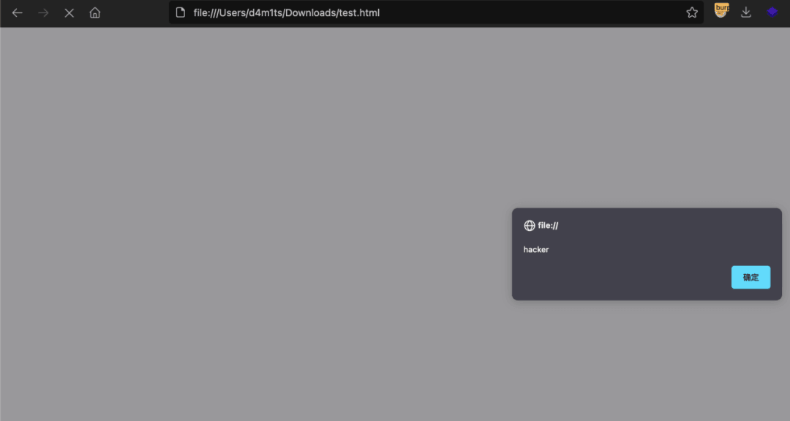
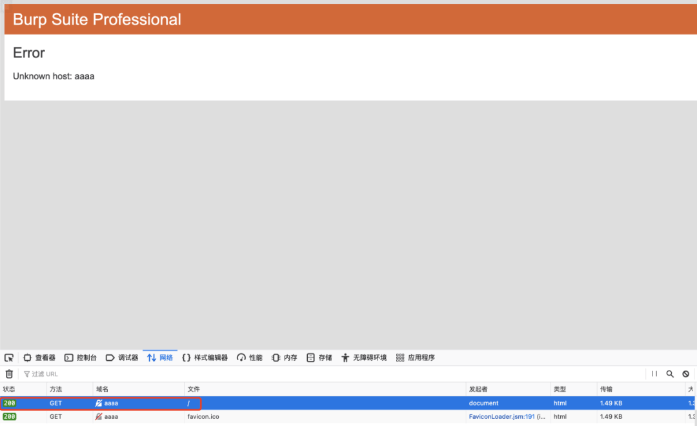
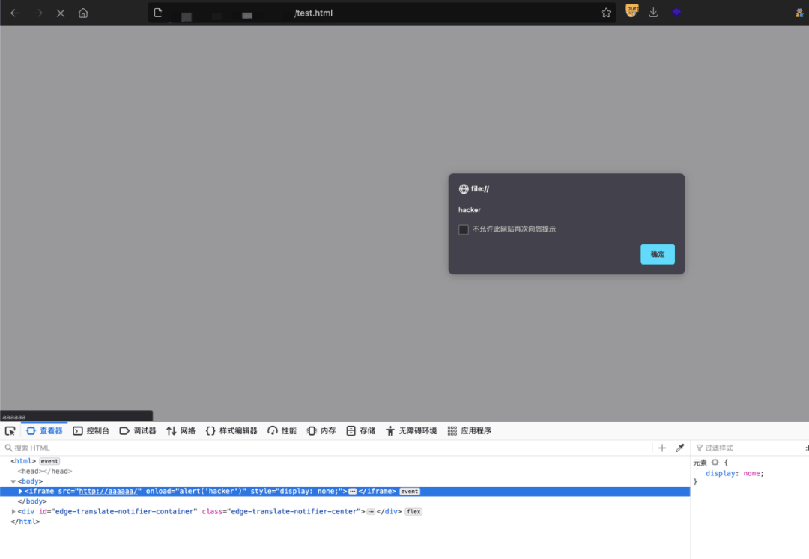
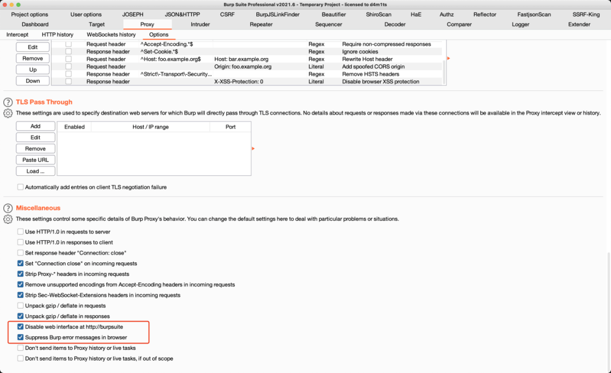

# 【知道创宇小课堂】防止 Burp 被识别

Author：d4m1ts

  

  

  

前言

  

读完这篇文章《[精确判断网站访问者是否是黑客的方法](https://mp.weixin.qq.com/s?__biz=Mzg4OTExMjE2Mw==&mid=2247483923&idx=1&sn=01f1f8f3e3a1a601d24d783843b2f4c4&scene=21#wechat_redirect)》，确实感觉渗透越来越危险了，一不小心就被引入到蜜罐了，一定要保护好自己，尽可能避免一切风险！

  

  

  

  

识别原理

  

一般做渗透都会使用 burpsuite 来抓包测试，而挂着 burp 代理是可以访问 http://burp 这个地址的，就是下面这样，咱们通常下载 Burp 证书的地方

  

  

**也就是说，如果识别到网站浏览者可以访问 http://burp，那么就可以判定为攻击者**

##   

  

  

  

识别举例

  

原文作者给出了两种方法，一种是采用 img 标签，一种是采用 script 标签

  

采用 img 标签不存在跨域的问题，结合 onload 事件，如果能加载 burp 的图标 http://burp/favicon.ico，就说明是攻击者，举例代码如下：

  

  

  

采用 script 标签的演示代码如下，但是通过测试并不能成功触发弹窗，可以在控制台看到错误信息

  

  

  

##   

  

  

识别扩展

  

##   

通过上面的内容，我们可以扩展一下，任意能够识别 http://burp 或相关内容是否能够访问的方法都可以用来判定是否为攻击者

  

上面主要是通过加载图标的手法，稍微修改下 burp 就可以去掉图标，那肯定需要找一个更稳定的方法去识别

  

查阅了一些资料，发现 iframe 标签也不存在跨域的问题，且网站可成功访问才能触发相关的事件，效果杠杠的，举例如下

<iframe src="http://burp/" onload="alert('hacker')"></iframe>  
  

  

  

这样太明显了，隐藏一下

<iframe src="http://burp/" onload="alert('hacker')" style="display: none;"></iframe>  

  

  

再进阶一点

  

走了 burp 代理，就算目标不能访问，burp 也会返回相关内容，这会让 iframe 认为加载成功，可以通过这个性质来判断是否使用了代理

  

  

所以也可以用如下的代码去测试

<iframe src="http://aaaaa/" onload="alert('hacker')"></iframe>  

  

  

  

  

防止识别方法

  

通过研究发现，原文中直接不让访问 http://burp 也能通过识别扩展中的 http://aaaa 这种来识别发现是否使用了代理

  

解决办法也很简单，**多谢 R4ph4e1 师傅**，在 Proxy --> Options 中最下面，勾选如下图的 2 条即可

-   一个是关闭 http://burp 代理
    
-   一个是关闭 burp 自带的浏览器错误回显信息
    
      
    

  

