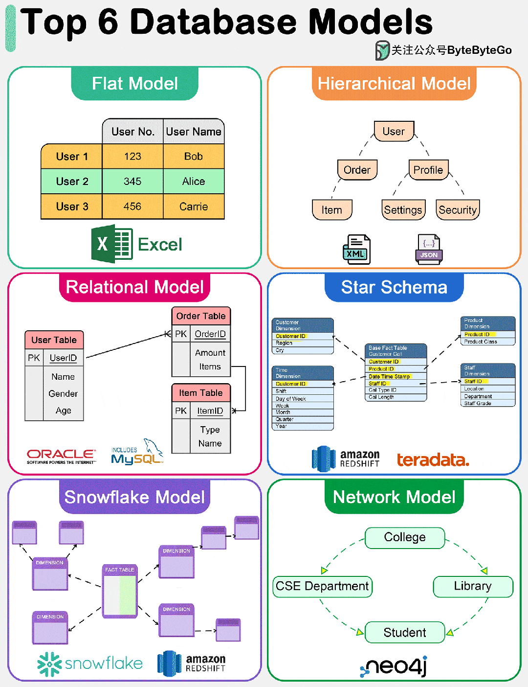

# 程序员应知必会的 6 种常见数据模型

今天来聊聊常见的 6 大数据模型。

数据模型为数据库管理系统（DBMS）中的数据存储、检索和操作提供了基础，并影响着数据的结构和访问方式。

下图显示了 6 大数据模型。

## 01 扁平模型

扁平数据模型是最简单的数据库模型之一。它将数据组织到一个表中，其中每一行代表一条记录，每一列代表一个属性。这种模型**类似于 Excel 电子表格**，易于理解和实施。但是，它缺乏有效处理数据实体之间复杂关系的能力。

## 02 分层模型

分层数据模型将数据组织成树状结构，每条记录只有一个父记录，但可以有多个子记录。这种模型对于数据实体之间有明确 "父 - 子" 关系的情况非常有效。但是，**它在处理多对多关系时会很吃力**。

## 03 关系模型

关系模型由 E.F. Codd 于 1970 年提出，以表（关系）表示数据，由行（元组）和列（属性）组成。它支持数据完整性，并通过使用键和规范化来避免冗余。**关系模型的优势在于其灵活性和查询语言 SQL（结构化查询语言）的简易性**，这使其成为传统数据库系统中使用最广泛的数据模型。它能有效处理多对多的关系，并支持复杂的查询和事务。

## 04 星型模型

星型模型是数据仓库中用于 OLAP（联机分析处理）应用的一种专用数据模型。它的特点是**中央事实表包含可测量的定量数据，周围是维度表**，包含与事实数据相关的描述性属性。该模型针对分析应用中的查询性能进行了优化，通过最大限度地减少查询所需的连接次数，提供简单、快速的数据检索。

## 05 雪花模型

雪花模型是星形模型的一种变体，在这种模式中，**维度表被规范化为多个相关表**，从而减少了冗余并提高了数据完整性。这样就形成了类似雪花的结构。虽然雪花模型会因连接次数的增加而导致更复杂的查询，但它在存储效率方面具有优势，在维度表较大或频繁更新的情况下也很有利。

## 06 网络模型

网络数据模型允许每条记录有多个父节点和子节点，从而形成一个可以表示数据实体之间复杂关系的图结构。这种模型通过**有效处理多对多关系**，克服了层次模型的一些局限性。不过，它的设计和查询可能比较复杂，在大多数应用中已被关系模型所取代，但在某些专业领域仍有使用。
