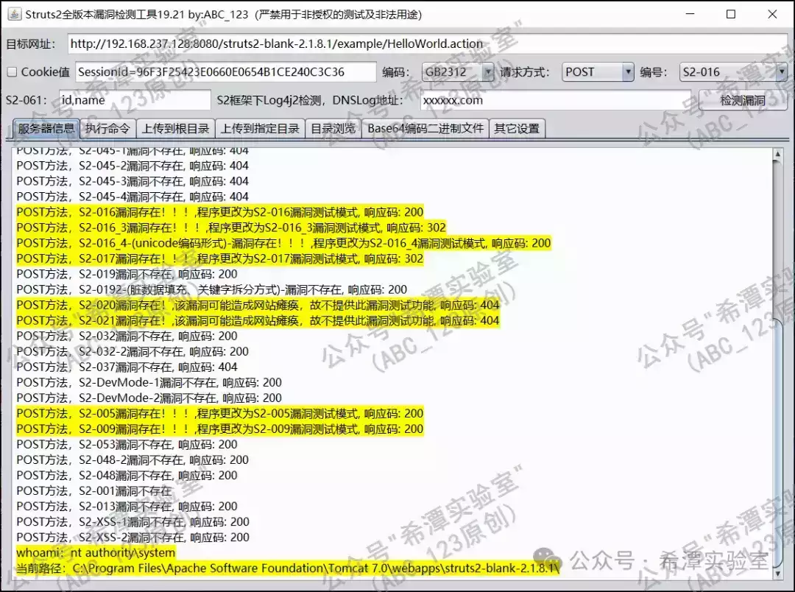
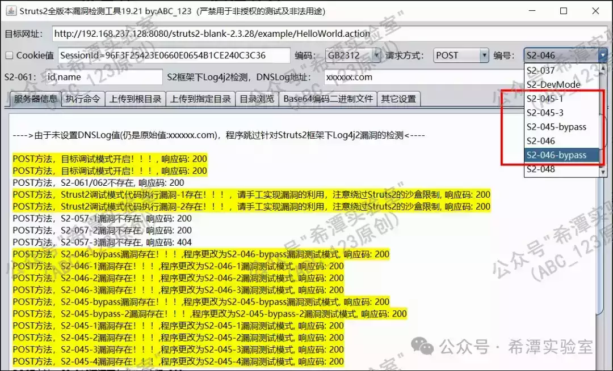
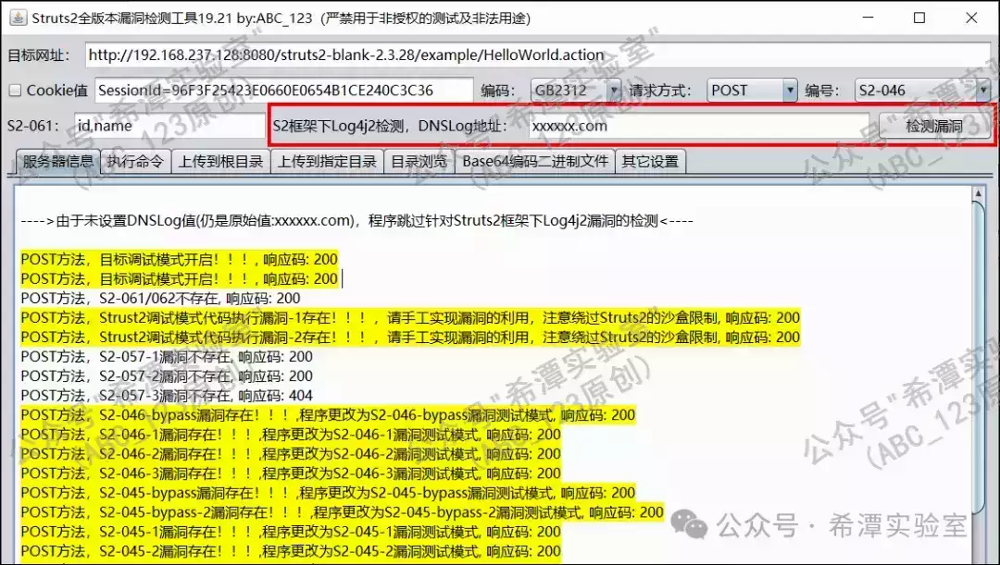
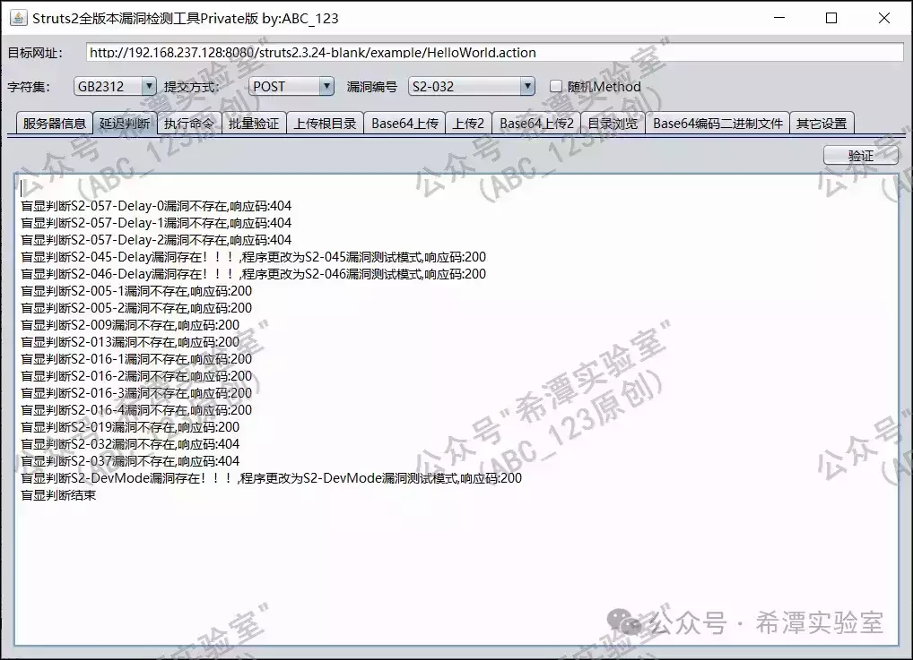

# 第87篇：Struts2框架全版本漏洞检测工具，原创发布（漏洞检测而非漏洞利用）

##  **Part1 前言** 

**大家好，我是ABC\_123**。在2016年时，很多Java应用网站都是基于Struts2框架开发的，因而Struts2的各个版本的漏洞非常多，研发工具的初衷就是为了方便安全测试人员快速寻找Struts2漏洞。在后期更新过程中，ABC\_123尽可能把这款工具写得简单易用，**哪怕对Struts2漏洞完全不懂的新手，也能快速帮助企业找到Struts2漏洞并进行修复**。

  

##  **Part2 程序介绍** 

-   ## **程序的亮点**
    

**漏洞检测准确：**对于Struts2漏洞的检测，极少会出现误报的情况。在过去8年里，ABC\_123根据网友的反馈，在不断修复bug的同时，**对Struts2漏洞的检测逻辑调整了上百次**。

**检测语句不同：**每个漏洞检测语句都经过ABC\_123的调整和改造，尽可能规避触发WAF告警；能用一条漏洞检测语句，绝对不用两条，尽可能一步到位。

**程序体积较小：**ABC\_123对此程序的代码做了极大优化，最终程序大小仅有100k左右。

  

-   ## **程序的简介**
    

1、点击“检测漏洞”，程序会自动检测该URL是否存在S2-001、S2-005、S2-009、S2-013、S2-016、S2-017、S2-019、S2-020/021、S2-032、S2-037、DevMode、S2-045/046、S2-052、S2-048、S2-053、S2-057、S2-061、S2-062、Struts2专属的log4j2等十余种漏洞。

2、“批量验证”，（**为防止批量geshell，公开发布版本中不带有此功能**）。

3、S2-020、S2-021仅提供漏洞扫描功能，因漏洞利用exp很大几率造成网站访问异常，本程序暂不提供。

4、对于需要登录的页面，请勾选“设置全局Cookie值”，并填好相应的Cookie，程序每次发包都会带上Cookie。

5、作者ABC\_123对不同版本的Struts2漏洞测试语句做了大量修改，执行命令、上传功能已经能通用。

6、支持GET、POST、UPLOAD三种请求方法，您可以自由选择（UPLOAD为Multi-Part方式提交）。

7、部分漏洞测试支持UTF-8、GB2312、GBK编码转换。

8、每次操作都启用一个线程，防止操作界面卡死。

9、程序不再更新绕waf功能，因为一旦更新绕waf功能，工具流传开，将会很快失效。

  

-   ## **常见的Struts2漏洞总结**
    

根据ABC\_123过去对Struts2漏洞的研究及挖掘经验，给出如下总结，仅供大家参考。

**常见漏洞编号：**S2-005、S2-016、S2-017、S2-045、S2-046、S2-057、S2-调试模式、S2的Log4j2等，这些是比较常见的漏洞（Struts2调试模式下的漏洞，在最近几年官方是不收录的，因而没有补丁）。

**少见的漏洞：**S2-001、S2-009、S2-019、S2-032、S2-037等，这些偶尔会遇到。

**难以利用的漏洞：**S2-020、S2-021也比较常见，但是利用很困难，getshell的结果大概率会造成网站崩溃，所以本程序不提供相关漏洞的利用。

**极少见的漏洞：**S2-013、S2-048、S2-052、S2-053、S2-061、S2-062、S2-066等。这些漏洞利用条件太过苛刻，在实战中基本上不会遇到，在结合代码审计的情况下可以发挥作用。

##   

-   ## **工具的使用技巧**
    

如果遇到程序检测到Struts2-045/S2-046代码执行漏洞，却没办法执行命令或者上传文件的情况，请手工对漏洞编号进行选择。由于目标网站环境问题，Struts2漏洞在不同的Web环境下，一些漏洞测试语句不一样，所以需要切换到不同的利用模式。

  

Struts2框架下的Log4j2漏洞检测与其它框架不同，需要特殊构造的检测语句。想要使用该工具检测Struts2的log4j2漏洞，需要手工修改DNSLog的地址，如果您不修改默认的DNSLog地址，程序将会跳过对Log4j2漏洞的扫描。

  

-   ## **工具的其它流传版本**
    

目前大家手中比较多的版本就是下图展示的17-6版本，于2017年5月更新；还有一个半成品的程序版本是18.09，这个版本bug较多，不建议使用。

  

对于Struts2漏洞，部分情况下没有回显，因此需要通过延迟判断方法进行判断。

  

##  **Part3 总结** 

1\.  大家对程序有什么建议，或者发现了程序的bug，欢迎在后台或者在github上给我留言。

2\.  关注公众号“希潭实验室”后，回复数字“2222”，即可得到此工具的下载地址。