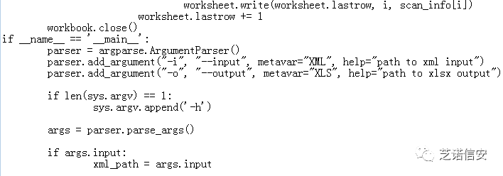
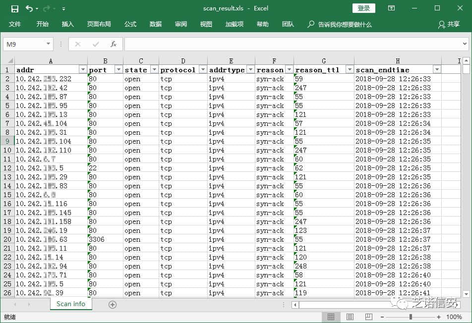

# 编写masscan报告转换脚本

由于nmap扫描比较慢，有时候需要使用masscan对大段ip进行快速扫描。为了后续方便数据处理，往往需要将数据以xls的形式进行统计，但是masscan只支持xml,json,list等格式输出,并不支持直接输出xls格式。最近有正好这个需求，于是写了个小脚本来转换一下。

## 一、编码

#### file: masscan-report-converter.py

#### 

目前脚本已经收集到我的WorkScript项目中，地址如下：

https://github.com/c0ny1/WorkScripts/tree/master/masscan-report-converter

## 二、使用步骤

##### 1.使用masscan进行扫描，扫描结果以xml保存

##### 2.使用上面写的脚本转换出xls格式的报告

最终效果如下：

图1-脚本转换后的报告