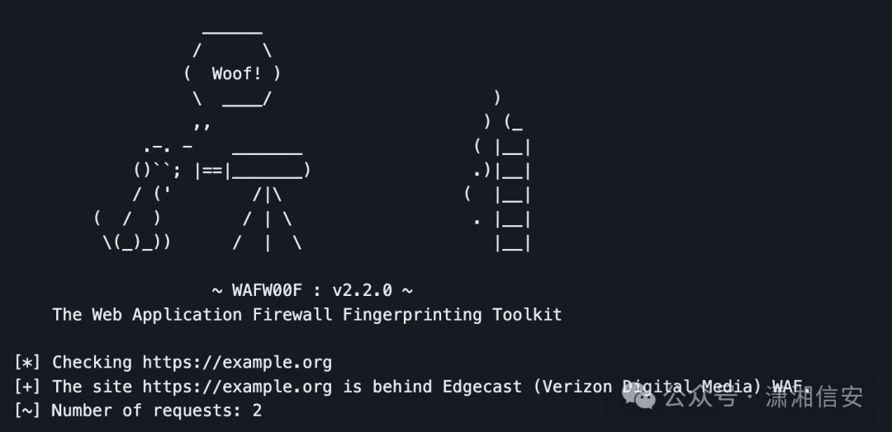

# 老外的漏洞赏金猎人顶级侦察工具

  

  

在本博客中，我们探讨了为漏洞赏金猎人提供支持的顶级侦察工具。从 Shodan 的 IoT 设备洞察到 Waymore 的 Web 应用程序漏洞识别，该工具库中的每个工具在保护数字环境方面都发挥着至关重要的作用。加入我们的网络侦察之旅，这些工具是揭开安全系统秘密的关键。

  

**介绍**

侦察工具对于漏洞赏金猎人来说至关重要，它可以充当导航潜在漏洞的数字指南针。这些工具有效地收集有关目标的信息，帮助猎人在进行更深入的测试之前识别弱点。通过扫描和分析目标的在线状态，侦察工具使猎人能够发现隐藏的入口点、暴露的数据和潜在的攻击向量。

这种主动方法最大限度地提高了在流程早期发现有影响的错误的机会，这在网络安全的动态领域至关重要。在对抗新兴威胁的竞赛中，侦察工具是漏洞赏金成功的关键，为猎人提供了在增强数字安全方面表现出色的战略必要性。

  

**侦察工具**

**1\. OSINT Framework**

```bash
https://osintframework.com/
```

OSINT 框架是用于开源情报收集的开源工具和资源的集合。它是一个集中式平台，整合了各种工具、网站和数据源，帮助漏洞赏金猎人收集有关其目标的信息。此信息可以包括电子邮件地址、域、子域、IP 地址等。  

漏洞赏金猎人可以浏览 OSINT 框架来访问各种工具和资源，这些工具和资源有助于发现潜在目标并收集有关目标的数据。这是一个有价值的侦察起点。


  

**2. Shodan**

```bash
https://www.shodan.io/
```

Shodan 通常被称为“物联网搜索引擎”。它允许用户搜索连接互联网的设备并检索有关它们的信息，包括开放端口、服务、横幅和漏洞。Shodan 广泛用于识别暴露的系统、物联网设备和潜在的安全风险。  

Bug 赏金猎人可以使用 Shodan 来查找可能具有较弱安全配置或已知漏洞的设备，例如网络摄像头、服务器、路由器或其他网络设备。

要搜索具有特定关键字的设备（例如 Apache HTTP 服务器），您可以使用：

```bash
shodan search "product:Citrix" --fields ip_str | awk '{print $1}'
```


  

**3. Censys**

```bash
https://search.censys.io/
```

Censys 是另一个专用于互联网连接设备的搜索引擎。它提供有关设备和服务的详细信息，例如证书、SSL 配置和横幅。此信息可用于资产发现和漏洞评估。  

Bug 赏金猎人可以利用 Censys 来识别开放服务并检查 SSL 配置以检测潜在的安全问题。例如，他们可以搜索具有特定属性的 HTTPS 服务器来评估其安全状况。

要搜索 Citrix，您可以使用：

```bash
censys search "citrix"
```


  

**4. Subfinder**

```bash
https://github.com/projectdiscovery/subfinder
```

Subfinder 是一个子域发现工具，可帮助查找与目标域关联的子域。子域经常被忽视，并且为漏洞赏金猎人提供了更广泛的攻击面。  

Bug 赏金猎人可以使用 Subfinder 来发现目标的子域，从而可能识别出隐藏的服务或入口点。例如，在“example.com”上运行 Subfinder 可以显示“api.example.com”或“blog.example.com”等子域。

要查找 HackerOne 的子域，您可以使用：

```bash
subfinder -d hackerone.com
```


  

**5. Trufflehog**

```bash
https://github.com/trufflesecurity/trufflehog
```

Trufflehog 专门用于在代码存储库中查找敏感信息，例如 API 密钥、密码和其他机密。它扫描代码中的高熵字符串和已知的秘密模式。  

Bug 赏金猎人可以使用 Trufflehog 扫描代码存储库，以发现无意的秘密或敏感信息泄露。例如，在 Git 存储库 URL 上运行 Trufflehog 可能会泄露意外提交的秘密。

要扫描 Git 存储库中的机密，请使用：trufflehog https://github.com/user/repo.git

```bash
trufflehog git https://github.com/trufflesecurity/test_keys
```


  

**6. Nmap**

```bash
https://nmap.org/
```

Nmap 是 Network Mapper 的缩写，是一款用于网络发现和安全审计的综合网络扫描工具。它使错误赏金猎人能够识别目标系统上的开放端口和服务，从而提供对网络配置的深入了解。  

Bug 赏金猎人经常使用 Nmap 对目标 IP 地址或域执行端口扫描。例如，在“example.com”上运行 Nmap 扫描可以识别开放端口以及与其关联的服务。

要扫描目标主机的开放端口，请使用：

```bash
nmap -p 1-1000 example.com
```


  

**7. Waymore**

```bash
https://github.com/xnl-h4ck3r/waymore
```

任何进行错误赏金的人都可能使用过 @TomNomNom 的令人惊叹的 waybackurls。该工具从 web.archive.org 获取 URL，并从 index.commoncrawl.org 上的索引集合之一获取附加链接（如果有）。

您也可能使用过 @hacker\_ 的惊人 gau，它还可以从 wayback archive、Common Crawl 以及 Alien Vault 和 URLScan 中找到 URL。

现在，waymore 也可以从所有这些来源获取 URL（能够过滤更多内容以获得您想要的内容）：

```bash
Wayback Machine (web.archive.org)
Common Crawl (index.commoncrawl.org)
Alien Vault OTX (otx.alienvault.com)
URLScan (urlscan.io)
```

漏洞赏金猎人可以使用 Waymore 收集有关目标网络存在的大量信息。

只需从 redbull.com 的所有来源获取 URL（-mode U 仅适用于 URL，因此不会下载任何响应）：

```bash
python3 waymore.py -i redbull.com -mode U
```


  

**8. Waf00f**

```bash
https://github.com/EnableSecurity/wafw00f
```

Waf00f 是一个简单的工具，可帮助漏洞赏金猎人识别目标网站使用的 Web 应用程序防火墙 (WAF) 并对其进行指纹识别。了解 WAF 的存在对于安全评估至关重要。  

Bug 赏金猎人可以使用 Waf00f 来确定目标网站是否受 WAF 保护。例如，针对“example.com”运行 Waf00f 可以揭示正在使用的 WAF 类型，这是绕过或规避安全机制的重要信息。

要检查网站是否使用 WAF，请使用：

```bash
wafw00f https://example.org
```



  

**9. Amass**

```bash
https://github.com/owasp-amass/amass
```

Amass 是一款功能强大的侦察工具，集成了各种子域枚举技术、DNS 信息收集和网络映射，可提供目标在线状态的全面视图。它的目标是发现尽可能多的子域和相关资产。  

漏洞赏金猎人可以利用 Amass 来识别与目标域关联的子域。这种扩大的范围有助于识别目标基础设施的潜在攻击面和未探索的区域。

要发现域的子域，请使用：

```bash
amass enum -d example.com
```


  

**10. FFuF**

```bash
https://github.com/ffuf/ffuf
```

ffuf (Fuzz Faster U Fool) 是一种快速 Web 模糊器，用于查找 Web 应用程序中隐藏的资源和潜在漏洞。它对于目录和文件暴力发现特别有效，可以帮助漏洞赏金猎人发现隐藏或被遗忘的端点。  

Bug 赏金猎人可以使用 ffuf 来扫描 Web 应用程序中的隐藏目录和文件，方法是指定目标 URL 并使用单词列表进行暴力破解。例如，使用自定义单词列表扫描“example.com”可以显示隐藏的资源。

要暴力破解网站上的目录，请使用：

```bash
ffuf -u https://example.com/FUZZ -w wordlist.txt
```


  

**11. Waybackurl**

```bash
https://github.com/tomnomnom/waybackurls
```

Waybackurl 查询 Wayback Machine 的存档以检索网页的历史快照。当错误赏金猎人需要查看历史内容、跟踪更改和调查网站的演变时，此工具非常有价值。  

Bug 赏金猎人可以使用 Waybackurl 检索目标域的历史 URL 和内容快照。通过检查历史数据，他们可能会发现以前暴露的已弃用的功能或漏洞。

要检索目标域的历史 URL，请使用：

```bash
waybackurl example.com
```


  

**12. theHarvester**

```bash
https://github.com/laramies/theHarvester
```

theHarvester 是一款侦察工具，旨在通过公共数据源、搜索引擎和在线资源收集有关目标的信息。它专注于检索电子邮件地址、子域等。  

漏洞赏金猎人可以使用 theHarvester 收集有关目标的信息，例如与域或子域关联的电子邮件地址。例如，使用“all”选项在“example.com”上运行 theHarvester 可以提供广泛的数据源和结果。

要获取与域相关的信息，请使用：

```bash
theHarvester -d example.com -l 100 -b all
```


  

**13. Google Dork**

```bash
https://google.com
```

Google Dorking 是指在 Google 等搜索引擎上使用特定搜索查询来发现网站上隐藏或敏感信息的做法。这是一种手动侦察技术，可以发现不适合公共访问的文件、目录或信息。  

漏洞赏金猎人可以利用 Google Dorking 来识别特定漏洞或信息泄露问题。例如，搜索包含关键字“confidential”的 PDF 文件

一个 Google Dork，用于查找标题中包含“机密”的 PDF 文件：

```bash
filetype:pdf intitle:confidential site:example.com
```


  

**14. Gau**

```bash
https://github.com/lc/gau
```

Gau 是“获取所有 URL”的缩写，是一种多功能工具，用于从网站或域（包括子域和路径）中提取 URL。它提供了一种枚举网络资源的有效方法，帮助漏洞赏金猎人发现隐藏的页面和端点。  

Bug 赏金猎人可以使用 Gau 收集与目标域关联的 URL，其中可能包括子域和特定路径。Gau 对于扩大攻击面特别有用。例如，在“example.com”上运行 Gau 可以生成一个 URL 列表，例如：

```bash
https://example.com/page1
https://subdomain.example.com/page2
```

要从网站获取 URL，请使用：

```bash
gau example.com
```


  

**15. GitHub Dork**

```bash
https://github.com
```

GitHub Dorking 涉及使用 GitHub 上的特定搜索查询来发现可能无意暴露的存储库、文件或敏感信息。Bug 赏金猎人可以利用 GitHub Dorks 来识别安全漏洞、暴露的 API 密钥或其他机密信息。  

例如，搜索可能包含敏感信息的配置文件：

```bash
path:**/.env MAIL_HOST=smtp.gmail.com
```


  

**结论**

在漏洞赏金狩猎领域，掌握侦察艺术是毋庸置疑的，本博客中探索的顶级工具库证明了其重要性。从 OSINT 框架的综合情报收集到 Shodan 的物联网设备洞察和 Waymore 在网络应用程序漏洞识别方面的能力，每个工具都是解开安全系统秘密的关键。

随着漏洞赏金狩猎者开始他们的网络旅程，这些侦察工具将成为指路明灯，使他们能够精确地浏览广阔的数字景观。通过利用这些工具，狩猎者不仅可以识别潜在目标，还可以更深入地了解漏洞，使他们能够报告有影响力的漏洞，并为增强数字安全做出重大贡献。

  

- - -

- - -

- - -
