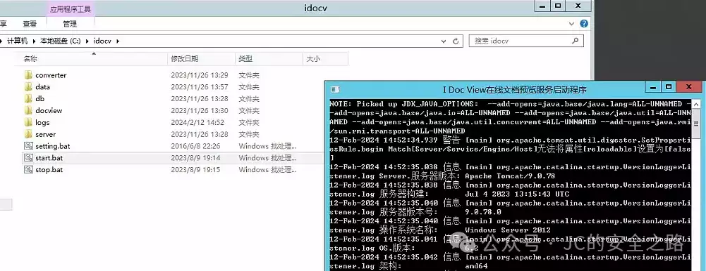
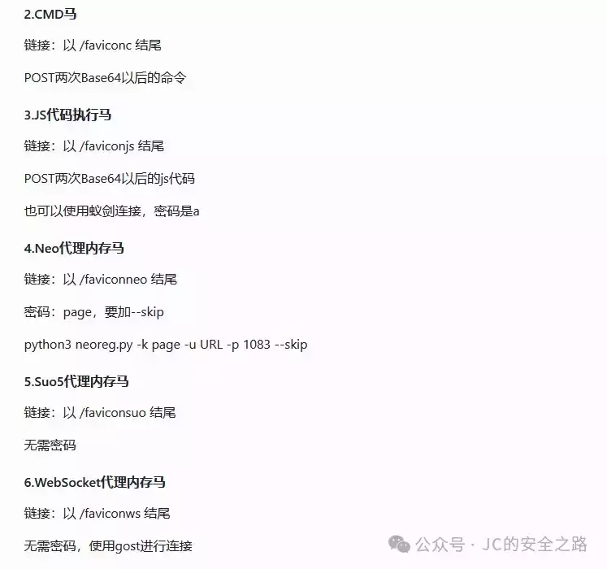
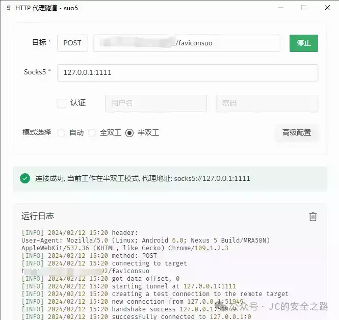
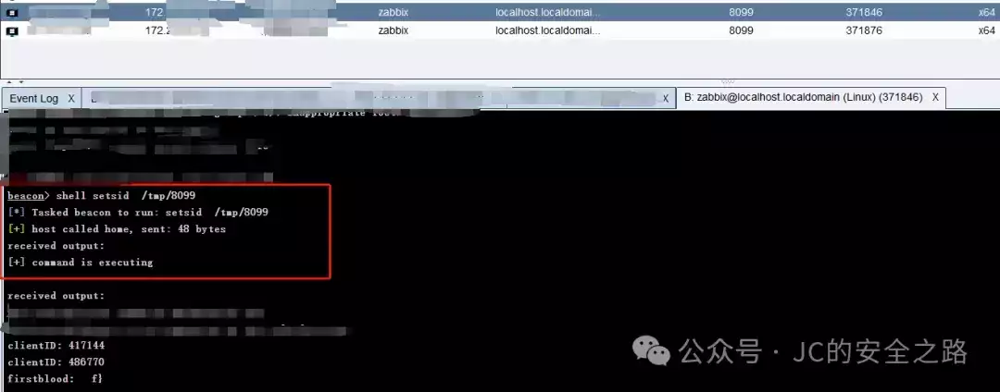

# 聊聊攻防渗透中的一些技巧和打法（一）

    

  

  

**01**

**特殊情况下的 Agent 内存马  
**

  

日常渗透打点有时候会遇到一些不太常见的情况，就是找到一个点，可以命令执行，但是是由于网络策略的原因，反向不出网，没法直接上线 Cobaltstrike(假设出网，大部分时候就是直接执行远程下载落地，执行自身上线)，并且这个 web 应用是 jar 包启动的（俗称的**JAVA 微服务架构**就是这个），这就导致无论正向写 webshell 或者反向反弹 shell 都不是很好操作。

因此引入了 Java Agent 内存马用于解决这个问题。

首先，我们都知道 Java 是一种静态强类型语言，在运行之前必须将其编译成.class 字节码，然后再交给 JVM 处理运行。Java Agent 就是一种能在不影响正常编译的前提下，修改 Java 字节码，进而动态地修改已加载或未加载的类、属性和方法的技术。

简而言之，就是通过命令执行将恶意类注册为 Agent 代理，这里的恶意类就包含我们常用的 webshell，正向 webshell 代理，比如 Suo5,Neo-reGeorg 等基于 webshell 的不出网代理。

接下来，用一个场景举例：

由于专门做一个环境略微麻烦，笔者就直接在命令行里示例，这个环境是 idocv 的漏洞环境：

这里使用 Agent 内存马注入，我们可以使用工具 Vagent

相关说明如下：

以上，我们在 cmd 中模拟命令执行的效果：  

如图，返回 id，即为注入成功

访问内存马，也是返回 200，证明注入成功的，这里连接一下代理，验证是否可用：

证明可用

  

  

  

**02**

**

# Vcenter 的常见打法

**

### 

  

企业中用 VMware vCenter 管控 EXSI 虚拟机是很常见的情况。大多数攻防场景下，并不是说你控下了 Vcenter 就算你控下了所有机器，裁判需要你证明可以控制 vcenter 内的虚拟机才可以。

这就涉及到需要登录 vCenter 控制台，而一般 vCenter 的密码是随机生成的，非常非常复杂（18 位往上），因此就需要下载 vCenter 的数据库文件，从中生成可用 cookie 进而进入控制台。

这里使用漏洞直接打入 webshell  

接下来下载 data.mdb 文件（该文件位于服务器目录下，位置不唯一，自行查找），使用 vcenter\_saml\_login.py 生成 Cookie 登录系统：  

工具自取：https://github.com/horizon3ai/vcenter\_saml\_login  
  

红框就是生成的 cookie，将访问控制台的 Cookie 改为新生成的 Cookie，访问 https://vcenter.chaos-example.com/ui/即可（这个域名仅举例说明，非实际域名地址，这个需要根据内网自动跳转的域名修改）  

这里还涉及一步操作，就是需要将 vcenter 的 host 指向 Vcenter 的内网 IP 地址 (因为内网访问 Vcenter 大多数情况会直接跳转内网域名，但是由于内网 DNS 并不知道，所以就会出现不修改本机域名指向就无法访问的情况)  

  
  

比如我这里是修改本机的 Host 文件，使得 vcenter.chaos-example.com 指向 192.168.1.1

刷新页面，如下：  

  

即为进入 Vcenter 的控制台，可以统计具体的虚拟机数量（以及通过克隆虚拟机提取内存，获取内存中保存的 windows 密码），就不演示了，详情自行研究。  

  

  

  

  

  

**03**

# **关于 zabbix 上线的打法**

  

zabbix 是一个很常见的运维工具：

很多时候会碰到运维人员正在使用 zabbix，未退出的情况 (或者有时候运气好也有弱口令)，这时候又想控制 zabbix agent 下的机器，可以使用 zabbix 下发脚本命令执行的功能：

一般是在 http://127.0.0.1/zabbix.php?action=script.list 这里

例如：

写了一段下载后上线的命令：

执行上线

笔者只是举例，上线的工具笔者是用的 CS，当然用其他远控工具也是可以的，不要局限。

  

  

  

  

**04**

**

后话  

**

  

  

照例说两句，祝大家新年快乐，万事如意！