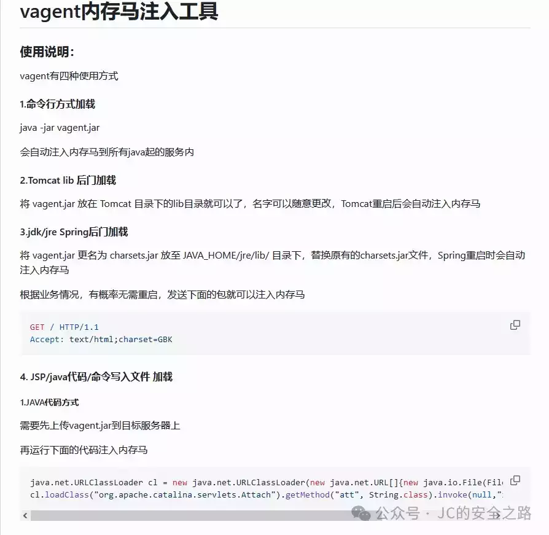
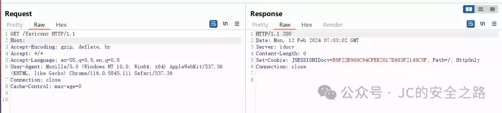
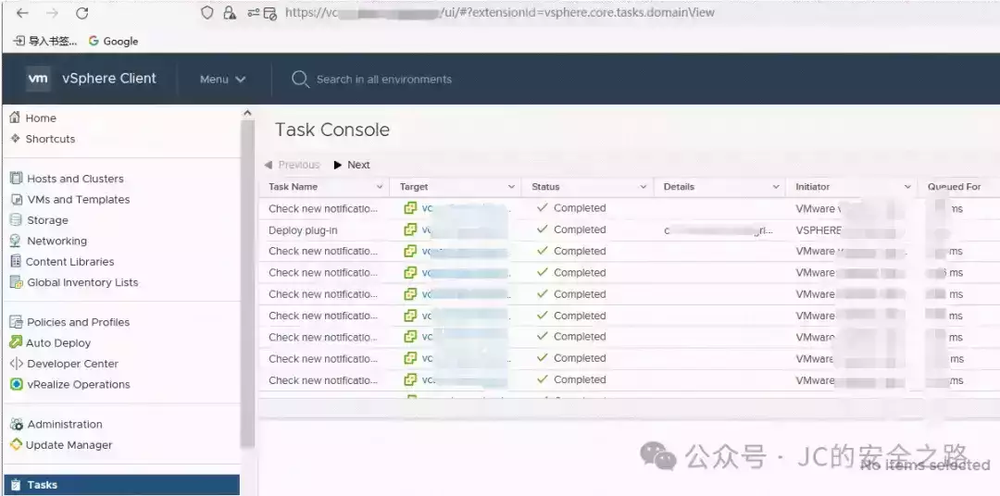
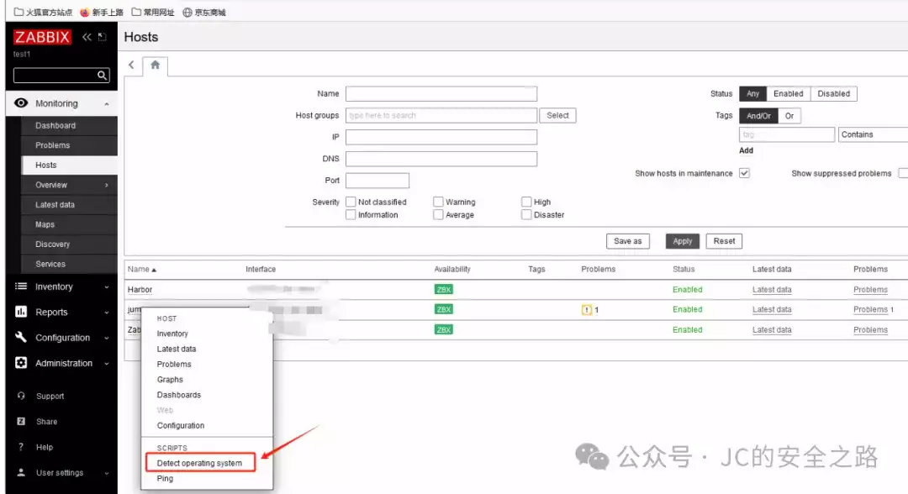

# 聊聊攻防渗透中的一些技巧和打法（一）

    

  

  

**01**

**特殊情况下的Agent内存马  
**

  

日常渗透打点有时候会遇到一些不太常见的情况，就是找到一个点，可以命令执行，但是是由于网络策略的原因，反向不出网，没法直接上线Cobaltstrike(假设出网，大部分时候就是直接执行远程下载落地，执行自身上线)，并且这个web应用是jar包启动的（俗称的**JAVA微服务架构**就是这个），这就导致无论正向写webshell或者反向反弹shell都不是很好操作。

因此引入了Java Agent内存马用于解决这个问题。

首先，我们都知道Java是一种静态强类型语言，在运行之前必须将其编译成.class字节码，然后再交给JVM处理运行。Java Agent 就是一种能在不影响正常编译的前提下，修改 Java 字节码，进而动态地修改已加载或未加载的类、属性和方法的技术。

简而言之，就是通过命令执行将恶意类注册为Agent代理，这里的恶意类就包含我们常用的webshell，正向webshell代理，比如Suo5,Neo-reGeorg等基于webshell的不出网代理。

接下来，用一个场景举例：

由于专门做一个环境略微麻烦，笔者就直接在命令行里示例，这个环境是idocv的漏洞环境：

这里使用Agent内存马注入，我们可以使用工具 Vagent

相关说明如下：

以上，我们在cmd中模拟命令执行的效果：  

如图，返回id，即为注入成功

访问内存马，也是返回200，证明注入成功的，这里连接一下代理，验证是否可用：

证明可用

  

  

  

**02**

**

# Vcenter的常见打法

**

### 

  

企业中用VMware vCenter管控EXSI虚拟机是很常见的情况。大多数攻防场景下，并不是说你控下了Vcenter就算你控下了所有机器，裁判需要你证明可以控制vcenter内的虚拟机才可以。

这就涉及到需要登录vCenter控制台，而一般vCenter的密码是随机生成的，非常非常复杂（18位往上），因此就需要下载vCenter的数据库文件，从中生成可用cookie进而进入控制台。

这里使用漏洞直接打入webshell  

接下来下载data.mdb文件（该文件位于服务器目录下，位置不唯一，自行查找），使用vcenter\_saml\_login.py生成Cookie登录系统：  

工具自取：https://github.com/horizon3ai/vcenter\_saml\_login  
  

红框就是生成的cookie，将访问控制台的Cookie改为新生成的Cookie，访问https://vcenter.chaos-example.com/ui/即可（这个域名仅举例说明，非实际域名地址，这个需要根据内网自动跳转的域名修改）  

这里还涉及一步操作，就是需要将vcenter的host指向Vcenter的内网IP地址(因为内网访问Vcenter大多数情况会直接跳转内网域名，但是由于内网DNS并不知道，所以就会出现不修改本机域名指向就无法访问的情况)  

  
  

比如我这里是修改本机的Host文件，使得vcenter.chaos-example.com指向192.168.1.1

刷新页面，如下：  

  

即为进入Vcenter的控制台，可以统计具体的虚拟机数量（以及通过克隆虚拟机提取内存，获取内存中保存的windows密码），就不演示了，详情自行研究。  

  

  

  

  

  

**03**

# **关于zabbix上线的打法**

  

zabbix是一个很常见的运维工具：

很多时候会碰到运维人员正在使用zabbix，未退出的情况(或者有时候运气好也有弱口令)，这时候又想控制zabbix agent下的机器，可以使用zabbix下发脚本命令执行的功能：

一般是在http://127.0.0.1/zabbix.php?action=script.list这里

例如：

写了一段下载后上线的命令：

执行上线

笔者只是举例，上线的工具笔者是用的CS，当然用其他远控工具也是可以的，不要局限。

  

  

  

  

**04**

**

后话  

**

  

  

照例说两句，祝大家新年快乐，万事如意！