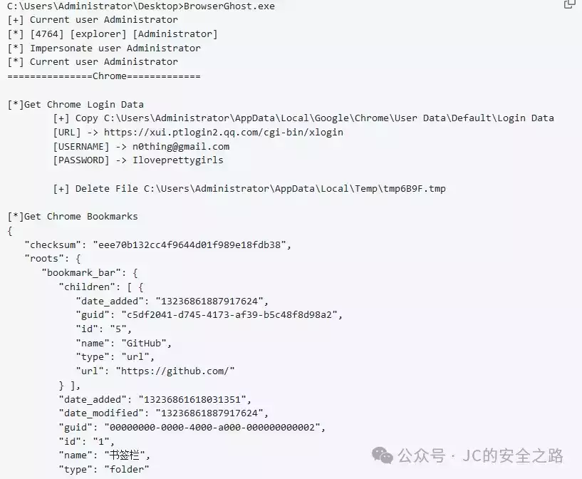
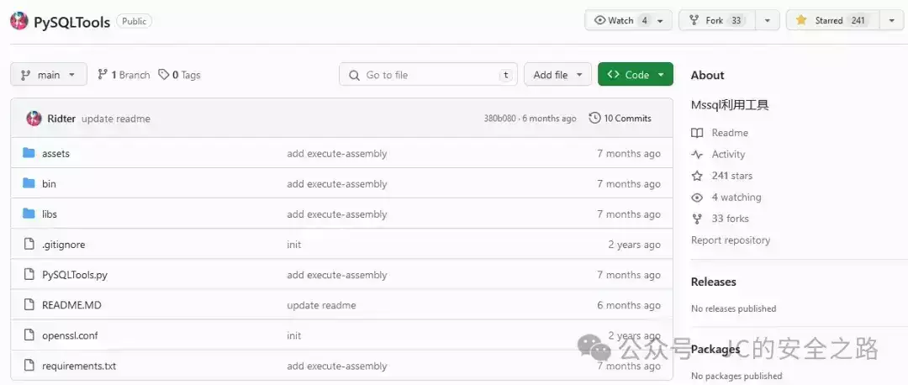

# 聊聊攻防渗透中的一些技巧和打法（二）

    

  

  

  

**01**

**

内网的elasticsearch未授权

**

  

日常攻防内网渗透的时候经常遇到elasticsearch数据库未授权，笔者惯用的是DBweaver，但是由于elasticsearch数据库有的版本高，有的版本低，驱动比较难找，并且费时间，于是专门找了一个适用的谷歌浏览器插件**elasticsearch-Head。**

需要注意的是，加载插件需要谷歌浏览器开启开发者模式，具体操作方式自行搜索学习；


解压elasticsearch-Head后，进入\\cpmmilfkofbeimbmgiclohpodggeheim\\0.3\_0\\ 目录下，加载插件即可

> chrome-extension://cpmmilfkofbeimbmgiclohpodggeheim/elasticsearch-head/index.html

可以在谷歌浏览器url栏目直接输入，进入插件，点击new按钮输入未授权的es数据地址（例如：http://x.x.x.x:9200）**，**如下图**：**


即可方便的翻找数据库，以及执行统计语句，计算数据量，便于算分。

由于**elasticsearch-Head**需要科学上网，所以笔者打包好了一份以便读者自行安装学习，关注公众号并回复"**elasticsearch-Head**"即可获取。  

  

  

  

**02**

**

# 浏览器密码提取

**

### 

  

依旧是攻防场景，内网渗透阶段，对于钓鱼上线/控下的机器进行收集信息，浏览器保存的账号密码信息，浏览器浏览记录/cookie是重点（划线，要考）  

浏览器浏览记录，书签这些一般都包含目标内网的工作环境，有利于了解当前的网段的通向，比如钓鱼上线的机器的ip有可能分配的IP地址：例如192.168.x.x，内网有它统一的出口，工作环境的IP则是10.10开头的内网地址。

浏览器密码则不必多说，大部分是内网相关的系统，至于权限高低就看运气了。  

推荐一些好用的工具：

https://github.com/Naturehi666/searchall  

  

作者集成了HackBrowserData，也是一个抓浏览器信息的工具，非常好用。

另一个是观星实验室的工具，也是笔者经常用于收集浏览器信息的工具之一：

https://github.com/QAX-A-Team/BrowserGhost  




  

  

以上两个工具都可以在github获取（下载较慢），当然，也可以关注公众号回复"**浏览器凭据提取**"获取。  

  

  

  

**03**

# **关于mssql弱口令**

  

Mssql/SqlServer弱口令是内网非常常见的，无论是正式环境还是测试内网，大部分突破点都是这里开始的。

讲一个案例，是笔者给某单位做的红队评估，当时互联网侧由于该单位没有业务，导致很长时间都无法从互联网突破，后来甲方给了一个内网的测试VPN作为入口点，通过分析VPN路由，扫描网段发现一个Mssql弱口令（同事之前利用过xp\_cmdshell，但是未成功...后面笔者是使用clr成功执行了命令），这个弱口令是可以直接执行命令的，虽然做了降权处理（windows service权限）。通过命令执行添加了一个普通用户的权限，登录桌面后发现这台机器是该单位内部某个员工的搭建的游戏私服（就是那种网页传奇游戏），这个数据库就是游戏的数据库，导致内网被突破，后续通过内网信息收集一路突破逻辑隔离，进入专网...  

推荐工具：

mssql数据库连接工具，提权上线一把梭

https://github.com/Ridter/PySQLTools

支持

xp\_cmdshell，

ole，

clr等提权方式，还支持efspotato,badpotato,godpotato三种方法从服务权限提升至nt system权限，其他支持的功能如下：

### 

```plain
功能很多，笔者也只是用过部分，
这里就仁者见仁智者见智啦。当然，实战当中思路不要局限，
```