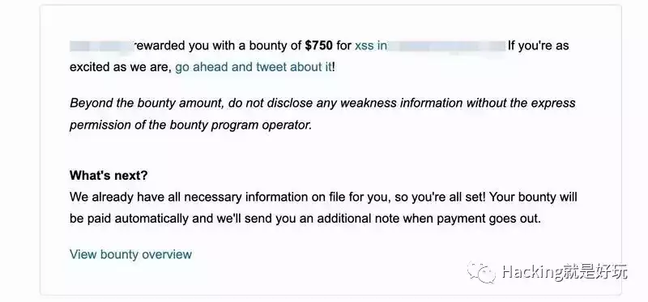

# [自动化bugbounty] hackerone，bugcrowd赏金资产范围

xscan发布后，已经有不少人获得了赏金了

  

一个xss奖金将近5000CNY，加入星球找到一个就回本，甚至有25倍的回报率。  

来自 大佬的评价：  

有了xscan，还差一个资产范围，这不，提取了hackerone和bugcrowd官方含有漏洞赏金项目的范围，51可以卷起来了～

（xscan将扫描细节的参数抽离出来了，不同参数扫描效果不一样，可以多测试选择适合的参数进行扫描）  

资产范围提取自官方，json格式,包含inscope,outscope,url,name,logo字段,后续会做成监控，用于持续监控更新的项目，更新的范围。

h1，bugcrowd赏金范围公开下载，公众号回复“资产范围”

加入知识星球，公众号回复“知识星球”