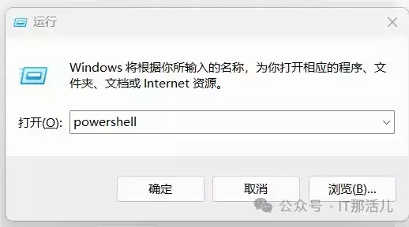
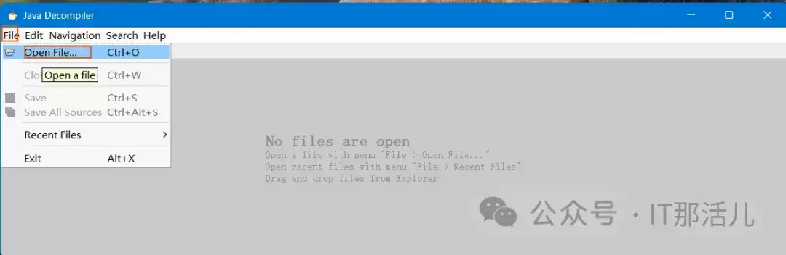
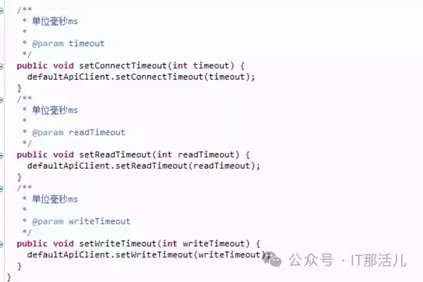
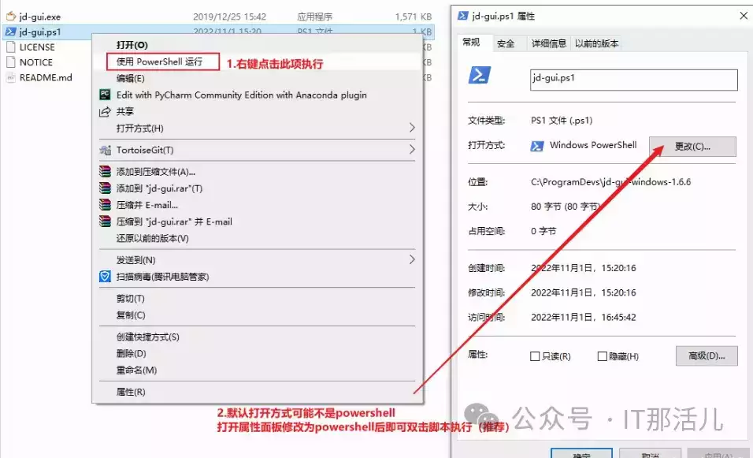
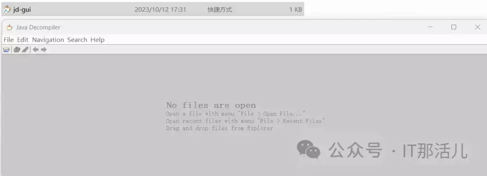

# 解决 JD-GUI 反编译 jar 注释中文乱码

  

  

  

问题现象

  

  

  

我们平时会使用 JD-GUI 反编译其他项目 jar 包来排查源码里有什么问题，如果源码中都是英文注释倒还好，**要是有中文注释，就会遇到中文乱码的情况**。


如上图所示，如果出现这种情况就很难通过注释快速了解代码逻辑，影响问题排查进度。如果是在 eclipse 或者 idea 中，一般直接在设置里配置编码格式为 UTF-8 重新打包即可，但目前这里显然不太现实。那么**如何解决这个问题，以下提供两种解决方**案。

  

  

  

解决方案

  

  

  

**2.1 命令行方式**

我们知道 JD-GUI 也是一个 java 程序，启动时除了直接双击.exe 文件，还可以在 cmd 里面直接使用 java -jar xxx 的方式，这样只需要指定 file.endocing=UTF-8 即可：



**2）**在弹出的窗口中输入 java -D'file.encoding=UTF-8' -jar %JD\_GUI\_HOME%\\jd-gui.exe，输入完命令后就会弹出 jd-gui 的页面


**3）**然后选择打开需反编译的 jar 包即可





如图所示，可以看到原来乱码的地方都已经显示正常了。

**2.2 脚本方式**

每次打开 powershell 并输入这一串命令显然很麻烦，其实可以通过脚本的方式，并绑定到 jd-gui 的快捷方式图标来自动配置并打开 jd-gui：

**1）**编写脚本

```plain
java -D'file.encoding=utf-8' -jar C:\ProgramDevs\jd-gui-windows-1.6.6\jd-gui.exe

powershell 脚本后缀为.ps1，保存为 C:\ProgramDevs\jd-gui-windows-1.6.6\jd-gui.ps1
```

**2）**测试脚本



**3）**绑定至 jd-gui 快捷方式


**4）**双击快捷方式即可打开 jd-gui 窗口，且中文不会乱码



**5）**然后选择打开需反编译的 jar 包即可 (同第一种方式步骤 3)