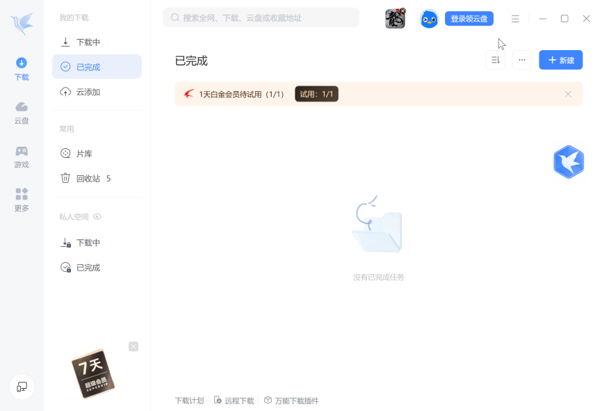
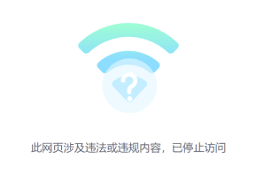
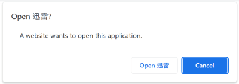

# 迅雷加速器应用存在多个漏洞 | 几乎安全 --- Numerous vulnerabilities in Xunlei Accelerator application | Almost Secure

Xunlei Accelerator (迅雷客户端) a.k.a. Xunlei Thunder by the China-based Xunlei Ltd. is a wildly popular application. According to the [company’s annual report](https://ir.xunlei.com/static-files/3100b981-4a23-460b-8342-a0446ffff2c4) 51.1 million active users were counted in December 2022. The company’s Google Chrome extension 迅雷下载支持，while not mandatory for using the application, had 28 million users at the time of writing.  
迅雷加速器（迅雷客户端）a.k.a. 中国迅雷公司的迅雷是一个广受欢迎的应用程序。根据该公司的年度报告，2022 年 12 月的活跃用户数为 5110 万。该公司的谷歌 Chrome 扩展浏览器下载支持，虽然不是强制使用该应用程序，但在撰写本文时有 2800 万用户。



I’ve found this application to expose a massive attack surface. This attack surface is largely accessible to arbitrary websites that an application user happens to be visiting. Some of it can also be accessed from other computers in the same network or by attackers with the ability to intercept user’s network connections ([Man-in-the-Middle attack](https://en.wikipedia.org/wiki/Man-in-the-middle_attack)).  
我发现这个应用程序暴露了一个巨大的攻击面。这种攻击面很大程度上可以被应用程序用户碰巧访问的任意网站访问。其中一些也可以从同一网络中的其他计算机或具有拦截用户网络连接能力的攻击者（中间人攻击）访问。

It does not appear like security concerns were considered in the design of this application. Extensive internal interfaces were exposed without adequate protection. Some existing security mechanisms were disabled. The application also contains large amounts of third-party code which didn’t appear to receive any security updates whatsoever.  
在此应用程序的设计中似乎没有考虑安全问题。大量的内部接口暴露在外，没有适当的保护。一些现有的安全机制被禁用。该应用程序还包含大量的第三方代码，这些代码似乎没有收到任何安全更新。

I’ve reported a number of vulnerabilities to Xunlei, most of which allowed remote code execution. Still, given the size of the attack surface it felt like I barely scratched the surface.  
我已经向迅雷报告了一些漏洞，其中大多数允许远程代码执行。尽管如此，考虑到攻击面的大小，我觉得我几乎没有触及表面。

Last time Xunlei made security news, it was due to distributing a malicious software component. Back then [it was an inside job](https://news.softpedia.com/news/Company-Admits-Its-Employees-Bundled-Malware-with-Xunlei-Download-Manager-390840.shtml), some employees turned rouge. However, the application’s flaws allowed the same effect to be easily achieved from any website a user of the application happened to be visiting.  
上一次迅雷发布安全新闻，是因为发布了一个恶意软件组件。当时是内部人干的，有些员工变成了胭脂。然而，该应用程序的缺陷允许从应用程序用户碰巧访问的任何网站轻松实现相同的效果。

#### Contents 内容

-   [↓↓↓](#what-is-xunlei-accelerator)  
      
    What is Xunlei Accelerator?  
    什么是迅雷加速器？  
      
    [↑↑↑](#what-is-xunlei-accelerator)
    
-   [↓↓↓](#the-built-in-web-browser)  
      
    The built-in web browser  
    内置 Web 浏览器  
      
    [↑↑↑](#the-built-in-web-browser)
    
    -   [↓↓↓](#the-trouble-with-custom-chromium-based-browsers)  
          
        The trouble with custom Chromium-based browsers  
        自定义基于 Chromium 的浏览器的问题  
          
        [↑↑↑](#the-trouble-with-custom-chromium-based-browsers)
        
    -   [↓↓↓](#protections-disabled)  
          
        Protections disabled  已禁用保护  
          
        [↑↑↑](#protections-disabled)
        
    -   [↓↓↓](#censorship-included)  
          
        Censorship included  审查包括  
          
        [↑↑↑](#censorship-included)
        
    -   [↓↓↓](#native-api)  
          
        Native API  原生 API  
          
        [↑↑↑](#native-api)
        
    -   [↓↓↓](#getting-into-the-xunlei-browser)  
          
        Getting into the Xunlei browser  
        进入迅雷浏览器  
          
        [↑↑↑](#getting-into-the-xunlei-browser)
        
    -   [↓↓↓](#the-fixes)  
          
        The fixes  的修复  
          
        [↑↑↑](#the-fixes)
        
-   [↓↓↓](#the-main-application)  
      
    The main application  
    主应用程序  
      
    [↑↑↑](#the-main-application)
    
    -   [↓↓↓](#outdated-electron-framework)  
          
        Outdated Electron framework  
        过时的电子框架  
          
        [↑↑↑](#outdated-electron-framework)
        
    -   [↓↓↓](#cross-site-scripting-vulnerabilities)  
          
        Cross-site scripting vulnerabilities  
        跨站点脚本漏洞  
          
        [↑↑↑](#cross-site-scripting-vulnerabilities)
        
    -   [↓↓↓](#impact-of-executing-arbitrary-code-in-the-renderer-process)  
          
        Impact of executing arbitrary code in the renderer process  
        在渲染器进程中执行任意代码的影响  
          
        [↑↑↑](#impact-of-executing-arbitrary-code-in-the-renderer-process)
        
    -   [↓↓↓](#the-lack-of-fixes)  
          
        The (lack of) fixes  
        （缺少）修复  
          
        [↑↑↑](#the-lack-of-fixes)
        
-   [↓↓↓](#the-xllite-application)  
      
    The XLLite application  
    XLLite 应用  
      
    [↑↑↑](#the-xllite-application)
    
    -   [↓↓↓](#overview-of-the-application)  
          
        Overview of the application  
        应用概述  
          
        [↑↑↑](#overview-of-the-application)
        
    -   [↓↓↓](#the-pan-authentication)  
          
        The “pan authentication”  
        “泛认证”  
          
        [↑↑↑](#the-pan-authentication)
        
    -   [↓↓↓](#achieving-code-execution-via-plugin-installation)  
          
        Achieving code execution via plugin installation  
        通过插件安装实现代码执行  
          
        [↑↑↑](#achieving-code-execution-via-plugin-installation)
        
    -   [↓↓↓](#the-fixes-1)  
          
        The fixes  的修复  
          
        [↑↑↑](#the-fixes-1)
        
-   [↓↓↓](#plugin-management)  
      
    Plugin management  插件管理  
      
    [↑↑↑](#plugin-management)
    
    -   [↓↓↓](#the-oddities)  
          
        The oddities  怪异之处  
          
        [↑↑↑](#the-oddities)
        
    -   [↓↓↓](#example-scenario-xlserviceplatform)  
          
        Example scenario: XLServicePlatform  
        示例场景：XLServicePlatform  
          
        [↑↑↑](#example-scenario-xlserviceplatform)
        
    -   [↓↓↓](#the-lack-of-fixes-1)  
          
        The (lack of?) fixes  
        缺少（？修复  
          
        [↑↑↑](#the-lack-of-fixes-1)
        
-   [↓↓↓](#outdated-components)  
      
    Outdated components  过时的组件  
      
    [↑↑↑](#outdated-components)
    
-   [↓↓↓](#reporting-the-issues)  
      
    Reporting the issues  报告问题  
      
    [↑↑↑](#reporting-the-issues)
    

## [](#what-is-xunlei-accelerator)What is Xunlei Accelerator?  
什么是迅雷加速器？

Wikipedia lists Xunlei Limited’s main product as a Bittorrent client, and maybe a decade ago it really was. Today however it’s rather difficult to describe what this application does. Is it a download manager? A web browser? A cloud storage service? A multimedia client? A gaming platform? It appears to be all of these things and more.  
维基百科将迅雷有限公司的主要产品列为 Bittorrent 客户端，也许十年前它确实是。然而，今天很难描述这个应用程序做了什么。这是一个下载管理器吗？网络浏览器？云存储服务？多媒体客户端？游戏平台？它似乎是所有这些事情和更多。

It’s probably easier to think of Xunlei as an advertising platform. It’s an application with the goal of maximizing profits through displaying advertising and selling subscriptions. As such, it needs to keep the users on the platform for as long as possible. That’s why it tries to implement every piece of functionality the user might need, while not being particularly good at any of it of course.  
把迅雷看作一个广告平台可能更容易一些。这是一个应用程序的目标是通过显示广告和销售订阅来实现利润最大化。因此，它需要尽可能长时间地将用户留在平台上。这就是为什么它试图实现用户可能需要的每一个功能，而不是特别擅长其中任何一个。

So there is a classic download manager that will hijack downloads initiated in the browser, with the promise of speeding them up. There is also a rudimentary web browser (two distinctly different web browsers in fact) so that you don’t need to go back to your regular web browser. You can play whatever you are downloading in the built-in media player, and you can upload it to the built-in storage. And did I mention games? Yes, there are games as well, just to keep you occupied.  
因此，有一个经典的下载管理器将劫持在浏览器中启动的下载，并承诺加快下载速度。还有一个基本的 Web 浏览器（实际上是两个截然不同的 Web 浏览器），这样你就不需要回到常规的 Web 浏览器。您可以在内置媒体播放器中播放您正在下载的任何内容，并且可以将其上传到内置存储。我有提到游戏吗？是的，也有游戏，只是为了让你有事可做。

Altogether this is a collection of numerous applications, built with a wide variety of different technologies, often implementing competing mechanisms for the same goal, yet trying hard to keep the outward appearance of a single application.  
总而言之，这是一个由大量应用程序组成的集合，这些应用程序使用各种不同的技术构建，经常为同一个目标实现相互竞争的机制，但却努力保持单个应用程序的外观。

## [](#the-built-in-web-browser)The built-in web browser  
内置 Web 浏览器

### [](#the-trouble-with-custom-chromium-based-browsers)The trouble with custom Chromium-based browsers  
自定义基于 Chromium 的浏览器的问题

Companies love bringing out their own web browsers. The reason is not that their browser is any better than the other 812 browsers already on the market. It’s rather that web browsers can monetize your searches (and, if you are less lucky, also your browsing history) which is a very profitable business.  
公司喜欢推出自己的网络浏览器。原因并不是他们的浏览器比市场上其他 812 浏览器更好。相反，网络浏览器可以通过你的搜索（如果你不那么幸运，还可以通过你的浏览历史）赚钱，这是一项非常有利可图的业务。

Obviously, profits from that custom-made browser are higher if the company puts as little effort into maintenance as possible. So they take the open source Chromium, slap their branding on it, maybe also a few half-hearted features, and they call it a day.  
显然，如果公司尽可能少地投入维护工作，定制浏览器的利润会更高。所以他们采用开源的 Chromium，在上面打上他们的品牌，也许还有一些半心半意的功能，然后他们就收工了。

Trouble is: a browser has a massive attack surface which is exposed to arbitrary web pages (and ad networks) by definition. Companies like Mozilla or Google invest enormous resources into quickly plugging vulnerabilities and bringing out updates every six weeks. And that custom Chromium-based browser also needs updates every six weeks, or it will expose users to known (and often widely exploited) vulnerabilities.  
问题是：浏览器有一个巨大的攻击面，根据定义，它会暴露给任意网页（和广告网络）。像 Mozilla 或谷歌这样的公司投入了大量资源来快速修补漏洞，并每六周更新一次。基于 Chromium 的自定义浏览器也需要每六周更新一次，否则它会使用户暴露于已知（通常被广泛利用）的漏洞。

Even merely keeping up with Chromium development is tough, which is why it almost never happens. In fact, when I looked at the unnamed web browser built into the Xunlei application (internal name: TBC), it was based on Chromium 83.0.4103.106. Being released in May 2020, this particular browser version was already three and a half years old at that point. For reference: Google fixed eight actively exploited zero-day vulnerabilities in Chromium in the year 2023 alone.  
即使只是跟上 Chromium 的发展也很坚韧，这就是为什么它几乎从未发生过。事实上，当我查看迅雷应用程序（内部名称：TBC）中内置的未命名 Web 浏览器时，它基于 Chromium 83.0.4103.106。这个浏览器版本于 2020 年 5 月发布，当时已经有三年半的历史了。仅在 2023 年，谷歌就修复了 8 个被积极利用的 Chromium 零日漏洞。

Among others, the browser turned out to be vulnerable to CVE-2021-38003. There is [this article](https://medium.com/numen-cyber-labs/from-leaking-thehole-to-chrome-renderer-rce-183dcb6f3078) which explains how this vulnerability allows JavaScript code on any website to gain read/write access to raw memory. I could reproduce this issue in the Xunlei browser.  
除此之外，该浏览器还容易受到 CVE-2021-38003 的攻击。有这篇文章解释了这个漏洞如何允许任何网站上的 JavaScript 代码获得对原始内存的读 / 写访问。我可以在迅雷浏览器中重现这个问题。

### [](#protections-disabled)Protections disabled 已禁用保护

It is hard to tell whether not having a pop-up blocker in this browser was a deliberate choice or merely a consequence of the browser being so basic. Either way, websites are free to open as many tabs as they like. Adding `--autoplay-policy=no-user-gesture-required` command line flag definitely happened intentionally however, turning off video autoplay protections.  
很难说这个浏览器中没有弹出窗口拦截器是一个故意的选择，还是仅仅是浏览器如此基本的结果。无论哪种方式，网站都可以自由地打开尽可能多的标签。添加 `--autoplay-policy=no-user-gesture-required` 命令行标志肯定是故意的，但是，关闭视频自动播放保护。

It’s also notable that Xunlei revives Flash Player in their browser. Flash Player support has been disabled in all browsers in December 2020, for various reasons including security. Xunlei didn’t merely decide to ignore this reasoning, they shipped Flash Player 29.0.0.140 (released in April 2018) with their browser. Adobe support website [lists numerous Flash Player security fixes](https://helpx.adobe.com/security/security-bulletin.html#flashplayer) published after April 2018 and before end of support.  
同样值得注意的是，迅雷在他们的浏览器中恢复了 Flash Player。出于安全等各种原因，Flash Player 支持已于 2020 年 12 月在所有浏览器中禁用。迅雷 29.0.0.140 Adobe 支持网站列出了 2018 年 4 月之后和支持结束之前发布的许多 Flash Player 安全修复程序。

### [](#censorship-included)Censorship included 审查包括

Interestingly, Xunlei browser won’t let users visit the `example.com` website (as opposed to `example.net`). When you try, the browser redirects you to a page on `static.xbase.cloud`. This is an asynchronous process, so chances are good that you will catch a glimpse of the original page first.  
有趣的是，迅雷浏览器不会让用户访问 `example.com` 网站（而不是 `example.net` ）。当您尝试时，浏览器会将您重定向到 `static.xbase.cloud` 上的页面。这是一个异步的过程，因此您很有可能首先看到原始页面。



Automated translation of the text: “This webpage contains illegal or illegal content and access has been stopped.”  
文本的自动翻译：“此网页包含非法或非法内容，访问已停止。”

As it turns out, the application will send every website you visit to an endpoint on `api-shoulei-ssl.xunlei.com`. That endpoint will either accept your choice of navigation target or instruct to redirect you to a different address. So when to navigate to `example.com` the following request will be sent:  
事实证明，应用程序会将您访问的每个网站发送到 `api-shoulei-ssl.xunlei.com` 上的端点。该端点将接受您选择的导航目标或指示将您重定向到其他地址。因此，当导航到 `example.com` 时，将发送以下请求：

```bash
POST /xlppc.blacklist.api/v1/check HTTP/1.1
Content-Length: 29
Content-Type: application/json
Host: api-shoulei-ssl.xunlei.com

{"url":"http://example.com/"}
```

And the server responds with:  
服务器响应：

```json
{
  "code": 200,
  "msg": "ok",
  "data": {
    "host": "example.com",
    "redirect": "https://static.xbase.cloud/file/2rvk4e3gkdnl7u1kl0k/xappnotfound/#/unreach",
    "result": "reject"
  }
}
```

Interestingly, giving it the address `http://example.com./` (note the trailing dot) will result in the response `{"code":403,"msg":"params error","data":null}`. With the endpoint being unable to handle this address, the browser will allow you to visit it.  
有趣的是，给它地址 `http://example.com./` （注意结尾的点）将导致响应 `{"code":403,"msg":"params error","data":null}` 。由于端点无法处理此地址，浏览器将允许您访问它。

### [](#native-api)Native API 原生 API

In an interesting twist, the Xunlei browser exposed `window.native.CallNativeFunction()` method to all web pages. Calls would be forwarded to the main application where any plugin could register its native function handlers. When I checked, there were 179 such handlers registered, though that number might vary depending on the active plugins.  
一个有趣的转折是，迅雷浏览器向所有网页公开了 `window.native.CallNativeFunction()` 方法。调用将被转发到主应用程序，任何插件都可以在其中注册其本机函数处理程序。当我检查时，有 179 个这样的处理程序注册，尽管这个数字可能会因活动插件而异。

Among the functions exposed were `ShellOpen` (used Windows shell APIs to open a file), `QuerySqlite` (query database containing download tasks), `SetProxy` (configure a proxy server to be used for all downloads) or `GetRecentHistorys` (retrieve browsing history for the Xunlei browser).  
其中暴露的功能包括 `ShellOpen` （使用 Windows shell API 打开文件）， `QuerySqlite` （查询包含下载任务的数据库）， `SetProxy` （配置用于所有下载的代理服务器）或 `GetRecentHistorys` （检索迅雷浏览器的浏览历史记录）。

My proof-of-concept exploit would run the following code:  
我的概念验证漏洞将运行以下代码：

```js
native.CallNativeFunction("ShellOpen", "c:\\windows\\system32\\calc.exe");
```

This would open the Windows Calculator, just as you’d expect.  
这将打开 Windows 计算器，正如您所期望的那样。

Now this API was never meant to be exposed to all websites but only to a selected few very “trusted” ones. The allowlist here is:  
现在这个 API 从来没有打算暴露给所有的网站，但只选择了几个非常“信任”的。这里的 allowlist 是：

```json
[
  ".xunlei.com",
  "h5-pccloud.onethingpcs.com",
  "h5-pccloud.test.onethingpcs.com",
  "h5-pciaas.onethingpcs.com",
  "h5-pccloud.onethingcloud.com",
  "h5-pccloud-test.onethingcloud.com",
  "h5-pcxl.hiveshared.com"
]
```

And here is how access was being validated:  
以下是如何验证访问权限：

```js
function isUrlInDomains(url, allowlist, frameUrl) {
  let result = false;
  for (let index = 0; index < allowlist.length; ++index) {
    if (url.includes(allowlist[index]) || frameUrl && frameUrl.includes(allowlist[index])) {
      result = true;
      break;
    }
  }
  return result;
}
```

As you might have noticed, this doesn’t actually validate the host name against the list but looks for substring matches in the entire address. So `https://malicious.com/?www.xunlei.com` is also considered a trusted address, allowing for a trivial circumvention of this “protection.”  
正如您可能已经注意到的，这实际上并没有根据列表验证主机名，而是在整个地址中查找子字符串匹配。所以 `https://malicious.com/?www.xunlei.com` 也被认为是一个受信任的地址，允许对这种“保护”的轻微规避。

### [](#getting-into-the-xunlei-browser)Getting into the Xunlei browser  
进入迅雷浏览器

Now most users hopefully won’t use Xunlei for their regular browsing. These should be safe, right?  
现在，大多数用户希望不会使用迅雷进行常规浏览。这些应该很安全吧

Unfortunately not, as there is a number of ways for webpages to open the Xunlei browser. The simplest way is using a special `thunderx://` address. For example, `thunderx://eyJvcHQiOiJ3ZWI6b3BlbiIsInBhcmFtcyI6eyJ1cmwiOiJodHRwczovL2V4YW1wbGUuY29tLyJ9fQ==` will open the Xunlei browser and load `https://example.com/` into it. From the attacker’s point of view, this approach has a downside however: modern browsers ask the user for confirmation before letting external applications handle addresses.  
不幸的是，没有，因为有很多方法可以打开网页迅雷浏览器。最简单的方法是使用一个特殊的 `thunderx://` 地址。例如， `thunderx://eyJvcHQiOiJ3ZWI6b3BlbiIsInBhcmFtcyI6eyJ1cmwiOiJodHRwczovL2V4YW1wbGUuY29tLyJ9fQ==` 将打开迅雷浏览器并加载 `https://example.com/` 。从攻击者的角度来看，这种方法有一个缺点：现代浏览器在让外部应用程序处理地址之前会要求用户确认。



There are alternatives however. For example, the Xunlei browser extension (28 million users according to Chrome Web Store) is meant to pass on downloads to the Xunlei application. It could be instrumented into passing on `thunderx://` links without any user interaction however, and these would immediately open arbitrary web pages in the Xunlei browser.  
然而，还有其他选择。例如，迅雷浏览器扩展程序（根据 Chrome 网上商店的数据，该扩展程序拥有 2800 万用户）旨在将下载传递给迅雷应用程序。然而，它可以在没有任何用户交互的情况下传递 `thunderx://` 链接，这些链接将立即在迅雷浏览器中打开任意网页。

More ways to achieve this are exposed by the XLLite application’s API which is [introduced later](#achieving-code-execution-via-plugin-installation). And that’s likely not even the end of it.  
XLLite 应用程序的 API（稍后介绍）提供了实现此目的的更多方法。这可能还没完。

### [](#the-fixes)The fixes 的修复

While Xunlei never communicated any resolution of these issues to me, as of Xunlei Accelerator 12.0.8.2392 (built on February 2, 2024 judging by executable signatures) several changes have been implemented. First of all, the application no longer packages Flash Player. It still activates Flash Player if it is installed on the user’s system, so some users will still be exposed. But chances are good that this Flash Player installation will at least be current (as much as software can be “current” three years after being discontinued).  
虽然迅雷从未向我传达过这些问题的任何解决方案，但截至迅雷加速器 12.0.8.2392（根据可执行签名判断，构建于 2024 年 2 月 2 日），已经实施了一些更改。首先，应用程序不再打包 Flash Player。如果 Flash Player 安装在用户的系统上，它仍然会激活 Flash Player，因此某些用户仍然会暴露。但是很有可能这个 Flash Player 安装至少是最新的（就像软件在停产三年后仍然是“最新的”一样）。

The `isUrlInDomains()` function has been rewritten, and the current logic appears reasonable. It will now only check the allowlist against the end of the hostname, matches elsewhere in the address won’t be accepted. So this now leaves “only” all of the xunlei.com domain with access to the application’s internal APIs. Any [cross-site scripting vulnerability](https://en.wikipedia.org/wiki/Cross-site_scripting) anywhere on this domain will again put users at risk.  
`isUrlInDomains()` 函数已重写，当前逻辑似乎合理。它现在只会检查 allowlist 是否与主机名的末尾相匹配，地址中其他地方的匹配将不被接受。因此，现在只剩下 xunlei.com 此域上任何地方的任何跨站点脚本漏洞都将再次将用户置于危险之中。

The outdated Chromium base appears to remain unchanged. It still reports as Chromium 83.0.4103.106, and the exploit for CVE-2021-38003 still succeeds.  
过时的 Chromium 基础似乎保持不变。它仍然报告为 Chromium 83.0.4103.106，并且 CVE-2021-38003 的漏洞仍然成功。

The browser extension 迅雷下载支持 also received an update, version 3.48 on January 3, 2024. According to automated translation, the changelog entry for this version reads: “Fixed some known issues.”The fix appears to be adding a bunch of checks for the [event.isTrusted property](https://developer.mozilla.org/en-US/docs/Web/API/Event/isTrusted), making sure that the extension can no longer be instrumented quite as easily. Given these restrictions, just opening the `thunderx://` address directly likely has higher chances of success now, especially when combined with social engineering.  
浏览器扩展插件谷歌下载支持也于 2024 年 1 月 3 日收到更新，版本 3.48。根据自动翻译，该版本的更新日志条目为：“修复了一些已知问题。”修复似乎是为 event.isTrusted 属性添加了一系列检查，以确保扩展不再那么容易被检测。考虑到这些限制，直接打开 `thunderx://` 地址现在可能有更高的成功机会，特别是当与社会工程相结合时。

## [](#the-main-application)The main application 主应用程序

### [](#outdated-electron-framework)Outdated Electron framework  
过时的电子框架

The main Xunlei application is based on the [Electron framework](https://en.wikipedia.org/wiki/Electron_(software_framework)). This means that its user interface is written in HTML and displayed via the Chromium web browser (renderer process). And here again it’s somewhat of a concern that the Electron version used is 83.0.4103.122 (released in June 2020). It can be expected to share most of the security vulnerabilities with a similarly old Chromium browser.  
迅雷的主要应用程序基于 Electron 框架。这意味着它的用户界面是用 HTML 编写的，并通过 Chromium Web 浏览器（渲染器进程）显示。在这里，需要再次关注的是，使用的 Electron 版本是 83.0.4103.122（于 2020 年 6 月发布）。可以预期，它将与类似的旧 Chromium 浏览器共享大部分安全漏洞。

Granted, an application like that should be less exposed than a web browser as it won’t just load any website. But it does work with remote websites, so vulnerabilities in the way it handles web content are an issue.  
当然，这样的应用程序应该比 Web 浏览器更少暴露，因为它不会加载任何网站。但它确实适用于远程网站，因此它处理 Web 内容的方式存在漏洞。

### [](#cross-site-scripting-vulnerabilities)Cross-site scripting vulnerabilities  
跨站点脚本漏洞

Being HTML-based, the Xunlei application is potentially vulnerable to [cross-site scripting vulnerabilities](https://en.wikipedia.org/wiki/Cross-site_scripting). For most part, this is mitigrated by using the React framework. React doesn’t normally work with raw HTML code, so there is no potential for vulnerabilities here.  
由于基于 HTML，迅雷应用程序可能容易受到跨站点脚本漏洞的攻击。在大多数情况下，使用 React 框架可以缓解这种情况。React 通常不使用原始 HTML 代码，因此这里没有潜在的漏洞。

Well, normally. Unless `dangerouslySetInnerHTML` property is being used, which you should normally avoid. But it appears that Xunlei developers used this property in a few places, and now they have code displaying messages like this:  
一般来说除非正在使用 `dangerouslySetInnerHTML` 属性，通常应避免使用。但迅雷的开发者似乎在一些地方使用了这个属性，现在他们的代码显示了这样的消息：

```js
$createElement("div", {
  staticClass: "xly-dialog-prompt__text",
  domProps: { innerHTML: this._s(this.options.content) }
})
```

If message content ever happens to be some malicious data, it could create HTML elements that will result in execution of arbitrary JavaScript code.  
如果消息内容碰巧是某些恶意数据，它可能会创建 HTML 元素，从而导致执行任意 JavaScript 代码。

How would malicious data end up here? Easiest way would be [via the browser](#native-api). There is for example the `MessageBoxConfirm` native function that could be called like this:  
恶意数据如何在这里结束？最简单的方法是通过浏览器。例如，可以像这样调用 `MessageBoxConfirm` 本机函数：

```js
native.CallNativeFunction("MessageBoxConfirm", JSON.stringify({
  title: "Hi",
  content: ``,
  type: "info",
  okText: "Ok",
  cancelVisible: false
}));
```

When executed on a “trusted” website in the Xunlei browser, this would make the main application display a message and, as a side-effect, run the JavaScript code `alert(location.href)`.  
当在迅雷浏览器中的“可信”网站上执行时，这将使主应用程序显示一条消息，并作为副作用运行 JavaScript 代码 `alert(location.href)` 。

### [](#impact-of-executing-arbitrary-code-in-the-renderer-process)Impact of executing arbitrary code in the renderer process  
在渲染器进程中执行任意代码的影响

Electron normally [sandboxes renderer processes](https://www.electronjs.org/docs/latest/tutorial/sandbox#renderer-processes), making certain that these have only limited privileges and vulnerabilities are harder to exploit. This security mechanism is active in the Xunlei application.  
Electron 通常会对渲染进程进行沙箱处理，确保这些进程只有有限的权限，并且漏洞更难利用。这种安全机制在迅雷应用中是活跃的。

However, Xunlei developers at some point must have considered it rather limiting. After all, their user interface needed to perform lots of operations. And providing a restricted interface for each such operation was too much effort.  
然而，迅雷的开发人员在某种程度上肯定认为它相当有限。毕竟，他们的界面需要进行大量的操作。而且为每个这样的操作提供一个受限的接口是非常费力的。

So they built a generic interface into the application. By means of messages like `AR_BROWSER_REQUIRE` or `AR_BROWSER_MEMBER_GET`, the renderer process can instruct the main (privileged) process of the application to do just about anything.  
因此，他们在应用程序中构建了一个通用接口。通过像 `AR_BROWSER_REQUIRE` 或 `AR_BROWSER_MEMBER_GET` 这样的消息，渲染器进程可以指示应用程序的主（特权）进程做任何事情。

My proof-of-concept exploit successfully abused this interface by loading Electron’s [shell module](https://www.electronjs.org/docs/latest/api/shell) (not accessible to sandboxed renderers by regular means) and calling one of its methods. In other words, the Xunlei application managed to render this security boundary completely useless.  
我的概念验证漏洞成功地通过加载 Electron 的 shell 模块（无法通过常规方式访问沙箱渲染器）并调用其方法之一来滥用了此接口。换句话说，迅雷应用程序设法使这个安全边界完全无用。

### [](#the-lack-of-fixes)The (lack of) fixes  
（缺少）修复

Looking at Xunlei Accelerator 12.0.8.2392, I could not recognize any improvements in this area. The application is still based on Electron 83.0.4103.122. The number of potential XSS vulnerabilities in the message rendering code didn’t change either.  
看看迅雷加速器 12.0.8.2392，我无法识别这方面的任何改进。该应用程序仍然基于 Electron 83.0.4103.122。消息呈现代码中潜在的 XSS 漏洞数量也没有改变。

It appears that Xunlei called it a day after making certain that triggering messages with arbitrary content became more difficult. I doubt that it is impossible however.  
迅雷似乎是在确定触发带有任意内容的消息变得更加困难后的第二天宣布这一消息的。但我怀疑这是不可能的。

## [](#the-xllite-application)The XLLite application XLLite 应用

### [](#overview-of-the-application)Overview of the application  
应用概述

The XLLite application is one of the plugins running within the Xunlei framework. Given that I never created a Xunlei account to see this application in action, my understanding of its intended functionality is limited. Its purpose however appears to be integrating the Xunlei cloud storage into the main application.  
XLLite 应用程序是在迅雷框架内运行的插件之一。鉴于我从未创建过迅雷账户来查看这个应用程序的运行情况，我对其预期功能的理解有限。然而，其目的似乎是将迅雷云存储集成到主应用程序中。

As it cannot modify the main application’s user interface directly, it exposes its own user interface as a local web server, on a randomly chosen port between 10500 and 10599. That server essentially provides static files embedded in the application, all functionality is implemented in client-side JavaScript.  
由于它不能直接修改主应用程序的用户界面，因此它将自己的用户界面作为本地 Web 服务器暴露在 10500 和 10599 之间随机选择的端口上。该服务器本质上提供嵌入在应用程序中的静态文件，所有功能都在客户端 JavaScript 中实现。

Privileged operations are provided by a separate local server running on port 21603. Some of the API calls exposed here are handled by the application directly, others are forwarded to the main application via yet another local server.  
缓存操作由运行在端口 21603 上的独立本地服务器提供。这里公开的一些 API 调用由应用程序直接处理，其他调用通过另一个本地服务器转发到主应用程序。

I originally got confused about how the web interface accesses the API server, with the latter failing to implement [CORS](https://developer.mozilla.org/en-US/docs/Web/HTTP/CORS) correctly – `OPTION` requests don’t get a correct response, so that only basic requests succeed. It appears that Xunlei developers didn’t manage to resolve this issue and instead resorted to proxying the API server on the user interface server. So any endpoints available on the API server are exposed by the user interface server as well, here correctly (but seemingly unnecessarily) using CORS to allow access from everywhere.  
我最初对 Web 接口如何访问 API 服务器感到困惑，后者未能正确实现 CORS- `OPTION` 请求没有得到正确的响应，因此只有基本请求成功。看来迅雷的开发人员并没有设法解决这个问题，而是采取了在用户界面服务器上禁用 API 服务器的做法。因此，API 服务器上可用的任何端点也由用户界面服务器公开，这里正确地（但似乎不必要）使用 CORS 来允许从任何地方访问。

So the communication works like this: the Xunlei application loads `http://127.0.0.1:105xx/` in a frame. The page then requests some API on its own port, e.g. `http://127.0.0.1:105xx/device/now`. When handling the request, the XLLite application requests `http://127.0.0.1:21603/device/now` internally. And the API server handler within the same process responds with the current timestamp.  
因此，通信是这样工作的：迅雷应用程序在一个帧中加载 `http://127.0.0.1:105xx/` 。然后，页面在自己的端口上请求一些 API，例如 `http://127.0.0.1:105xx/device/now` 。在处理请求时，XLLite 应用程序在内部请求 `http://127.0.0.1:21603/device/now` 。并且同一进程中的 API 服务器处理程序使用当前时间戳进行响应。

This approach appears to make little sense. However, it’s my understanding that Xunlei also produces storage appliances which can be installed on the local network. Presumably, these appliances run identical code to expose an API server. This would also explain why the API server is exposed to the network rather than being a localhost-only server.  
这种做法似乎没有什么意义。不过，据我所知，迅雷也生产可以安装在本地网络上的存储设备。据推测，这些设备运行相同的代码来公开 API 服务器。这也可以解释为什么 API 服务器暴露于网络，而不是仅作为本地主机的服务器。

### [](#the-pan-authentication)The “pan authentication”  
“泛认证”

With quite a few API calls having the potential to do serious damage or at the very least expose private information, these need to be protected somehow. As mentioned above, Xunlei developers chose not to use CORS to restrict access but rather decided to expose the API to all websites. Instead, they implemented their own “pan authentication” mechanism.  
由于相当多的 API 调用有可能造成严重损害，或者至少暴露私人信息，因此需要以某种方式保护这些调用。如上所述，迅雷开发者选择不使用 CORS 来限制访问，而是决定将 API 公开给所有网站。相反，他们实现了自己的“泛认证”机制。

Their approach of generating authentication tokens was taking the current timestamp, concatenating it with a long static string (hardcoded in the application) and hashing the result with MD5. Such tokens would expire after 5 minutes, apparently an attempt to thwart replay attacks.  
他们生成身份验证令牌的方法是获取当前时间戳，将其与一个长静态字符串（在应用程序中硬编码）连接起来，并使用 MD5 对结果进行散列。这些令牌将在 5 分钟后过期，显然是为了阻止重放攻击。

They even went as far as to perform time synchronization, making sure to correct for deviation between the current time as perceived by the web page (running on the user’s computer) and by the API server (running on the user’s computer). Again, this is something that probably makes sense if the API server can under some circumstances be running elsewhere on the network.  
他们甚至执行时间同步，确保纠正网页（在用户计算机上运行）和 API 服务器（在用户计算机上运行）感知的当前时间之间的偏差。同样，如果 API 服务器在某些情况下可以在网络上的其他地方运行，那么这可能是有意义的。

Needless to say that this “authentication” mechanism doesn’t provide any value beyond very basic obfuscation.  
不用说，这种“身份验证”机制除了非常基本的混淆之外，没有提供任何价值。

### [](#achieving-code-execution-via-plugin-installation)Achieving code execution via plugin installation  
通过插件安装实现代码执行

There are quite a few interesting API calls exposed here. For example, the `device/v1/xllite/sign` endpoint would sign data with one out of three private RSA keys hardcoded in the application. I don’t know what this functionality is used for, but I sincerely hope that it’s as far away from security and privacy topics as somehow possible.  
这里公开了很多有趣的 API 调用。例如， `device/v1/xllite/sign` 端点将使用应用程序中硬编码的三个 RSA 私钥之一来签署数据。我不知道这个功能是用来做什么的，但我真诚地希望它尽可能远离安全和隐私话题。

There is also the `device/v1/call` endpoint which is yet another way to open a page in the Xunlei browser. Both `OnThunderxOpt` and `OpenNewTab` calls allow that, the former taking a `thunderx://` address to be processed and the latter a raw page address to be opened in the browser.  
还有 `device/v1/call` 端点，这是在迅雷浏览器中打开页面的另一种方式。 `OnThunderxOpt` 和 `OpenNewTab` 调用都允许这样做，前者获取要处理的 `thunderx://` 地址，后者获取要在浏览器中打开的原始页面地址。

It’s fairly obvious that the API exposes full access to the user’s cloud storage. I chose to focus my attention on the `drive/v1/app/install` endpoint however, which looked like it could do even more damage. This endpoint in fact turned out to be a way to install binary plugins.  
很明显，API 公开了对用户云存储的完全访问。然而，我选择将注意力集中在 `drive/v1/app/install` 端点上，看起来它可能会造成更大的损害。这个端点实际上是一种安装二进制插件的方法。

I couldn’t find any security mechanisms preventing malicious software to be installed this way, apart from the already mentioned useless “pan authentication.” However, I couldn’t find any actual plugins to use as an example. In the end I figured out that a plugin had to be packaged in an archive containing a `manifest.yaml` file like the following:  
我找不到任何安全机制来防止恶意软件以这种方式安装，除了已经提到的无用的“泛认证”。然而，我找不到任何实际的插件作为例子。最后，我发现一个插件必须打包在一个包含如下所示的 `manifest.yaml` 文件的归档文件中：

```yaml
ID: Exploit
Title: My exploit
Description: This is an exploit
Version: 1.0.0
System:
  - OS: windows
    ARCH: 386
Service:
  ExecStart: Exploit.exe
  ExecStop: Exploit.exe
```

The plugin would install successfully under `Thunder\Profiles\XLLite\plugin\Exploit\1.0.1\Exploit` but the binary wouldn’t execute for some reason. Maybe there is a security mechanism that I missed, or maybe the plugin interface simply isn’t working yet.  
插件将在 `Thunder\Profiles\XLLite\plugin\Exploit\1.0.1\Exploit` 下成功安装，但由于某种原因，二进制文件无法执行。也许有一个安全机制，我错过了，或者也许插件接口只是还没有工作。

Either way, I started thinking: what if instead of making XLLite run my “plugin” I would replace an existing binary? It’s easy enough to produce an archive with file paths like `..\..\..\oops.exe`. However, the [Go package archiver](https://pkg.go.dev/github.com/mholt/archiver) used here has protection against such path traversal attacks.  
无论哪种方式，我开始思考：如果不是让 XLLite 运行我的“插件”，而是替换现有的二进制文件，会怎么样？使用像 `..\..\..\oops.exe` 这样的文件路径生成一个归档文件是很容易的。然而，这里使用的 Go 包归档器可以防止这种路径遍历攻击。

The XLLite code deciding which folder to put the plugin into didn’t have any such protections on the other hand. The folder is determined by the `ID` and `Version` values of the plugin’s manifest. Messing with the former is inconvenient, it being present twice in the path. But setting the “version” to something like `..\..\..` achieved the desired results.  
另一方面，决定将插件放入哪个文件夹的 XLLite 代码没有任何这样的保护。文件夹由插件清单的 `ID` 和 `Version` 值决定。使用前一个版本是不方便的，因为它在路径中出现了两次。但是将“版本”设置为像 `..\..\..` 这样的值可以达到预期的效果。

Two complications: 两个并发症：

1.  The application to be replaced cannot be running or the Windows file locking mechanism will prevent it from being replaced.  
    要替换的应用程序无法运行，或者 Windows 文件锁定机制将阻止它被替换。
2.  The plugin installation will only replace entire folders.  
    插件安装只会替换整个文件夹。

In the end, I chose to replace Xunlei’s media player for my proof of concept. This one usually won’t be running and it’s contained in a folder of its own. It’s also fairly easy to make Xunlei run the media player by using a `thunderx://` link. Behold, installation and execution of a malicious application without any user interaction.  
最后，我选择替换迅雷的媒体播放器作为我的概念验证。这一个通常不会运行，它包含在自己的文件夹中。通过使用 `thunderx://` 链接让迅雷运行媒体播放器也相当容易。看，安装和执行恶意应用程序没有任何用户交互。

Remember that the API server is exposed to the local network, meaning that any devices on the network can also perform API calls. So this attack could not merely be executed from any website the user happened to be visiting, it could also be launched by someone on the same network, e.g. when the user is connected to a public WiFi.  
请记住，API 服务器暴露于本地网络，这意味着网络上的任何设备也可以执行 API 调用。因此，这种攻击不仅可以从用户碰巧访问的任何网站执行，也可以由同一网络上的某人发起，例如当用户连接到公共 WiFi 时。

### [](#the-fixes-1)The fixes 的修复

As of version 3.19.4 of the XLLite plugin (built January 25, 2024 according to its digital signature), the “pan authentication” method changed to use [JSON Web Tokens](https://en.wikipedia.org/wiki/JSON_Web_Token). The authentication token is embedded within the main page of the user interface server. Without any CORS headers being produced for this page, the token cannot be extracted by other web pages.  
从 XLLite 插件的 3.19.4 版本（根据其数字签名于 2024 年 1 月 25 日构建）开始，“泛认证”方法更改为使用 JSON Web 令牌。身份验证令牌嵌入在用户界面服务器的主页中。如果没有为此页面生成任何 CORS 头，则其他网页无法提取令牌。

It wasn’t immediately obvious what secret is being used to generate the token. However, authentication tokens aren’t invalidated if the Xunlei application is restarted. This indicates that the secret isn’t being randomly generated on application startup. The remaining possibilities are: a randomly generated secret stored somewhere on the system (okay) or an obfuscated hardcoded secret in the application (very bad).  
目前还不清楚是什么秘密被用来生成令牌。但是，如果迅雷应用程序重启，认证令牌不会失效。这表明密钥不是在应用程序启动时随机生成的。其余的可能性是：一个随机生成的秘密存储在系统的某个地方（好的），或者一个模糊的硬编码秘密存储在应用程序中（非常糟糕）。

While calls to other endpoints succeed after adjusting authentication, calls to the `drive/v1/app/install` endpoint result in a “permission denied” response now. I did not investigate whether the endpoint has been disabled or some additional security mechanism has been added.  
虽然在调整身份验证后对其他端点的调用成功，但对 `drive/v1/app/install` 端点的调用现在会导致“permission denied”响应。我没有调查端点是否已被禁用或添加了一些额外的安全机制。

## [](#plugin-management)Plugin management 插件管理

### [](#the-oddities)The oddities 怪异之处

XLLite’s plugin system is actually only one out of at least five completely different plugin management systems in the Xunlei application. One other is the main application’s plugin system, the XLLite application is installed as one such plugin. There are more, and `XLLiveUpdateAgent.dll` is tasked with keeping them updated. It will download the list of plugins from an address like `http://upgrade.xl9.xunlei.com/plugin?os=10.0.22000&pid=21&v=12.0.3.2240&lng=0804` and make sure that the appropriate plugins are installed.  
XLLite 的插件系统实际上只是迅雷应用中至少五个完全不同的插件管理系统中的一个。另一个是主应用程序的插件系统，XLLite 应用程序作为一个这样的插件安装。还有更多， `XLLiveUpdateAgent.dll` 的任务是保持更新。它将从类似 `http://upgrade.xl9.xunlei.com/plugin?os=10.0.22000&pid=21&v=12.0.3.2240&lng=0804` 的地址下载插件列表，并确保安装了适当的插件。

Note the lack of TLS encryption here which is quite typical. Part of the issue appears to be that Xunlei decided to implement their own HTTP client for their downloads. In fact, they’ve implemented a number of different HTTP clients instead of using any of the options available via the Windows API for example. Some of these HTTP clients are so limited that they cannot even parse uncommon server responses, much less support TLS. Others support TLS but use their own list of CA certificates which happens to be Mozilla’s list from 2016 (yes, that’s almost eight years old).  
请注意，这里缺少 TLS 加密，这是非常典型的。问题的一部分似乎是迅雷决定为他们的下载实现自己的 HTTP 客户端。事实上，他们已经实现了许多不同的 HTTP 客户端，而不是使用通过 Windows API 提供的任何选项。其中一些 HTTP 客户端非常有限，甚至无法解析不常见的服务器响应，更不用说支持 TLS 了。其他支持 TLS，但使用他们自己的 CA 证书列表，这恰好是 Mozilla 从 2016 年开始的列表（是的，这几乎是八年前的）。

Another common issue is that almost all these various update mechanisms run as part of the regular application process, meaning that they only have user’s privileges. How do they manage to write to the application directory then? Well, Xunlei solved this issue: they made the application directory writable with user’s privileges! Another security mechanism successfully dismantled. And there is a bonus: they can store application data in the same directory rather than resorting to per-user nonsense like AppData.  
另一个常见的问题是，几乎所有这些不同的更新机制都是作为常规应用程序进程的一部分运行的，这意味着它们只具有用户的权限。那么，他们是如何设法写入应用程序目录的呢？好吧，迅雷解决了这个问题：他们使应用程序目录可写与用户的特权！又一个安全机制被成功拆除。还有一个好处：它们可以将应用程序数据存储在同一个目录中，而不是像 AppData 那样诉诸于每个用户的废话。

Altogether, you better don’t run Xunlei Accelerator on untrusted networks (meaning: any of them?). Anyone on your network or anyone who manages to insert themselves into the path between you and the Xunlei update server will be able to manipulate the server response. As a result, the application will install a malicious plugin without you even noticing anything.  
总之，你最好不要在不受信任的网络上运行迅雷加速器（意思是：任何一个？）。您网络上的任何人或任何设法插入您和迅雷更新服务器之间路径的人都能够操纵服务器响应。因此，应用程序将安装恶意插件，而您甚至没有注意到任何事情。

You also better don’t run Xunlei Accelerator on a computer that you share with other people. Anyone on a shared computer will be able to add malicious components to the Xunlei application, so next time you run it your user account will be compromised.  
你也最好不要在你和其他人共用的电脑上运行迅雷加速器。共享计算机上的任何人都可以将恶意组件添加到迅雷应用程序中，因此下次您运行它时，您的用户帐户将受到损害。

### [](#example-scenario-xlserviceplatform)Example scenario: XLServicePlatform  
示例场景：XLServicePlatform

I decided to focus on XLServicePlatform because, unlike all the other plugin management systems, this one runs with system privileges. That’s because it’s a system service and any installed plugins will be loaded as dynamic libraries into this service process. Clearly, injecting a malicious plugin here would result in full system compromise.  
我决定把重点放在 XLServicePlatform 上，因为与其他所有插件管理系统不同，这个插件管理系统使用系统权限运行。这是因为它是一个系统服务，任何安装的插件都将作为动态库加载到这个服务进程中。显然，在这里注入恶意插件将导致整个系统的危害。

The management service downloads the plugin configuration from `http://plugin.pc.xunlei.com/config/XLServicePlatform_12.0.3.xml`. Yes, no TLS encryption here because the “HTTP client” in question isn’t capable of TLS. So anyone on the same WiFi network as you for example could redirect this request and give you a malicious response.  
管理服务从 `http://plugin.pc.xunlei.com/config/XLServicePlatform_12.0.3.xml` 下载插件配置。是的，这里没有 TLS 加密，因为有问题的“HTTP 客户端”不支持 TLS。因此，任何人在同一个 WiFi 网络，例如你可以重定向此请求，并给你一个恶意的响应给予。

In fact, that HTTP client was rather badly written, and I found multiple Out-of-Bounds Read vulnerabilities despite not actively looking for them. It was fairly easy to crash the service with an unexpected response.  
事实上，那个 HTTP 客户端写得相当糟糕，我发现了多个 Out-of-Bounds Read 漏洞，尽管我没有主动寻找它们。由于意外的响应，很容易使服务崩溃。

But it wasn’t just that. The XML response was parsed using libexpat 2.1.0. With that version being released more than ten years ago, there are numerous known vulnerabilities, including a number of critical remote code execution vulnerabilities.  
但不仅仅如此。XML 响应是使用 libexpat 2.1.0 解析的。该版本发布于十多年前，存在许多已知漏洞，包括许多关键的远程代码执行漏洞。

I generally leave binary exploitation to other people however. Continuing with the high-level issues, a malicious plugin configuration will result in a DLL or EXE file being downloaded, yet it won’t run. There is a working security mechanism here: these files need a valid code signature issued to Shenzhen Thunder Networking Technologies Ltd.  
我通常把二进制开发留给其他人。继续高级问题，恶意插件配置将导致 DLL 或 EXE 文件被下载，但它不会运行。这里有一个有效的安全机制：这些文件需要一个有效的代码签名颁发给深圳市迅雷网络技术有限公司。

But it still downloads. And there is our old friend: a path traversal vulnerability. Choosing the file name `..\XLBugReport.exe` for that plugin will overwrite the legitimate bug reporter used by the Xunlei service. And crashing the service with a malicious server response will then run this trojanized bug reporter, with system privileges.  
但它仍然下载。还有我们的老朋友：路径遍历漏洞。为该插件选择文件名 `..\XLBugReport.exe` 将覆盖迅雷服务使用的合法 bug 报告程序。然后，恶意服务器响应会使服务崩溃，并将以系统权限运行此木马化的错误报告程序。

My proof of concept exploit merely created a file in the `C:\Windows` directory, just to demonstrate that it runs with sufficient privileges to do it. But we are talking about complete system compromise here.  
我的概念证明攻击只是在 `C:\Windows` 目录中创建了一个文件，只是为了证明它运行时有足够的权限来执行此操作。但我们在这里讨论的是完全的系统危害。

### [](#the-lack-of-fixes-1)The (lack of?) fixes  
缺少（？修复

At the time of writing, XLServicePlatform still uses its own HTTP client to download plugins which still doesn’t implement TLS support. Server responses are still parsed using libexpat 2.1.0. Presumably, the Out-of-Bounds Read and Path Traversal vulnerabilities have been resolved but verifying that would take more time than I am willing to invest.  
在撰写本文时，XLServicePlatform 仍然使用自己的 HTTP 客户端来下载仍然没有实现 TLS 支持的插件。服务器响应仍然使用 libexpat 2.1.0 解析。据推测，越界读取和路径 Traffic 漏洞已经解决，但验证需要更多的时间比我愿意投资。

The application will still render its directory writable for all users. It will also produce a number of unencrypted HTTP requests, including some that are related to downloading application components.  
应用程序仍将使其目录对所有用户可写。它还将产生许多未加密的 HTTP 请求，包括一些与下载应用程序组件相关的请求。

## [](#outdated-components)Outdated components 过时的组件

I’ve already mentioned the browser being based on an outdated Chromium version, the main application being built on top of an outdated Electron platform and a ten years old XML library being widely used throughout the application. This isn’t by any means the end of it however. The application packages lots of third-party components, and the general approach appears to be that none of them are ever updated.  
我已经提到了浏览器基于过时的 Chromium 版本，主应用程序构建在过时的 Electron 平台之上，并且在整个应用程序中广泛使用了十年前的 XML 库。然而，这绝不是它的结束。该应用程序打包了许多第三方组件，并且通常的方法似乎是它们都不会更新。

Take for example the media player XMP a.k.a. Thunder Video which is installed as part of the application and can be started via a `thunderx://` address from any website. This is also an Electron-based application, but it’s based on an even older Electron 59.0.3071.115 (released in June 2017). The playback functionality seems to be based on the APlayer SDK which Xunlei provides for free for other applications to use.  
以媒体播放器 XMP 为例，Thunder Video 作为应用程序的一部分安装，可以通过任何网站的 `thunderx://` 地址启动。这也是一个基于 Electron 的应用程序，但它基于更老的 Electron 59.0.3071.115（2017 年 6 月发布）。播放功能似乎是基于迅雷免费提供给其他应用程序使用的 APlayer SDK。

Now you might know that media codecs are extremely complicated pieces of software that are known for disastrous security issues. That’s why web browsers are very careful about which media codecs they include. Yet APlayer SDK features media codecs that have been discontinued more than a decade ago as well as some so ancient that I cannot even figure out who developed them originally. There is FFmpeg 2021-06-30 (likely a snapshot around version 4.4.4), which has [dozens of known vulnerabilities](https://ffmpeg.org/security.html). There is libpng 1.0.56, which was released in July 2011 and is [affected by seven known vulnerabilities](http://www.libpng.org/pub/png/libpng.html). Last but not least, there is zlib 1.2.8-4 which was released in 2015 and is affected by at least two critical vulnerabilities. These are only some examples.  
现在你可能知道，媒体编解码器是非常复杂的软件，以灾难性的安全问题而闻名。这就是为什么网络浏览器对它们包含的媒体编解码器非常小心的原因。然而，APlayer SDK 提供的媒体编解码器已经在十多年前停产，还有一些非常古老，我甚至不知道最初是谁开发的。FFmpeg 2021-06-30（可能是版本 4.4.4 左右的快照），它有几十个已知漏洞。libpng 1.0.56 于 2011 年 7 月发布，受到七个已知漏洞的影响。最后但并非最不重要的是，2015 年发布的 zlib 1.2.8-4 至少受到两个严重漏洞的影响。这些只是一些例子。

So there is a very real threat that Xunlei users might get compromised via a malicious media file, either because they were tricked into opening it with Xunlei’s video player, or because a website used one of several possible ways to open it automatically.  
因此，迅雷用户可能会通过恶意媒体文件受到非常真实的威胁，这可能是因为他们被骗用迅雷的视频播放器打开它，或者是因为网站使用了几种可能的方法之一自动打开它。

As of Xunlei Accelerator 12.0.8.2392, I could not notice any updates to these components.  
截至迅雷加速器 12.0.8.2392，我没有注意到这些组件有任何更新。

## [](#reporting-the-issues)Reporting the issues 报告问题

Reporting security vulnerabilities is usually quite an adventure, and the language barrier doesn’t make it any better. So I was pleasantly surprised to discover [XunLei Security Response Center](https://security.xunlei.com/) that was even discoverable via an English-language search thanks to the site heading being translated.  
报告安全漏洞通常是一种冒险，语言障碍并没有使它变得更好。所以我惊喜地发现迅雷安全响应中心，甚至可以通过英语搜索，感谢网站标题被翻译。

Unfortunately, there was a roadblock: submitting a vulnerability is only possible after logging in via WeChat or QQ. While these social networks are immensely popular in China, creating an account from outside China proved close to impossible. I’ve spent way too much time on verifying that.  
不幸的是，有一个障碍：只有通过 WeChat 或 QQ 登录后才能提交漏洞。虽然这些社交网络在中国非常受欢迎，但事实证明，在中国境外创建一个账户几乎是不可能的。我花了太多时间来验证这一点。

That’s when I took a closer look and discovered an email address listed on the page as fallback for people who are unable to log in. So I’ve sent altogether five vulnerability reports on 2023-12-06 and 2023-12-07. The number of reported vulnerabilities was actually higher because the reports typically combined multiple vulnerabilities. The reports mentioned 2024-03-06 as publication deadline.  
就在那时，我仔细看了看，发现页面上列出了一个电子邮件地址，作为无法登录的人的备用地址。因此，我在 2023-12-06 和 2023-12-07 共发送了五份漏洞报告。报告的漏洞数量实际上更高，因为报告通常合并了多个漏洞。报告提到 2024-03-06 为出版截止日期。

I received a response a day later, on 2023-12-08:  
一天后，也就是 2023 年 12 月 8 日，我收到了一个回复：

> Thank you very much for your vulnerability submission. XunLei Security Response Center has received your report. Once we have successfully reproduced the vulnerability, we will be in contact with you.  
> 非常感谢您提交的漏洞。迅雷安全响应中心已收到您的报告。一旦我们成功复制了漏洞，我们将与您联系。

Just like most companies, they did not actually contact me again. I saw my proof of concept pages being accessed, so I assumed that the issues are being worked on and did not inquire further. Still, on 2024-02-10 I sent a reminder that the publication deadline was only a month away. I do this because in my experience companies will often “forget” about the deadline otherwise (more likely: they assume that I’m not being serious about it).  
就像大多数公司一样，他们实际上没有再联系我。我看到我的概念证明页面被访问，所以我认为这些问题正在解决中，没有进一步询问。尽管如此，在 2024-02-10 我发送了一个提醒，离出版截止日期只有一个月了。我这样做是因为根据我的经验，公司通常会“忘记”最后期限（更有可能的是：他们认为我不是认真的）。

I received another laconic reply a week later which read:  
一周后，我收到了另一封简短的回信，内容如下：

> XunLei Security Response Center has verified the vulnerabilities, but the vulnerabilities have not been fully repaired.  
> 迅雷安全响应中心已对漏洞进行验证，但漏洞尚未完全修复。

That was the end of the communication. I don’t really know what Xunlei considers fixed and what they still plan to do. Whatever I could tell about the fixes here has been pieced together from looking at the current software release and might not be entirely correct.  
这是通信的结束。我真的不知道迅雷认为什么是固定的，他们仍然计划做什么。无论我能告诉这里的修复已经拼凑在一起，从目前的软件版本，可能不完全正确。

It does not appear that Xunlei released any further updates in the month after this communication. Given the nature of the application with its various plugin systems, I cannot be entirely certain however.  
迅雷似乎在此次沟通后的一个月内没有发布任何进一步的更新。考虑到应用程序的性质及其各种插件系统，我不能完全肯定。
