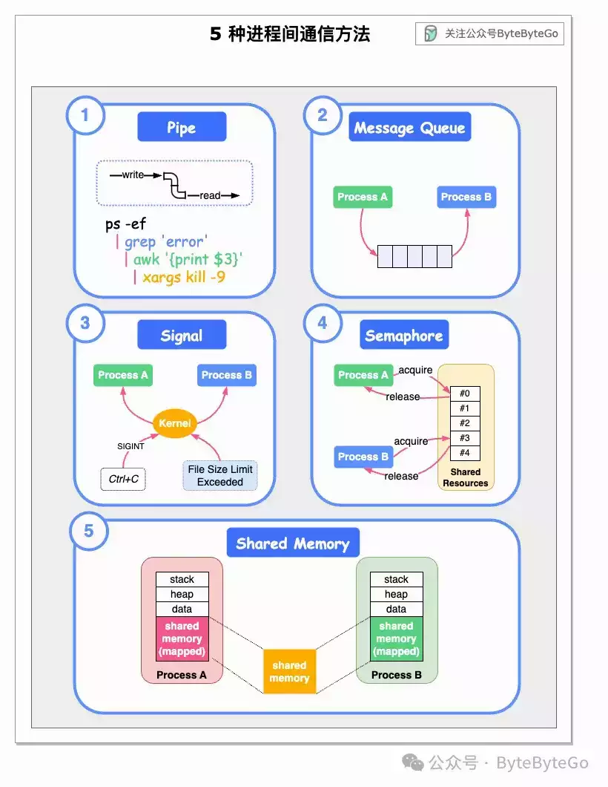

# 进程间如何进行通信？

在 Linux 上，进程之间如何通信？

下图显示了进程间通信的 5 种方式。

## 01 管道（Pipe）

## 02 消息队列（Message Queue）

消息队列允许一个或多个进程写入消息，并由一个或多个读取进程读取。

## 03 信号（Signal）

信号是 Unix 系统使用的最古老的进程间通信方法之一。信号可能由键盘中断或错误条件（如进程试图访问其虚拟内存中不存在的位置）产生。内核可以生成一组定义好的信号，系统中的其他进程也可以生成这些信号。例如，Ctrl+C 向进程 A 发送 SIGINT 信号。

## 04 信号量（Semaphore）

信号量是内存中的一个位置，其值可由多个进程测试和设置。根据测试和设置操作的结果，一个进程可能需要休眠，直到另一个进程改变了该信号量的值。

## 05 共享内存（Shared Memeory）

共享内存允许一个或多个进程通过其所有虚拟地址空间中的内存进行通信。当进程不再希望共享虚拟内存时，它们就会从中分离。

***\------ 往期阅读 ------***

[存储密码时为什么要加盐？](http://mp.weixin.qq.com/s?__biz=MzkxMDE5NzE4Mg==&mid=2247484227&idx=1&sn=dd5df5205501dc2da9887b9d709b3ffc&chksm=c12e6b92f659e28416a112821cca71ad2e0cfa9a7782b592d6317e9329d01a6fdcff8fea9a67&scene=21#wechat_redirect)

[架构师应知必会的缩写大全](http://mp.weixin.qq.com/s?__biz=MzkxMDE5NzE4Mg==&mid=2247484216&idx=1&sn=1ae135093a6f69f1fecd23927d3bd1c5&chksm=c12e6be9f659e2ff9b794069d63adf5f7a204e0b31f7806156812c5ae528cbf94b000c5c3ced&scene=21#wechat_redirect)  

[一图看懂 8 种编程范式](http://mp.weixin.qq.com/s?__biz=MzkxMDE5NzE4Mg==&mid=2247484193&idx=1&sn=a039396e2d44ce9f4fc3b25e168c3d8b&chksm=c12e6bf0f659e2e6cab150f7e2f1b4f3cfc053badff86104b8267b365eeb21d5057cfbefa4b8&scene=21#wechat_redirect)  

[面试官：你说说如何提高 API 接口的性能？](http://mp.weixin.qq.com/s?__biz=MzkxMDE5NzE4Mg==&mid=2247484116&idx=1&sn=63ea230824cae6d6438adfce5daa235b&chksm=c12e6a05f659e31379b754c039ff6b7f6ca2e24c0606fcc39abc43984c76ec2c610d5f58f3d2&scene=21#wechat_redirect)